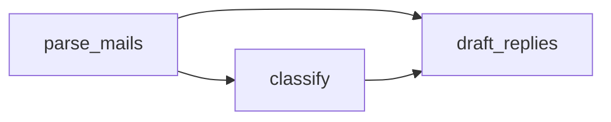

# Mail triage — Design

## Format and rationale

TypeScript: the update of the registry is deterministic work, done by a custom tool the crew declares
with its agents. The crew has no guardrail and no `knowledge`, which this team does not need.

## Process

`sequential`: three steps in a fixed order, each reading what the earlier ones produced. A failed task
fails the run, and the registry keeps the next run from redoing the mails already recorded.

## Agents

| Id | Role | Tools | maxIter | Justification |
|---|---|---|---|---|
| reader | Reads each `.eml` file of `/mailbox` that the registry does not hold, and extracts its headers and its text | `email_parse`, `file_read` | 12 | one parse per mail, 50 new mails at most, read in batches of five |
| sorter | Gives each mail its category, its urgency and the reason, and records it | `json_tool`, `file_write`, `registry_update` | 8 | one pass over the parsed mails, one write of the classification file, one update of the registry |
| drafter | Writes the reply draft of each mail that calls for one | `file_read`, `file_write` | 10 | one draft per mail of the three categories, 25 at most |

## Tasks and DAG

| Id | Agent | Dependencies | Reads | Deliverable |
|---|---|---|---|---|
| parse_mails | reader | — | `/mailbox/*.eml`, `/state/registry.json` | — |
| classify | sorter | parse_mails | the result of `parse_mails`; `/output/classification.json` when it exists | `/output/classification.json` |
| draft_replies | drafter | classify | the results of `parse_mails` and `classify` | `/output/drafts/<mail>.txt` |

## Tools

| Tool | Kind (built-in / custom) | Used by | Why deterministic |
|---|---|---|---|
| `email_parser` | built-in | reader | — |
| `file_read` | built-in | reader, drafter | — |
| `file_write` | built-in | sorter, drafter | — |
| `json_tool` | built-in | sorter | — |
| `registry_update` | custom | sorter | pure TypeScript, no I/O: given the registry and the keys of the mails just recorded, it returns the registry with those keys added, sorted, each once |

## Mounts

| Mount point | Access | Role | Folder of the team |
|---|---|---|---|
| `/mailbox` | ro | mailbox | `./mailbox` |
| `/state` | rw | state | `./state` |
| `/output` | rw | deliverables | `./output` |

## Deliverables and schemas

| Path | Source | Format | Schema |
|---|---|---|---|
| `/output/classification.json` | final_message | JSON, one record per mail | `library/schemas/mail-classification.schema.json` |
| `/mailbox/drafts/<mail>.txt` | tool_call | plain text, one file per mail | — |

## Resume and incremental strategy

The registry is `/state/registry.json`: the list of the file names already recorded. `parse_mails` leaves
out the files it holds; `classify` adds a mail's key through `registry_update` once its record is
written. A mail cut in the middle is not in the registry: the next run processes it again as a whole.

## LLM profile

The machine profile. The design assumes a model that calls tools and holds five parsed mails in its
context at once. No model is pinned in the crew.

## Risks

| Risk | Mitigation |
|---|---|
| A local model answers a category outside the list | the schema of the classification file refuses it, and the task description gives the list |
| A mail carries instructions for the model | the task descriptions say that a mail is content to classify; the adversarial set proves it (INV-INJECTION) |
