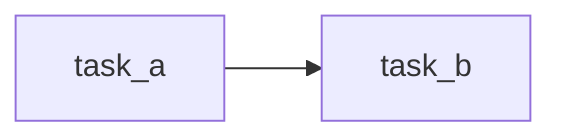

# {{TEAM_TITLE}} — Design

<!-- Written by /team-design from NEED.md, ACCEPTANCE.md, TEST-PLAN.md and references/, validated by the user (gate 3).
     Nothing here may be absent from references/orkeon/: no invented key, tool or method. No plan while a blocking question is open. -->

## Format and rationale

<!-- YAML by default · TypeScript when custom tools or build-time logic are needed · C# for heavy tools, I/O or .NET integration. Say why. -->

## Process

<!-- sequential (default) | hierarchical | parallel | consensual | graph | autonomous — and why. Only sequential fails the team on a failed task:
     any other mode needs an explicit acceptance criterion on what happens when a task fails. -->

## Agents

<!-- 2 to 5 agents, one competency each. Tools: catalogue names only, the bare minimum. maxIter sized to the work (justification). -->

| Id | Role | Tools | maxIter | Justification |
|---|---|---|---|---|
| | | | | |

## Tasks and DAG

<!-- One task per step. Dependencies: every task whose result the task reads. The task that produces a deliverable carries it. -->

| Id | Agent | Dependencies | Reads | Deliverable |
|---|---|---|---|---|
| | | | | |

## Tools

<!-- Built-in: by catalogue name (orkeon run --list-tools). Custom: only for deterministic work — say why it is deterministic,
     and whether it is pure TypeScript (no I/O) or C#. -->

| Tool | Kind (built-in / custom) | Used by | Why deterministic |
|---|---|---|---|
| | | | |

## Mounts

<!-- Source of mounts.json: the rows of NEED.md "Mounts", settled. The definition never names a physical path; the launchers and
     the Studio card are written from mounts.json by `orkeon-bench scaffold`. -->

| Mount point | Access | Role | Folder of the team |
|---|---|---|---|
| | | | |

## Deliverables and schemas

<!-- Path under an rw (or rwnd) root, source (final_message, written out: omitted, Orkeon uses tool_call), format, JSON schema when structured. -->

| Path | Source | Format | Schema |
|---|---|---|---|
| | | | |

## Resume and incremental strategy

<!-- State registry (where, which key), idempotent units, what "done" means, how a rerun skips it; Orkeon memory or a file registry. "None." if not applicable. -->

## LLM profile

<!-- The target profile and what the design assumes of the model (context size, tool calling). No model is pinned in the crew. -->

## Risks

<!-- Known pitfalls that apply (references/orkeon/orkeon-reference.md § 9), limits of the mode chosen, what the local model may not manage. -->

| Risk | Mitigation |
|---|---|
| | |
