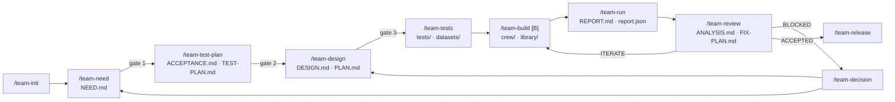

# The workflow — from a need to a released team

> Process reference of the Orkeon harness (the workshop's `references/process/`). Established for Orkeon
> `main` at a2bb6c3 (first written on `1.0.0-rc.4`). The `team-*` skills automate these steps one by one
> (lots 2 to 9 of the harness plan);
> until a skill exists, its step is done by hand with the templates of `.claude/templates/`.
> Strings shared with scripts (phases, verdicts, report labels, ids) are frozen:
> `.claude/harness/FROZEN-LITERALS.md`.

## 1. Principles

1. **A chain of artefacts.** Each step reads a file and writes one; nothing important travels through
   the conversation; no step starts without the artefact of the previous one.
2. **Progressive and interruptible.** `workbooks/<slug>/STATUS.md` says where the team is; any step can be
   resumed after a pause, a `/clear` or a restart, and refuses to skip a gate.
3. **Tests before the team.** Criteria, indicators and invariants are written before the design; the
   tests exist before the build; a team is accepted only by a report that proves it.
4. **The orchestrator judges, subagents produce.** The orchestrator splits, delegates with compact
   contracts (named paths, ids), reads diffs and reports, decides. A subagent that cannot comply
   without leaving its scope answers `BLOCKED`.
5. **Separation of roles.** The test author never writes in `crew/`; the implementer never modifies
   a test; the reviewer is read-only and audits what was delivered before its conformance to the plan.
6. **Deterministic wherever possible.** Parsing, business rules, state registries, deduplication go in
   deterministic tools with unit tests; the LLM judges and writes. Wiring is tested with a simulated LLM.
7. **Controlled cost.** Test levels run from free to paid; a remote LLM is called only after an
   estimate, a cap and an explicit approval; no hook launches a paid run.
8. **Everything is archived.** Numbered attempts with a snapshot of the design, reports in Markdown
   and JSON, run manifests, decisions.
9. **Secure by default.** No key on disk; no e-mail sent without a draft and allowed recipients;
   inputs are untrusted; invariants are checked on every run.
10. **The Orkeon reference is authoritative.** YAML by default, TypeScript for custom tools or
    build-time logic, C# for heavy tools, I/O or .NET integration. The installed binary settles doubts.
11. **One fact, one place; literals are frozen.** A convention lives in one file and is cited elsewhere.

## 2. The loop



Three gates need the user (need, test plan, design). After them the loop build → run → review turns
without the user, except on `BLOCKED` or at the budget gate. `/team-decision` and `/team-status` can be
used at any time.

**Two tracks for a new team** (D34). Facing a request for a team, the user chooses: a **prototype** — a
generator (`orkeon-crew-yaml`, `orkeon-crew-typescript`) writes the team at once, and nothing proves it
yet — or the **method** above. `/team-init --adopt <slug>` brings a prototype into the method: its crew
is kept as the starting point of the build, its README becomes a first draft of `NEED.md`, and `crew/` is
not frozen before the first build once D36 lands (lots 2 and 6) — today `guard-phase` freezes `crew/` in
every phase but `build` as soon as `STATUS.md` has one (§ 4). A **light track** (D37), chosen with
`/team-init --light <slug>` and recorded as `track: light` in `STATUS.md`, suits a small team: `NEED.md`,
`ACCEPTANCE.md` and `TEST-PLAN.md` are filled together and approved once (`/team-approve need` then
writes `gate_passed: test-plan`, with `phase: test-plan`); `DESIGN.md` and `PLAN.md` come together, with a
single batch `B1`; the templates, the checklists, the gates and the record stay.

## 3. The steps

| # | Step | Reads | Writes | Exit gate |
|---|---|---|---|---|
| 0 | `/team-init [--adopt] [--light] <slug>` | — | `STATUS.md`, `DEC-0001` (creation), `tests/<slug>/` | — |
| 1 | `/team-need` | `STATUS.md`, a brief if any | `NEED.md` | gate 1: the user validates the need |
| 2 | `/team-test-plan` | `NEED.md` | `ACCEPTANCE.md`, `TEST-PLAN.md`, `tests/<slug>/bench.config.json` | gate 2: the user validates criteria, thresholds, budget |
| 3 | `/team-design` | `NEED`, `ACCEPTANCE`, `TEST-PLAN`, `references/` | `DESIGN.md`, `PLAN.md` | gate 3: pitfalls checked by script, the user validates |
| 4 | `/team-tests` | `ACCEPTANCE`, `TEST-PLAN`, `DESIGN` | `tests/**`, `library/datasets/` when shared | every test exists, cites an id, and is **red** (for an adopted prototype, those that already pass are listed in the journal) |
| 5 | `/team-build [B<n>]` | the batch sheet of `PLAN.md`, `DESIGN.md`, the tests of the batch | `crew/**`, `library/tools/**`, the team `README.md`; `B1` creates `teams/<slug>/`: `mounts.json` from `DESIGN.md`, the crew, then `orkeon-bench scaffold <slug>` | L0 and L1 green on the batch; no test modified |
| 6 | `/team-run [--level] [--profile]` | `tests/`, `bench.config.json`, `mounts.json` | `attempts/ATT-n/REPORT.md` + `report.json`, `runs/` | budget gate before any remote profile |
| 7 | `/team-review` | the capture: report, runs, design, plan, diff since the previous attempt; then the review `team-reviewer` returns | `attempts/ATT-n/ANALYSIS.md`, `FIX-PLAN.md`, the verdict in `STATUS.md` | `ACCEPTED` · `ITERATE` · `BLOCKED` |
| 8 | `/team-release` | the whole folder | final `README.md`, card and launchers realigned, attempts summary, proposed commit and tag command, runs compacted | — |
| any | `/team-decision "…"` | `STATUS.md` | `DEC-nnnn`, artefacts marked to revise, `STATUS.md` | — |
| any | `/team-status` | `STATUS.md`, the folder | nothing (or a realigned `STATUS.md`) | — |

Every step starts by reading `STATUS.md`, checks that the previous gate is passed, and ends by
updating it (the `status-check` hook verifies it).

## 4. Gates and `STATUS.md`

`STATUS.md` carries the state in its front matter: `phase`, `gate_passed` (the last phase whose exit
gate was passed, `null` before the first one), `attempt`, `batch`, `verdict`, `next_action`,
`updated_at`, `track` (`full` or `light`, D37) and `iteration` (0 at `/team-init`, raised by one at each
`ITERATE`, D38; absent, they read `full` and 0); then a journal, one bullet per event.

| Gate | Exit of | What must be true | Validated by | `STATUS.md` once passed |
|---|---|---|---|---|
| gate 1 | `/team-need` | every section of `NEED.md` filled or `TBD` with an open question; no design detail | the user | `phase: need`, `gate_passed: need`, next `/team-test-plan` |
| gate 2 | `/team-test-plan` | every AC attached to a level and a dataset; thresholds and budget stated | the user | `phase: test-plan`, `gate_passed: test-plan`, next `/team-design` |
| gate 3 | `/team-design` | no blocking question open; design clear of the known pitfalls; every batch has anchors | script, then the user | `phase: design`, `gate_passed: design`, next `/team-tests` |
| tests red | `/team-tests` | every test exists and cites an id; no orphan test, no AC without a test; all red | script | `phase: tests`, `gate_passed: tests`, next `/team-build B1` |
| batch green | each `/team-build B<n>` | L0 and L1 green on the batch; `tests/` untouched | script, diff read by the orchestrator | `phase: build`, `batch: B<n>`; `gate_passed: build` after the last batch |
| budget | before a remote `/team-run` | estimate ≤ cap; explicit approval recorded in the open attempt | the user | — (the approval lives in the attempt) |
| verdict | `/team-review` | see § 5, `/team-review` | the reviewer | `verdict` set; `gate_passed: review` with `phase: accepted` on `ACCEPTED`, `phase: review` on `BLOCKED`; on `ITERATE`, `gate_passed: tests` (D38, below) |

Phases, in order: `need` → `test-plan` → `design` → `tests` → `build` → `run` → `review` →
`accepted` → `published`. `ITERATE` sets the phase back to `build` with a new attempt, `gate_passed:
tests` and the `iteration` counter raised (D38), so that the gate never runs ahead of the phase.

**Approvals come from what the user types** (D36): `/team-approve need`, `/team-approve test-plan` and
`/team-approve design` at gates 1–3, `/team-approve remote <usd>` for a paid run. A `UserPromptSubmit`
hook (lot 2) records the gate in `STATUS.md` (front matter and journal line) or, through `orkeon-bench`
(the bench alone writes the marker, D19), the approval marker of the open attempt. It is a trace Claude
cannot fill in by mistake — not a proof against a determined agent. **Until that hook ships**, nothing
records an approval automatically: the main thread writes the gate on the user's explicit word, quoted
in the journal line, and the remote-approval marker is written from the shell in the open attempt,
quoting the user's yes — never on Claude's own initiative.

**`guard-phase` reads `phase` alone today**: in a team whose `STATUS.md` has a phase, `crew/` is
writable only in phase `build` and `tests/<slug>/` is frozen only during `build`; a team without a phase
(a prototype) is not held. With D36 (lots 2 and 6), it will read `gate_passed` before a write in `crew/`
and keep `tests/<slug>/` frozen from the first build until `ACCEPTED`.

## 5. The steps in detail

**`/team-init <slug>`** creates, next to `teams/`, the workbook `workbooks/<slug>/` and the tests
`tests/<slug>/` (D29); writes `STATUS.md` (`phase: need`, `track`, `iteration: 0`) and `DEC-0001`. It
does not create the team folder (D35): the format and the mount points are decided at need and design
(D27), and `orkeon-bench scaffold` needs a crew. `teams/<slug>/` is created by the first build batch —
`mounts.json` from `DESIGN.md` `## Mounts`, the crew through the generator skill (into that folder, never
`<slug>-2`), then `orkeon-bench scaffold <slug>`; Studio lists the team as soon as its folder exists, and
launches it once `--validate` passes. With `--adopt`, the team folder already exists (a prototype): it is
kept, and the need starts from its README. With `--light`, `STATUS.md` records `track: light` (§ 2).

**`/team-need`** is a structured interview: one question = one decision, the recommended option
first, `TBD` for what is not known, at most three challenges (minimal scope, simpler alternative,
justified complexity), assumptions recorded as `Hn — to be validated by`. It covers inputs (source,
format, volume, frequency, virtual root), outputs (files and actions, with the authorization an
action needs), the mounts that follow, triggers, incremental processing, resume, constraints,
security, non-goals and open questions. It says nothing about agents or tasks.

**`/team-test-plan`** decides how we will know the team is right: acceptance criteria `AC-xx`
(Given a dataset / When the team runs / Then …, each attached to the lowest level that proves it),
indicators `IND-xx` (measure, unit, threshold, direction), invariants `INV-xx` (from
`references/testing/invariants-catalog.md` plus the team's own), then the plan itself: levels,
datasets (with an adversarial set when inputs are untrusted), LLM targets, judges, repetitions and
`pass@k`, budget — whose values go into `tests/<slug>/bench.config.json`.

**`/team-design`** chooses the format (YAML / TypeScript / C#) and says why, the orchestration mode,
the mounts, 2 to 5 agents, the tasks and their DAG, built-in and custom tools (each custom tool with
its "why deterministic"), deliverables and schemas, the resume and incremental strategy, the LLM
profile, the risks. Then `PLAN.md`: ordered batches — typically `B1` deterministic tools, `B2`
agents and tasks skeleton, `B3` deliverables and schemas, `B4` resume and incremental, `B5`
hardening — each with a sheet: scope, ids covered, tests that must pass, expected cost, and
**Anchors** naming every file the implementer will touch. A missing path is a gap of the plan.

**`/team-tests`** delegates to `team-test-author` and `dataset-synthesizer`: datasets (one subfolder
per virtual root, `expected/`, `manifest.json`), component scenarios with the reply scripts of the
simulated LLM, end-to-end scenarios (dataset, targets, deterministic checks, judge rubric), rubrics,
unit tests of the planned custom tools. Every test cites the id it covers. The team does not exist yet:
every test is red — for an adopted prototype (D34), the tests that already pass are listed in the journal.

**`/team-build [B<n>]`** delegates one batch to `team-implementer` with a compact contract: batch,
target files, ids covered, tests to pass, what is forbidden. The implementer uses the generator
skills (into the existing team folder, never `<slug>-2`, D34) and never touches `tests/`: a test that cannot pass without being modified comes back
`BLOCKED`. The orchestrator never relaunches an agent with the same instruction; a short correction
goes to the same agent (under three turns), otherwise to a new agent with a corrected contract. Two
batches with disjoint files may be built in parallel; merging and checks stay serial.

**`/team-run`** calls `orkeon-bench run <team> --level <max> [--profile <name>]`: the machine profile
by default, the simulated LLM at the component level, roots bound to the datasets. Levels run in
order and stop at the first red one. Before a remote target: estimate (expected tokens × price),
comparison with the cap of `bench.config.json`, the user's explicit approval (`/team-approve remote
<usd>`, § 4) recorded in the open attempt. A target is remote when `orkeon-bench profile <slug> <name>` says so: a named profile on a
host that is not local, and the machine profile too when what Orkeon will read for the run points off
the machine or holds an `Llm` section without a base URL. Result: `REPORT.md` + `report.json` in the attempt, raw runs under `runs/`.

**`/team-review`** runs `team-reviewer` in a forked context, read-only, on a **capture**
(`orkeon-bench capture`: status, diff since the previous attempt, report, relevant event excerpts).
The reviewer writes nothing: it returns its review — verdict, gap table, fix plan — and the skill,
in the main thread, writes `ANALYSIS.md` and `FIX-PLAN.md` of the open attempt from it.
Each gap gets a severity (`Blocking` / `Major` / `Minor`), an id, a category — `prompt`, `tool`,
`dag`, `data`, `model`, `flaky`, `need` — and an evidence; no evidence, no gap. A divergence from
the plan is *team at fault*, *plan outdated* (never blocking) or *to be arbitrated*. Verdict:
`ACCEPTED` (every AC passes at its required level, every IND within threshold, every INV true, no
`Blocking` or `Major` gap), `ITERATE` (the fix plan is applicable) or `BLOCKED` (the user must
decide). After two correction/review rounds still in gap, the skill stops and hands back.

**`/team-decision "<change>"`** turns any change into a `DEC-nnnn`: context, decision, alternatives
set aside, artefacts to revise, the step to resume from. A change of need goes back to step 1 or 2,
a change of design to step 3, a change of threshold or test to step 2 or 4; a new attempt is opened
when the team is already built.

**`/team-status`** summarises `STATUS.md` — phase, current attempt and batch, last gate passed, open
decisions, next action and its command — and realigns it when the files say otherwise.

**`/team-release`** checks the verdict is `ACCEPTED`, regenerates the team `README.md`, realigns the
Studio card and the launchers from `mounts.json`, marks the version in `STATUS.md`, **proposes** the
commit and tag command (`team/<slug>/v<n>`) without running it, and compacts old runs.

## 6. Who writes where

| Role | Tools | May write | Report |
|---|---|---|---|
| orchestrator (main thread) | all | `workbooks/<slug>/`, and in the open attempt `ANALYSIS.md` and `FIX-PLAN.md` only, never `runs/`; `settings/<slug>/` — the team's own Orkeon settings — at the first `/team-build` batch when the team needs them (no subagent writes a settings file, D40); nothing in `crew/` or `tests/<slug>/` by itself | to the user |
| `team-test-author` | read, write, bash | `tests/<slug>/**`, `library/datasets/**` | `DONE` / `BLOCKED` |
| `dataset-synthesizer` | read, write, bash | `tests/<slug>/datasets/**`, `library/datasets/**` | `DONE` / `BLOCKED` |
| `team-implementer` | read, write, bash | `teams/<slug>/crew/**`, `teams/<slug>/mounts.json` (first batch), the team `README.md`, `library/tools/**`; never `tests/<slug>/`, `workbooks/<slug>/` nor a settings file | `DONE` / `BLOCKED` |
| `team-reviewer` | read, read-only bash | nothing: it returns its review | the review (verdict, gaps, fixes) then `DONE` / `BLOCKED` |
| `run-analyst` | read | nothing | `DONE` with the summary |
| `judge` | read | nothing | `DONE` with the judgements |
| `orkeon-bench` | — | `workbooks/<slug>/runs/**`; the attempt folders with their `manifest.json`, `REPORT.md`, `report.json`, `remote-approval.json`, `design-snapshot/`; the Studio card mounts, the launchers, the folders of the mount points with their `.gitkeep` and the team's `.gitignore` (`scaffold`) | JSON on stdout |

Three mechanisms hold these scopes: the agent frontmatter (tools, model, turn cap), the
`permissions.deny` rules (`runs/` is closed to the Edit and Write tools), and the `guard-phase`
hook, which reads the agent type, the path, the phase and the state of the attempt: a closed attempt
is read-only for everyone; in an open one, Edit and Write reach `ANALYSIS.md` and `FIX-PLAN.md`
only, and only from the main thread. `guard-phase` acts inside a team's four trees (`teams/`,
`workbooks/`, `tests/` and `settings/` of its slug), holds the six agents above by their type, and refuses
every subagent a file Orkeon reads as settings (anything under `settings/<x>/`, a settings file of a team
folder or of its `crew/`, an `appsettings*.json` at the workshop root, an `appsettings/appsettings.json` or
`_shared/appsettings.json` elsewhere in the workshop — wider than what Orkeon reads at a2bb6c3, which no
longer reads a working directory's `appsettings.<environment>.json`, `orkeon/cli.md` § 5). Elsewhere — `library/`, `references/`, any other
folder — and for another agent type, only the charter or the contract holds a subagent; a write through
Bash escapes the hook.

Every subagent ends with one of two reports, checked for shape by a hook (the review of
`team-reviewer` precedes its `DONE` report and is checked too):

```
## DONE                                     ## BLOCKED
- Files: …                                  - Reason: …
- Ids covered: …                            - Missing: …
- Command: `…` — exit N   (or none)         - Next: …
- Notes: …
```

## 7. Test levels

| Level | Proves | Tools | LLM | Cost | When |
|---|---|---|---|---|---|
| **L0 static** | the definition is well formed and loadable | `check_crew.py` / `check_team.py`, `orkeon run --validate`, `tsc`, `dotnet build`, schema validation, secrets absent, `mounts.json` consistent with card and launchers | none | none | end of every batch, before any run |
| **L1 unit** | the custom tools are correct | vitest (TypeScript); the project's tests (C#) | none | none | end of every batch |
| **L2 component** | one task or agent in isolation, wiring, deliverables, resume | `orkeon-bench` + simulated LLM: scripted replies, real tool calls | simulated | none | every attempt |
| **L3 end-to-end local** | the whole team reaches the AC with a local model | `orkeon-bench` + the machine profile (Ollama) on the datasets, deterministic checks + judges | local | machine time | every attempt, with repetitions |
| **L4 end-to-end remote** | the same with the production model | `orkeon-bench` + a remote profile | remote | **paid** | on request, before acceptance, behind the budget gate |

In `report.json` the levels are keyed `static`, `unit`, `component`, `e2e_local`, `e2e_remote`.
Execution stops at the first red level. An AC is attached to the lowest level that can prove it; an
AC required remotely is never proven by a local run.

## 8. Mounts

A team sees only its **mount points**: virtual roots, free in name and number, each backed by a
folder (D11, D27).

- **Declared** in `NEED.md` then `DESIGN.md` (`## Mounts`): root, access (`ro` / `rw` / `rwnd`), role
  (`inputs`, `deliverables`, `state`, `archive`, `mailbox`, `reference`…), what goes there. The need
  decides them: one point per kind of content the team reads or writes, named after it (`/mailbox`,
  `/invoices`, `/reports`), and a `/state` (rw) as soon as there is resume or incremental
  processing. A **scheme** is only a proposal for a need that names no folder: the user's own in
  `library/mount-schemes/`, else the generic one (`.claude/templates/mounts.json`: `/workspace` ro,
  `/output` rw). Reserved to the runner, never declared: `/crew`, `/script`, `/llm-logs`, `/sandbox`,
  `/credentials`.
- **Written** in `mounts.json` at the team root, the single source of the mount points:

  ```json
  {
    "version": 1,
    "mounts": [
      { "root": "/mailbox", "access": "ro", "role": "mailbox", "default": "./mailbox" },
      { "root": "/state", "access": "rw", "role": "state", "default": "./state" },
      { "root": "/output", "access": "rw", "role": "deliverables", "default": "./output" }
    ]
  }
  ```

  `default` is the folder of the point when the team runs on its own folders: inside the team
  (`./input` for `/workspace`, `./<name>` otherwise — Orkeon Studio's convention), or absolute. A
  path starting with `~`, `$` or `%` is rejected (nothing expands it), and so is a reserved root.
  `orkeon-bench scaffold <team>` writes from it the launchers (`run.sh`, `run.cmd`), the `mounts[]`
  of the Studio card and the folders of the team; run it again after every change of the file.

  The folder behind a point is all its agents reach (D40). A mount point may not use: the team folder
  itself; `crew/`, or a folder named `agents`, `tasks`, `appsettings` or `_shared` at the root of the
  team; outside the team, a folder that holds the team folder, the workshop or the home folder, or that
  is or lies inside the workshop's `settings/`, `workbooks/`, `tests/`, `.claude/`, `library/`,
  `references/`, `.devcontainer/` or `.git/`, an `appsettings/` or `_shared/` folder above the team, a
  hidden folder of the home folder (`~/.config`, `~/.claude`, `~/.ssh`…), the user's `AppData`, `/proc`,
  or another team's folder or mount set. A `/plugins` mount point is read-only. Any other folder outside
  the team passes with a warning: Orkeon Studio launches the team only when that folder is declared,
  spelled exactly, in its Authorized folders. The Windows spellings of these folders
  (`C:\Users\<you>\Orkeon\settings`, `C:\Users\<you>\.claude`, `C:\Users\<you>\AppData\…`) are refused
  the same way. Paths are judged as written: a symbolic link is not followed, and a folder name ending with a
  dot or a space is refused, since Windows drops them (`./crew.` is `crew/` there). Folders compare ignoring
  case, the configured workshop `$ORKEON_WORKSHOP` and `$XDG_CONFIG_HOME/Orkeon` are guarded too, and
  `orkeon-bench`, `check_crew.py` / `check_team.py` and the C# runner and host apply the same rule
  (`references/reliability/security.md` § 8).
- **Mount sets** (D28): `mounts.<name>/<slug>/` next to `teams/` holds another folder for each
  point, named after it (`mounts.test/mail-triage/mailbox/`…) — for a trial, a demonstration, another
  environment. `TEAM_ENV=<name> ./run.sh`, `orkeon-bench mounts <team> --env <name>` and
  `orkeon-harness-run` bind it; a read-only folder must exist, a writable one is created. Studio
  always runs the team's own folders (it accepts no folder outside the team that its settings do not
  declare).
- **Tested** by binding each point to the subfolder of a dataset of `tests/<slug>/datasets/` named
  after it; written points are bound to a temporary copy the bench then compares with `expected/`.
- **Never** in the definition: `crew/` names no physical path, and `config.yaml` carries no `mounts:` block.

The launchers run `orkeon run crew` from the team folder: `orkeon-bench scaffold` writes no other
command. A team using C# plugin tools — which neither the stock `orkeon` nor Studio on Windows loads —
is run by hand with `orkeon-harness-run crew --plugins <dir>` from the team folder (it reads the
team's `mounts.json`), until its launchers and bench support land (lot 8;
`references/orkeon/csharp-tools.md` § 9).

## 9. The user steps in

- **At a gate**: validates, amends (the step resumes at the question) or refuses (back to the previous step).
- **Between gates**: runs `/team-decision`; the workflow repositions itself.
- **In the middle of the loop**: a free message ("stop, change X") is treated as a decision by the
  running step, which finishes the action in progress cleanly before resuming.
- **Not** by changing `crew/` outside a build, or `tests/` from the first build until `ACCEPTED`: when
  the change goes through Claude, `guard-phase` refuses it and points to `/team-decision` (today during
  phase `build` only for `tests/<slug>/`, from the first build until `ACCEPTED` once D36 lands — § 4); a
  change made by hand in an editor is recorded afterwards as a `DEC-nnnn`. Until the `team-*` skills
  ship, the user moves the phase by hand in `STATUS.md`, with the reason in its journal.
- **Not** by Orkeon Studio's Rename, Duplicate or Delete on a workshop team: they touch the team folder
  alone and leave the workbook, the tests, the settings and the mount sets behind (D39,
  `references/orkeon/studio-layout.md`). To rename or remove a team, move or remove its five trees
  together by hand — `teams/<slug>/`, `workbooks/<slug>/`, `tests/<slug>/`, `settings/<slug>/` and each
  `mounts.<name>/<slug>/`; `orkeon-bench team rename|remove` will do it (planned, lot 4), and
  `orkeon-bench doctor` will list the orphans.

## 10. Resuming

`STATUS.md` is a small state machine. After a `/clear`, a container restart or a new session,
`/team-status` (or any `team-*` step) rereads the files and resumes. No information needed for what
comes next exists only in the conversation.

## 11. What is archived

| What | Where | When | Retention |
|---|---|---|---|
| Decisions | `workbooks/<slug>/decisions/DEC-nnnn-<slug>.md` | every decision or change | unlimited, versioned |
| Attempts | `workbooks/<slug>/attempts/ATT-nnnn/`: `manifest.json`, `design-snapshot/`, `REPORT.md`, `report.json`, `ANALYSIS.md`, `FIX-PLAN.md` | opened by `/team-build` (or `/team-decision`), closed by `/team-review` | unlimited for text; snapshots compacted beyond N attempts |
| Runs | `workbooks/<slug>/runs/RUN-<stamp>-<target>/`: `events.jsonl`, `stdout.log`, `output-snapshot/`, `manifest.json` | every execution | ignored by git; the last N on disk plus those a report cites |
| Accepted team | version in `STATUS.md`, summary in `README.md`, proposed commit and tag `team/<slug>/v<n>` | `/team-release` | — |

A closed attempt is immutable. The harness proposes commits and tags; it never runs them.

## 12. Artefacts at a glance

| Artefact | Template | Written by | Read by |
|---|---|---|---|
| `workbooks/<slug>/NEED.md` | `NEED.md` | `/team-need` | `/team-test-plan`, `/team-design` |
| `workbooks/<slug>/ACCEPTANCE.md` | `ACCEPTANCE.md` | `/team-test-plan` | `/team-design`, `/team-tests`, the bench, the reviewer |
| `workbooks/<slug>/TEST-PLAN.md` | `TEST-PLAN.md` | `/team-test-plan` | `/team-design`, `/team-tests`, `/team-run` |
| `workbooks/<slug>/DESIGN.md` · `PLAN.md` | `DESIGN.md` · `PLAN.md` | `/team-design` | `/team-tests`, `/team-build`, the reviewer |
| `workbooks/<slug>/STATUS.md` | `STATUS.md` | every `team-*` step; a gate, the `/team-approve` hook (lot 2) — until then the main thread, on the user's explicit word | every `team-*` step, hooks, the bench |
| `workbooks/<slug>/decisions/DEC-nnnn-*.md` | `DECISION.md` | `/team-init`, `/team-decision` | every step |
| `workbooks/<slug>/attempts/ATT-nnnn/manifest.json` | `ATTEMPT-manifest.json` | the bench | hooks, the bench |
| `…/REPORT.md` · `report.json` | `REPORT.md` · `report.schema.json` | the bench (`/team-run`) | `/team-review`, `/team-release` |
| `…/ANALYSIS.md` · `FIX-PLAN.md` | `ANALYSIS.md` · `FIX-PLAN.md` | `/team-review`, from the review `team-reviewer` returns | `/team-build`, the user |
| `teams/<slug>/mounts.json` | `mounts.json` (the generic scheme) | the first `/team-build` batch, through the generator skill, from `DESIGN.md` `## Mounts` (D35); a prototype's generator (D34) | the bench (`scaffold` writes the launchers, the card mounts and the folders from it), the C# runner and host, the checks |
| `settings/<slug>/appsettings.json` | — (the workshop's `settings/README.md`) | the main thread, at the first `/team-build` batch when the team needs its own settings; never a subagent (D33, D40) | the launchers and the bench (`--settings`), `orkeon-harness-run`, the C# host, the run gate, the checks |
| `tests/<slug>/bench.config.json` | `bench.config.json` | `/team-test-plan` | the bench |
| `tests/<slug>/**/*.scenario.json` | `scenario.json` | `team-test-author` | the bench |
| `tests/<slug>/datasets/<name>/manifest.json` | `dataset-manifest.json` | `dataset-synthesizer` | the bench |

## 13. Identifiers

| Prefix | Object | Example |
|---|---|---|
| `R-` | business rule in `NEED.md` | `R-03` |
| `AC-` | acceptance criterion | `AC-01` |
| `IND-` | indicator | `IND-02` |
| `INV-` | invariant | `INV-RESUME`, `INV-07` |
| `J-` | judge / rubric | `J-01` |
| `DEC-` | decision | `DEC-0004` |
| `ATT-` | attempt | `ATT-0002` |
| `RUN-` | execution | `RUN-20260930-1912-local` |
| `B` | batch of the plan (`B1`, `B2`… — never `L`, which names the test levels `L0`–`L4`) | `B3` |
| `F-` | fix of the fix plan | `F-2` |
| `H` | assumption | `H1` |
| `C` | correction appended to a batch sheet | `C1` |

An id is never renumbered. Tests are named after the criterion they cover: `ac-01-<slug>.scenario.json`.
