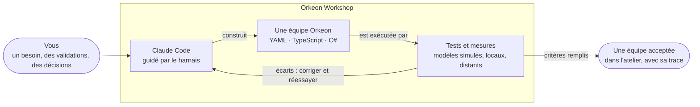

# Orkeon Workshop

*[English](./README.md) · Français*

[](https://github.com/Orkeon/orkeon-workshop/actions/workflows/checks.yml)
[](https://github.com/Orkeon/orkeon-workshop/actions/workflows/image.yml)
[](./LICENSE)

<p align="center">
  
</p>

**Un atelier open source qui fait de [Claude Code](https://code.claude.com/docs/en/overview) un
constructeur d'équipes d'agents [Orkeon](https://github.com/Orkeon/orkeon) — avec les tests, les mesures
et la trace qui rendent une équipe digne de confiance.**

Orkeon est un framework .NET pour des équipes d'agents d'IA. Demander une telle équipe à un assistant de
programmation est facile ; savoir si elle fait ce qu'il fallait, ce qu'elle coûte et comment elle se
comporte quand les choses tournent mal ne l'est pas. Orkeon Workshop donne à Claude Code une méthode et des
garde-fous. Aujourd'hui, Claude écrit une équipe pour vous, la confronte à ce qu'Orkeon et Orkeon Studio
acceptent réellement, et l'exécute sur un modèle local ; la méthode qui se construit autour consigne le
besoin, place les critères d'acceptation et les tests en premier, construit l'équipe pour qu'elle y
réponde, l'exécute sur des modèles simulés, locaux et distants, puis la passe en revue et la corrige
jusqu'à ce qu'un rapport prouve qu'elle remplit ses critères — en gardant sur disque chaque tentative et
chaque décision.



Le tout tient dans une seule image de conteneur, **`orkeon-workshop`** : la ligne de commande d'Orkeon,
des modèles locaux sur votre GPU et le harnais, prêts à l'emploi, avec Claude Code — installé au premier
démarrage de l'image publiée. Les équipes qu'on y construit apparaissent directement dans Orkeon Studio.

## Le découvrir en discutant

- **Avant d'installer** : collez [ce prompt](./docs/fr/discover-with-claude.md) dans une conversation
  claude.ai ou Claude Desktop. Claude vous présente le projet dans votre langue et vous guide dans
  l'installation.
- **Une fois installé** : ouvrez Claude Code avec `workshop` et tapez `/orkeon-tour` — une visite guidée de
  votre propre atelier, qui peut construire une première équipe avec vous.

## Démarrer

Il vous faut Docker Desktop (Windows, moteur WSL 2) ou Docker Engine (Linux), environ 25 Go de disque et
un compte Claude. Dans PowerShell :

```powershell
docker pull ghcr.io/orkeon/orkeon-workshop:latest
docker tag ghcr.io/orkeon/orkeon-workshop:latest orkeon-workshop
New-Item -ItemType Directory -Force "$env:USERPROFILE\Orkeon" | Out-Null

docker run -it --init --name my-orkeon-workshop --gpus=all `
  --cap-add=NET_ADMIN --cap-add=NET_RAW --add-host=host.docker.internal:host-gateway `
  -v /var/run/docker.sock:/var/run/docker-host.sock `
  -v cc-ollama:/home/node/.ollama/models `
  -v my-orkeon-workshop-claude:/home/node/.claude -e CLAUDE_CONFIG_DIR=/home/node/.claude `
  -v "$env:USERPROFILE\Orkeon:/workspace" `
  -e DOCKER_MODE=socket orkeon-workshop
```

(Pas de GPU NVIDIA ? Retirez `--gpus=all`.) Ensuite, dans le conteneur :

```text
workshop          ← dans le terminal du conteneur : ouvre Claude Code dans votre atelier
/orkeon-tour      ← puis, dans Claude Code : la visite guidée
```

Pas à pas, pour Windows et Linux : [Installer](./docs/fr/getting-started/install.md), puis
[Votre première équipe](./docs/fr/getting-started/first-team.md).

## Documentation

| | |
|---|---|
| **Démarrer** | [Installer](./docs/fr/getting-started/install.md) · [Votre première équipe](./docs/fr/getting-started/first-team.md) · [VS Code](./docs/fr/getting-started/vs-code.md) |
| **Comprendre** | [L'atelier](./docs/fr/concepts/workshop.md) · [Les équipes](./docs/fr/concepts/teams.md) · [Points de montage](./docs/fr/concepts/mount-points.md) · [Comment se construit une équipe](./docs/fr/concepts/process.md) · [Tester](./docs/fr/concepts/testing.md) |
| **Faire** | [Équipe YAML](./docs/fr/guides/yaml-team.md) · [Équipe TypeScript](./docs/fr/guides/typescript-team.md) · [Outils C#](./docs/fr/guides/csharp-tools.md) · [Modèles](./docs/fr/guides/models.md) · [Modes Docker](./docs/fr/guides/docker-modes.md) · [Mettre à jour](./docs/fr/guides/updating.md) |
| **Consulter** | [`orkeon-bench`](./docs/fr/reference/orkeon-bench.md) · [Options et variables](./docs/fr/reference/configuration.md) · [Le harnais](./docs/fr/reference/harness.md) · [Dépannage](./docs/fr/reference/troubleshooting.md) · [FAQ](./docs/fr/faq.md) |
| **Construire et concevoir** (en anglais) | [Construire l'image](./.devcontainer/README.md) · [Le plan d'Orkeon Workshop](./docs/orkeon-workshop-plan.md) |

Tout part du [sommaire de la documentation](./docs/fr/README.md).

## Où en est le projet

**Fondations construites et vérifiées** (lots 0 et 1) : l'image, le harnais et ses garde-fous, les
documents de référence, les générateurs d'équipes (`orkeon-crew-yaml`, `orkeon-crew-typescript`), la visite
guidée, `orkeon-bench` et les gabarits .NET, ainsi qu'`orkeon-studio-check`, qui lit une équipe avec le
propre code d'Orkeon Studio. **Ensuite** : les skills `team-*`, qui conduisent la méthode pas à pas, et les
commandes du banc qui exécutent et notent une équipe, d'abord sur un modèle simulé — voir la
[feuille de route](./docs/fr/README.md#feuille-de-route).

## Licence

Orkeon Workshop est distribué sous [licence MIT](./LICENSE). [`THIRD-PARTY-NOTICES.md`](./THIRD-PARTY-NOTICES.md)
recense ce qui vient d'ailleurs : des éléments adaptés de deux projets sous licence MIT, et six fichiers de
devcontainer dérivés du devcontainer de référence d'Anthropic, dont les parties issues d'Anthropic ne sont
pas couvertes par la licence MIT. Les logiciels que l'image installe, à commencer par Claude Code, gardent
leur propre licence ; l'image publiée ne contient pas Claude Code.

Orkeon Workshop n'est ni affilié à Anthropic ni cautionné par cette entreprise. Pour Claude Code lui-même,
consultez sa [documentation](https://code.claude.com/docs/en/overview).
