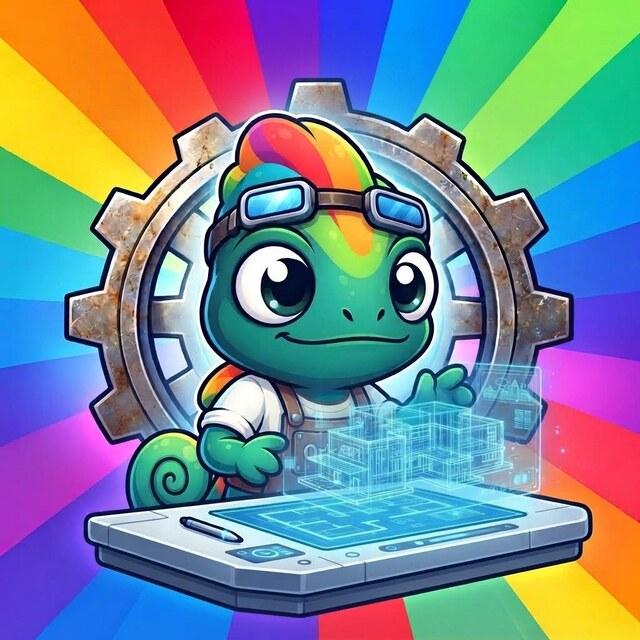
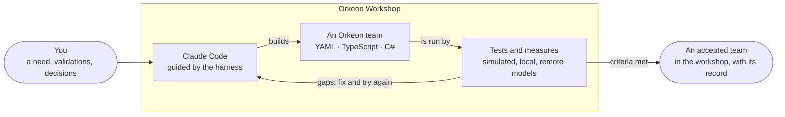

# Orkeon Workshop

*English · [Français](./README.fr.md)*

[](https://github.com/Orkeon/orkeon-workshop/actions/workflows/checks.yml)
[](https://github.com/Orkeon/orkeon-workshop/actions/workflows/image.yml)
[](./LICENSE)

<p align="center">
  
</p>

**An open-source workshop that turns [Claude Code](https://code.claude.com/docs/en/overview)
into a builder of [Orkeon](https://github.com/Orkeon/orkeon) agent teams — with the tests, the
measures and the record that make a team something you can rely on.**

Orkeon is a .NET framework for teams of AI agents. Asking a coding assistant for such a team is easy;
knowing whether it does what was needed, what it costs and how it behaves when things go wrong is not.
Orkeon Workshop gives Claude Code a method and guard rails. Today Claude writes a team for you, checks it
against what Orkeon and Orkeon Studio really accept, and runs it on a local model; the method being built
around it writes the need down, puts the acceptance criteria and the tests first, builds the team against
them, runs it on simulated, local and remote models, and reviews and fixes it until a report proves it meets its criteria —
every attempt and every decision on disk.



It comes as one container image, **`orkeon-workshop`**: the Orkeon CLI, local models on your GPU and the
harness, ready to use, with Claude Code — installed at the first start of the published image. Teams built
in it show up directly in Orkeon Studio.

## Discover it in a chat

- **Before installing**: paste [this prompt](./docs/discover-with-claude.md) into a claude.ai or Claude
  Desktop chat. Claude explains the project in your language and walks you through the installation.
- **Once installed**: open Claude Code with `workshop` and type `/orkeon-tour` — a guided tour of your
  own workshop, which can build a first team with you.

## Get started

You need Docker Desktop (Windows, WSL 2 engine) or Docker Engine (Linux), about 25 GB of disk and a
Claude account. Your **workshop** is a folder of your computer, with any name: the folder that already
holds your teams — on Windows, Orkeon Studio reads `%USERPROFILE%\Orkeon` by default, and can be
[pointed at any other folder](./docs/concepts/workshop.md#orkeon-studio-sees-it) — or an empty one created
for it. Set `$workshop` (Windows) or `workshop` (Linux) to it below.

On Windows, in PowerShell:

```powershell
docker pull ghcr.io/orkeon/orkeon-workshop:latest
docker tag ghcr.io/orkeon/orkeon-workshop:latest orkeon-workshop
$workshop = "$env:USERPROFILE\Orkeon"                        # your workshop folder, existing or new
New-Item -ItemType Directory -Force $workshop | Out-Null     # creates it only if it does not exist

docker run -it --init --name my-orkeon-workshop --gpus=all `
  --cap-add=NET_ADMIN --cap-add=NET_RAW --add-host=host.docker.internal:host-gateway `
  -v /var/run/docker.sock:/var/run/docker-host.sock `
  -v cc-ollama:/home/node/.ollama/models `
  -v my-orkeon-workshop-claude:/home/node/.claude -e CLAUDE_CONFIG_DIR=/home/node/.claude `
  -v "${workshop}:/workspace" `
  -e DOCKER_MODE=socket orkeon-workshop
```

On Linux, in a terminal:

```bash
docker pull ghcr.io/orkeon/orkeon-workshop:latest
docker tag ghcr.io/orkeon/orkeon-workshop:latest orkeon-workshop
workshop="$HOME/Orkeon"                                      # your workshop folder, existing or new
mkdir -p "$workshop"                                         # creates it only if it does not exist

docker run -it --init --name my-orkeon-workshop --gpus=all \
  --cap-add=NET_ADMIN --cap-add=NET_RAW --add-host=host.docker.internal:host-gateway \
  -v /var/run/docker.sock:/var/run/docker-host.sock \
  -v cc-ollama:/home/node/.ollama/models \
  -v my-orkeon-workshop-claude:/home/node/.claude -e CLAUDE_CONFIG_DIR=/home/node/.claude \
  -v "$workshop:/workspace" \
  -e DOCKER_MODE=socket orkeon-workshop
```

No NVIDIA GPU? Remove `--gpus=all`. If the start fails on a GPU error, the container was often created
anyway: `docker rm my-orkeon-workshop` before trying again — see
[the `--gpus=all` option](./docs/reference/troubleshooting.md#the---gpusall-option). Then, in the container:

```text
workshop          ← in the container's terminal: opens Claude Code in your workshop
/orkeon-tour      ← then, in Claude Code: the guided tour
```

Step by step, for Windows and Linux: [Install](./docs/getting-started/install.md), then
[Your first team](./docs/getting-started/first-team.md).

## Documentation

| | |
|---|---|
| **Start** | [Install](./docs/getting-started/install.md) · [Your first team](./docs/getting-started/first-team.md) · [VS Code](./docs/getting-started/vs-code.md) |
| **Understand** | [The workshop](./docs/concepts/workshop.md) · [Teams](./docs/concepts/teams.md) · [Mount points](./docs/concepts/mount-points.md) · [How a team gets built](./docs/concepts/process.md) · [Testing](./docs/concepts/testing.md) |
| **Do** | [YAML team](./docs/guides/yaml-team.md) · [TypeScript team](./docs/guides/typescript-team.md) · [C# tools](./docs/guides/csharp-tools.md) · [Models](./docs/guides/models.md) · [Docker modes](./docs/guides/docker-modes.md) · [Updating](./docs/guides/updating.md) |
| **Look up** | [`orkeon-bench`](./docs/reference/orkeon-bench.md) · [Options and variables](./docs/reference/configuration.md) · [The harness](./docs/reference/harness.md) · [Troubleshooting](./docs/reference/troubleshooting.md) · [FAQ](./docs/faq.md) |
| **Build and design** | [Building the image](./.devcontainer/README.md) · [The Orkeon Workshop plan](./docs/orkeon-workshop-plan.md) |

All of it starts from the [documentation index](./docs/README.md).

## Where the project stands

**Foundation built and checked** (lots 0 and 1): the image, the harness and its guards, the reference
documents, the team generators (`orkeon-crew-yaml`, `orkeon-crew-typescript`), the guided tour,
`orkeon-bench` and the .NET templates, and `orkeon-studio-check`, which reads a team with Orkeon Studio's
own code. **First steps of the method** (lot 2): the skills `/team-init`, `/team-need`, `/team-decision`
and `/team-status`, and your approvals, typed as `/team-approve …` and recorded by a hook; and a bench that runs a team's static checks and its component scenarios on a simulated model (the
start of lot 4). **Next**: the skills of the later steps, and the bench commands that run a team on a
local then a remote model and score it — see the [roadmap](./docs/README.md#roadmap).

## Licence

Orkeon Workshop is released under the [MIT licence](./LICENSE). [`THIRD-PARTY-NOTICES.md`](./THIRD-PARTY-NOTICES.md)
lists what comes from elsewhere: material adapted from two MIT-licensed projects, and six devcontainer
files derived from Anthropic's reference devcontainer, whose Anthropic parts are not covered by the MIT
licence. The software the image installs, Claude Code first of all, keeps its own licence; the published
image does not contain Claude Code.

Orkeon Workshop is not affiliated with or endorsed by Anthropic. For Claude Code itself, see its
[documentation](https://code.claude.com/docs/en/overview).
