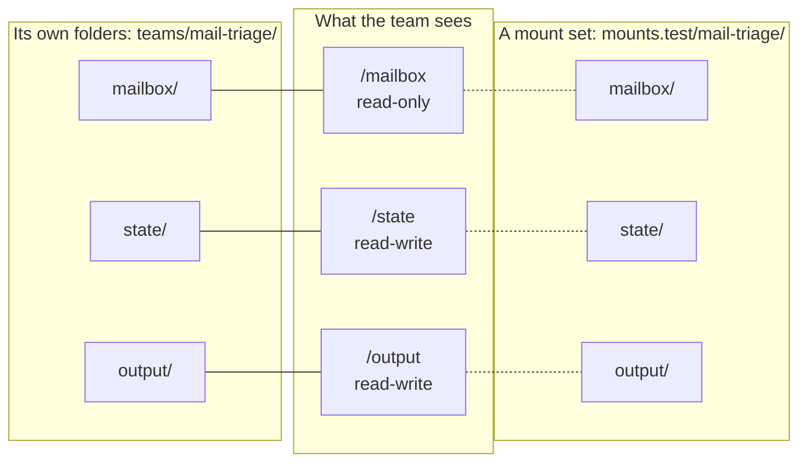

# Mount points and mount sets

*English · [Français](../fr/concepts/mount-points.md)*

## What a mount point is

Agents never see your disk. They see a few **virtual folders** — the team's mount points — and
Orkeon binds each of them to a real folder when the team runs. A mount point has:

| | | Example |
|---|---|---|
| `root` | the virtual path the agents use: one lowercase word after `/` | `/mailbox` |
| `access` | `ro` read-only · `rw` read and write · `rwnd` write but never delete | `ro` |
| `role` | what it is for, in one word | `mailbox`, `inputs`, `deliverables`, `state` |
| `default` | the folder behind it when the team runs on its own folders, relative to the team folder | `./mailbox` |
| `description` | optional, for people | `The mails to triage` |

Their names and their number are the team's own, decided from its need. A mail triage team could
declare three, in its `mounts.json`:

```json
{
  "version": 1,
  "mounts": [
    { "root": "/mailbox", "access": "ro", "role": "mailbox", "default": "./mailbox", "description": "The mails to triage" },
    { "root": "/state", "access": "rw", "role": "state", "default": "./state", "description": "What was processed already" },
    { "root": "/output", "access": "rw", "role": "deliverables", "default": "./output", "description": "The triage report" }
  ]
}
```

A task then says, in its description, *"read the mails of `/mailbox`, skip those listed in
`/state/seen.json`, write the report to `/output/triage.md`"*.

## Where they come from

When a generator skill creates a team, it decides the mount points in this order:

1. the folders **you** name — *"read the mails of …"*, *"write the digests to …"*;
2. otherwise, the mount points table of the team's need or design (`workbooks/<slug>/NEED.md`,
   `DESIGN.md`), when the method produced one;
3. otherwise, from what the team reads and writes — one point per kind of content, named after it:
   `/mailbox` for mails, `/invoices`, `/reports`…; a `/state` only when the team resumes or works
   incrementally;
4. only when the need says nothing about files, it **proposes** a scheme: one of yours from
   `library/mount-schemes/`, otherwise the generic one — `/workspace` to read and `/output` to write
   — and says that it is a proposal.

Five roots are reserved to Orkeon and refused: `/crew`, `/script`, `/llm-logs`, `/sandbox`,
`/credentials`. A `/plugins` mount point must be read-only (`"access": "ro"`): `orkeon-harness-run`
loads the plugins it finds there.

### What a mount point may not open

The folder behind a mount point is everything its agents can read or write with the file tools — Orkeon
lets them nowhere else. So some folders are refused, by `orkeon-bench scaffold`, the C# runner and the
checks alike:

| Refused folder | Why |
|---|---|
| the team folder itself (`.`) | its agents would reach `crew/`, the launchers and `mounts.json`, and on a writable point leave a settings file the next run reads; Studio refuses it too |
| anything inside `crew/` | the definition of the team is not data |
| a folder named `appsettings` or `_shared` at the root of the team | Orkeon looks for settings there |
| outside the team, a folder that holds the team folder, the workshop or your home folder | every team, their settings and your credentials would be in reach |
| outside the team, the workshop's `settings/`, `workbooks/`, `tests/`, `.claude/`, `library/`, `references/`, `.devcontainer/` or `.git/` — or a folder inside one of them | the teams' settings, records, approvals of paid runs and budgets; the harness, the shared library and references; what runs at the next start or git command |
| an `appsettings/` or `_shared/` folder above the team (in `teams/`, the workshop or higher) | Orkeon reads the settings of every run there |
| a hidden folder of your home folder (`~/.config`, `~/.claude`, `~/.ssh`…), your `AppData`, `/proc` | the settings and credentials of your tools — the machine's Orkeon settings and mail tokens, Claude Code's sign-in — and, in `/proc`, the model's key |
| another team's folder, or its mount set `mounts.<name>/<other>/` | the agents of a team never reach the folders of another |
| a folder whose name ends with a dot or a space (`./crew.`) | Windows drops them: on the host, Studio and `run.cmd` would bind another folder (`./crew.` is `crew/` there) |

Comparisons ignore case (a Windows folder does), the Windows spellings of these folders are refused the
same way (`C:\Users\<you>\Orkeon\settings`, `C:\Users\<you>\.claude`…), and paths are judged as written:
a symbolic link is not followed. Any other folder outside the team is accepted with a warning: the
launchers bind it, but Orkeon Studio launches the team only once that folder is declared in its
Authorized folders.

### Your own schemes

A scheme is a ready list of mount points, kept in `library/mount-schemes/` with the shape of a
`mounts.json` — for instance `mail.json` for every team that works on a mailbox. The generator skills
offer your schemes before the generic one. A team starts from a copy and adapts it; nothing links it
back to the scheme.

## Everything else follows from `mounts.json`

`mounts.json` is the single source. After any change to it, run:

```bash
orkeon-bench scaffold <team>
```

It writes the launchers `run.sh` and `run.cmd` (one binding per mount point), the `mounts` of the
Studio card, and creates the folders inside the team, each with a `.gitkeep` — git keeps no empty folder,
and neither the launchers nor Studio run a team whose read-only folder is missing — plus the team's
`.gitignore`, which keeps what the team reads and writes out of git. The checks of the generator skills verify that
the folders, the card and the launchers agree with it, and that every deliverable is written under a
writable mount point.

To see the bindings a run will use:

```console
$ orkeon-bench mounts notes-digest
--mount /workspace/teams/notes-digest/notes:/notes:ro /workspace/teams/notes-digest/reports:/reports:rw
```

## Mount sets: the same team on other folders

A **mount set** gives every mount point of a team another folder: for a trial, a demonstration,
another month of data. It is a folder of the workshop, prepared from your computer like any other:

```text
mounts.<set>/<team>/<one folder per mount point>
```



On the left, what Studio and `./run.sh` bind; on the right, what `TEAM_ENV=test ./run.sh` binds:

```bash
cd /workspace/teams/mail-triage
TEAM_ENV=test ./run.sh                          # the launcher, on mounts.test/mail-triage/
orkeon-bench mounts mail-triage --env test      # the same bindings, printed
```

- A read-only folder of the set must exist; a writable one is created.
- A set exists when its folder `mounts.<set>/<team>/` exists; otherwise the launcher refuses, with the
  path it expected.
- Set names are kebab-case words: `test`, `demo`, `march-2026`.
- The C# runner `orkeon-harness-run` reads `TEAM_ENV` the same way.

**Orkeon Studio always runs the team's own folders.** It accepts only folders inside the team, or
folders declared in its Settings › Authorized folders (compared on the physical folder only, spelled
exactly as in the card: `C:/x` is not `C:\x`),
which is why a team's default folders stay inside it and mount sets serve the launchers.

## Folders outside the workshop

A `default` can also be an absolute path. A container path (a host folder mounted with `-v`) follows
the refusals above; a read-only one must exist, a writable one is created by the launcher; the launchers
add `--allow-external-mounts`, and Studio needs the folder in its Authorized folders. A Windows path — a
share such as `\\nas\inbox`, or `C:\Data\in` — serves `run.cmd` and Studio only: `run.sh` cannot bind it,
and the checks warn about it (and refuse the Windows spellings of the folders above). Simpler to keep data
in the workshop, or in a mount set.

Next: [How a team gets built](./process.md).
