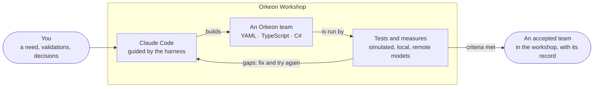
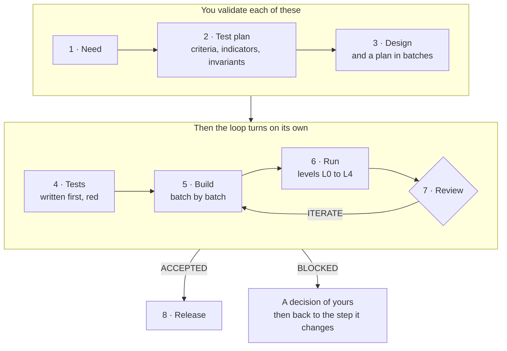
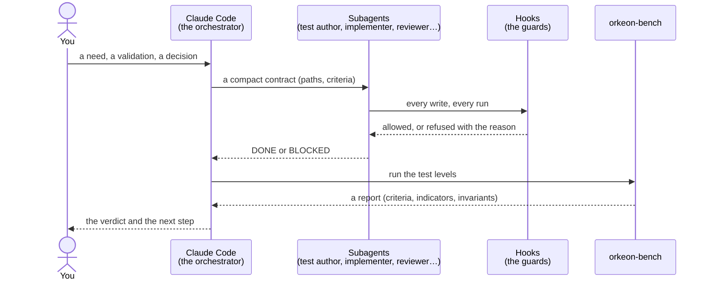

# How a team gets built

*English · [Français](../fr/concepts/process.md)*

Asking a coding assistant for an agent team is easy. A few minutes later there is a folder that loads
and seems to work — and nobody knows whether it does what was needed, what happens when it stops
halfway or meets the same input twice, what it costs, whether a mail it reads can talk it into doing
something else, or why it was built that way once the conversation is gone.

The workshop's method answers those questions before a team is called finished.



## Two tracks

When you ask for a team, Claude offers two tracks and lets you choose:

- **A prototype**: a generator skill writes the team at once, checks it and loads it in Orkeon. It is
  quick, and nothing proves it does what you need yet.
- **The method** described below: the need, the criteria and the tests come first, and a record proves
  the result. A light track keeps it short for a small team — need and acceptance in one document and one
  validation, design and plan together, a single batch.

A prototype can join the method later, through `/team-init --adopt <slug>` (planned, lot 2), which will
keep its crew as the starting point and turn its README into a first draft of the need.

## The steps

Each step reads a file and writes one; nothing important travels through the conversation; no step
starts without the result of the previous one. You validate the need, the test plan and the design;
after that, the loop turns on its own until the team is accepted, or until it needs a decision from you.



| # | Step | Produces | Exit gate |
|---|---|---|---|
| 0 | Start — `/team-init <slug>` | the workbook (`STATUS.md`, a first decision) and the tests folder; the team folder itself comes with the first build, once its format and mount points are decided | — |
| 1 | Need — `/team-need` | `NEED.md`: what the team reads and writes, its mount points, how it resumes after a stop, what it must not process twice, its constraints | you validate the need |
| 2 | Test plan — `/team-test-plan` | `ACCEPTANCE.md`, `TEST-PLAN.md`: acceptance criteria, indicators, invariants; datasets, test levels, budget | you validate criteria, thresholds and budget |
| 3 | Design — `/team-design` | `DESIGN.md`, `PLAN.md`: format, agents, tasks, tools, deliverables, resume strategy; a plan in batches `B1`, `B2`… | you validate the design |
| 4 | Tests — `/team-tests` | synthetic datasets, scenarios, judge rubrics, in `tests/<slug>/` | every test exists, cites a criterion, and fails |
| 5 | Build — `/team-build` | the team, batch by batch, by a subagent that cannot touch the tests | static and unit levels pass, no test modified |
| 6 | Run — `/team-run` | an attempt: the runs and a report | budget gate before any remote model |
| 7 | Review — `/team-review` | an analysis and a fix plan, from read-only subagents | `ACCEPTED` · `ITERATE` (back to 5) · `BLOCKED` (a decision is needed) |
| 8 | Release — `/team-release` | README, Studio card and launchers realigned; a git tag proposed | — |

You can change the need, the criteria or the design at any time: the change becomes a dated decision
(`/team-decision`) and the steps it invalidates are redone. `/team-status` tells where a team is.

> **Planned.** The `team-*` skills above are the drivers of each step, built lot by lot (see the
> [roadmap](../README.md#roadmap)), and so is the simulated model the loop runs on first. Until they
> exist, the method is followed by hand, on your request, with the templates of `.claude/templates/` and
> the description in `references/process/workflow.md`; the generator skills (`orkeon-crew-yaml`,
> `orkeon-crew-typescript`) already build and check a team — a prototype.

## The workbook

Everything about how a team is made stays in `workbooks/<slug>/`:

```text
workbooks/notes-digest/
├── NEED.md          the need, as you validated it
├── ACCEPTANCE.md    acceptance criteria (AC-01…), indicators (IND-01…), invariants (INV-…)
├── TEST-PLAN.md     datasets, levels, budget
├── DESIGN.md        the design and its reasons
├── PLAN.md          the build plan, in batches B1, B2…
├── STATUS.md        where the team is: phase, last gate passed, attempt, verdict, next action
├── decisions/       DEC-0001-<slug>.md, DEC-0002-<slug>.md… — every change of direction, dated
├── attempts/        ATT-0001/… — each run of the test levels: report, analysis, fix plan
└── runs/            the raw runs (written by orkeon-bench only)
```

`STATUS.md` starts with a few fields that scripts read:

```markdown
---
phase: build
gate_passed: tests
attempt: ATT-0002
batch: B1
verdict: null
next_action: /team-build B1
updated_at: 2026-09-30T19:12:00Z
---

- 2026-09-30 19:12 — /team-build — B1 opened
```

## Who does what

Claude Code does not write everything itself. The main session splits the work, delegates it with a
short contract and judges the result; subagents produce; hooks watch every write and every run; the
bench measures.



The hooks enforce part of the method whatever the permission mode — and the workshop's seeded Claude Code
settings ask no permission (`bypassPermissions`, [The workshop](./workshop.md#what-belongs-to-whom)), so
they are the guards:

- no run on a paid remote model without a recorded approval;
- no test edited during a build, no team edited by the one who writes its tests, and no team's settings
  written by a subagent;
- no key written to disk.

Commits and tags are proposed, never made: that is a rule Claude follows (the `guard-git` hook that would
enforce it is off by default). Your validations at the gates will be recorded from what you type
(`/team-approve`), by a hook, once the `team-*` skills ship.

The details of each guard are in [The harness](../reference/harness.md).

Next: [Testing a team](./testing.md).
