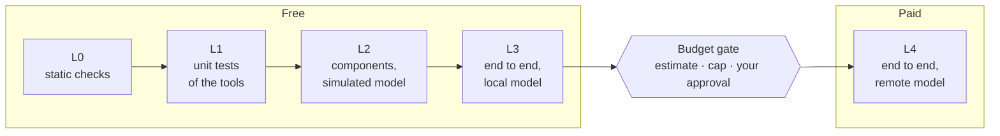

# Testing a team

*English · [Français](../fr/concepts/testing.md)*

A team is accepted by a report that proves it meets its criteria — not by a demo that looked right.
This page explains what is measured and how, from free checks to paid runs.

## Criteria, indicators, invariants

Before the team is designed, its test plan states what "done" means
(`workbooks/<slug>/ACCEPTANCE.md`):

| Kind | Id | What it is | Example |
|---|---|---|---|
| **Acceptance criterion** | `AC-01`, `AC-02`… | a behaviour the team must show, at a given test level | *every mail gets exactly one category* |
| **Indicator** | `IND-01`… | a measure with a threshold | *triage under 2 minutes for 50 mails*, *judge score ≥ 4/5* |
| **Invariant** | `INV-FS`, `INV-RESUME`… | a property that must always hold | *writes only under its writable mount points*, *a mail already processed is not processed again* |

Standard invariants come from a catalogue (`references/testing/invariants-catalog.md`): `INV-FS`
(writes only where allowed), `INV-SECRETS` (no key in outputs or logs), `INV-EMAIL` (drafts, never sends
on its own), `INV-TOOLS` (only declared tools), `INV-SCHEMA`, `INV-IDEMP` (same input, same result),
`INV-RESUME` (an interrupted run resumes without redoing what was done), `INV-INCR`, `INV-BUDGET`,
`INV-INJECTION` (instructions hidden in an input have no effect).

The verdict follows one rule: **accepted** ⇔ every criterion passes at its level, every invariant
holds and every indicator is in range.

## Five levels, from free to paid

The levels run in order and stop at the first failure, so that a paid run never pays for a mistake a
free level would have caught.



| Level | Proves | With | Costs |
|---|---|---|---|
| **L0 static** | the definition is well formed and loads | `check_crew.py` / `check_team.py`, `orkeon run --validate`, `tsc`, `dotnet build`, the agreement of `mounts.json`, card and launchers | nothing |
| **L1 unit** | the custom tools are correct | unit tests of the tools (TypeScript, C#) | nothing |
| **L2 component** | the wiring: a task in isolation, tool calls, deliverables, resume | a **simulated model** that answers from a script, while the real tools run | nothing |
| **L3 end to end, local** | the whole team reaches its criteria with a small local model | Ollama (`qwen3:8b` by default) on the datasets, repeated (`pass@k`: a local model is noisy) | machine time |
| **L4 end to end, remote** | the same with the production model | a remote provider | **money** — only after an estimate, a cap and your explicit approval |

> **Available today:** the L0 checks (the check scripts, `--validate`, `tsc`, the .NET builds) and the
> unit tests of the .NET templates. **Planned (lot 4):** `orkeon-bench run`, which runs the levels in one
> command, the simulated model server, datasets and attempts.

## The simulated model

The simulated model is a small local server that speaks the protocol of an OpenAI-compatible
provider. A scenario tells it what to answer to each task — a final text, or a tool call that the
real tool then executes. It proves the wiring (task B receives the output of task A, the deliverable is
written, `file_write` is never called on a read-only folder) without spending a token. The set-up was
proven on the installed Orkeon while the harness was built — a forty-line stub, not shipped, made `orkeon
run` call a real tool and write a real deliverable (`VERIFICATIONS.md`, V-04); the simulated model itself
ships with the bench in lot 4.

## Local and remote models

"The model" here is the one the **team under test** calls — never the one Claude Code uses. By default
the bench uses the Orkeon settings of the machine (the local Ollama model, as the image configures it).
A team's `tests/<slug>/bench.config.json` can name other profiles:

```json
{
  "profiles": {
    "machine": { "source": "orkeon-settings" },
    "claude":  { "baseUrl": "https://api.anthropic.com", "model": "<model>", "keyEnv": "ANTHROPIC_API_KEY", "timeoutSeconds": 600 }
  },
  "levels": {
    "e2e_local":  { "profile": "machine", "repeat": 3, "pass_at": 2 },
    "e2e_remote": { "profile": "claude",  "repeat": 1 }
  },
  "budget": { "local_minutes_max": 60, "remote_usd_max": 2.0 }
}
```

A profile never holds a key, only the **name** of the environment variable that does (`keyEnv`).
`orkeon-bench profile <team> <profile>` shows what a profile would inject, and whether it is remote:

```console
$ orkeon-bench profile notes-digest machine
profile: machine (machine)
  settings file: /home/node/.config/Orkeon/appsettings.json
  base URL from: /home/node/.config/Orkeon/appsettings.json
  Llm section from: /home/node/.config/Orkeon/appsettings.json
remote: no (localhost: local host)
variables to inject: none (machine settings apply)
```

Any run that would reach a remote model goes through the **budget gate** (the `run-gate` hook): it is
refused unless the team's open attempt holds your approval. See [Models: local and remote](../guides/models.md).

## Datasets and judges

- **Datasets** are synthetic: nominal cases, edge cases (empty, too big, duplicates, odd encodings) and
  an **adversarial** set — inputs that hide instructions, to prove the team ignores them. One folder per
  mount point, so a dataset is also a ready mount set. They live in `tests/<slug>/datasets/`.
- **Judges** grade what a rule cannot check — the quality of a summary, the tone of a reply — with a
  versioned rubric (`tests/<slug>/judges/<name>.md`) applied by a read-only Claude subagent.

## The report

Each run of the levels is an **attempt** (`workbooks/<slug>/attempts/ATT-0001/`) with a report in two
forms: `REPORT.md` for people, `report.json` for scripts — written by `orkeon-bench run` (planned, lot 4).
`orkeon-bench report validate`, available today, checks the JSON against its schema and the verdict rule:

```bash
orkeon-bench report validate workbooks/notes-digest/attempts/ATT-0001/report.json
```

Next: [A YAML team](../guides/yaml-team.md), or back to [the documentation index](../README.md).
