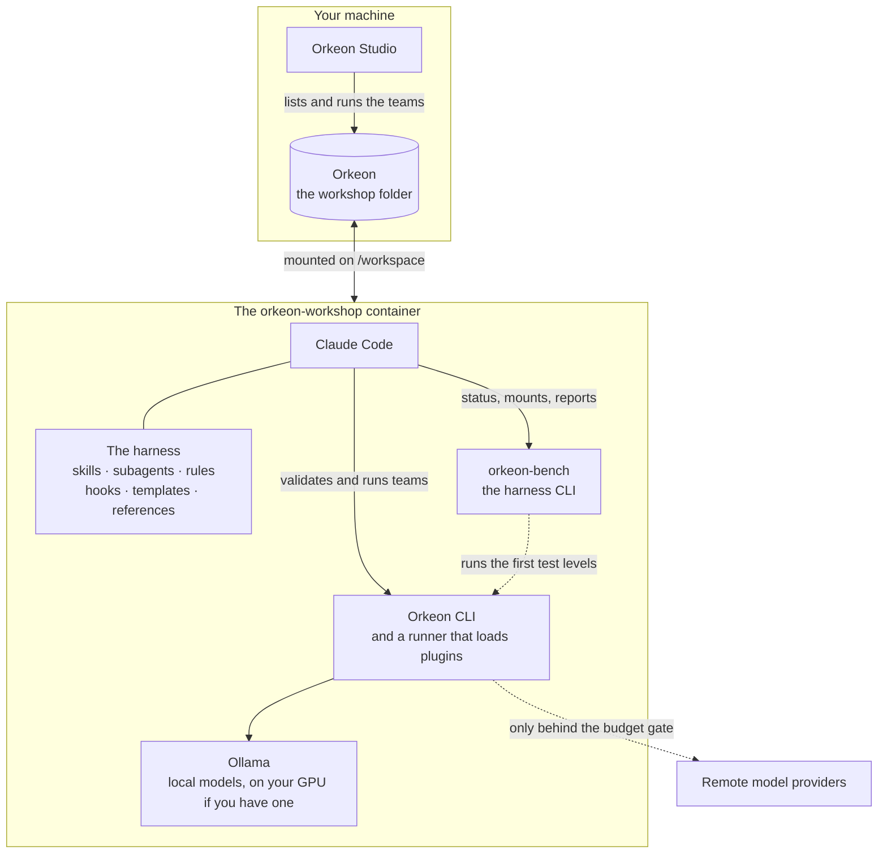

# The workshop

*English · [Français](../fr/concepts/workshop.md)*

The **workshop** is one folder of your computer, of any name — this documentation uses `%USERPROFILE%\Orkeon`
on Windows, the folder Orkeon Studio reads by default, and `~/Orkeon` on Linux — mounted on `/workspace` in the
container, the way Claude Code's own devcontainer mounts a project. A folder that already holds teams
can be it: the harness settles next to them. Claude Code is opened there, the harness is deployed there, and your teams live there.



## What is in it

```text
/workspace/                the host's Orkeon folder
├── CLAUDE.md              the workshop's notes; imports the harness entry point
├── .claude/               the harness: skills, agents, rules, hooks, templates, evals
├── .devcontainer/         its VS Code configuration: open the folder, Reopen in Container
├── references/            reference documents: Orkeon, the process, testing…
├── library/               reusable bricks: agents, tools, schemas, datasets, mount schemes, examples
├── teams/<slug>/          one team, as Orkeon Studio runs it
│   ├── crew/              its definition: YAML, or TypeScript with custom tools
│   ├── mounts.json        its mount points, free in name and number
│   ├── studio-team.json   the card Orkeon Studio reads, with run.sh and run.cmd: written from mounts.json
│   ├── README.md          how to use the team; .gitignore keeps what it reads and writes out of git
│   └── <its folders>      one per mount point, each with a .gitkeep
├── workbooks/<slug>/      how it is made: need, criteria, test plan, design, plan, status,
│                          decisions, attempts, runs
├── tests/<slug>/          how it is proven: datasets, scenarios, judges, bench configuration
├── settings/<slug>/       its own Orkeon settings, when it needs some: appsettings.json
├── mounts.<name>/<slug>/  a mount set: other folders for the same mount points
└── archive/               retired teams, compacted attempts and runs
```

A team is spread over folders with the same name (its *slug*, like `notes-digest`): what Studio runs in
`teams/<slug>/`, how it was made in `workbooks/<slug>/`, how it is proven in `tests/<slug>/`, and, when it
needs settings of its own (a mailbox, another model), its Orkeon settings in `settings/<slug>/`. The team
folder holds only what Studio and the definition of the crew need — nothing about how the team was made,
and no settings file, since its agents can read what sits beside the crew. See [Teams](./teams.md) and
[Mount points](./mount-points.md).

`settings/<slug>/appsettings.json` is passed to Orkeon with `--settings` by the team's launchers
(`run.sh`, `run.cmd`) and `orkeon-harness-run`; `orkeon-bench run`, on the simulated model, passes a copy of it whose model
settings point at that model and whose other settings are the team's. Orkeon then reads it **instead of**
`~/.config/Orkeon/appsettings.json`: it carries its own `Llm` section, and never a key (a mailbox names the
variable that holds its password — set in the environment the team runs in: the container reads no other
place, Windows also reads your user environment, where Orkeon Studio keeps a password typed in
Settings › E-mail). Orkeon Studio passes it too, on its own, when it launches a team of the
teams folder it lists: the Run screen shows it on a "Team settings file" line, and the run reads it instead
of Studio's own settings file. A model setting the card names (`"profile"` in `studio-team.json`, spelled
exactly as in Studio) is laid over its `Llm` section, and a file pinned in Run › Advanced options (Expert
mode) replaces it for the whole form until Studio closes. A mail account declared in Studio's Settings › E-mail goes
to Studio's own settings: it is visible to every team Studio launches on them — every team without a
settings file of its own — and to no team launched on its own settings file; a team's own account is written in its
`settings/<slug>/appsettings.json`. The
seeded `settings/README.md` shows an example.

Never leave a settings file in `appsettings/` or `_shared/` at the root of the workshop or in `teams/`:
Orkeon finds such a file on its own and reads it, instead of the machine's settings, for every run that
names no settings file — in Studio, the launch of every team without a settings file of its own, unless
an Expert pins a file. `orkeon-bench doctor`, the checks and the start of the container report it.

## What belongs to whom

At each start, `sync-harness.sh` brings the workshop in step with the harness of the image:

| In the workshop | Rule |
|---|---|
| `.claude/` (skills, agents, rules, hooks, templates, evals, `harness/`), `references/`, `library/examples/` | **The image's.** New and updated files are copied, retired ones removed. A file you edited is first saved under `.claude/harness-backup/<stamp>/` (the stamp of the image's harness), then replaced. A file whose line endings alone were changed — a checkout that converted them to CRLF — is put back as shipped, with no backup; and at each start every script of `.claude/` (`*.sh`, `*.py`), `.claude/local/` aside, is put in LF and made executable. |
| `CLAUDE.md`, `.gitignore`, `.gitattributes`, `.claude/settings.local.json`, `.devcontainer/devcontainer.json`, `settings/README.md`, the shelves of `library/` | **Created once**, when absent, then yours: never touched again. |
| `teams/`, `workbooks/`, `tests/`, `settings/`, `mounts.<name>/`, `archive/`, `.claude/local/` (where `/workshop-language` keeps the language of your workshop), `references/local/`, anything you add | **Yours**: never touched. |

So: write your own notes in `CLAUDE.md` (below its first line), your own references in
`references/local/`, your own Claude Code settings in `.claude/settings.local.json` — and never edit
the image's files in place.

Claude Code works in the workshop without asking you: the hooks are the guards. Two things make it so.
The `workshop` command starts it with `--dangerously-skip-permissions` (and `--teammate-mode
in-process`): that option is what puts Claude Code in its bypass mode, where no tool asks. And the
seeded `.claude/settings.local.json` allows every command and every edit (`Bash(*)`, `Edit`, `Write`):
without the option, only the other tools would ask — the `"defaultMode": "bypassPermissions"` of that
file changes nothing, since Claude Code takes that mode from the command line, never from a project's
files. To be asked again, start with `WORKSHOP_SKIP_PERMISSIONS=0 workshop` and remove from that file
the entries of `allow` you want to be asked about
([Configuration](../reference/configuration.md#variables-of-the-image)).

The synchronisation costs one file read when the image has not changed, and a walk through the scripts of
`.claude/`: each start puts every `*.sh` and `*.py` there in LF and makes it executable, so that a hook
runs whatever the machine the workshop was cloned on. The rest of the workshop is not walked: a start
stays short, whatever the workshop holds. `sync-harness.sh --dry-run`
shows what it would do; `-e HARNESS_SYNC=off` turns it off for a container.

## Only into a workshop

The harness deploys only into a folder that is a workshop: one it was deployed into before, one
holding `teams/`, or an empty one. Mount a source project on `/workspace` by mistake and it deploys
nothing, and says why:

```text
[harness] /workspace is not an Orkeon workshop (no harness deployed there before, no teams/, and it holds: README.md src). Nothing deployed.
[harness] Mount your Orkeon folder on /workspace, set ORKEON_WORKSHOP to it, or run 'sync-harness.sh --adopt' once to make this folder a workshop.
```

To work on a source project next to the workshop, mount it elsewhere, for instance
`-v "<project>:/projects/<name>"`. To keep the workshop at another path in the container, set
`ORKEON_WORKSHOP`: `-v "<folder>:/orkeon" -e ORKEON_WORKSHOP=/orkeon`.

## Orkeon Studio sees it

Orkeon Studio, on Windows, lists every folder of its teams folder as a team. That folder is
`%USERPROFILE%\Orkeon\teams` by default: a workshop in `%USERPROFILE%\Orkeon` needs nothing. For a
workshop in any other folder, point Studio at its `teams` subfolder — in Studio, Settings › Studio, the
"Teams folder" card, **Change…** — or set the `ORKEON_STUDIO_TEAMS_ROOT` variable, which wins over that
card, in PowerShell:

```powershell
setx ORKEON_STUDIO_TEAMS_ROOT "D:\Work\my-workshop\teams"
```

The path must be absolute. Studio chooses its teams folder once, when it starts: close it and start it
again after either change. The "Teams folder" card says which folder is in force and where it comes
from. `orkeon-studio --teams-root <folder>` names the folder for one start.

A team built in the workshop appears in Studio the next time "My teams" opens; Studio runs it with the
folders its card names, on the team's own settings file when it has one, else on Studio's own model
settings. What Studio checks, and what it does with a workshop team, is in
[Teams](./teams.md#what-studios-own-actions-do).

## Versioning it with git

The workshop can be a git repository: `git init` in it, from the container or the host. The
`.gitignore` the harness created keeps out what should not be versioned — the runs, the mount sets
`mounts.*/`, build output, the backups and local settings of the harness, `.env` files — and each team's
`.gitignore`, written by `orkeon-bench scaffold`, keeps out what the team reads and writes in its folders
(a `.gitkeep` keeps each folder: the launchers and Studio create a missing writable folder, and refuse
to run without a read-only one). The harness never commits for you: when something is worth a commit,
Claude proposes the command and you run it.

The `.gitattributes` the harness created holds one rule, `* -text`: git stores and checks out every
file byte for byte. Commit it with the rest. Without it, a Git that converts line endings — Git for
Windows does by default (`core.autocrlf`) — checks the workshop out in CRLF on the next machine: the
hooks no longer run (`set: pipefail: invalid option name`) before the container, at its next start, has
put `.claude/` back, a launcher `run.sh` no longer runs at all, and a crew or a dataset no longer has the
digest `orkeon-bench` recorded for it. The rule cuts both ways: git no longer puts in LF a file an editor
saved in CRLF — it is committed as it is. In a workshop cloned before it had this file, the container
puts the harness back by itself; the rest — launchers, documents, data — is repaired as
[Troubleshooting](../reference/troubleshooting.md#a-workshop-checked-out-in-crlf) says.

Next: [Teams](./teams.md).
