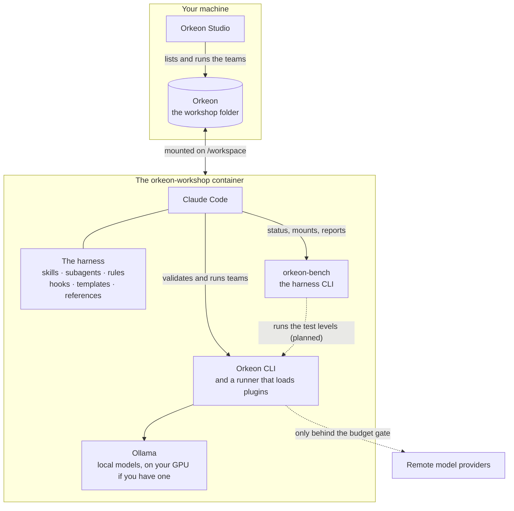

# The workshop

*English · [Français](../fr/concepts/workshop.md)*

The **workshop** is one folder of your computer — `%USERPROFILE%\Orkeon` on Windows, `~/Orkeon` on
Linux — mounted on `/workspace` in the container, the way Claude Code's own devcontainer mounts a
project. Claude Code is opened there, the harness is deployed there, and your teams live there.



## What is in it

```text
/workspace/                the host's Orkeon folder
├── CLAUDE.md              the workshop's notes; imports the harness entry point
├── .claude/               the harness: skills, agents, rules, hooks, templates, evals
├── .devcontainer/         its VS Code configuration: open the folder, Reopen in Container
├── references/            reference documents: Orkeon, the process, testing…
├── library/               reusable bricks: agents, tools, schemas, datasets, mount schemes, examples
├── teams/<slug>/          one team, as Orkeon Studio runs it
│   ├── crew/              its definition: YAML, or TypeScript with custom tools
│   ├── mounts.json        its mount points, free in name and number
│   ├── studio-team.json   the card Orkeon Studio reads, with run.sh and run.cmd: written from mounts.json
│   ├── README.md          how to use the team; .gitignore keeps what it reads and writes out of git
│   └── <its folders>      one per mount point, each with a .gitkeep
├── workbooks/<slug>/      how it is made: need, criteria, test plan, design, plan, status,
│                          decisions, attempts, runs
├── tests/<slug>/          how it is proven: datasets, scenarios, judges, bench configuration
├── settings/<slug>/       its own Orkeon settings, when it needs some: appsettings.json
├── mounts.<name>/<slug>/  a mount set: other folders for the same mount points
└── archive/               retired teams, compacted attempts and runs
```

A team is spread over folders with the same name (its *slug*, like `notes-digest`): what Studio runs in
`teams/<slug>/`, how it was made in `workbooks/<slug>/`, how it is proven in `tests/<slug>/`, and, when it
needs settings of its own (a mailbox, another model), its Orkeon settings in `settings/<slug>/`. The team
folder holds only what Studio and the definition of the crew need — nothing about how the team was made,
and no settings file, since its agents can read what sits beside the crew. See [Teams](./teams.md) and
[Mount points](./mount-points.md).

`settings/<slug>/appsettings.json` is passed to Orkeon with `--settings` by the team's launchers
(`run.sh`, `run.cmd`) and `orkeon-harness-run` — and by the bench once it runs teams (lot 4). Orkeon then reads it **instead of**
`~/.config/Orkeon/appsettings.json`: it carries its own `Llm` section, and never a key (a mailbox names the
variable that holds its password). Studio does not read it: in Studio a team runs on Studio's own settings,
or on the model setting its card names (`"profile"` in `studio-team.json`, spelled exactly as in Studio); to hand Studio this file, pin
it in Run › Advanced options (Expert mode), which holds for the whole form until Studio closes — every
team launched from that form then gets that file. A mail account
written in Studio's own settings is visible to every team Studio launches. The seeded `settings/README.md`
shows an example.

Never leave a settings file in `appsettings/` or `_shared/` at the root of the workshop or in `teams/`:
Orkeon finds such a file on its own and reads it, instead of the machine's settings, for every run that
names no settings file — every Studio launch, unless an Expert pins a file. `orkeon-bench doctor`, the
checks and the start of the container report it.

## What belongs to whom

At each start, `sync-harness.sh` brings the workshop in step with the harness of the image:

| In the workshop | Rule |
|---|---|
| `.claude/` (skills, agents, rules, hooks, templates, evals, `harness/`), `references/`, `library/examples/` | **The image's.** New and updated files are copied, retired ones removed. A file you edited is first saved under `.claude/harness-backup/<stamp>/` (the stamp of the image's harness), then replaced. |
| `CLAUDE.md`, `.gitignore`, `.claude/settings.local.json`, `.devcontainer/devcontainer.json`, `settings/README.md`, the shelves of `library/` | **Created once**, when absent, then yours: never touched again. |
| `teams/`, `workbooks/`, `tests/`, `settings/`, `mounts.<name>/`, `archive/`, `.claude/local/`, `references/local/`, anything you add | **Yours**: never touched. |

So: write your own notes in `CLAUDE.md` (below its first line), your own references in
`references/local/`, your own Claude Code settings in `.claude/settings.local.json` — and never edit
the image's files in place.

The seeded `.claude/settings.local.json` lets Claude Code run every command and make every edit without
asking you (`"defaultMode": "bypassPermissions"`, with `Bash(*)`, `Edit` and `Write` allowed): the hooks
are then the guards. Remove `defaultMode` from that file to be asked again.

The synchronisation costs one file read when the image has not changed. `sync-harness.sh --dry-run`
shows what it would do; `-e HARNESS_SYNC=off` turns it off for a container.

## Only into a workshop

The harness deploys only into a folder that is a workshop: one it was deployed into before, one
holding `teams/`, or an empty one. Mount a source project on `/workspace` by mistake and it deploys
nothing, and says why:

```text
[harness] /workspace is not an Orkeon workshop (no harness deployed there before, no teams/, and it holds: README.md src). Nothing deployed.
[harness] Mount your Orkeon folder on /workspace, set ORKEON_WORKSHOP to it, or run 'sync-harness.sh --adopt' once to make this folder a workshop.
```

To work on a source project next to the workshop, mount it elsewhere, for instance
`-v "<project>:/projects/<name>"`. To keep the workshop at another path in the container, set
`ORKEON_WORKSHOP`: `-v "<folder>:/orkeon" -e ORKEON_WORKSHOP=/orkeon`.

## Orkeon Studio sees it

Orkeon Studio, on Windows, lists every folder of `%USERPROFILE%\Orkeon\teams` as a team — the workshop
must therefore be `%USERPROFILE%\Orkeon` itself for Studio to see its teams. A team built in the workshop appears there
the next time "My teams" opens; Studio runs it with the folders its card names, on Studio's own model
settings. What Studio checks, and what it does with a workshop team, is in
[Teams](./teams.md#what-studios-own-actions-do).

## Versioning it with git

The workshop can be a git repository: `git init` in it, from the container or the host. The
`.gitignore` the harness created keeps out what should not be versioned — the runs, the mount sets
`mounts.*/`, build output, the backups and local settings of the harness, `.env` files — and each team's
`.gitignore`, written by `orkeon-bench scaffold`, keeps out what the team reads and writes in its folders
(a `.gitkeep` keeps each folder, which Studio needs to exist). The harness never commits for you: when
something is worth a commit, Claude proposes the command and you run it.

Next: [Teams](./teams.md).
