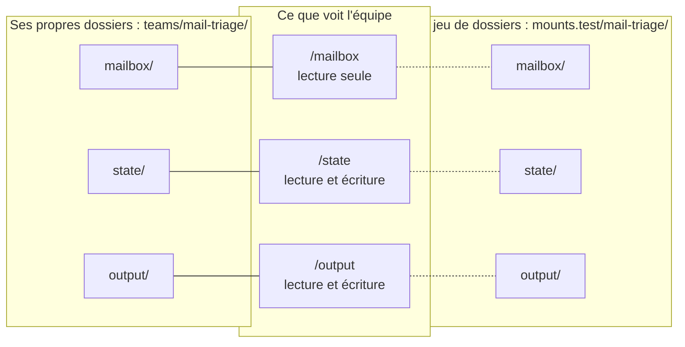

# Points de montage et jeux de dossiers

*[English](../../concepts/mount-points.md) · Français*

## Ce qu'est un point de montage

Les agents ne voient jamais votre disque. Ils voient quelques **dossiers virtuels** — les points de
montage de l'équipe — et Orkeon relie chacun d'eux à un vrai dossier quand l'équipe s'exécute. Un point de
montage a :

| | | Exemple |
|---|---|---|
| `root` | le chemin virtuel qu'utilisent les agents : un mot en minuscules après `/` | `/mailbox` |
| `access` | `ro` lecture seule · `rw` lecture et écriture · `rwnd` écriture sans jamais supprimer | `ro` |
| `role` | à quoi il sert, en un mot | `mailbox`, `inputs`, `deliverables`, `state` |
| `default` | le dossier derrière lui quand l'équipe s'exécute sur ses propres dossiers, relatif au dossier de l'équipe | `./mailbox` |
| `description` | facultatif, pour les humains | `The mails to triage` |

Leurs noms et leur nombre sont propres à l'équipe, décidés à partir de son besoin. Une équipe de tri
d'e-mails pourrait en déclarer trois, dans son `mounts.json` :

```json
{
  "version": 1,
  "mounts": [
    { "root": "/mailbox", "access": "ro", "role": "mailbox", "default": "./mailbox", "description": "The mails to triage" },
    { "root": "/state", "access": "rw", "role": "state", "default": "./state", "description": "What was processed already" },
    { "root": "/output", "access": "rw", "role": "deliverables", "default": "./output", "description": "The triage report" }
  ]
}
```

Une tâche dit alors, dans sa description : *« lire les e-mails de `/mailbox`, ignorer ceux qui figurent
dans `/state/seen.json`, écrire le rapport dans `/output/triage.md` »*.

## D'où ils viennent

Quand un skill générateur crée une équipe, il décide des points de montage dans cet ordre :

1. les dossiers que **vous** nommez — *« lire les e-mails de … »*, *« écrire les résumés dans … »* ;
2. sinon, le tableau des points de montage du besoin ou de la conception de l'équipe
   (`workbooks/<slug>/NEED.md`, `DESIGN.md`), quand la méthode en a produit un ;
3. sinon, d'après ce que l'équipe lit et écrit — un point par type de contenu, nommé d'après lui :
   `/mailbox` pour les e-mails, `/invoices`, `/reports`… ; un `/state` seulement quand l'équipe reprend
   après un arrêt ou travaille par incréments ;
4. seulement quand le besoin ne dit rien des fichiers, il **propose** un schéma : l'un des vôtres, pris
   dans `library/mount-schemes/`, sinon le schéma générique — `/workspace` pour lire et `/output` pour
   écrire — et précise qu'il s'agit d'une proposition.

Cinq racines sont réservées à Orkeon et refusées : `/crew`, `/script`, `/llm-logs`, `/sandbox`,
`/credentials`. Un point de montage `/plugins` doit être en lecture seule (`"access": "ro"`) :
`orkeon-harness-run` charge les plugins qu'il y trouve.

### Ce qu'un point de montage ne peut pas ouvrir

Le dossier derrière un point de montage est tout ce que ses agents peuvent lire ou écrire avec les outils
de fichiers — Orkeon ne les laisse aller nulle part ailleurs. Certains dossiers sont donc refusés, aussi
bien par `orkeon-bench scaffold` que par l'exécuteur C# et les vérifications :

| Dossier refusé | Pourquoi |
|---|---|
| le dossier de l'équipe lui-même (`.`) | ses agents atteindraient `crew/`, les lanceurs et `mounts.json`, et, sur un point en écriture, laisseraient un fichier de réglages que la prochaine exécution lirait ; Studio le refuse aussi |
| tout ce qui se trouve dans `crew/` | la définition de l'équipe n'est pas une donnée |
| un dossier nommé `agents`, `tasks`, `appsettings` ou `_shared` à la racine de l'équipe | Studio prendrait le dossier de l'équipe pour le crew ; Orkeon cherche des réglages dans les deux derniers |
| hors de l'équipe, un dossier qui contient le dossier de l'équipe, l'atelier ou votre dossier personnel | toutes les équipes, leurs réglages et vos identifiants seraient à portée |
| hors de l'équipe, les dossiers `settings/`, `workbooks/`, `tests/`, `.claude/`, `library/`, `references/`, `.devcontainer/` ou `.git/` de l'atelier — ou un dossier situé dans l'un d'eux | les réglages des équipes, leurs traces, les accords des exécutions payantes et les budgets ; le harnais, la bibliothèque partagée et les documents de référence ; ce qui s'exécute au prochain démarrage ou à la prochaine commande git |
| un dossier `appsettings/` ou `_shared/` au-dessus de l'équipe (dans `teams/`, dans l'atelier ou plus haut) | Orkeon y lit les réglages de chaque exécution |
| un dossier caché de votre dossier personnel (`~/.config`, `~/.claude`, `~/.ssh`…), votre `AppData`, `/proc` | les réglages et les identifiants de vos outils — les réglages Orkeon de la machine et les jetons des comptes e-mail, la connexion de Claude Code — et, dans `/proc`, la clé du modèle |
| le dossier d'une autre équipe, ou son jeu de dossiers `mounts.<name>/<other>/` | les agents d'une équipe n'atteignent jamais les dossiers d'une autre |
| un dossier dont le nom finit par un point ou une espace (`./crew.`) | Windows les supprime : sur l'hôte, Studio et `run.cmd` relieraient un autre dossier (`./crew.` y désigne `crew/`) |

Les comparaisons ignorent la casse (comme le fait un dossier Windows), les graphies Windows de ces
dossiers sont refusées de la même façon (`C:\Users\<you>\Orkeon\settings`, `C:\Users\<you>\.claude`…), et
les chemins sont jugés tels qu'ils sont écrits : un lien symbolique n'est pas suivi. Tout autre dossier
hors de l'équipe est accepté avec un avertissement : les lanceurs le relient, mais Orkeon Studio ne lance
l'équipe qu'une fois ce dossier déclaré dans ses « Dossiers autorisés » (Authorized folders).

### Vos propres schémas

Un schéma est une liste toute prête de points de montage, rangée dans `library/mount-schemes/` sous la
forme d'un `mounts.json` — par exemple `mail.json` pour toutes les équipes qui travaillent sur une boîte
aux lettres. Les skills générateurs proposent vos schémas avant le schéma générique. Une équipe part
d'une copie et l'adapte ; plus rien ne la relie ensuite au schéma.

## Tout le reste découle de `mounts.json`

`mounts.json` est la source unique. Après toute modification, lancez :

```bash
orkeon-bench scaffold <team>
```

Cette commande écrit les lanceurs `run.sh` et `run.cmd` (une liaison par point de montage), les `mounts`
de la carte Studio, et crée les dossiers dans l'équipe, chacun avec un `.gitkeep` — Studio ne crée pas un
dossier manquant, et git ne conserve aucun dossier vide —, ainsi que le `.gitignore` de l'équipe, qui
garde hors de git ce que l'équipe lit et écrit. Les vérifications des skills générateurs contrôlent que
les dossiers, la carte et les lanceurs concordent avec `mounts.json`, et que chaque livrable est écrit
sous un point de montage en écriture.

Pour voir les liaisons qu'une exécution utilisera :

```console
$ orkeon-bench mounts notes-digest
--mount /workspace/teams/notes-digest/notes:/notes:ro /workspace/teams/notes-digest/reports:/reports:rw
```

## Jeux de dossiers : la même équipe sur d'autres dossiers

Un **jeu de dossiers** donne un autre dossier à chaque point de montage d'une équipe : pour un essai, une
démonstration, un autre mois de données. C'est un dossier de l'atelier, que vous préparez depuis votre
ordinateur comme n'importe quel autre :

```text
mounts.<set>/<team>/<un dossier par point de montage>
```



À gauche, ce que relient Studio et `./run.sh` ; à droite, ce que relie `TEAM_ENV=test ./run.sh` :

```bash
cd /workspace/teams/mail-triage
TEAM_ENV=test ./run.sh                          # le lanceur, sur mounts.test/mail-triage/
orkeon-bench mounts mail-triage --env test      # les mêmes liaisons, affichées
```

- Dans un jeu, un dossier en lecture seule doit déjà exister ; un dossier en écriture est créé au besoin.
- Un jeu existe quand son dossier `mounts.<set>/<team>/` existe ; sinon le lanceur refuse, en indiquant le
  chemin qu'il attendait.
- Les noms de jeux de dossiers sont des mots en minuscules reliés par des tirets (kebab-case) : `test`, `demo`,
  `march-2026`.
- L'exécuteur C# `orkeon-harness-run` lit `TEAM_ENV` de la même façon.

**Orkeon Studio exécute toujours l'équipe sur ses propres dossiers.** Il n'accepte que des dossiers
situés dans l'équipe, ou des dossiers déclarés dans « Réglages › Dossiers autorisés » (Settings ›
Authorized folders) — seul le dossier physique est comparé, et il doit y être écrit exactement comme
dans la carte : `C:/x` n'est pas `C:\x`. C'est pourquoi les dossiers par défaut d'une équipe restent à
l'intérieur de celle-ci, et les jeux de dossiers servent aux lanceurs.

## Dossiers hors de l'atelier

Un `default` peut aussi être un chemin absolu. Un chemin du conteneur (un dossier de l'hôte monté avec
`-v`) suit les refus ci-dessus ; un dossier en lecture seule doit exister, un dossier en écriture est
créé par le lanceur ; les lanceurs ajoutent `--allow-external-mounts`, et Studio a besoin que le dossier
figure dans ses « Dossiers autorisés ». Un chemin Windows — un partage comme `\\nas\inbox`, ou
`C:\Data\in` — ne sert qu'à `run.cmd` et à Studio : `run.sh` ne peut pas le relier, et les vérifications
le signalent (et refusent les graphies Windows des dossiers ci-dessus). Il est plus simple de garder les
données dans l'atelier, ou dans un jeu de dossiers.

Suite : [Comment se construit une équipe](./process.md).
