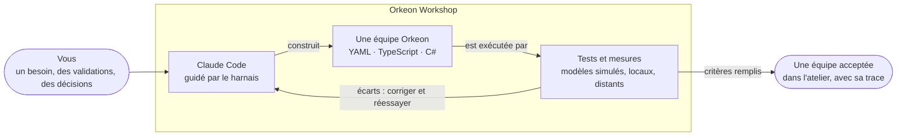
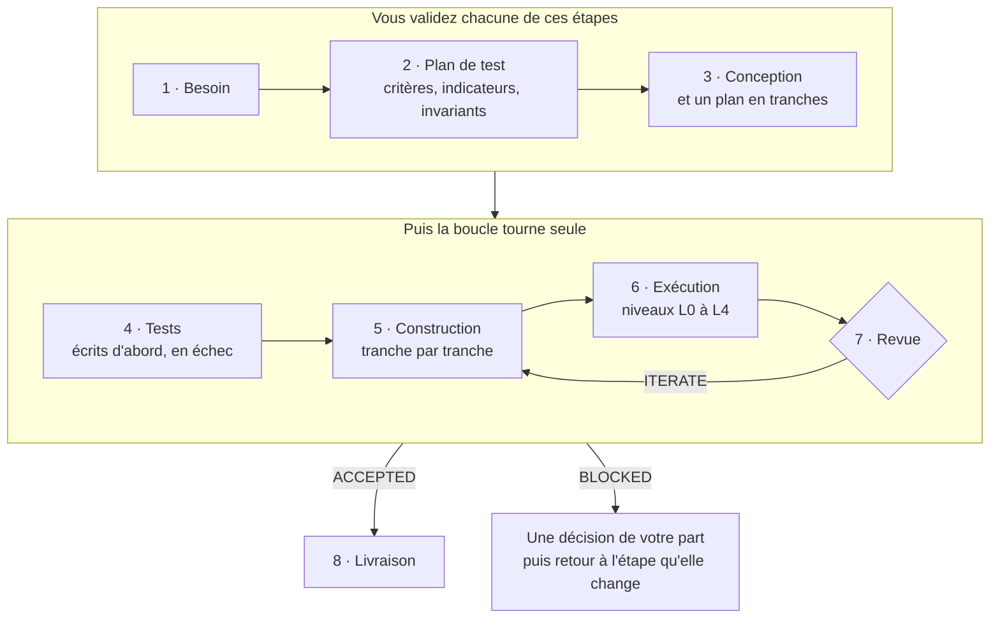
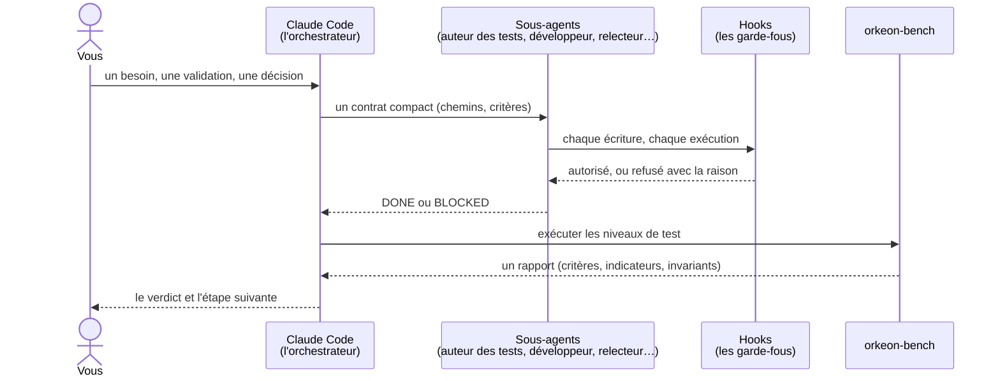

# Comment se construit une équipe

*[English](../../concepts/process.md) · Français*

Demander une équipe d'agents à un assistant de programmation, c'est facile. Quelques minutes plus tard,
on obtient un dossier qui se charge et semble fonctionner — et personne ne sait s'il fait ce qu'il
fallait, ce qui se passe quand l'équipe s'arrête à mi-chemin ou reçoit deux fois la même entrée, ce
qu'elle coûte, si un e-mail qu'elle lit peut la convaincre de faire autre chose, ni pourquoi elle a été
construite ainsi une fois la conversation terminée.

La méthode de l'atelier répond à ces questions avant qu'une équipe soit déclarée terminée.



## Deux pistes

Quand vous demandez une équipe, Claude vous propose deux pistes et vous laisse choisir :

- **Un prototype** : un skill générateur écrit l'équipe d'un coup, la vérifie et la charge dans Orkeon.
  C'est rapide, mais rien ne prouve encore qu'elle fait ce dont vous avez besoin.
- **La méthode** décrite ci-dessous : le besoin, les critères et les tests viennent d'abord, et une trace
  prouve le résultat. Une piste allégée l'abrège pour une petite équipe — besoin, critères et plan de test
  validés ensemble par un seul `/team-approve need`, conception et plan ensemble, une seule tranche.

Un prototype peut rejoindre la méthode plus tard, grâce à `/team-init --adopt <slug>`, qui garde son crew
comme point de départ et fait de son README le premier brouillon du besoin. `/team-init --light <slug>`
choisit la piste allégée.

## Les étapes

Chaque étape lit un fichier et en écrit un ; rien d'important ne passe par la conversation ; aucune étape
ne commence sans le résultat de la précédente. Vous validez le besoin, le plan de test et la conception ;
ensuite, la boucle tourne seule jusqu'à ce que l'équipe soit acceptée, ou jusqu'à ce qu'il faille une
décision de votre part.



| # | Étape | Produit | Validation de sortie |
|---|---|---|---|
| 0 | Démarrage — `/team-init <slug>` | le cahier (`STATUS.md`, une première décision) et le dossier des tests ; le dossier de l'équipe lui-même arrive avec la première construction, une fois son format et ses points de montage décidés | — |
| 1 | Besoin — `/team-need` | `NEED.md` : ce que l'équipe lit et écrit, ses points de montage, comment elle reprend après un arrêt, ce qu'elle ne doit pas traiter deux fois, ses contraintes | vous validez le besoin |
| 2 | Plan de test — `/team-test-plan` | `ACCEPTANCE.md`, `TEST-PLAN.md` : critères d'acceptation, indicateurs, invariants ; jeux de données, niveaux de test, budget | vous validez les critères, les seuils et le budget |
| 3 | Conception — `/team-design` | `DESIGN.md`, `PLAN.md` : format, agents, tâches, outils, livrables, stratégie de reprise ; un plan en tranches `B1`, `B2`… | vous validez la conception |
| 4 | Tests — `/team-tests` | jeux de données synthétiques, scénarios, grilles d'évaluation des juges, dans `tests/<slug>/` | chaque test existe, cite un critère, et échoue |
| 5 | Construction — `/team-build` | l'équipe, tranche par tranche, par un sous-agent qui ne peut pas toucher aux tests | les niveaux statique et unitaire passent, aucun test n'est modifié |
| 6 | Exécution — `/team-run` | une tentative : les exécutions et un rapport | barrière de budget avant tout modèle distant |
| 7 | Revue — `/team-review` | une analyse et un plan de correction, par des sous-agents en lecture seule | `ACCEPTED` · `ITERATE` (retour à 5) · `BLOCKED` (une décision est nécessaire) |
| 8 | Livraison — `/team-release` | README, carte Studio et lanceurs réalignés ; une étiquette de version proposée | — |

Vous pouvez changer le besoin, les critères ou la conception à tout moment : le changement devient une
décision datée (`/team-decision`) et les étapes qu'il invalide sont refaites. `/team-status` indique où
en est une équipe — dans n'importe quelle session : tout ce qu'il faut pour reprendre est dans le cahier,
rien dans la conversation.

Vous passez une validation en tapant une ligne : `/team-approve need`, `/team-approve test-plan`,
`/team-approve design` (ajoutez le nom de l'équipe quand plusieurs attendent). Un hook l'enregistre telle
que vous l'avez tapée ; Claude ne peut pas écrire une validation à votre place, et un « ok » dit dans la
conversation n'est pas la validation — Claude vous demandera de la taper. Une ligne tapée trop tôt est
refusée, avec la raison : une validation n'est enregistrée qu'une fois que son étape a terminé son document
et vous l'a soumis.

**Dans votre langue.** Par défaut, Claude converse dans la langue de vos messages et écrit tous les
fichiers en anglais. `/workshop-language fr` — une étiquette de langue, ou son nom — règle la langue de
l'atelier : Claude converse alors dans cette langue même quand vous ne tapez que des commandes, et y écrit
le texte du cahier (le besoin, les critères, le plan de test, la conception, les décisions). Ce que lisent
les scripts reste en anglais : les titres des documents, les clés et le journal de `STATUS.md`, les
identifiants, et les messages des hooks, que Claude vous rapporte dans votre langue. Rien de ce qui est
déjà écrit n'est traduit, et `/workshop-language default` revient en arrière. La langue dans laquelle
écrivent les agents d'une équipe est une autre question : elle fait partie du besoin de cette équipe.

> **Disponible et prévu.** Les skills `team-*` pilotent chacun une étape et sont construits lot par lot
> (voir la [feuille de route](../README.md#feuille-de-route)). Disponibles : `/team-init`, `/team-need`,
> `/team-decision`, `/team-status`, les validations (`/team-approve`) et `/workshop-language` ; le modèle simulé sur lequel la
> boucle tourne d'abord ([Tester une équipe](./testing.md)). Prévus : les skills des étapes 2 à 8. Tant
> qu'un skill n'existe pas, son étape
> est suivie à la main, à votre demande, avec les gabarits de `.claude/templates/` et la description de
> `references/process/workflow.md` ; les skills générateurs (`orkeon-crew-yaml`, `orkeon-crew-typescript`)
> construisent et vérifient déjà une équipe — un prototype.

## Le cahier

Tout ce qui concerne la fabrication d'une équipe reste dans `workbooks/<slug>/` :

```text
workbooks/notes-digest/
├── NEED.md          le besoin, tel que vous l'avez validé
├── ACCEPTANCE.md    critères d'acceptation (AC-01…), indicateurs (IND-01…), invariants (INV-…)
├── TEST-PLAN.md     jeux de données, niveaux, budget
├── DESIGN.md        la conception et ses raisons
├── PLAN.md          le plan de construction, en tranches B1, B2…
├── STATUS.md        où en est l'équipe : phase, dernière validation franchie, tentative, verdict, prochaine action
├── decisions/       DEC-0001-<slug>.md, DEC-0002-<slug>.md… — chaque changement de direction, daté
├── attempts/        ATT-0001/… — chaque essai pour faire passer l'équipe : rapport, analyse, plan de correction
└── runs/            les exécutions brutes (écrites par orkeon-bench seulement)
```

`STATUS.md` commence par quelques champs que lisent des scripts :

```markdown
---
phase: build
gate_passed: tests
attempt: ATT-0002
batch: B1
verdict: null
next_action: /team-build B1
updated_at: 2026-09-30T19:12:00Z
---

- 2026-09-30 19:12 — /team-build — B1 opened
```

## Qui fait quoi

Claude Code n'écrit pas tout lui-même. La session principale découpe le travail, le délègue avec un
contrat court et juge le résultat ; les sous-agents produisent ; les hooks surveillent chaque écriture et
chaque exécution ; le banc mesure.



Les hooks font respecter une partie de la méthode, quel que soit le mode de permission — et `workshop`
lance Claude Code sans demande de permission (`--dangerously-skip-permissions`,
[L'atelier](./workshop.md#ce-qui-appartient-à-qui)), si bien que ce sont eux les garde-fous :

- aucune exécution sur un modèle distant payant sans un accord enregistré ;
- aucune validation passée par Claude : vos validations sont enregistrées à partir de la ligne que vous
  tapez (`/team-approve …`), et une modification qui en écrirait une à votre place est refusée ;
- aucun test modifié pendant une construction, aucune équipe modifiée par celui qui écrit ses tests, et
  aucun réglage d'équipe écrit par un sous-agent ;
- aucune clé écrite sur le disque.

Les commits et les étiquettes de version sont proposés, jamais effectués : c'est une règle que Claude suit (le hook
`guard-git` qui la ferait respecter est désactivé par défaut).

Le détail de chaque garde-fou se trouve dans [Le harnais](../reference/harness.md).

Suite : [Tester une équipe](./testing.md).
