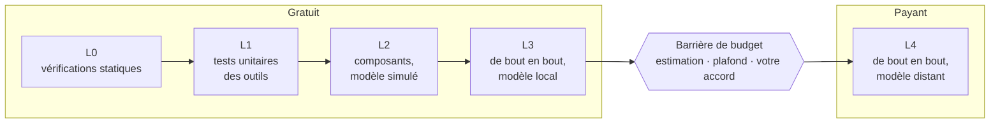

# Tester une équipe

*[English](../../concepts/testing.md) · Français*

Une équipe est acceptée au vu d'un rapport qui prouve qu'elle remplit ses critères — pas d'une
démonstration qui semblait convaincante. Cette page explique ce qui est mesuré et comment, des
vérifications gratuites aux exécutions payantes.

## Critères, indicateurs, invariants

Avant que l'équipe soit conçue, son plan de test énonce ce que « terminé » veut dire
(`workbooks/<slug>/ACCEPTANCE.md`) :

| Nature | Identifiant | Ce que c'est | Exemple |
|---|---|---|---|
| **Critère d'acceptation** | `AC-01`, `AC-02`… | un comportement que l'équipe doit montrer, à un niveau de test donné | *chaque e-mail reçoit exactement une catégorie* |
| **Indicateur** | `IND-01`… | une mesure avec un seuil | *tri en moins de 2 minutes pour 50 e-mails*, *note du juge ≥ 4/5* |
| **Invariant** | `INV-FS`, `INV-RESUME`… | une propriété qui doit toujours être vraie | *n'écrit que sous ses points de montage en écriture*, *un e-mail déjà traité n'est pas traité à nouveau* |

Les invariants standard viennent d'un catalogue (`references/testing/invariants-catalog.md`) : `INV-FS`
(n'écrit que là où c'est permis), `INV-SECRETS` (aucune clé dans les sorties ni dans les journaux),
`INV-EMAIL` (rédige des brouillons, n'envoie jamais de lui-même), `INV-TOOLS` (seulement les outils
déclarés), `INV-SCHEMA`, `INV-IDEMP` (même entrée, même résultat), `INV-RESUME` (une exécution
interrompue reprend sans refaire ce qui a été fait), `INV-INCR`, `INV-BUDGET`, `INV-INJECTION` (des
instructions cachées dans une entrée restent sans effet).

Le verdict suit une seule règle : **acceptée** ⇔ chaque critère passe à son niveau, chaque invariant
tient et chaque indicateur est dans sa plage.

## Cinq niveaux, du gratuit au payant

Les niveaux s'exécutent dans l'ordre et s'arrêtent au premier échec, pour qu'une exécution payante ne
paie jamais pour une erreur qu'un niveau gratuit aurait détectée.



| Niveau | Prouve | Avec | Coût |
|---|---|---|---|
| **L0 statique** | la définition est bien formée et se charge | `check_crew.py` / `check_team.py`, `orkeon run --validate`, `tsc`, `dotnet build`, la concordance entre `mounts.json`, la carte et les lanceurs | rien |
| **L1 unitaire** | les outils sur mesure sont corrects | les tests unitaires des outils (TypeScript, C#) | rien |
| **L2 composant** | le câblage : une tâche isolée, les appels d'outils, les livrables, la reprise | un **modèle simulé** qui répond d'après un script, pendant que les vrais outils s'exécutent | rien |
| **L3 de bout en bout, local** | l'équipe entière atteint ses critères avec un petit modèle local | Ollama (`qwen3:8b` par défaut) sur les jeux de données, plusieurs fois (`pass@k` : les résultats d'un modèle local varient) | du temps machine |
| **L4 de bout en bout, distant** | la même chose avec le modèle de production | un fournisseur distant | **de l'argent** — seulement après une estimation, un plafond et votre accord explicite |

> **Disponible aujourd'hui :** les vérifications L0 (les scripts de vérification, `--validate`, `tsc`, les
> compilations .NET) et les tests unitaires des gabarits .NET. **Prévu (lot 4) :** `orkeon-bench run`, qui
> exécute les niveaux en une seule commande, le serveur du modèle simulé, les jeux de données et les tentatives.

## Le modèle simulé

Le modèle simulé est un petit serveur local qui parle le protocole d'un fournisseur compatible OpenAI.
Un scénario lui dit quoi répondre à chaque tâche — un texte final, ou un appel d'outil que le vrai outil
exécute ensuite. Il prouve le câblage (la tâche B reçoit la sortie de la tâche A, le livrable est écrit,
`file_write` n'est jamais appelé sur un dossier en lecture seule) sans dépenser un seul jeton. Le
dispositif a été éprouvé sur la version d'Orkeon installée pendant la construction du harnais — un
bouchon de quarante lignes, non livré, a amené `orkeon run` à appeler un vrai outil et à écrire un vrai
livrable (`VERIFICATIONS.md`, V-04) ; le modèle simulé lui-même sera livré avec le banc au lot 4.

## Modèles locaux et distants

« Le modèle », ici, est celui qu'appelle l'**équipe testée** — jamais celui qu'utilise Claude Code. Par
défaut, le banc utilise les réglages Orkeon de la machine (le modèle Ollama local, tel que l'image le
configure). Le fichier `tests/<slug>/bench.config.json` d'une équipe peut nommer d'autres profils :

```json
{
  "profiles": {
    "machine": { "source": "orkeon-settings" },
    "claude":  { "baseUrl": "https://api.anthropic.com", "model": "<model>", "keyEnv": "ANTHROPIC_API_KEY", "timeoutSeconds": 600 }
  },
  "levels": {
    "e2e_local":  { "profile": "machine", "repeat": 3, "pass_at": 2 },
    "e2e_remote": { "profile": "claude",  "repeat": 1 }
  },
  "budget": { "local_minutes_max": 60, "remote_usd_max": 2.0 }
}
```

Un profil ne contient jamais de clé, seulement le **nom** de la variable d'environnement qui la contient
(`keyEnv`). `orkeon-bench profile <team> <profile>` montre ce qu'un profil injecterait, et s'il est
distant :

```console
$ orkeon-bench profile notes-digest machine
profile: machine (machine)
  settings file: /home/node/.config/Orkeon/appsettings.json
  base URL from: /home/node/.config/Orkeon/appsettings.json
  Llm section from: /home/node/.config/Orkeon/appsettings.json
remote: no (localhost: local host)
variables to inject: none (machine settings apply)
```

Toute exécution qui atteindrait un modèle distant passe par la **barrière de budget** (le hook
`run-gate`) : elle est refusée tant que la tentative ouverte de l'équipe ne contient pas votre accord.
Voir [Modèles : locaux et distants](../guides/models.md).

## Jeux de données et juges

- Les **jeux de données** sont synthétiques : cas nominaux, cas limites (vide, trop gros, doublons,
  encodages inhabituels) et un jeu **hostile** — des entrées qui cachent des instructions, pour prouver
  que l'équipe les ignore. Un dossier par point de montage : un jeu de données est donc aussi un jeu de
  dossiers tout prêt. Ils se trouvent dans `tests/<slug>/datasets/`.
- Les **juges** notent ce qu'une règle ne peut pas vérifier — la qualité d'un résumé, le ton d'une
  réponse — avec une grille d'évaluation versionnée (`tests/<slug>/judges/<name>.md`) appliquée par un
  sous-agent Claude en lecture seule.

## Le rapport

Chaque exécution des niveaux est une **tentative** (`workbooks/<slug>/attempts/ATT-0001/`), avec un
rapport sous deux formes : `REPORT.md` pour les humains, `report.json` pour les scripts — écrits par
`orkeon-bench run` (prévu, lot 4). `orkeon-bench report validate`, disponible dès aujourd'hui, vérifie le
JSON par rapport à son schéma et à la règle du verdict :

```bash
orkeon-bench report validate workbooks/notes-digest/attempts/ATT-0001/report.json
```

Suite : [Une équipe YAML](../guides/yaml-team.md), ou retour au [sommaire de la documentation](../README.md).
