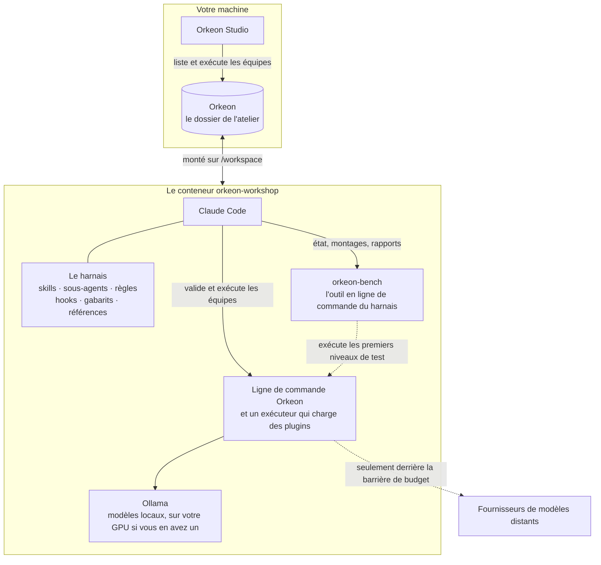

# L'atelier

*[English](../../concepts/workshop.md) · Français*

L'**atelier** est un dossier de votre ordinateur, au nom de votre choix — cette documentation prend
`%USERPROFILE%\Orkeon` sous Windows, le dossier que lit Orkeon Studio par défaut, et `~/Orkeon` sous Linux — monté
sur `/workspace` dans le conteneur, comme le devcontainer de Claude Code monte un projet. Un dossier qui
contient déjà des équipes peut en être un : le harnais s'installe à côté d'elles.
C'est là que Claude Code s'ouvre, que le harnais est déployé et que vivent vos équipes.



## Ce qu'il contient

```text
/workspace/                le dossier Orkeon de l'hôte
├── CLAUDE.md              les notes de l'atelier ; importe le point d'entrée du harnais
├── .claude/               le harnais : skills, agents, règles, hooks, gabarits, évals
├── .devcontainer/         sa configuration VS Code : ouvrir le dossier, puis Reopen in Container
├── references/            documents de référence : Orkeon, le processus, les tests…
├── library/               briques réutilisables : agents, outils, schémas JSON, jeux de données, schémas de montage, exemples
├── teams/<slug>/          une équipe, telle qu'Orkeon Studio l'exécute
│   ├── crew/              sa définition : YAML, ou TypeScript avec des outils sur mesure
│   ├── mounts.json        ses points de montage, libres en nom et en nombre
│   ├── studio-team.json   la carte que lit Orkeon Studio, avec run.sh et run.cmd : écrits à partir de mounts.json
│   ├── README.md          comment utiliser l'équipe ; .gitignore garde hors de git ce qu'elle lit et écrit
│   └── <ses dossiers>     un par point de montage, chacun avec un .gitkeep
├── workbooks/<slug>/      comment elle est faite : besoin, critères, plan de test, conception, plan, état,
│                          décisions, tentatives, exécutions
├── tests/<slug>/          comment on prouve qu'elle fonctionne : jeux de données, scénarios, juges, configuration du banc
├── settings/<slug>/       ses propres réglages Orkeon, quand elle en a besoin : appsettings.json
├── mounts.<name>/<slug>/  un jeu de dossiers : d'autres dossiers pour les mêmes points de montage
├── deployments/           les archives qu'écrit /deploy : une équipe à installer dans un autre atelier
└── archive/               équipes retirées, tentatives et exécutions compactées
```

Une équipe est répartie sur des dossiers qui portent le même nom (son *slug*, comme `notes-digest`) :
dans `teams/<slug>/`, ce que Studio exécute ; dans `workbooks/<slug>/`, comment elle a été faite ; dans
`tests/<slug>/`, la preuve qu'elle fonctionne ; et, quand elle a besoin de réglages propres (une boîte aux
lettres, un autre modèle), ses réglages Orkeon dans `settings/<slug>/`. Le dossier de l'équipe ne contient
que ce dont Studio et la définition du crew ont besoin — rien sur la façon dont l'équipe a été faite, et
aucun fichier de réglages, puisque ses agents peuvent lire ce qui se trouve à côté du crew. Voir
[Les équipes](./teams.md) et [Points de montage](./mount-points.md).

`settings/<slug>/appsettings.json` est transmis à Orkeon avec `--settings` par les lanceurs de l'équipe
(`run.sh`, `run.cmd`) et par `orkeon-harness-run` ; `orkeon-bench run`, sur le modèle simulé, en transmet une copie dont les
réglages de modèle désignent ce modèle et dont les autres réglages sont ceux de l'équipe. Orkeon le lit alors **à la place de** `~/.config/Orkeon/appsettings.json` : il contient sa
propre section `Llm`, et jamais de clé (une boîte aux lettres y nomme la variable qui contient son mot de
passe — définie dans l'environnement où l'équipe s'exécute : le conteneur ne lit rien d'autre, Windows lit
aussi votre environnement utilisateur, où Orkeon Studio conserve un mot de passe saisi dans
« Réglages › Mails » (Settings › E-mail)). Orkeon Studio le transmet aussi, de lui-même, quand il lance une équipe du dossier d'équipes qu'il
liste : l'écran « Exécuter » (Run) le montre sur une ligne « Fichier de réglages de l'équipe » (Team
settings file), et l'exécution le lit à la place du fichier de réglages de Studio. Un réglage de modèle que
nomme la carte (`"profile"` dans `studio-team.json`, écrit exactement comme dans Studio) s'applique
par-dessus sa section `Llm`, et un fichier épinglé dans « Exécuter › Options avancées » (Run › Advanced
options), en mode « Expert », le remplace pour tout le formulaire jusqu'à la fermeture de Studio. Un compte
e-mail déclaré dans « Réglages › Mails » (Settings › E-mail) de Studio est inscrit dans les réglages de
Studio : il est visible par toutes les équipes que Studio lance avec eux — toutes celles qui n'ont pas de
fichier de réglages propre — et par aucune équipe lancée avec son propre fichier de réglages ; le compte d'une équipe s'écrit dans
son `settings/<slug>/appsettings.json`. Le fichier `settings/README.md`, que le harnais
crée une fois, en donne un exemple.

Ne laissez jamais de fichier de réglages dans `appsettings/` ou `_shared/` à la racine de l'atelier ou
dans `teams/` : Orkeon trouve un tel fichier tout seul et le lit, à la place des réglages de la machine,
pour chaque exécution qui ne nomme aucun fichier de réglages — dans Studio, le lancement de toute équipe
qui n'a pas de fichier de réglages propre, à moins qu'un fichier ne soit épinglé en mode « Expert ».
`orkeon-bench doctor`, les vérifications et le démarrage du conteneur le signalent.

## Ce qui appartient à qui

À chaque démarrage, `sync-harness.sh` aligne l'atelier sur le harnais de l'image :

| Dans l'atelier | Règle |
|---|---|
| `.claude/` (skills, agents, règles, hooks, gabarits, évals, `harness/`), `references/`, `library/examples/` | **Propriété de l'image.** Les fichiers nouveaux ou mis à jour sont copiés, ceux que l'image a retirés sont supprimés. Un fichier que vous avez modifié est d'abord sauvegardé sous `.claude/harness-backup/<stamp>/` (l'empreinte du harnais de l'image), puis remplacé. Un fichier dont seules les fins de ligne ont changé — une extraction qui les a converties en CRLF — est remis tel que l'image le livre, sans sauvegarde ; et à chaque démarrage, chaque script de `.claude/` (`*.sh`, `*.py`), hors `.claude/local/`, est remis en LF et rendu exécutable. |
| `CLAUDE.md`, `.gitignore`, `.gitattributes`, `.claude/settings.local.json`, `.devcontainer/devcontainer.json`, `settings/README.md`, les rayons de `library/` | **Créés une seule fois**, s'ils manquent, puis à vous : plus jamais touchés. |
| `teams/`, `workbooks/`, `tests/`, `settings/`, `mounts.<name>/`, `archive/`, `.claude/local/` (où `/workshop-language` garde la langue de votre atelier, et où Claude dépose les scripts qu'il vous remet à exécuter, `.claude/local/scripts/`), `references/local/`, tout ce que vous ajoutez | **À vous** : jamais touchés. |

Donc : écrivez vos propres notes dans `CLAUDE.md` (sous sa première ligne), vos propres références dans
`references/local/`, vos propres réglages Claude Code dans `.claude/settings.local.json` — et ne modifiez
jamais sur place les fichiers de l'image.

Dans l'atelier, Claude Code travaille sans vous demander la permission : ce sont les hooks qui servent de
garde-fous. Deux choses y contribuent. La commande `workshop` le lance avec
`--dangerously-skip-permissions` (et `--teammate-mode in-process`) : c'est cette option qui met Claude Code
dans son mode sans permission, où aucun outil ne demande. Et le `.claude/settings.local.json` que le
harnais crée autorise toutes les commandes et toutes les modifications (`Bash(*)`, `Edit`, `Write`) : sans
l'option, seuls les autres outils demanderaient — le `"defaultMode": "bypassPermissions"` de ce fichier ne
change rien, car Claude Code ne prend ce mode que de la ligne de commande, jamais des fichiers d'un projet.
Pour que Claude Code vous demande de nouveau la permission, lancez `WORKSHOP_SKIP_PERMISSIONS=0 workshop`
et retirez de ce fichier les entrées de `allow` sur lesquelles vous voulez être consulté
([Configuration](../reference/configuration.md#variables-de-limage)).

La synchronisation coûte la lecture d'un seul fichier quand l'image n'a pas changé, et un parcours des
scripts de `.claude/` : chaque démarrage y remet en LF et rend exécutable chaque `*.sh` et `*.py`, pour
qu'un hook s'exécute quelle que soit la machine où l'atelier a été cloné. Le reste de l'atelier n'est pas
parcouru : un démarrage reste court, quoi que contienne l'atelier.
`sync-harness.sh --dry-run` montre ce qu'elle ferait ; `-e HARNESS_SYNC=off` la désactive pour un
conteneur.

## Uniquement dans un atelier

Le harnais ne se déploie que dans un dossier qui est un atelier : un dossier où il a déjà été déployé, un
dossier qui contient `teams/`, ou un dossier vide. Si vous montez par erreur un projet de code sur
`/workspace`, il ne déploie rien et explique pourquoi :

```text
[harness] /workspace is not an Orkeon workshop (no harness deployed there before, no teams/, and it holds: README.md src). Nothing deployed.
[harness] Mount your Orkeon folder on /workspace, set ORKEON_WORKSHOP to it, or run 'sync-harness.sh --adopt' once to make this folder a workshop.
```

Pour travailler sur un projet de code à côté de l'atelier, montez-le ailleurs, par exemple
`-v "<project>:/projects/<name>"`. Pour placer l'atelier à un autre chemin dans le conteneur, définissez
`ORKEON_WORKSHOP` : `-v "<folder>:/orkeon" -e ORKEON_WORKSHOP=/orkeon`.

## Orkeon Studio le voit

Sous Windows, Orkeon Studio présente chaque dossier de son dossier d'équipes comme une équipe. Ce dossier
est `%USERPROFILE%\Orkeon\teams` par défaut : un atelier placé dans `%USERPROFILE%\Orkeon` ne demande rien.
Pour un atelier placé dans un autre dossier, indiquez à Studio son sous-dossier `teams` — dans Studio,
« Réglages › Studio » (Settings › Studio), carte « Dossier des équipes » (Teams folder), bouton
**Changer…** (Change…) — ou définissez la variable `ORKEON_STUDIO_TEAMS_ROOT`, qui l'emporte sur cette
carte, dans PowerShell :

```powershell
setx ORKEON_STUDIO_TEAMS_ROOT "D:\Work\my-workshop\teams"
```

Le chemin doit être absolu. Studio choisit son dossier d'équipes une seule fois, à son démarrage :
fermez-le et relancez-le après l'un ou l'autre changement. La carte « Dossier des équipes » indique le
dossier en vigueur et d'où il vient. `orkeon-studio --teams-root <folder>` désigne le dossier pour un seul
démarrage.

Une équipe construite dans l'atelier apparaît dans Studio la prochaine fois que vous ouvrez « Mes équipes »
(My teams) ; Studio l'exécute avec les dossiers que nomme sa carte, sur le fichier de réglages propre à
l'équipe quand elle en a un, sinon sur les réglages de modèle de Studio lui-même.
Ce que Studio vérifie, et ce qu'il fait d'une équipe de l'atelier, se trouve dans
[Les équipes](./teams.md#ce-que-font-les-actions-de-studio).

## Le versionner avec git

L'atelier peut être un dépôt git : lancez `git init` dedans, depuis le conteneur ou depuis l'hôte. Le
`.gitignore` créé par le harnais écarte ce qui ne doit pas être versionné — les exécutions, les jeux de
dossiers `mounts.*/`, les sorties de compilation, les sauvegardes et les réglages locaux du harnais, les
fichiers `.env` — et le `.gitignore` de chaque équipe, écrit par `orkeon-bench scaffold`, écarte ce que
l'équipe lit et écrit dans ses dossiers (un `.gitkeep` conserve chaque dossier : les lanceurs et Studio
créent un dossier en écriture manquant, et refusent d'exécuter l'équipe sans un dossier en lecture seule).
Le harnais ne fait jamais de commit à votre place : quand quelque chose mérite un commit, Claude propose la
commande et c'est vous qui la lancez.

Le `.gitattributes` créé par le harnais contient une seule règle, `* -text` : git enregistre et extrait
chaque fichier octet pour octet. Versionnez-le avec le reste. Sans lui, un Git qui convertit les fins de
ligne — Git for Windows le fait par défaut (`core.autocrlf`) — extrait l'atelier en CRLF sur la machine
suivante : les hooks ne s'exécutent plus (`set: pipefail: invalid option name`) avant que le conteneur, à
son prochain démarrage, ait remis `.claude/` en état, un lanceur `run.sh` ne s'exécute plus du tout, et un
crew ou un jeu de données n'a plus l'empreinte qu'`orkeon-bench` avait enregistrée. La règle joue dans les
deux sens : git ne remet plus en LF un fichier qu'un éditeur a enregistré en CRLF — il est versionné tel
quel. Dans un atelier cloné avant d'avoir ce fichier, le conteneur remet de lui-même le harnais en état ;
le reste — lanceurs, documents, données — se répare comme l'indique le
[Dépannage](../reference/troubleshooting.md#un-atelier-extrait-en-crlf).

Suite : [Les équipes](./teams.md).
