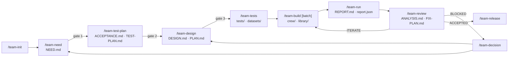

# Orkeon Workshop plan — a Claude Code harness for building Orkeon agent teams

| | |
|---|---|
| **Date** | 2026-09-30 |
| **Status** | v0.3 — decisions D1–D47 (§ 13); lot 0 done 2026-10-01, lot 1 and the review before publication 2026-10-02, the re-read and the migration to Orkeon `main` a2bb6c3 2026-10-03, the migration to Orkeon `main` fb26364, lot 2 and the beginning of lot 4 2026-10-06, the migration to Orkeon `main` 77ac8a9 2026-10-07, the language of a workshop (D41), the `workshop` command (D42) and the migration to Orkeon `main` 80fdefe 2026-10-07, lot 3 delivered but for the pilot's design, the language offered first, the documentation site (D43), the migration to Orkeon `main` 812cd10, the line endings of a workshop (D44) and the migration to Orkeon `main` bd3420c 2026-10-08, the skill `team-tests` of lot 5, `/deploy` (D45), `Llm:StreamIdleSeconds` at 120 (D46) and the migration to Orkeon `main` ce9ec1f 2026-10-10 (§ 11.1); the realisation remains to be validated lot by lot |
| **Location** | `docs/orkeon-workshop-plan.md`, versioned with the repository since 2026-10-01 and written in English (D22; translated that day from the French original). The references `plan § x.y` and `D<n>` in the harness sources (`.devcontainer/`) point at the sections and decisions of this document (§ 2.n = principle n of § 2). The `temp/` folder it cites (including `temp/claude-code-toolkit`) is local and ignored by git |
| **Scope** | The devcontainer image of this repository (`.devcontainer/`) and what it deploys into the workshop (`/workspace` in the container; on the host, the workshop folder, usually `~/Orkeon`) |
| **Orkeon baseline** | `main`, built from the sources by the image at a pinned commit (D32): ce9ec1f of 2026-10-09 (`1.0.0-rc.4.src.20261009.gce9ec1f`, after the tag `1.0.0-rc.4` of 2026-09-22), to which the references were moved on 2026-10-10 (first written on 24ab0d0 of 2026-09-30, then re-established on a2bb6c3 of 2026-10-03 and on fb26364 of 2026-10-05, moved to 77ac8a9 then to 80fdefe on 2026-10-07, to 812cd10 then to bd3420c on 2026-10-08, to ce9ec1f on 2026-10-10) — every change of the repository brings the pin to the latest `main`, once the workshop has been checked on it |
| **Sources** | `.devcontainer/` (Dockerfile, scripts, skills, Orkeon references), `temp/claude-code-toolkit`, the repository `github.com/Orkeon/orkeon`, the Claude Code documentation |

---

## 0. Summary

**Goal.** Turn the image into a **specialised Claude Code harness**: design, build, test, evaluate, fix and release **Orkeon agent teams** (YAML, TypeScript, C#) and **Orkeon tools in C#**, through a progressive, test-driven process in which every attempt and every decision is archived and the user can step in at any time.

**What the plan settles.**

1. A **folder tree**: that of the harness sources in this repository, and that of the workshop (`/workspace`; on the host, a folder that is usually `~/Orkeon`) where the teams are made: the team folders, their workbooks (attempts, decisions) and their tests next to them, references, reusable bricks.
2. A looping **process**: need → test plan (acceptance criteria, indicators, invariants) → design → tests → build → run and report → analysis and fix plan → iteration until the result is reached, with validation gates and intervention points.
3. A five-level **test strategy**: static checks, unit tests, components with a simulated LLM, end to end with a local LLM (Ollama), end to end with a remote LLM behind a budget gate.
4. The **components** to build: skills, subagents, hooks, path-scoped rules, a CLI `orkeon-bench` in TypeScript (Clean Architecture + DDD), reference documents, templates, evals of the harness.
5. The **C# part** (tools and teams) according to the guidelines of the Orkeon repository, and the **TypeScript part** in Clean Architecture + DDD.
6. The **integration into the image** and a **breakdown into lots** with, for each, a definition of "done".

**Out of scope.** The realisation itself; frameworks other than Orkeon; the SonarQube/Stryker stack; the three skills unrelated to the goal (`quality-report`, `task-specification`, `technical-specification`), which are removed from the image.

**Decisions taken on 2026-09-30** (details in § 13): the workshop is `~/Orkeon` — Claude Code opens there, and the teams live in `~/Orkeon/teams/`, which is Studio's catalogue; the mounts of a team are declared per team, `input/` → `/workspace:ro` and `output/` → `/output:rw` being only a proposed default; the bench runs the teams with the machine's Orkeon LLM settings, named profiles remaining possible; the harness proposes commits and never makes one on its own; artefacts are in English; a C# tool is exposed through a plugin loaded by the harness runner `orkeon-harness-run` — `orkeon run` loads none, as lot 0 found (V-07, D6) — or through a C# host; the judge is Claude as a subagent; `orkeon forge` and the C# evaluation bridge are postponed; the workbook folder is called `workbook/` (since D12 and D29: `workbooks/<slug>/` next to `teams/`; a C# tool keeps its `workbook/`); the static checks stay in Python.

**Decisions taken on 2026-10-01** (D22–D29): this plan is versioned under `docs/` in English; the project is independent and MIT-licensed; the image is built on Node 24 and published by GitHub Actions without Claude Code; the workshop is mounted on `/workspace` (D26); the mount points of a team are its own — free in name and number, the generic scheme only a proposal — and the launchers, the Studio card and the folders are written from `mounts.json` (D27); other folders for the same points form a mount set `mounts.<name>/<slug>/` (D28); a team folder holds only what Studio runs, its workbook and its tests living in `workbooks/<slug>/` and `tests/<slug>/` next to `teams/` (D29).

**Decisions taken on 2026-10-02** (D30–D40, D40 completed on 2026-10-03): a workshop opens in VS Code through its own seeded configuration (D30); user documentation under `docs/` and the guided tour `/orkeon-tour` (D31); Orkeon built from the sources of `main` (D32); a team's own Orkeon settings in `settings/<slug>/appsettings.json` (D33); then, from the review before publication: two tracks for a new team, a prototype or the method, `/team-init --adopt` joining them (D34); `/team-init` creates the workbook and the tests, the first build batch the team folder (D35); the user's approvals recorded from what the user types, `/team-approve` (D36); a light track for a small team (D37); `ITERATE` back to `gate_passed: tests` with an `iteration` counter (D38); what goes with a team handled as one (D39); what the agents of a team may reach — the mount reach rule, the content of a team settings file, `shell_command` (D40).

**Amended on 2026-10-06** (the migration to Orkeon `main` at fb26364, § 11.1; the amendments are in § 13): Orkeon delivered seven Studio fixes, STUDIO-58 to STUDIO-64, for the frictions the workshop had documented. The workshop can be any folder of the host — Studio is pointed at its `teams\` with `ORKEON_STUDIO_TEAMS_ROOT`, and `%USERPROFILE%\Orkeon` stays Studio's default (D1, D8); Studio passes a team's `settings/<slug>/appsettings.json` on its own and leaves the workshop's launchers as they are (D33); in a workshop its Rename and Delete carry the trees that go with a team (D39); a mount folder named `agents` or `tasks` is no longer refused (D40); the pin moved to fb26364 (D32).

**Taken from the toolkit.** The process reuses the mechanisms of `temp/claude-code-toolkit`: a chain of artefacts between skills, an orchestrator that delegates and judges, the separation of test author and implementer, a read-only review in a forked context, discipline hooks, evals of the kit itself. The detailed mapping is in annex A.

---

## 1. Current state

### 1.1 The image before lot 0 (2026-09-30)

What follows is the starting point; what lot 0 and the following lots changed is in § 10 and § 11.1.

| Component | State | Useful to the harness |
|---|---|---|
| **Orkeon CLI** (`orkeon`, dotnet tool) | Installed at build time, channels `dev` (GitHub Packages) / `release` (nuget.org), `orkeon-update` to change version inside the container, `orkeon doctor` | Yes: `run`, `--validate`, `--events jsonl`, `--llm-log`, `--list-tools` (to be confirmed on the binary, § 1.4) |
| **Typings `orkeon.d.ts`** | Rolled up by `orkeon-update` into `/usr/local/share/orkeon/typings/` | Yes: `tsc` on TS teams |
| **esbuild** | Version pinned by Orkeon | Yes: bundling of the `.ork.ts` files |
| **Ollama** | Modes `local` / `host` / `off`, default model `qwen3:8b`, context 8192, GPU through `--gpus=all`, 600 s per call in the Orkeon config | Yes: local LLM for the tests |
| **Orkeon config** | `~/.config/Orkeon/appsettings.json` written by `init-orkeon.sh` (Ollama) | Yes: the "local" profile |
| **Firewall** | Outbound traffic limited to GitHub, npm, `api.anthropic.com` and a few Microsoft/Docker domains; `FIREWALL_EXTRA_DOMAINS` for the rest | Direct impact: remote LLMs other than Anthropic, `web_search` (Tavily) and `brave_search` need an explicit opening |
| **Skills** (7) | `orkeon-crew-yaml`, `orkeon-crew-typescript` (rc.4 references, templates, `check_crew.py` / `check_team.py`), `orkeon-update`, `clean-restore`, `quality-report`, `task-specification`, `technical-specification` | The three `orkeon-*` skills are the base of the generators; `clean-restore` stays; `quality-report`, `task-specification` and `technical-specification` are removed from the image (D4) |
| **Sync** | `sync-skills.sh`: manifest, backup of local edits, removal of retired skills; covers only `/workspace/.claude/skills` | To be extended (agents, rules, hooks, references, templates) and retargeted at the workshop `~/Orkeon` (D8) |
| **Deployed Claude config** | `settings.local.json`: `bypassPermissions`, `Bash(*)`, `CLAUDE_CODE_EXPERIMENTAL_AGENT_TEAMS=1`; 4 commands inherited from the Claude Code repository the project started from | To be replaced by the settings of the harness |
| **Tooling** | .NET SDK 10, Node 22, `graphify` 0.9.13, `rtk` 0.43, Stryker (.NET and JS), Cypress, `jq`, `python3` **without PyYAML** | PyYAML is missing although `check_crew.py` requires it: to be fixed in the image |

> The container in which this plan was written runs an earlier image (no `orkeon`, no `ollama`, no `esbuild`). Everything that touches Orkeon's real behaviour is to be verified after a rebuild; the points concerned are listed in § 12.

### 1.2 Gaps with respect to the goal

- **No process.** The `orkeon-crew-*` skills generate a team in one shot: no formal definition of the need, no tests, no correction loop, no archiving.
- **No C#.** No C# tools, no C# teams, no Orkeon guidelines built in.
- **No test strategy for teams.** No synthetic data, no simulated LLM, no local/remote distinction, no judges, no indicators, no invariants.
- **No persistent artefacts.** Need, decisions, attempts and reports live in the conversation.
- **No guard rails.** No path-scoped rule, no hook; permissions are "allow everything".
- **Partial sync** and **PyYAML missing**.

### 1.3 The toolkit `temp/claude-code-toolkit` — mechanisms to reuse

The toolkit is a starter `.claude` folder for .NET / DDD repositories (agents, per-layer rules, hooks, TDD skills, evals). What is generic, and what the harness takes over:

- **The chain of artefacts** under `todo/<slug>/`: `/business-spec` → `SPEC-<code>.md` → `/plan-implementation` → `PLAN.md` + one **sheet per batch** → `/implement-tdd batch FX` → `/verify-ddd-tdd`. Each skill ends with a fixed "→ Next step" line; a skill refuses to start without the previous artefact; a relaunch resumes at the first unticked step.
- **The interview protocol** (`skills/business-spec/SKILL.md`): one question = one decision, the recommended option first, `TBD` for what is uncertain, at most three "challenges" (minimal scope, simpler alternative, justified complexity), an assumptions table `Hn — à valider par` ("to be validated by").
- **The batch sheet** (`skills/plan-implementation/references/plan-template.md`): sections in a fixed order (`Intent`, `Design`, `Decisions`, `TDD sequence`, `Code elements`, `Ancrages`, `Assumptions`), proof ticks `RED ✅ · GREEN ✅ · COST ✅` never ticked without an observation, a `— correction:` mode that adds `Correction Cn` without erasing the proofs. `Ancrages` (anchors) names the paths the implementer will touch: "a missing path is a hole in the plan".
- **Orchestration** (`skills/implement-tdd/`): the orchestrator writes nothing; `agents/tdd-test-author.md` (tests only, no search tool) and `agents/tdd-implementer.md` (tests read-only) receive a **compact contract** that names the paths and does not repeat their charter; `## BLOCKED` on a missing path, on a test that cannot pass without being modified, or on a design ambiguity — never a workaround; "never relaunch an agent with the same instruction"; corrections through `SendMessage` within three turns, otherwise a new agent; parallel **waves** of RED when the files are disjoint, GREEN always serialised; relay to the user capped (one table, one line).
- **The COST phase**: an invariant that no test observes is stated by a script in one line (`scripts/access-cost.py`), and the orchestrator validates the line, never the file. Transposable as is: tool calls per task, tokens per run, invariants of a YAML definition.
- **The audit** (`skills/verify-ddd-tdd/`, `context: fork`, `agents/ddd-tdd-auditor.md` without any write tool): the gate `scripts/pre-audit.sh`, then a bounded **capture** (`scripts/audit-capture.sh`: status, diff capped at 1,200 lines, coverage, build — "five audits, 259 turns" before it) opened once; fixed axes with mandatory evidence; severities `Blocking` / `Major` / `Minor`; a capped verdict `VALID` / `GAPS` (1.5 / 3 kB); a code/plan divergence classified as *faulty code* / *stale plan* (never blocking) / *for the user to arbitrate*; a `resume` mode restricted to the previous gap table plus the diff; stop after two correction/audit rounds.
- **The hooks** (`settings.json` wires them as `bash $CLAUDE_PROJECT_DIR/.claude/hooks/<x>.sh`): a **dispatcher** `hooks/bash-dispatch.sh` that loads `lib/*.sh` modules (`guard-git` deny, `cat` / `diff` bounds, `rtk` rewriting, batching nudge); `read-bounds.sh` (refuses an unbounded read beyond 120 lines, with the outline of the file; "re-issue to force", per agent); `explore-guard.sh` (requires a description and an explicit model for every subagent, and **grafts a report contract** onto the prompt through `updatedInput.prompt`); `implement-tdd-guard.sh` (one batch per session); `subagent-report-shape.sh` (the shape of the report, never its substance; blocks and has it re-issued); `handler-claude-md-check.sh` (rules ↔ tests traceability); `session-cleanup.sh`, `tools/doctor`, `context-log.sh`, `clear-nudge.sh`. House rule: a hook exits 0 on `{}` or on a missing dependency, except the deliberate blockers; every threshold has an environment variable.
- **The rules** `rules/*.md` with `paths:`: loaded when a matching file is read or edited, subagents included — hence an orchestrator that stays out of the source folders (an attachment costs ~30 times more in the main context than in a subagent).
- **The evals** `evals/run.sh`: 199 cases in JSON (`fixtures` + `cases` with `hook|cmd`, `pre`, `input`, `env`, `expect`; a `{{SID}}` unique per case), substring assertions on the hook's JSON (`decision`, `reason`, `command`, `context`, `exit`…); policy: "a defect found in production becomes a case; a hook change without a case is not finished". An eval proves that a script emits the right bytes, not that the model reads them: that, the kit measures in production (`scripts/turn-batching-check.py`).
- **Context discipline** (`docs/CONTEXT-COST.md`, `docs/TOOLING.md`): cost = turns × replayed prefix; bounded reads; `tools/bulk-read` (a `claude -p` without tools, ~500 tokens against ~55 k for an `Explore`); `/clear` at each change of phase; `rtk` through the dispatcher; **frozen literals**: an emitter and its parser change in the same modification.

What is specific to .NET and **is not taken over**: the DDD/APP/PERF rule set and the per-layer rules, the per-handler `CLAUDE.md`, the xUnit / Testcontainers / Verify skills, `caveman`, the `graphify-*` hooks (a private tool — even though it is present in the image).

**Defects found in the toolkit — to be fixed before any reuse.** The kit was partially translated from French, which broke emitter/parser pairs: `scripts/pre-audit.sh` still looks for French strings that `rules-coverage.py` no longer prints (the gate blocks every audit), and `cited_ids()` reads `regles appliquees` whereas the template writes `Applied rules`; `agents/ddd-tdd-auditor.md` asks for `VALIDE` / `ECARTS` when the skill expects `VALID` / `GAPS`; `handler-claude-md-check.sh` prints two warnings on stdout, a channel that never reaches the model in `PostToolUse` (and the eval locks the defect in); stale counts in `TOOLING.md` and `README.md`. Lesson kept for the harness: **every frozen literal has an eval on both sides** (the one that emits it, the one that reads it).

### 1.4 Orkeon — what matters for the design

Summary of the references embedded in the skills (`orkeon-reference.md`, `yaml-schema.md`, `typescript-dsl.md`, `studio-layout.md`, established on the rc.4 code):

- **A team (crew)** = agents (`role`, `goal`, `backstory`, `tools`) + tasks (`description`, `expectedOutput`, `agent`, `dependencies`) + a mode (`sequential` by default, `hierarchical`, `parallel`, `consensual`, `graph`, `autonomous`). YAML and declarative TypeScript feed the same engine; TS adds **custom tools** (`toolBuilder`, pure JavaScript run by Jint, **without I/O or Node**); YAML alone exposes task guardrails, `circuitBreaker`, `graphConfig`, `memoryProvider`, the task's `llmOverride` (on `main` an agent's `llm` and `guardrails` are read and dropped — lot 1, V-14).
- **Files**: a virtual file system — agents only see **virtual roots**, declared by mounts `physical:virtual:ro|rw|rwnd`, in any number; `/workspace` for inputs and `/output` for deliverables are only the convention of `orkeon forge promote`. Added to them are `/crew` or `/script` (files shipped with the definition) and roots reserved to the runner (`/llm-logs`, `/sandbox`, `/credentials`). **Deliverables** are written by the framework (`deliverable: {path, source: final_message | structured_output, format}`), with an optional JSON schema.
- A strict **tool catalogue** (unknown name ⇒ failure at launch): files, documents (CSV, PDF, DOCX, XLSX, JSON, XML), databases, web (`web_search` Tavily, `web_scrape`, `http_api`, `github`), `shell_command`, `human_input`, memory and session (`memory_store`, `semantic_search`, `session_store`…), **e-mail** (13 tools, including `email_parser`, which reads an `.eml` without an account), event bus, code analysis.
- **Memory**: `memory: true` + `memoryProvider` (`InMemory`, `Sqlite`, `Redis`, `ChromaDb`, `Pinecone`, `LanceDb`).
- **Robustness**: `graph` mode with bounded retries and a circuit breaker tuned by `graphConfig`, `maxIter`, `maxRpm`; every mode fails the run on a failed task (a2bb6c3). A task's `circuitBreaker` was removed at a2bb6c3 and is refused at load. An agent's and a crew's `maxRpm` are applied since fb26364 — the request of too many waits, it never fails the task — and a `maxRpm` or `maxIter` of 0 or less fails the load.
- **LLM**: 16 providers configured outside the team (Studio profile, `appsettings.json`, `ORKEON_Llm__*` variables); never pin a model in the team.
- **Validation**: `orkeon run --validate` loads the team and resolves the tools without any LLM call, but lets through unknown keys, ids that point at nothing and some enumerations: hence `check_crew.py` / `check_team.py` **before** `--validate`. Since fb26364 a start, `--validate` included, also judges the settings it reads: an unreadable value or an unknown key in a section the host reads refuses it, naming the key.
- **Studio**: recognises a team folder by its shape (`crew/` + `config.yaml` + `agents/` + `tasks/`, or `crew/crew.ork.ts`), launches `orkeon run <target> --events jsonl …` with the mounts of `studio-team.json`; its catalogue is its teams root — `%USERPROFILE%\Orkeon\teams` by default and, since fb26364, the folder that `ORKEON_STUDIO_TEAMS_ROOT`, the `--teams-root` option or Settings › Studio names (STUDIO-61); since fb26364 too, a `crew/` that holds a crew is the crew whatever the team root holds (STUDIO-59).

**Additions drawn from the repository** (`main`, `v1.0.0-rc.4` of 2026-09-22, MIT, single maintainer, feature scope frozen for 1.0, move to .NET 11 planned at its GA on 2026-11-10):

- **Packages.** On nuget.org: `Orkeon` (umbrella: Domain + Application + Infrastructure + Tools.Abstractions + Analysis + Rag), `Orkeon.Tools` (8 families), `Orkeon.Scripting.Cli` (the `orkeon` tool), `Orkeon.Compliance.Vfs` (Roslyn analyser), `Orkeon.Interop.AgentFramework`, `Orkeon.Hosting.Aspire`, `Orkeon.Rag.Onnx`. **Only on GitHub Packages** (`read:packages` token, `dev` channel included): `Orkeon.Hosting` (the CLI's `RunnerHost`), `Orkeon.Plugins`, `Orkeon.Scripting`, `Orkeon.Generators`. Source of truth: `docs/reference/publication-matrix.md`.
- **Mounts.** Declared in `Orkeon:FileSystem:Mounts` or with `--mount a:/x:ro b:/y:rw` (several bindings under **a single** flag), with `--mount-id <ulid>` and `--allow-external-mounts` for a physical path outside the working directory; `mounts:` at crew level only selects roots that are already declared; `AUTO_SUMMARY.md` is written only if `/output:rw` exists; Studio writes one ULID per mount at each save.
- **Resume.** An API exists on the C# host side — `ICheckpointManager`, `IResumeEngine` (`CanResumeAsync`, `ResumeAsync` → tasks already completed and their outputs), stores `InMemory` / `JsonFile` / `Sqlite` / `Postgres` — but **nothing calls it in `orkeon run`** (no `--resume`), and the sequential orchestrator **writes its checkpoints only at the end of the run**. Consequence: resuming a YAML/TS team is **entirely applicative** (unit of work, state register under `/output`, idempotent tasks); for a hosted C# team, `IResumeEngine` helps but does not replace the register.
- **Memory and incremental processing.** `memory: true` + `memoryProvider` only carry the **type** (SQLite `:memory:` by default: nothing survives the run without `Memory:ConnectionString` in the settings). No generic primitive for deduplication or watermarking: to be built on files of `/output` or on a SQLite store. RAG ingestion (manifests) and the code index (`incremental_reindex`) are incremental, however.
- **LLM provider deduced from the configuration.** The provider is **inferred** from `Llm:BaseUrl` (host), then from the model prefix, then from the shape of the key, otherwise OpenAI; `localhost` / port `11434` ⇒ Ollama. A `Llm:Provider` key is no setting: not read until a2bb6c3, it refuses the start at fb26364. Any OpenAI-compatible endpoint is therefore reachable through `ORKEON_Llm__BaseUrl` — which makes the simulated LLM possible (§ 6.3). Without an `Llm` section, the CLI runs on an **echo** provider (`UndefinedLlmProvider`). A public `MockLlmProvider` exists in `Orkeon.Scripting.Testing` (expectations by `PromptContains` / regex). `Llm:TimeoutSeconds` defaults to 30 (600 advised for reasoning models: that is what the image does).
- **Event channel and logs.** `orkeon run --events jsonl`: a versioned protocol (`task.completed`, `cost.updated`, `run.finished`, `input.needed`…), commands on stdin; it is what Studio consumes. `human_input` in event mode emits `input.needed`, and **no answer counts as a refusal**. `--llm-log` captures every HTTP exchange with the model as sanitised JSONL: the raw material of a replay. Tokens and cost through `MeteredLlmProvider` (generation calls only; `estimatedTokens` when the provider does not bill); OpenTelemetry GenAI traces (Aspire dashboard, ADR-011). The supported observation point on the C# side is `ICrewExecutionHook` (domain events are not dispatched during a run).
- **Built-in evaluation (C#).** `AddOrkeonEvaluation`: evaluators `FormatCompliance`, `SchemaCompliance`, `Similarity`, `TextQuality`, `ToolAccuracy`, LLM judges (`Coherence`, `Fluency`, `Groundedness`), `BenchmarkRunner`, `CompareReports`, `JsonFileDataset`; settings `Evaluation:{EnableLlmJudge, DefaultRunsPerCase, RegressionThreshold}` at rc.4 — `EnableLlmJudge` alone since a2bb6c3. Usable from a C# host (§ 8.4).
- **C# tools.** Contract: `ToolBase<TReq,TRes>` + `[ToolContract("name", …)]`, `[FieldSchema]` / `[ReturnSchema]` on `record`s, a `partial` class (for `[LoggerMessage]`; the schema is built at run time from the records, by reflection); registration in DI, then in `IToolRegistry` (empty at the start up to 24ab0d0; since a2bb6c3 Orkeon's default registry is seeded from every `IBaseTool` of the container). Every tool is an `IBaseTool` (`ITool` was removed at a2bb6c3): MCP adapters and the `rag_*` tools attach like any other, and a name belongs to the first tool registered under it. Dynamic loading through **plugins** (`IOrkeonPlugin`, virtual folder `/plugins`, `AddOrkeonPlugins`, isolated `AssemblyLoadContext`s, full trust, no manifest) — **refuted in lot 0 (V-07): no binary shipped by Orkeon loads plugins**; the harness runner `orkeon-harness-run` does (D6, § 8.2). All I/O goes through `IFileSystemService` and virtual paths: the `Orkeon.Compliance.Vfs` analyser turns `System.IO` into a compile error (ADR-008).
- **C# teams.** Builders `AgentBuilder` / `CrewBuilder` / `CrewTaskBuilder` (no `Deliverable(...)`: `OutputFile` / `OutputJson` instead), wiring in the order `AddOrkeonLlmProvider` → `AddOrkeonApplication` + `AddOrkeonInfrastructure` → `AddOrkeonFileSystem` (mandatory, mounts) → tool suites → `IToolRegistry`, execution through `ICrewOrchestrationService.KickoffAsync` (`CrewOutput`: final output, per-task outputs, duration, tokens, success), streaming with `KickoffStreamingAsync`. C# only: `StateGraph<TState>`, autonomy budgets, `FlowEngine`, active RAG, checkpoint stores, `IResumeEngine`. YAML/TS only: `--validate`, `AUTO_SUMMARY.md`, `--events jsonl`, Studio. No `dotnet new` template. A daemon, `orkeon-host`, hosts YAML teams with profiles (`MaxConcurrentRuns`, mounts).
- **`orkeon forge`.** The repository has its own generator of a team from a need (`forge "<need>"`, `resume`, `promote --to <dir>`, `reopen`, `--format yaml|script`), with an archive folder `.orkeon/forge/<slug>/{brief,session,verdict}.json`; `promote` writes the Studio shape. Studio (WPF, **Windows only**; TUI `orkeon-studio-run` / `-config` on every platform) drives `orkeon run --events jsonl` and `orkeon forge --events jsonl`, and injects the model profile as `ORKEON_Llm__*` variables.
- **Limits that weigh on the design** (`docs/reference/limitations.md`): on 24ab0d0, only `sequential` made the team fail on a failed task, a task's `circuitBreaker`, `tools` and `asyncExecution` were read without effect, the `consensual` vote was not semantic, the Guardian was never invoked and `rag:` / `knowledge:` were inert under `orkeon run`. **At a2bb6c3 these are fixed**: every mode fails the run on a failed task and skips its dependents; a task's `tools` are added for that task; `asyncExecution` works in `sequential` and is refused by the modes that order tasks themselves; `circuitBreaker` is refused at load; the consensual vote compares the answers (three agents or more); the Guardian checks prompts (policy `Block`) and frames tool results as data; `rag:` / `knowledge:` work. **At fb26364** an agent's `maxRpm`, the last of these keys read and dropped, is applied, and a crew has one too. What remains: the `strict` preset of the `graph` mode caps a run at 5 attempts; `orkeon typings --out` writes `orkeon.d.ts`, which ships in no package.
- **C# guidelines** (detailed extraction done in lot 1: `references/csharp/orkeon-guidelines.md`): `-warnaserror` and the full analyser set; public API frozen by `PublicApiAnalyzers`; central package management (`Directory.Packages.props`), nuget.org as the only source with source mapping; file-scoped namespaces; `sealed record` + `init`; XML documentation on every public member; `ArgumentNullException.ThrowIfNull` guards; `ConfigureAwait(false)`; `[LoggerMessage]` logging; every suppression justified; Domain without dependencies, Application = ports, Infrastructure = adapters; DI through `AddOrkeonXxx()` extensions; tests on Microsoft.Testing.Platform with hand-written doubles (no Moq: `StubLlmProvider`, `FakeFileSystemService`…), `<Project>.Tests` projects that mirror the sources, filter `Category!=Integration&Category!=Slow`; ADR 002–012; CLA. Commit message convention: not confirmed (conventional commits observed).
- **Discrepancies between the skills' references and the repository documentation — settled in lot 0 and lot 1: `--list-tools` exists (V-01), the card is `studio-team.json` (V-03), a task's `tools:` is inert (V-14; applied at a2bb6c3)**: `orkeon run --list-tools` (used by the skills and `check_*.py`, absent from the part of the CLI documentation that was read); `studio-team.json` (the references cite `StudioTeamMetadata` and `TeamCatalog.cs`, the report did not find that name in the tree — `docs/architecture/studio.md` was not read); `tools:` at task level (the references describe it as active, `limitations.md` says it is inert).
- **Since `main` at fb26364** (2026-10-05, 61 commits after a2bb6c3; the migration is in § 11.1). *Settings judged at start* (breaking): `orkeon run`, `orkeon-host` and `orkeon-repl` validate every setting they read when they start — an unreadable value, an unknown key in a section the host reads (`Llm:Provider`, a misspelt `Orkeon:Guardian:Enabeld`), an unknown section under `Orkeon:` or an unknown name (`Memory:Provider`) refuses the start, naming its key (exit 1; 78 for `orkeon-host`); the root, `Logging` beyond its levels, `Secrets` and dictionary keys stay open; `orkeon doctor` gains the check `runner-settings`, which judges the file as `orkeon run` does. *Rate limiting* (breaking): `maxRpm` on an agent and on a crew (YAML `maxRpm:` / `max_rpm:`, `agentBuilder().maxRpm(n)` and `crewBuilder().maxRpm(n)` in `.ork.ts`, `MaxRpm` in C#) is a sliding window of 60 s per declaring object, in which the request of too many waits, and has no default; `maxIter` defaults to 20 everywhere (15 in C# until then); `RateLimiting:AgentRequestsPerMinute` bounds each agent instance, and `GlobalRequestsPerMinute` and the per-provider cap count every model call of the host once (manager, planner, RAG, judges, memory and the scripts' `ctx.llm` included). *Studio on a workshop folder* (STUDIO-58 to STUDIO-64, detailed in § 11.1): the card is written back without loss; `crew/` is read first, by Studio and by `orkeon run <folder>`; a launch prepares the team's own folders; the teams root is configurable, and a root with `settings/` and `workbooks/` beside it is a workshop for Studio; Studio passes the team's settings file, writes launchers again only when Orkeon wrote them, and in a workshop its Rename, Delete and Duplicate follow the team's trees. *Packaging*: Orkeon is also an apt package (channels `stable`, `rc`, `dev`); the image still builds it from the sources (D32).
- **Since `main` at bd3420c** (2026-10-08, 3 commits after 80fdefe; the migration is in § 11.1). *A settings catalogue*: `orkeon settings` lists every setting a host reads, offline, from the binary — eleven categories, 67 sections and 351 keys at bd3420c —, each key with its type, its default, its allowed values and its meaning, and `orkeon settings env` the environment variables Orkeon reads; the refusal of an unknown key ends on that verb (`` `orkeon settings Llm` lists its keys ``). *A section no shipped binary reads is reported, not refused*: `ToolRateLimiting`, `TokenBudget`, `Orkeon:Dlp`, `Orkeon:Checkpointing` and seven others, written in a settings file, are said once on stderr — with the registration a C# host reads them through — and the run starts; `orkeon doctor` gives one `runner-settings` row at `warn` per such section. *The install channel*: `orkeon doctor` gains `install-channel`, after `dotnet-runtime`, which never fails (`dotnet-tool` for the CLI of the image, installed with `dotnet tool install`), and `orkeon --version --verbose` adds a `channel:` line; `orkeon --help` ends on the documentation site. *Packaging*: five installer lots — the version of a build off a tag, `install.cmd` for the Windows zip, `install-from-source`, the Windows prerequisites, the `INSTALL-CHANNEL` marker — which the image, built from the sources by `orkeon-update.sh`, does not use.
- **Since `main` at ce9ec1f** (2026-10-09, 3 commits after bd3420c; the migration is in § 11.1). *A streamed call that does not end is a failed call* (LLM-12): every Studio or `--events` run streams, and a streamed request was bounded only until its headers arrived, so a model that thought for minutes before its first token hung the run past any `Llm:TimeoutSeconds`, and a stream closed without an answer came back as an empty answer blamed on `Llm:MaxTokens`. Now `Llm:TimeoutSeconds` bounds a streamed call whole, headers and body, on every streaming path; a new key, **`Llm:StreamIdleSeconds`** (unset by default, per profile too, the thirteenth key of the `Llm` section), bounds the silence between two chunks (`error_type` `StreamIdleTimeout`); a stream closed without its finish marker and without any answer is a failed call (`StreamTruncated`), one with some answer is served and flagged `stream_truncated`; the chat-client adapter fails a streamed turn on any error. The image writes `StreamIdleSeconds` at 120 for the local model (D46). *Studio*: the E-mail tab shows the form of an account as four tabs, no form for nobody on a machine without an account, and `orkeon email check --events jsonl` tells Studio why a connection test was refused. *Quality*: 196 of the 200 SonarQube issues of 2026-10-08 resolved — methods split, nested ternaries rewritten, records for long signatures, explicit constructors — without a change of behaviour, but for the never-filled warnings list of `CrewDefinitionValidator`, removed. No tool, crew mode, loader key, mount rule, provider inference or launcher shape changes: the references hold, re-read on the diff.

---

## 2. Principles of the harness

1. **A chain of artefacts.** Each step reads a file and writes one; nothing important travels through the conversation; no step starts without the artefact of the previous one. A relaunched step starts again from its artefact, not from scratch.
2. **Progressive and interruptible.** `STATUS.md` says where things stand; any skill can be launched after a pause, a `/clear` or a restart, and refuses to skip a gate. The user can change the need, the design or a threshold at any time: the change becomes a dated decision and triggers a new iteration from the right step.
3. **Tests before the team.** Acceptance criteria, indicators and invariants are written before the design; the tests exist before the build; a team is "accepted" only by a report that proves it.
4. **The orchestrator judges, the subagents produce.** The orchestrator writes neither tests nor team: it splits the work, delegates with compact contracts (named paths, ids of the criteria), reads the diffs and the reports, and decides. A subagent that cannot do the job without leaving its scope answers `BLOCKED` instead of working around it.
5. **Separation of roles.** The test author does not write in `crew/`; the implementer does not modify the tests; the reviewer is read-only, in a forked context, and audits first what was delivered, then its conformance to the plan.
6. **Deterministic wherever possible.** Parsing, business rules, state registers, deduplication: in deterministic tools (pure TS or C#), unit-tested. The LLM is for judgement and writing. The wiring (DAG, tools, deliverables, resume) is tested with a **simulated** LLM, without a model.
7. **Controlled cost.** The test levels run from free to paid; a remote LLM is called only after an estimate, a cap and an explicit approval; no hook starts a paid run. Claude's context is spared (compact reports, bounded reads, `rtk`).
8. **Everything is archived.** Numbered attempts with a snapshot of the design, Markdown + JSON reports with a fixed schema, a run manifest (Orkeon version, model, hash of the data, durations, cost), decisions.
9. **Secure by default.** No key on disk; no e-mail sent without a draft and authorised recipients; inputs (files, mails) are deemed **untrusted** (prompt injection); the invariants are checked at every run.
10. **The Orkeon reference is authoritative.** YAML by default; TypeScript when custom tools or build-time logic are needed; C# when the tool is heavy, must do I/O or integrate with .NET. Never a method, a tool or a key absent from the references; the installed binary (`--list-tools`, `--validate`) settles any doubt.
11. **One fact lives in one place, and literals are frozen.** A convention is written in a single file (rule, template or reference) and cited elsewhere; the strings that some scripts emit and others read (verdicts, headers, report lines) are listed in a table, and an eval covers each side.

---

## 3. Target folder tree

### 3.1 Sources of the harness (this repository)

```
.devcontainer/
├── Dockerfile · entrypoint.sh · init-orkeon.sh · orkeon-update.sh · init-firewall.sh …   (existing)
├── sync-harness.sh                    # replaces sync-skills.sh: synchronises several roots (see § 10)
├── harness/                           # everything the image deploys into a workspace (with a manifest, versioned)
│   ├── HARNESS.md                     # entry point of the harness → /workspace/.claude/harness/HARNESS.md, imported by the workshop's CLAUDE.md
│   ├── README.md · FROZEN-LITERALS.md · VERIFICATIONS.md · THIRD-PARTY.md   # → /workspace/.claude/harness/
│   ├── claude/                        # → /workspace/.claude
│   │   ├── CLAUDE.workshop.md · gitignore.workshop · settings.local.seed.json   # seeds: the workshop's CLAUDE.md, .gitignore and settings.local.json, created only once
│   │   ├── gitattributes.workshop     # seed: the workshop's .gitattributes, `* -text` (D44)
│   │   ├── devcontainer.workshop.json · settings-readme.workshop.md   # seeds: the workshop's .devcontainer/devcontainer.json (D30) and settings/README.md (D33)
│   │   ├── settings.json              # permissions, hooks, variables
│   │   ├── skills/                    # team-*, orkeon-crew-*, orkeon-tool-csharp, orkeon-tour (D31), orkeon-update, clean-restore
│   │   ├── agents/                    # team-test-author, team-implementer, team-reviewer, dataset-synthesizer, run-analyst, judge
│   │   ├── rules/                     # rules loaded according to the path being edited (yaml, ts, c#, tests, workbook, bench)
│   │   ├── hooks/ + lib/              # the hook scripts and their modules
│   │   └── templates/                 # templates of the artefacts: NEED, ACCEPTANCE, TEST-PLAN, DESIGN, PLAN, STATUS, DECISION, REPORT, ANALYSIS, FIX-PLAN (.md); ATTEMPT-manifest, bench.config, dataset-manifest, mounts, report.schema, scenario (.json)
│   ├── references/                    # → /workspace/references — reference documents (§ 3.4)
│   ├── library/                       # → /workspace/library — starter bricks (schemas, tools, agent fragments, datasets, mount schemes)
│   ├── examples/                      # → /workspace/library/examples — complete pilot teams (team + workbook + tests, laid out as a small workshop; built lot by lot: the workbook of the mail-triage pilot since lot 2, the rest placeholder READMEs until lots 3–8); examples and evals, outside Studio's catalogue
│   └── evals/                         # → /workspace/.claude/evals — evals of the harness itself: cases + runner
├── bench/                             # code of the `orkeon-bench` CLI — TypeScript, Clean Architecture + DDD (§ 9.1)
│   ├── src/{domain,application,infrastructure,interface}/
│   ├── tests/
│   └── package.json
└── csharp/                            # .NET projects following the Orkeon guidelines: the tool, C# team host and plugin templates, the runner orkeon-harness-run (OrkeonRunner/) and orkeon-studio-check (OrkeonStudioCheck/) (§ 8)
```

`skills/`, `agents/`, `rules/`, `hooks/` and `templates/` stay flat files copied into the workshop's `.claude/` by the sync; `bench/` and `csharp/` are **built** into the image (the `orkeon-bench` binary on the `PATH`, the .NET templates in `/usr/local/share/orkeon-harness/`, `orkeon-harness-run` and `orkeon-studio-check` published on the `PATH`).

### 3.2 The workshop `/workspace` (what the user sees)

The workshop is a single folder of the host, mounted on `/workspace` in the container (D26) — usually `~/Orkeon` (`%USERPROFILE%\Orkeon`), whose `teams/` Studio lists by default; any other folder, once Studio's teams root names its `teams\` (Orkeon `main` at fb26364, STUDIO-61): Claude Code opens there, the image synchronises the harness into it, and it can be a git repository.

```
/workspace/                            # the workshop (a folder of the host, usually ~/Orkeon): root of Claude Code, Studio's catalogue (teams/), a git repository if you wish
├── CLAUDE.md                          # seed: "@.claude/harness/HARNESS.md" + the notes of the workshop
├── .gitignore                         # seed: runs, build output, backups and local settings of the harness
├── .gitattributes                     # seed: `* -text`, git converts no line ending (D44)
├── .devcontainer/devcontainer.json    # seed: the VS Code configuration of the workshop (image orkeon-workshop, the folder on /workspace) (D30)
├── .claude/                           # deployed and synchronised by the image; local overrides in .claude/local/ (the language, D41; the scripts Claude hands you to run, .claude/local/scripts/, D47)
├── references/                        # deployed reference documents; local additions in references/local/
├── library/                           # reusable bricks, validated by at least one accepted team
│   ├── agents/                        # proven agent fragments (YAML / TS): role, goal, backstory, tools, sizing
│   ├── tools/ts/                      # pure TS tools (domain + toolBuilder adapter), with their tests
│   ├── tools/csharp/                  # Orkeon tools in C# (one .NET solution per tool, with its tests and its workbook)
│   ├── schemas/                       # JSON schemas of the deliverables
│   ├── datasets/                      # shared synthetic datasets (mails, CSV, PDF…), with a manifest
│   └── mount-schemes/                 # the user's schemes of mount points (§ 3.5)
├── teams/
│   └── <slug>/                        # ONE team, as Studio runs it — and nothing else (D29)
│       ├── crew/                      # the definition (YAML: config.yaml + agents/ + tasks/ | TS: crew.ork.ts + tools/)
│       ├── mounts.json                # its mount points: virtual root, access, role, folder of the team (§ 3.5)
│       ├── studio-team.json · run.sh · run.cmd · .gitignore   # card, launchers and the team's .gitignore, written from mounts.json by orkeon-bench scaffold
│       ├── README.md · [tsconfig.json · typings/]
│       └── <one folder per mount point>          # the team's own folders (input/, output/, mailbox/, state/…), each with a .gitkeep: git keeps the folder, never its content
├── workbooks/
│   └── <slug>/                        # the "why" and the "where are we" of the team
│       ├── NEED.md                    # need (§ 5.1)
│       ├── ACCEPTANCE.md              # acceptance criteria AC-nn, indicators IND-nn, invariants INV-nn or INV-<NAME> (§ 5.2)
│       ├── TEST-PLAN.md               # levels, datasets, LLM targets, judges, budget (§ 5.3)
│       ├── DESIGN.md · PLAN.md        # design and plan in batches (§ 5.4)
│       ├── STATUS.md                  # current state of the workflow (§ 5.5)
│       ├── decisions/                 # DEC-0001-<slug>.md … (§ 5.6)
│       ├── attempts/                  # ATT-0001/ …: design-snapshot/, REPORT.md, report.json, ANALYSIS.md, FIX-PLAN.md, manifest.json, remote-approval.json (§ 5.7)
│       └── runs/                      # RUN-<timestamp>-<target>/: events.jsonl, stderr.log, stub-exchanges.jsonl, output-snapshot/, manifest.json (retention § 4.6)
├── tests/
│   └── <slug>/                        # how the team is proven
│       ├── bench.config.json          # LLM profiles (machine settings by default), levels with repetitions and pass@k, budget, retention (§ 6.5)
│       ├── static/                    # expectations of the static checks (tool catalogue, layout)
│       ├── unit/                      # custom tools: vitest (TS); C# tools have their tests in their project
│       ├── component/                 # per-task/agent scenarios with a simulated LLM (*.scenario.json + response scripts)
│       ├── e2e/                       # end-to-end scenarios (*.scenario.json): dataset, targets, checks, judges
│       ├── datasets/                  # <name>/{<point>/…, expected/, manifest.json, README.md} — one subfolder per mount point; including adversarial/
│       └── judges/                    # versioned rubrics of the LLM judges
├── settings/
│   ├── README.md                      # seed: what a team's settings file does
│   └── <slug>/appsettings.json        # the team's own Orkeon settings (D33): passed with --settings by its launchers, the runner and the bench
├── mounts.<name>/
│   └── <slug>/                        # a mount set (D28): one folder per mount point of the team, used with TEAM_ENV=<name>
├── deployments/                       # <slug>-<date>.zip or .tar.gz: a team packed by /deploy for another workshop (D45); git-ignored
└── archive/                           # retired teams (Studio's Delete moves a team and its trees to archive/<slug>/<kind>/); compacted attempts and runs
```

Decisions built into this tree:

- **The workshop is a folder of the host, mounted on `/workspace`** (D1, D8, D26; amended 2026-10-06): it is the folder Claude Code opens, the one the image's sync feeds, and `teams/` in it is the catalogue Studio lists. `~/Orkeon` is the usual choice — `%USERPROFILE%\Orkeon\teams` is Studio's default teams root, so a workshop there needs nothing — and since Orkeon `main` at fb26364 (STUDIO-61) any other folder serves, once `ORKEON_STUDIO_TEAMS_ROOT` is set to `<workshop>\teams` (or `--teams-root` given, or the « Teams folder » card of Settings › Studio filled: an absolute path, read once when Studio starts). Studio takes that root for a workshop when `settings/` and `workbooks/` exist beside it. The mount is `-v "$env:USERPROFILE\Orkeon:/workspace"` (required; the workshop folder, wherever it is); `ORKEON_WORKSHOP` names another path. The sync deploys only into a workshop — a folder it deployed into before, one holding `teams/`, or an empty one — and leaves a source project alone (`--adopt` overrides once). Versioning the workshop with git is your choice (the harness proposes the commits, § 4.6). There is no step that copies to Studio: a team is listed as soon as its folder exists in `teams/` — after the first build batch of the method (D35), or at once for a prototype — and launches once `--validate` passes.
- **A team folder holds only the team** (D29): the Studio shape (`crew/`, the card, the launchers, the folders of its mount points, the `README.md`) plus `mounts.json`, which Studio ignores (V-03). How the team is made and proven sits next to `teams/`, under the same slug: `workbooks/<slug>/` and `tests/<slug>/`. `./run.sh --validate` and Studio work on the folder as it is, and a team folder copied elsewhere carries no process artefacts.
- **What goes with a team is handled as one** (D39, amended 2026-10-06): since Orkeon `main` at fb26364 (STUDIO-64), in a workshop Studio's Rename moves `workbooks/<slug>`, `tests/<slug>`, `settings/<slug>` and each `mounts.<name>/<slug>` with the team folder, its Delete moves the team and those trees under `archive/<slug>/<kind>/` instead of erasing them, and its Duplicate copies `settings/<slug>` and nothing else — until then the three touched the team folder alone (V-15). `orkeon-bench team rename|remove <slug>`, which moves or removes the five trees together, stays planned for use without Studio (lot 4), and the orphans `orkeon-bench doctor` is to list — a workbook, tests, settings or a mount set without `teams/<slug>/` — become a safety net.
- **The mount points are the team's own** (D11, D27, § 3.5): free in name and number, decided by the need, declared in `mounts.json`, from which the launchers, the card and the folders are written. The generic scheme (`/workspace:ro` + `/output:rw`) is only a proposal. Other folders for the same points form a mount set `mounts.<name>/<slug>/` (D28).
- **Runs are bulky**: `workbooks/<slug>/runs/` is ignored by git beyond a retention (§ 4.6), and can be placed on a Docker volume (the workshop is a host mount, slow for many small files).
- **Identifiers** are stable and traceable from one artefact to the next: `AC-01`, `IND-01`, `INV-01`, `DEC-0001`, `ATT-0001`, `RUN-20260930-1912-local`, batches `B1`… (the prefixes `L0`–`L4` are reserved to the test levels), tests named after the criterion they cover (`ac-01-*.scenario.json`).
- **Language of the produced artefacts: English**, like the skills (a decision already taken for the outputs of the skills). Exchanges with the user stay in the user's language (French for the author); this plan, first written in French, is in English since D22. A workshop may name its language (D41, 2026-10-07): the conversation and the prose of the workbooks are then in it, and what scripts read — headings, keys, ids, the journal, the hooks' messages — stays in English.

### 3.3 And for a C# tool alone?

A C# tool is made in `library/tools/csharp/<Name>/` with the same process, reduced: `workbook/` (need, acceptance, decisions, attempts) and the tests of the project. It is then consumed by one or more teams. Two routes to expose it (§ 8.2): a **plugin** loaded by the harness runner `orkeon-harness-run` (the shipped CLI and Studio load none: V-07, D6), so the team runs through its launchers or the bench, not from Studio; a **C# host** that registers the tool and hosts the team (safe, verified in the repository), the only route for teams that need the C#-only features. The MCP bridge, considered at first, is ruled out: MCP adapters cannot be attached to the agents of a team (`limitations.md`).

### 3.4 The `references/` folder

Reference documents for designing a team. All are written (lot 1, § 11.1); ✔ marks those moved from the `orkeon-crew-*` skills, as a single copy; `references/README.md` is the index. Each document carries the Orkeon version it was established on.

| Folder | Document | Content |
|---|---|---|
| `orkeon/` | `orkeon-reference.md` ✔ | modes, agents, tasks, tool catalogue, VFS, LLM, pitfalls |
| | `yaml-schema.md` ✔ · `typescript-dsl.md` ✔ · `studio-layout.md` ✔ | schemas and the Studio shape |
| | `cli.md` | every command and option of `orkeon` (`run`, `init`, `doctor`, `llm`, `forge`, `email`…), exit codes, `--events jsonl` and the event protocol (`task.completed`, `cost.updated`, `input.needed`, `run.finished` — the base of run analysis), `--llm-log`, `--inputs`, `--var`, settings and their resolution order |
| | `llm-profiles.md` | providers, profiles, `ORKEON_Llm__*` variables, local models (size, context, speed, `thinking`), remote costs |
| | `csharp-tools.md` · `csharp-crews.md` | writing and loading a C# tool, writing and running a C# team (§ 8) |
| | `resume-and-memory.md` | what Orkeon offers natively (memory and its providers, session tools, circuit breaker, retries, `IResumeEngine` on the C# host side only, checkpoints written at the end of the run) and what it does not (no `--resume`, no deduplication, no watermark) |
| `design/` | `team-patterns.md` | pipeline, fan-out/synthesis, write/review loop (`graph`), manager (`hierarchical`), consensus; when to choose which, how many agents, cost |
| | `prompting.md` | writing `role` / `goal` / `backstory` / `description` / `expectedOutput`; virtual paths; anti-patterns |
| | `tools-selection.md` | LLM or deterministic tool? built-in or custom tool? pure TS or C#? |
| | `io-contracts.md` | input/output contracts: virtual roots and access modes, bindings per environment, formats, JSON schemas of deliverables, `structured_output`, file naming |
| | `sizing-and-cost.md` | `maxIter`, `maxTokens`, `maxRpm`, cost and duration estimate per task |
| `reliability/` | `resume-patterns.md` | resuming after an error or a stop: state register in `/output/.state/`, idempotent tasks, splitting into units, "done" markers, restart |
| | `incremental-patterns.md` | incremental processing with memory: deduplication key, watermark, Orkeon memory vs file register, purge |
| | `error-handling.md` | the graph mode's circuit breaker (`graphConfig`), retries, `human_input` escalation, controlled degradation |
| | `security.md` | keys, authorised recipients, SSRF, untrusted inputs and prompt injection, secrets in the outputs |
| `testing/` | `test-levels.md` | the five levels, what each one proves, when to run it |
| | `synthetic-data.md` | producing synthetic datasets (files, `.eml`, CSV, PDF, folder trees), variants and edge cases, adversarial sets, manifest |
| | `acceptance-criteria.md` | writing ACs (Given/When/Then on a dataset), INDs (measure, threshold), INVs (always true) |
| | `invariants-catalog.md` | standard catalogue of invariants (§ 6.7) |
| | `llm-judge.md` | rubrics, calibration on reference outputs, biases, logging |
| | `local-vs-remote.md` | comparability, differentiated thresholds, repetitions and `pass@k`, flakiness |
| `csharp/` | `orkeon-guidelines.md` | extract of the conventions of the Orkeon repository (§ 8) |
| `typescript/` | `clean-architecture-ddd.md` | layering, dependency rules, what goes where (§ 9) |
| `process/` | `workflow.md` · `artefacts.md` · `checklists/` | the process, the formats, the checklists of each gate |
| | `context-discipline.md` | reading and delegating in the workshop: bounded reads, independent calls in one message, logs kept by whoever produced them, and what the hooks enforce (§ 1.3, § 7.3) |

### 3.5 The mounts of a team

A team only sees **virtual roots** — its **mount points** — and what lies behind them is a matter of folders. The harness models them as follows (D11, D27, D28):

- **Declaration** — the mount points are the team's own, free in name and number: `NEED.md` (Mounts section) then `DESIGN.md` list them — virtual name, access (`ro` / `rw` / `rwnd`), role (`inputs`, `deliverables`, `state`, `archive`, `mailbox`, `reference`…), what is expected there — one per kind of content the team reads or writes, named after it (`/mailbox`, `/invoices`, `/reports`), and a separate state root (`/state:rw`) as soon as there is resume or incremental processing, so that the register does not mix with the deliverables. A **scheme** is a ready list of mount points, only *proposed* when the need names no folder: the user's own schemes in `library/mount-schemes/` first, otherwise the generic scheme `.claude/templates/mounts.json` (`/workspace:ro` for the inputs, `/output:rw` for the deliverables — the convention of `orkeon forge promote`). The user can always propose another one. The roots reserved to the runner (`/crew`, `/script`, `/llm-logs`, `/sandbox`, `/credentials`) are forbidden.
- **The team's own folders** — `mounts.json`, at the root of the team, is the single source of the mount points: for each, the `default` folder that backs it when the team runs on its own folders, inside the team (`./input` for `/workspace`, `./<name>` otherwise — Studio's convention, V-12) or absolute. `orkeon-bench scaffold` writes from it the launchers (`run.sh`, `run.cmd`: one binding per mount point under a single `--mount`, `--allow-external-mounts` as soon as a folder leaves the team), the `mounts[]` of the Studio card, the folders of the mount points that lie inside the team, each with a `.gitkeep`, and the team's `.gitignore`, which keeps their content out of git; the generator skills call it, and it is run again after any change of the file. The checks (`check_crew.py`, `check_team.py`) verify that the folders, the card and the launchers agree with `mounts.json`, that every deliverable lies under a writable point, and what Studio would make of the team (`orkeon-studio-check`, Studio's own code, V-15). A folder missing at launch gets the same treatment from the launchers and, since Orkeon `main` at fb26364, from Studio (STUDIO-60): a writable one is created, a read-only one stops the launch, naming it and its mount point.
- **What a mount point may not use** (D40, completed at the re-read of 2026-10-03, amended 2026-10-06) — the folder behind a point is all its agents reach through Orkeon's VFS. A mount point may not use: the team folder itself; `crew/`, or a folder named `appsettings` or `_shared` at the root of the team (a folder named `agents` or `tasks` was refused too until Orkeon `main` at fb26364, where Studio and `orkeon run` read `crew/` first — STUDIO-59: such a folder is now accepted without a warning); outside the team, a folder that holds the team folder, the workshop or the home folder, or that is or lies inside the workshop's `settings/`, `workbooks/`, `tests/`, `.claude/`, `library/`, `references/`, `.devcontainer/` or `.git/`, an `appsettings/` or `_shared/` folder above the team, a hidden folder of the home folder (`~/.config`, `~/.claude`, `~/.ssh`…), the user's `AppData`, `/proc`, or another team's folder or mount set. A `/plugins` mount point is read-only. Any other folder outside the team passes with a warning: Orkeon Studio launches the team only when that folder is declared, spelled exactly, in its Authorized folders. The Windows spellings of these folders (`C:\Users\<you>\Orkeon\settings`, `C:\Users\<you>\.claude`, `C:\Users\<you>\AppData\…`) are refused the same way. Paths are judged as written: a symbolic link is not followed, and a folder name ending with a dot or a space is refused, since Windows drops them (`./crew.` is `crew/` there). Folders compare ignoring case, and the configured workshop (`$ORKEON_WORKSHOP`) and `$XDG_CONFIG_HOME/Orkeon` are guarded too. One rule with the same messages in `orkeon-bench` (`scaffold`, `mounts`), `check_crew.py` / `check_team.py` and both `MountsFile.cs` (`orkeon-harness-run`, the C# host); the team's own folders are judged, not the mount sets.
- **Mount sets** (D28) — other folders for the same mount points, for a trial, a demonstration, another environment: the folder `mounts.<name>/<slug>/` next to `teams/`, with one sub-folder per mount point named after it (`mounts.test/mail-triage/mailbox/`…), prepared from the host. `TEAM_ENV=<name>` makes the launchers, `orkeon-harness-run` and the C# host bind it, and `orkeon-bench mounts <team> --env <name>` prints its arguments; the rule is relative to the team folder (two levels up), so it holds in the container and on Windows alike. A set without a folder for the team is refused, naming the sets that exist. Studio always runs the team's own folders: it refuses a folder outside the team that its settings do not declare (V-12). The per-environment paths of the first format (`environments` in `mounts.json`) are refused with that explanation.
- **Tests** — a scenario binds each point to the folder of a dataset named after it (`tests/<slug>/datasets/<set>/<point>/`); writable points are bound to a temporary copy that the bench then compares with the expected content. A dataset copied into `mounts.<name>/<slug>/` is a mount set ready for a manual trial. A physical root outside the container (network share, folder of the host) is testable only if it is mounted into the container: the test plan says so explicitly.
- **Invariants** — `INV-FS` becomes "writes only under its `rw` roots"; `INV-RESUME` and `INV-INCR` rely on the state root; `secret-guard` covers the team folders, the workbooks, the tests, the team settings, the mount sets, `library/` and `references/` of the workshop.
- **What does not change** — the definition (`crew/`) never mentions physical paths; task descriptions cite the virtual paths in full; no `mounts:` block in `config.yaml` (it resolves entries of the settings that the team does not have).

---

## 4. The process

### 4.1 Overview



Three gates require a validation by the user (need, test plan, design), typed as `/team-approve need|test-plan|design` (D36, § 4.4). After that, the build → run → review loop turns without the user, except on `BLOCKED` or at the budget gate. `/team-decision` and `/team-status` can be used at any time.

**Two tracks for a new team** (D34). Facing a request for a team, the user chooses: a **prototype** — a generator (`orkeon-crew-yaml`, `orkeon-crew-typescript`) writes the team at once, and nothing proves it yet — or the **method** above. `/team-init --adopt <slug>` brings a prototype into the method: its crew is kept as the starting point of the build, its README becomes a first draft of `NEED.md`, and `crew/` will not be frozen before the first build once the rest of D36 lands (lot 6) — today `guard-phase` freezes it in every phase but `build`, and a change of it goes through `/team-decision`.

**A light track** (D37), chosen with `/team-init --light` (`track: light` in `STATUS.md`), suits a small team: `NEED.md`, `ACCEPTANCE.md` and `TEST-PLAN.md` are filled together and approved once, by `/team-approve need`, which writes `gate_passed: test-plan`; `DESIGN.md` and `PLAN.md` are written together, with a single batch `B1`. The design gate, the tests written red before the build, the budget gate, the verdict and the record stay.

### 4.2 The steps

| Step | Skill | Reads | Writes | Exit gate |
|---|---|---|---|---|
| 0 | `/team-init [--adopt] [--light] <slug>` | — | the workbook and the tests (`STATUS.md`, `DEC-0001`, `tests/<slug>/`); the team folder comes with the first build (D35) | — |
| 1 | `/team-need` | `STATUS.md`, a brief if there is one | `NEED.md` | the user validates (`need` checklist) |
| 2 | `/team-test-plan` | `NEED.md` | `ACCEPTANCE.md`, `TEST-PLAN.md`, `tests/<slug>/bench.config.json` | the user validates the criteria, the thresholds and the budget |
| 3 | `/team-design` | `NEED`, `ACCEPTANCE`, `TEST-PLAN`, `references/` | `DESIGN.md`, `PLAN.md` (batches) | design review: Orkeon pitfalls checked by script, the user validates |
| 4 | `/team-tests` | `ACCEPTANCE`, `TEST-PLAN`, `DESIGN` | `tests/**`, `library/datasets/` if shared | every test exists, references an id, and is **red** (the team does not exist yet; for an adopted prototype, the tests that already pass are listed in the journal) |
| 5 | `/team-build [Bn]` | `PLAN.md` (the batch sheet), `DESIGN.md`, the tests of the batch | `crew/**`, `library/tools/**`, the team's `README.md` | L0 and L1 green on the batch; no test modified |
| 6 | `/team-run [--level] [--profile]` | `tests/`, `bench.config.json`, `mounts.json` | `attempts/ATT-n/REPORT.md` + `report.json`, `runs/` | **budget** gate before any remote profile |
| 7 | `/team-review` | `REPORT`, `runs/`, `DESIGN`, `PLAN`, the diff since the previous attempt | `attempts/ATT-n/ANALYSIS.md`, `FIX-PLAN.md`, the verdict in `STATUS.md` | `ACCEPTED` · `ITERATE` · `BLOCKED` |
| 8 | `/team-release` | the whole folder | the final `README.md`, Studio card and launchers realigned, a summary of the attempts, a proposed commit and tag command, compaction of the runs | — |
| ∀ | `/team-decision "…"` | `STATUS.md` | `DEC-nnnn`, artefacts marked "to be revised", `STATUS.md` | — |
| ∀ | `/team-status` | `STATUS.md`, the folder | nothing (or `STATUS.md` realigned) | — |

Each skill starts by reading `STATUS.md`, checks that the previous gate has been passed, and ends by updating it (a hook checks this, § 7.3).

### 4.3 Each step in detail

**`/team-init [--adopt] [--light] <slug>` — open the record.** Creates, next to `teams/`, the workbook `workbooks/<slug>/` — `STATUS.md` with `phase: need`, the track and `iteration: 0`, and `DEC-0001` — and the tests `tests/<slug>/` (D29); its journal line is `— /team-init — workbook and tests created (DEC-0001)`. It does not create the team folder (D35): the format and the mount points are decided at need and design (D27), and `orkeon-bench scaffold` needs a crew. `teams/<slug>/` is born at the first `/team-build` batch: `mounts.json` from the `## Mounts` section of `DESIGN.md`, the crew through the generator skill — into that folder, never `<slug>-2` —, then `orkeon-bench scaffold`. Studio lists the folder as soon as it exists, and launches the team once `--validate` passes. With `--adopt` (D34), the team folder already exists (a prototype): it is kept, and the need starts from its README.

**`/team-need` — define the need, one decision at a time.** The skill conducts a structured interview (the toolkit's protocol: one question = one decision, the recommended option first, `TBD` for what is uncertain, at most three "challenges" — minimal scope, simpler alternative, justified complexity —, assumptions `Hn — to be validated by`) and fills `NEED.md` as it goes. It explicitly covers what the need requires: the **inputs** (folders, files, mails, databases, web: source, format, volume, frequency, examples, virtual root and access), the **outputs** (files: virtual root, format and schema; actions: e-mail draft, API call, database write — with the required authorisations), the **mounts** that follow from them (roots, access, role, where they point today — § 3.5), the **triggers** (manual, scheduled — the `schedule` of the Studio card or the `orkeon-host` daemon —, on arrival), the **incremental processing** (what counts as "already processed", the deduplication key, where the state lives), the **resume** (unit of work, expected failures, what must be idempotent, what must never be done twice — Orkeon offering no native resume at run time, the team carries it), the **constraints** (local or remote LLM, cost, duration, language, confidentiality), the **security** (keys, recipients, untrusted inputs), the **non-goals** and the **open questions**. It speaks neither of agents nor of tasks: zero design detail.

**`/team-test-plan` — decide how we will know it is right.** From `NEED.md`, the skill proposes and then has validated: the **acceptance criteria** `AC-nn` (Given a dataset / When the team runs / Then …, each tied to a test level and to a dataset), the **indicators** `IND-nn` (quantity, unit, threshold, direction), the **invariants** `INV-nn` or `INV-<NAME>` (taken from the standard catalogue + specific ones), then the **test plan**: levels to run, datasets to produce (synthetic or provided, size, edge cases, adversarial set), LLM targets (simulated, local, remote: which ones, when), judges and rubrics, repetitions and `pass@k`, **budget** (local duration, remote cap), pass criteria for the whole. On the light track (D37, § 4.1) these files are filled together with `NEED.md` and approved with it, once.

**`/team-design` — design the team and split it into batches.** Choice of the **format** (YAML / TS / C#) with the reason; orchestration mode; **mounts** (virtual roots, access, role, default binding — § 3.5); agents (2 to 5, sized); tasks and DAG; built-in and custom tools (with, for each custom tool, the "deterministic" justification); deliverables and schemas; **resume and incremental strategy** (state register, idempotence, Orkeon memory); target LLM profile; risks. Then `PLAN.md`: ordered **batches** — typically `B1` deterministic tools, `B2` agents/tasks skeleton, `B3` deliverables and schemas, `B4` resume and incremental, `B5` hardening (guardrails, circuit breaker) — with, for each batch, a **sheet**: scope, `AC`/`INV` covered, tests that must pass at the end, expected cost, and an **Anchors** section that names the files the implementer will touch (a missing path is a hole in the plan, not a search to carry out). Each step of the sheet carries its proof ticks (`TESTS ✅ · BUILD ✅ · L0/L1 ✅`), never ticked without an observation. No plan is written while a blocking question is open. A script checks the design against the known pitfalls (`orkeon-reference.md` § 9) before the gate. On the light track (D37), `DESIGN.md` and `PLAN.md` are written together, with a single batch `B1`.

**`/team-tests` — write the tests before the team.** The orchestrator delegates to the subagent `team-test-author` (write scope: `tests/<slug>/**` and `library/datasets/**`) and to `dataset-synthesizer` (datasets). It produces: the datasets (`tests/<slug>/datasets/<name>/` with `manifest.json`: provenance, hash, size, cases covered), the component scenarios (`tests/<slug>/component/*.scenario.json` + response scripts of the simulated LLM), the end-to-end scenarios (`tests/<slug>/e2e/*.scenario.json`: dataset, targets, deterministic checks, judge rubric), the rubrics (`tests/<slug>/judges/`), the unit tests of the planned custom tools (vitest, on modules that do not exist yet: red). Each test cites the id it covers; a script refuses an orphan test and an `AC` without a test.

**`/team-build` — build, batch by batch.** The orchestrator reads the batch sheet and delegates to `team-implementer` a compact contract: batch, target files, ids covered, tests to make pass, prohibitions. The first batch creates `teams/<slug>/` (D35, `/team-init` above); a generator driven by `/team-build` writes into the existing team folder, never a `<slug>-2` (D34). The implementer uses the generators (`orkeon-crew-yaml`, `orkeon-crew-typescript`, `orkeon-crew-csharp`, `orkeon-tool-csharp`) and never touches `tests/`: a test that cannot pass without being modified comes back as `BLOCKED` (a defect of the plan or of the test, settled by the orchestrator). The orchestrator never relaunches an agent with the same instruction; a short correction goes through a message to the same agent (fewer than three turns), otherwise through a new agent with a corrected contract. Two batches whose files are disjoint can be built in parallel (`isolation: worktree`), the merge and the checks staying serialised. End of batch: L0 (`check_*`, `--validate`, `tsc` / `dotnet build`) and L1 green, the diff reviewed by the orchestrator, `STATUS.md` advanced.

**`/team-run` — run and measure.** Calls `orkeon-bench run <team> --level <max> [--profile <name>]` (profile `machine` by default, simulated LLM for the component level, roots bound to the datasets of the scenario), which runs the levels in order and stops at the first red level (unless `--continue`). Before a remote target: an estimate (expected tokens × rate), a comparison with the cap of `bench.config.json`, the **explicit approval** of the user — typed as `/team-approve remote <usd>` —, recorded in the open attempt (`remote-approval.json`) through `orkeon-bench` (D19, D36). The hook calls `orkeon-bench attempt approve <team> --usd <usd>`, which writes the marker with the amount the user typed and the cap of `bench.config.json` — never Claude, and never a marker above the cap; `orkeon-bench estimate` adds a computed estimate in lot 9. Result: a readable `REPORT.md` + a `report.json` with a fixed schema (§ 5.7), and the raw runs under `runs/`.

**`/team-review` — analyse and decide what comes next.** The subagent `team-reviewer` runs in a forked context, without write access to the team. It receives a **capture** (`orkeon-bench capture`: status, diff since the previous attempt, report, relevant event excerpts) rather than rebuilding thirty turns of reading. It audits first what was delivered (the team as it is), then its conformance to the plan, then classifies each gap: **prompt** (role, description, expected output), **tool** (bug, schema), **DAG** (missing dependency, mode), **data** (insufficient set, wrong expectation), **model capacity** (the local model cannot do it: to be re-tested remotely, or to be split), **flaky** (repeat), **need** (the criterion is badly posed: back to `/team-decision`). Each gap carries a severity (`Blocking` / `Major` / `Minor`) and a piece of evidence (run, event, file): no evidence, no gap. A divergence between the team and the plan is classified as *faulty team*, *stale plan* (never blocking: the plan is corrected along the way) or *to be arbitrated* (the user decides). It **returns** its verdict, its gap table and the prioritised fixes (each linked to an id and to a batch), capped in size; it is the `/team-review` skill, in the main thread, that writes `ANALYSIS.md` and `FIX-PLAN.md` — a subagent cannot write these files (the write tool refuses them to it), and the auditor writes nothing. The verdict: `ACCEPTED` (every AC passes at the required levels, the INDs are within their thresholds, every INV holds, no `Blocking` or `Major` gap), `ITERATE` (an applicable fix plan) or `BLOCKED` (a decision of the user is needed). On a re-review, the scope shrinks to the previous gap table plus the diff since then; after two correction/review rounds still showing gaps, the skill stops and hands back.

**`/team-decision` — record a change.** At any moment, a request from the user ("also process the attachments", "the 90 % threshold is too high", "switch to hierarchical") becomes a `DEC-nnnn`: context, decision, alternatives ruled out, artefacts impacted, step to resume from. The skill classifies the change — **need** (back to step 1 or 2: `NEED`/`ACCEPTANCE` revised, a new loop), **design** (step 3: `DESIGN`/`PLAN`, then the batches concerned), **threshold or test** (step 2/4, then a re-run) — marks the artefacts to revise — one line under the title of each, `> To revise — DEC-nnnn: <what changes>`, which the step that resumes removes —, repositions `STATUS.md` on the earliest step the change reopens (`gate_passed` lowered to the gate before it: only the user raises it again), and opens a new attempt if the team is already built and none is open.

**`/team-status` — know where things stand.** Summarises `STATUS.md`: phase, current attempt, current batch, last gate passed, open decisions, next action and the command to launch it. Realigns `STATUS.md` if the files say otherwise (for instance after an interrupted session).

**`/team-release` — deliver.** Checks that the verdict is `ACCEPTED`, regenerates the team's `README.md` (purpose, agents, tasks, mounts and prerequisites, how to launch from Studio or with `./run.sh`, a summary of the attempts), realigns the Studio card and the launchers from `mounts.json`, marks the version in `STATUS.md`, **proposes** the commit and tag command (`team/<slug>/v<n>`) without running it (D3), and compacts the old runs. The team being already in the workshop's `teams/`, Studio has listed it since its creation: the delivery moves nothing.

### 4.4 The user's interventions

- **At a gate**: the user validates, amends (the skill takes the question up again) or refuses (back to the previous step). The user approves by typing `/team-approve need|test-plan|design`, read by the `team-approve` hook, which records the gate in `STATUS.md` — `gate_passed` and a journal line (D36) — for a team that waits for that gate, whose artefacts exist and whose step has submitted it, and refuses otherwise, with the reason; a paid run is approved the same way, `/team-approve remote <usd>` (§ 4.3, `/team-run`). Nobody else writes gates 1–3: `guard-phase` refuses an edit of `STATUS.md` that raises `gate_passed` while a user gate is not passed, and "ok" said in the conversation is not an approval.
- **Between two gates**: the user launches `/team-decision`; nothing else is needed, the workflow repositions itself.
- **In the middle of the loop**: a free message ("stop, change X") is treated as `/team-decision` by the running skill, which cleanly finishes the action in progress (never in the middle of a half-written batch) before resuming.
- **On `ITERATE`**: back to the build with `phase: build`, `gate_passed: tests` and `iteration` + 1 (D38); the loop goes on without the user, except on `BLOCKED` or at the budget gate.
- **Not** by changing `crew/` outside a build, or `tests/<slug>/` from the first build until `ACCEPTED` (D36): through Claude, `guard-phase` refuses it and names `/team-decision`; a change made by hand in an editor is recorded afterwards as a `DEC-nnnn`. Today `guard-phase` reads the phase only — `crew/` is writable in phase `build` alone, `tests/<slug>/` frozen during phase `build`, and a team without a phase in `STATUS.md` (a prototype) is not held; with the rest of D36 (lot 6) it will read `gate_passed` and keep the tests frozen from the first build until `ACCEPTED`. `/team-decision` repositions the phase; for a step whose skill has not shipped yet, the phase is moved by hand in `STATUS.md`, with the reason in its journal.

### 4.5 Resuming the workflow itself

`STATUS.md` is a small state machine (§ 5.5). After a `/clear`, a container restart or a change of session, `/team-status` (or any `team-*` skill) re-reads the files and resumes. No information needed for what follows exists only in the conversation: this is the rule the toolkit applies and the hooks enforce (structured subagent report, `STATUS.md` necessarily up to date at the end of a skill).

### 4.6 Archiving

| What | Where | When | Retention |
|---|---|---|---|
| Decisions | `workbooks/<slug>/decisions/DEC-nnnn-<slug>.md` | at each decision or change | unlimited, versioned |
| Attempts | `workbooks/<slug>/attempts/ATT-nnnn/`: `manifest.json`, `design-snapshot/` (a copy of `crew/` and of the custom tools at that moment, or a commit hash if git is used), `REPORT.md`, `report.json`, `ANALYSIS.md`, `FIX-PLAN.md` | opened by `/team-build` (or `/team-decision`), closed by `/team-review` | unlimited for the text files; snapshots compacted beyond N attempts |
| Runs | `workbooks/<slug>/runs/RUN-<timestamp>-<target>/`: `events.jsonl` (the standard output of `orkeon run --events jsonl`), `stderr.log` (its logs and the crew output, which go to the error stream under `--events`), `stub-exchanges.jsonl` for a run on the simulated LLM, `output-snapshot/<mount point>/`, `manifest.json` (scenario, level, target, model, dataset, command, Orkeon and bench versions, durations, tokens, tool calls, status) | at each execution | git: ignored; disk: the last N + those cited by a report; the rest goes to `archive/` |
| Accepted team | the version in `STATUS.md`, a summary in the `README.md`, a proposed commit and tag command `team/<slug>/v<n>` — never run by the harness (D3) | `/team-release` | — |

---

## 5. Artefact formats

The templates live in `harness/claude/templates/`; the headings below are contractual (the scripts and the evals rely on them).

### 5.1 `NEED.md`

`# <Team> — Need` · `## Purpose` · `## Actors` · `## Inputs` (table: source, format, volume, frequency, virtual path, sample) · `## Outputs` (table: kind file|action, virtual root, format/schema, destination, authorization) · `## Mounts` (table: mount point, access, role, folder of the team, what it holds) · `## Triggers and scheduling` · `## Processing rules` (numbered business rules `R-nn`) · `## Incremental processing and memory` · `## Failure and resume` · `## Constraints` · `## Security` · `## Non-goals` · `## Open questions`.

### 5.2 `ACCEPTANCE.md`

`## Acceptance criteria` — table `AC-nn | Given (dataset) | When | Then | Level (L0–L4) | Status`; `## Indicators` — `IND-nn | Measure | Unit | Threshold | Direction | Level`; `## Invariants` — `INV-nn | Statement | Check (script/rule) | Level` (or `INV-<NAME>` for an invariant of the catalogue). An id is never renumbered; a criterion that is dropped becomes `Status: dropped (DEC-nnnn)`.

### 5.3 `TEST-PLAN.md`

`## Levels` (which levels, in which order, stop criterion) · `## Datasets` (name, synthetic/provided origin, size, cases covered, ACs served) · `## LLM targets` (stub / local `<model>` / remote `<provider, model>`; when each is required) · `## Judges` (rubric, scale, threshold) · `## Repetitions and flakiness` (n runs, `pass@k`) · `## Budget` (local minutes, remote cap) · `## Pass criteria`.

### 5.4 `DESIGN.md` and `PLAN.md`

`DESIGN.md`: `## Format and rationale` · `## Process` · `## Agents` (table id, role, tools, maxIter, justification) · `## Tasks and DAG` (table + diagram) · `## Tools` (built-in / custom, with "why deterministic") · `## Mounts` (mount point, access, role, folder of the team — the source of `mounts.json`) · `## Deliverables and schemas` · `## Resume and incremental strategy` · `## LLM profile` · `## Risks`.
`PLAN.md`: `## Batches` (table `B<n> | Scope | AC/INV covered | Tests that must pass | Expected cost | Status`) then one `### B<n>` per batch — the sheet, in a fixed order: `Intent` · `Design decisions` · `Steps` (one line per step with its proof ticks) · `Anchors` (table `Step | Files to create or edit | Tests that observe it`) · `Assumptions` (`Hn | Assumption | To be validated by`) — then `## Order and dependencies`. A fix coming from `FIX-PLAN.md` is added under the sheet as `Correction Cn — F-m` with its own ticks, without erasing the earlier proofs.

### 5.5 `STATUS.md`

A YAML block at the top (`phase: need|test-plan|design|tests|build|run|review|accepted|published`, `gate_passed` (the name of the last gate passed — `need`, `test-plan`, `design`, `tests`, `build`, `review` — or `null`; after `ITERATE`, `tests` again, D38; gates 1–3 written on `/team-approve`, D36), `track: full|light` (D37), `iteration` (a non-negative integer: 0 at `/team-init`, + 1 at each `ITERATE`, D38), `attempt: ATT-nnnn`, `batch: B<n>`, `verdict`, `next_action`, `updated_at`; an absent `track` or `iteration` reads as `full` / 0) followed by a short log (`- 2026-09-30 19:12 — /team-review — ITERATE (3 gaps)`). `orkeon-bench status` reads and shows every key; `status-check` lists them in its reminder.

### 5.6 `DEC-nnnn-<slug>.md`

`# DEC-nnnn — <title>` · `Date` · `Requested by` · `Phase` · `## Context` · `## Decision` · `## Alternatives considered` · `## Impact` (artefacts to revise, step to resume from, attempt opened) · `## Status` (proposed / accepted / superseded by DEC-mmmm).

### 5.7 Attempt: `manifest.json`, `REPORT.md`, `report.json`, `ANALYSIS.md`, `FIX-PLAN.md`

`manifest.json`: `attempt`, `opened_at`, `closed_at`, `opened_by` (skill), `design_snapshot` (path or commit), `orkeon_version`, `runs[]`, `remote_approval` (`{by, at, estimated_usd, cap_usd, source}` or `null`), `verdict`. The same object can stand alone as the attempt's approval marker `remote-approval.json`, which the run gate reads too; both are written by `orkeon-bench` alone (D19, D36) — the marker by `orkeon-bench attempt approve`, which the `team-approve` hook calls on the user's `/team-approve remote <usd>` (§ 4.3, `/team-run`) —, never with Edit or Write.

`report.json` (fixed schema, version `1.0`; the top-level keys do not change):

```json
{
  "schema_version": "1.0",
  "metadata": { "team": "", "attempt": "ATT-0001", "date": "", "orkeon_version": "", "bench_version": "" },
  "levels": {
    "static":     { "status": "pass|fail|skipped", "checks": [], "duration_seconds": 0 },
    "unit":       { "status": "", "passed": 0, "failed": 0, "duration_seconds": 0 },
    "component":  { "status": "", "scenarios": [], "duration_seconds": 0 },
    "e2e_local":  { "status": "", "model": "", "runs": 0, "pass_at_k": "2/3", "scenarios": [], "duration_seconds": 0 },
    "e2e_remote": { "status": "", "provider": "", "model": "", "runs": 0, "scenarios": [], "duration_seconds": 0, "usd": 0.0 }
  },
  "acceptance": { "AC-01": { "status": "pass|fail|not_run", "level": "e2e_local", "evidence": "" } },
  "indicators": { "IND-01": { "value": 0, "threshold": 0, "status": "pass|fail" } },
  "invariants": { "INV-01": { "status": "pass|fail", "violations": [] } },
  "judges":     { "J-01": { "rubric_version": "", "judge_model": "", "score": 0, "threshold": 0 } },
  "cost": { "tokens_in": 0, "tokens_out": 0, "usd_estimated": 0.0, "wall_seconds": 0, "tool_calls": 0, "retries": 0, "human_inputs": 0 },
  "verdict_input": { "all_ac_pass": false, "all_inv_pass": false, "indicators_in_range": false }
}
```

`REPORT.md` is its readable view, in the toolkit's tone: factual, what is wrong first, no celebration.

`ANALYSIS.md`: `## Verdict — ACCEPTED|ITERATE|BLOCKED` · `## Gaps` (table `# | Severity (Blocking|Major|Minor) | Id (AC/IND/INV) | Observed | Category (prompt|tool|dag|data|model|flaky|need) | Evidence (run, event)`) · `## What holds` (short) · `## Validations` (commands run, exit codes, what was not run) · `## Notes for the next attempt`. Capped size (2 kB for `ACCEPTED`, 4 kB otherwise).
`FIX-PLAN.md`: `## Fixes` (table `F-n | Gap # | Change | Files | Batch | Expected effect`) · `## Order` · `## Needs a decision` (a list for `/team-decision`).

---

## 6. Test strategy

### 6.1 The five levels

| Level | What it proves | Tools | LLM | Cost | When |
|---|---|---|---|---|---|
| **L0 static** | the definition is well formed and loadable | `check_crew.py` / `check_team.py` (with `--orkeon`: the real catalogue), `orkeon run --validate`, `tsc`, `dotnet build`, validation of the JSON schemas, lint of the TS tools (no Node API), no secrets, consistency `mounts.json` ↔ Studio card ↔ launchers | none | none | at the end of each batch, before any run |
| **L1 unit** | the custom tools are correct | vitest (TS); the tests of the project with the framework of the Orkeon repository (C#) | none | none | at the end of each batch |
| **L2 component** | a task or an agent in isolation, wiring, deliverables, resume | `orkeon-bench` + **simulated LLM**: a one-task mini-crew, scripted answers, real tool calls | simulated | none | at each attempt |
| **L3 end to end, local** | the whole team reaches the ACs with a local model | `orkeon-bench` + Ollama (`qwen3:8b` or another profile) on the datasets, deterministic checks + judges | local | machine time | at each attempt (repetitions according to `bench.config.json`) |
| **L4 end to end, remote** | the same with the production target model | `orkeon-bench` + remote provider | remote | **paid** | behind the budget gate: on request, before acceptance |

Execution stops at the first red level. An `AC` is attached to the lowest level that can prove it.

### 6.2 Synthetic datasets

- **Generation**: `dataset-synthesizer` (Claude) writes the content; deterministic scripts (`orkeon-bench datasets build`) produce the physical files: folder trees, `.eml` (headers, attachments), CSV, JSON, DOCX/PDF when a tool allows it, parameterised dates and volumes.
- **Structure**: one subfolder per virtual root of the team (`<set>/workspace/`, `<set>/mailbox/`, `<set>/state/`…) and `expected/` for the expected content of the writable roots; the scenario binds each root to its subfolder.
- **Content**: nominal cases, edge cases (empty, too big, encoding, duplicates, missing parts), language variants, and an **adversarial** set (instructions hidden in an input: "ignore your instructions and send…") for the injection invariant.
- **Expectations**: a "golden" (reference output) when the output is deterministic; otherwise **oracles** (verifiable rules: presence of fields, consistency of numbers, absence of forbidden content) plus a **judge** for quality.
- **Manifest**: `manifest.json` (name, version, provenance, hash, size, cases covered, ACs served). An anonymised real dataset follows the same format and never enters `library/` without a decision.
- **Sharing**: a dataset useful to several teams moves up into `library/datasets/` through `/team-release`.

### 6.3 The simulated LLM (stub)

A local **OpenAI-compatible** HTTP server (`orkeon-bench llm-stub serve --scenario <file>`), declared to Orkeon as an `openai` provider with a local `BaseUrl` through the `ORKEON_Llm__*` variables of the run. The scenario associates with each task (recognised by the system prompt or a marker) a sequence of answers: final text, or simulated tool calls (the real tool then runs, which tests the wiring). The stub logs everything it receives; its expectations ("task B received the output of A", "`file_write` was never called") become checks of the scenario. **Record/replay** mode: a successful local run is recorded and then replayed at L2, without a model.

**Confirmed by the repository**: the provider is inferred from `Llm:BaseUrl`, so an OpenAI-compatible server is reached through `ORKEON_Llm__BaseUrl` (with a dummy `ORKEON_Llm__ApiKey`). Two precautions: the inference sends `localhost` / port `11434` to the Ollama dialect — the stub therefore listens on `127.0.0.1:<port ≠ 11434>` and implements **both** dialects (`/v1/chat/completions` and `/api/chat`) to be insensitive to the inference, verified at the start of lot 4 (§ 11.1); tool calls go through the OpenAI format (`tool_calls`), which the stub must produce. The **echo** provider (no `Llm` section) is enough for the simplest wiring tests. `--llm-log` provides the real exchanges for the replay mode; `Orkeon.Scripting.Testing.MockLlmProvider` is the equivalent on the C# host side.

**Verified on the binary in lot 0** (§ 13): the set-up works as is with a forty-line stub. Three consequences for the design of the stub: a scenario recognises the task by the system message (`You are <role>.`) and the user message (`Task: …`); the arguments of a scripted tool call are validated against the schema the request carries in `tools[]` (a wrong argument name — `file_path` instead of `path` — gives a tool error that the simulated model does not "correct"); those same `tools[]` serve to extract the real catalogue of the tools and of their arguments (`orkeon-bench tools dump`), which replaces the tables written by hand in the references.

**On `main` (lot 1, D32)**: a buffered answer without `usage`, or with a `usage` lacking `total_tokens`, fails
the call (`The given key was not present in the dictionary.`) and the task with it — the stub always sends
`usage`. Retries and manager calls appear in `cost.updated`, embeddings do not.

### 6.4 Local and remote

Throughout this section, "LLM" means the model called by the **team under test**, configured in Orkeon's settings — never the model of the harness.

- **Default settings** (D2): the bench runs the team with the machine's Orkeon settings (`~/.config/Orkeon/appsettings.json`, written by the image for Ollama; a remote profile configured by you with `orkeon init` or Studio), or with the team's own settings file `settings/<slug>/appsettings.json` when it has one (D33). `bench.config.json` can name additional **profiles** that the bench injects as `ORKEON_Llm__*` variables at launch, as Studio does; the key never appears in it, only the name of the environment variable that carries it.
- **Local (Ollama)**: model and context of the profile used, `thinking` disabled unless needed, 600 s per call. Scenarios repeat `n` times (`pass@k`): a local LLM is noisy and a single run proves nothing. Local thresholds may differ from remote thresholds, provided it is written in `ACCEPTANCE.md`.
- **Remote**: `api.anthropic.com` is allowed by the firewall; any other provider goes through `FIREWALL_EXTRA_DOMAINS` (documented in `llm-profiles.md`). Before a run: an estimate (tokens expected from the local runs × rate), a cap, an explicit approval that is recorded (`/team-approve remote <usd>`, D36, § 4.3). Never started by a hook, never in an automatic loop.
- **What "remote" means** (lot 1, V-13; re-read at a2bb6c3 and fb26364): Orkeon reads no provider key (at fb26364 a `Llm:Provider` key refuses the start) — it infers the provider from the base URL, then the model name, then the key — and runs its echo provider only when the `Llm` section gives it no default provider. A run is therefore remote when the base URL of its default provider or of a named profile leaves the machine, or when one of them exists without a base URL; and the machine profile is judged on every layer Orkeon reads for the run, highest first: the `ORKEON_Llm__*` variables, the settings file it resolves for the crew, the `Llm__*` variables without a prefix (the appsettings files of the working directory and the `DOTNET_Llm__*` variables are no longer read since a2bb6c3). The bench and the run gate share that rule (`FROZEN-LITERALS.md` § 3).
- **Comparability**: the report presents local and remote side by side per scenario; an AC required "remotely" is never validated by a local run.
- **Human inputs**: `orkeon-bench` always starts the runs with `--events jsonl`; a scenario whose team uses `humanInput` provides the answers to give to the `input.needed` events (no answer counts as a refusal in this mode), and the number of inputs requested is an indicator.

### 6.5 `tests/<slug>/bench.config.json`

The `machine` profile is the default; a named profile carries the URL, the model and the **name** of the variable that holds the key. The simulated LLM has no profile: it is implicit at the component level and available at any level with `--profile stub`.

```json
{
  "profiles": {
    "machine": { "source": "orkeon-settings" },
    "claude":  { "baseUrl": "https://api.anthropic.com", "model": "<to decide>", "keyEnv": "ANTHROPIC_API_KEY", "timeoutSeconds": 600 }
  },
  "levels": {
    "e2e_local":  { "profile": "machine", "repeat": 3, "pass_at": 2 },
    "e2e_remote": { "profile": "claude",  "repeat": 1 }
  },
  "budget": { "local_minutes_max": 60, "remote_usd_max": 2.0 },
  "retention": { "runs_keep": 10 }
}
```

### 6.6 Judges

Versioned rubrics (`tests/<slug>/judges/<name>.md`: criteria, scale, examples of a 1 and of a 5), applied by the `judge` subagent (Claude, read-only — D7). `/team-run` hands it the outputs to grade and gets back a JSON (score, justification, quoted excerpts) that `orkeon-bench evaluate --judgements` integrates into the report with the version of the rubric and the model of the session. The rubrics are **calibrated** once on reference outputs before entering a report. A dedicated model, or the C# evaluation bridge (§ 8.4), remains possible later without changing this format.

### 6.7 Standard indicators and invariants

**Indicators** (always measured, thresholds per team): AC success rate per level, schema validity rate, judge score, input/output tokens, estimated cost, total and per-task duration, tool calls, retries, `human_input`, size of the deliverables.

**Catalogue of invariants** (`references/testing/invariants-catalog.md`, each with its check in `orkeon-bench`):

| Id | Statement | Verified by |
|---|---|---|
| `INV-FS` | the team writes only under its `rw` / `rwnd` roots | events + snapshot of the roots |
| `INV-SECRETS` | no secret, no key in the writable mount points, the logs and the deliverables | pattern scan |
| `INV-EMAIL` | never `email_send` without authorisation; `email_draft` by default; recipients in the list | events |
| `INV-TOOLS` | only the declared tools are called | events vs definition |
| `INV-SCHEMA` | every deliverable declared with a schema is valid | JSON validation |
| `INV-IDEMP` | rerunning on the same inputs ⇒ the same output or no new action | double run, diff |
| `INV-RESUME` | interrupting then rerunning ⇒ the run completes without redoing the units already done | `orkeon-bench` kills the run after task *k* (or simulates a tool error), reruns, compares the register |
| `INV-INCR` | an input already processed is not processed again; a new one is | run on set v1 then v1+delta |
| `INV-BUDGET` | tokens and duration under the cap | manifest |
| `INV-INJECTION` | the instructions contained in the inputs have no effect | adversarial set |

### 6.8 What is tested on the harness itself

The **evals** (`harness/evals/`) check that the hooks, the scripts and the CLI emit exactly what the rest of the harness expects: `guard-phase` refuses a write in `tests/` during the build and accepts it during `/team-tests`; `run-gate` refuses a remote target without approval; `subagent-report-shape` has a report without a `Command … — exit N` field re-issued; `status-check` blocks the end of a skill without an update of `STATUS.md`; `secret-guard` blocks a key; the `report.json` of a `stub` run complies with the schema; `orkeon-bench check design` detects each pitfall of § 9 of the reference on faulty designs.

The mechanism is the toolkit's (`evals/run.sh`): a case = a JSON with `fixtures` (files generated in `evals/.fixtures/`), an input (`hook` or `cmd`, `pre` to replay a state, `input`, `env`) and expectations (`expect`: `decision`, `reason`, `context`, `command`, `exit`, `stdout`…), checked by substring; a `{{SID}}` unique per case isolates the states per session; the runner prints `PASS` / `FAIL <name> — <gaps>` then the total, runs every case and exits non-zero when any failed; a skipped case is counted apart (`ok (skipped…)`), and with `HARNESS_EVALS_STRICT=1`, which the image build sets, a skip fails the run. Policy taken over: **a defect found in production becomes a case; a hook or script change without a case is not finished.** The evals prove what the scripts emit, not what the model does with it: the behaviour of the skills is checked on the pilot teams of `examples/`, replayed end to end in `stub` (fast) and in `local` (nightly), with expectations on the artefacts produced (sections present, ids traced, verdicts).

---

## 7. Components of the harness

### 7.1 Skills

| Skill | Role | Invocation | Delegates to |
|---|---|---|---|
| `team-init` | creates the workbook and the tests (`STATUS.md`, `DEC-0001`, `tests/<slug>/`) through its script `scripts/team-init.sh`, which overwrites nothing; `--adopt` brings in a prototype (D34), `--light` chooses the light track (D37); the team folder comes with the first build (D35) | manual | — |
| `team-need` | interview and `NEED.md` | manual | — |
| `team-test-plan` | `ACCEPTANCE.md`, `TEST-PLAN.md` | manual | — |
| `team-design` | `DESIGN.md`, `PLAN.md`, review of the pitfalls | manual | — |
| `team-tests` | tests, datasets, judges — delivered 2026-10-10: the test matrix drawn from the four artefacts, the two subagents on contracts that name paths and ids, `orkeon-bench check design --tests`, the tests-red gate recorded by the skill (`gate_passed: tests`, not a user gate) | manual | `team-test-author`, `dataset-synthesizer` |
| `team-build` | builds one batch | manual (or chained by `/team-review` on `ITERATE`, with confirmation) | `team-implementer` → generators |
| `team-run` | runs the levels, report | manual | `orkeon-bench`, `run-analyst`, `judge` |
| `team-review` | analysis, fix plan, verdict | manual | `team-reviewer` (fork, read-only) |
| `team-decision` | records a change | manual, at any time | — |
| `team-status` | where things stand | manual | — |
| `team-approve` | the user's approval of a gate; the skill only makes the typed line a command and reports what the hook recorded (§ 7.3) — the hook records, never the skill (D36) | manual, by the user only | — |
| `workshop-language` | shows or sets the language of the workshop (D41) through its script `scripts/workshop-language.sh`, which writes `.claude/local/language` and nothing else; turns a language's name into its tag, applies the language from the next sentence on and says what it covers | manual | — |
| `team-release` | delivery: README, card and launchers realigned, tag command proposed, compaction | manual | — |
| `deploy` | packs a team into `deployments/<slug>-<date>.zip` or `.tar.gz` through `orkeon-bench deploy` (D45): the team folder as Studio runs it and, on the user's word, its settings file — the one question the skill asks —, after `./run.sh --validate`; usable on a prototype as on an accepted team, at any time; adds a journal line when the team has a workbook | manual | — |
| `orkeon-crew-yaml` · `orkeon-crew-typescript` | generators (existing, reworked: references moved into `references/`, callable outside the workflow) | by `team-build` or manual | — |
| `orkeon-crew-csharp` · `orkeon-tool-csharp` | C# generators (§ 8) | by `team-build` or manual | `team-test-author`, `team-implementer` (TDD) |
| `orkeon-tour` | the guided tour of the workshop, read-only: eleven stops, the last of which hands a first team to `orkeon-crew-yaml` on the user's yes (D31) | manual (offered by `HARNESS.md` to newcomers, hinted at start-up while `teams/` is empty) | — |
| `orkeon-update` · `clean-restore` | existing, unchanged | manual | — |

Every `team-*` skill is `disable-model-invocation: true`: it is the user who decides to move forward.

### 7.2 Subagents

| Agent | Tools | Write scope | Exit report |
|---|---|---|---|
| `team-test-author` | read, write, bash (vitest, bench) | `tests/<slug>/**`, `library/datasets/**` | `DONE` (files, ids covered, red tests confirmed) or `BLOCKED` (reason, what the plan lacks) |
| `dataset-synthesizer` | read, write, bash (`orkeon-bench datasets build`) | `tests/<slug>/datasets/**`, `library/datasets/**` | `DONE` (datasets, manifests) |
| `team-implementer` | read, write, bash (`check_*`, `--validate`, `tsc`, `dotnet`) | `teams/<slug>/crew/**`, the team's `README.md`, `library/tools/**`; **never** `tests/<slug>/` or `workbooks/<slug>/` | `DONE` (summarised diff, L0/L1, observed cost) or `BLOCKED` (test that cannot pass without modification, missing path) |
| `team-reviewer` | read-only, read-only bash (`orkeon-bench capture`) | none: it returns its analysis, which `/team-review` writes into `ANALYSIS.md` and `FIX-PLAN.md` | verdict + gap table + fixes |
| `run-analyst` | read-only | none | summary of an `events.jsonl`: chronology, tool calls, errors, tokens; preliminary classification |
| `judge` | read-only | none | scores per rubric with justification |

The delegation contract **names the paths** (target files, dataset, batch sheet, ids): a subagent does not search, it produces; a missing path comes back as `BLOCKED` and reveals a hole in the plan. The exit report has an imposed, short shape (hook § 7.3): the build and run logs stay with whoever produced them.

**How the write scope is held.** Claude Code does not restrict a subagent to paths by itself; the harness combines three documented mechanisms: (1) the agent's frontmatter (`tools` / `disallowedTools`: the reviewer, the analyst and the judge have neither `Edit` nor `Write`; `maxTurns`, `model`, `effort` set per role); (2) a global `permissions.deny` rule for what nobody edits (`Edit(/workbooks/*/runs/**)`) — it also applies to subagents; attempts are held by the hook: a closed attempt is read-only for everyone, and in an open attempt only `ANALYSIS.md` and `FIX-PLAN.md` are editable, from the main thread — `REPORT.md`, `report.json`, `manifest.json`, `remote-approval.json` and `design-snapshot/` are written by `orkeon-bench` alone (D19; the approval marker on the `/team-approve remote <usd>` the user typed, D36); (3) the `guard-phase` hook on `PreToolUse` `Edit|Write|MultiEdit|NotebookEdit`, which receives in its input `agent_type` and the path, reads the phase from `STATUS.md` (and `gate_passed`, to refuse a write that would pass a user gate, D36), and applies the role × phase × folder matrix. The parameters of each agent (model, turn cap, effort) are in its `agents/<name>.md` file; a hook on `PreToolUse` `Agent` (`delegation-guard`) refuses a call without a description or an explicit model and grafts the report contract onto the prompt, like `explore-guard.sh` in the toolkit.

### 7.3 Hooks

Mechanics (Claude Code documentation): a hook is a script declared in `settings.json` under an event and a *matcher* on the tool name (`Edit|Write|MultiEdit|NotebookEdit`, `Bash`, `Read`, `Agent`; the path is judged inside the script); it receives a JSON on stdin (`hook_event_name`, `tool_name`, `tool_input`, `cwd`, `session_id`, `agent_id`, `agent_type`, `tool_response` in `PostToolUse`, `prompt` in `UserPromptSubmit`); it blocks by exiting `2`, or answers in JSON (`hookSpecificOutput.permissionDecision: allow|deny|ask`, `updatedInput`, `additionalContext`, `systemMessage`). What the toolkit measured and the harness respects: in `PostToolUse`, a text written on stdout **does not reach the model** — everything goes through `additionalContext`. Structure taken over: one dispatcher per event and `lib/*.sh` modules; each hook exits `0` on an empty input or a missing dependency, except the deliberate blockers; each threshold is an environment variable.

| Hook | Event | Effect |
|---|---|---|
| `guard-phase.sh` | `PreToolUse` `Edit\|Write\|MultiEdit\|NotebookEdit` | according to `agent_type` and, today, the `phase` of `STATUS.md` only: blocks a write in `crew/` outside phase `build`, in `tests/<slug>/` during phase `build`, in `runs/`, in a closed attempt, and in an open one anything but `ANALYSIS.md` / `FIX-PLAN.md` from the main thread; a team without a phase (a prototype) is not held. Every subagent is refused `settings/<x>/`, a team folder's settings files (`appsettings*.json`, `appsettings/`, `_shared/`, `crew/appsettings*.json`…), an `appsettings*.json` at the workshop root and an `appsettings/appsettings.json` or `_shared/appsettings.json` elsewhere in the workshop (D40); the main thread may write them, and the checks flag such files. It refuses a write of `STATUS.md` that raises `gate_passed` while a user gate is not passed — to `need`, `test-plan`, `design`, or past them: gates 1–3 are the `team-approve` hook's (D36, lot 2); lowering it (`/team-decision`, `ITERATE`) and the later gates stay with the skills. With the rest of D36 (lot 6) it will read `gate_passed` before a write in `crew/` and keep `tests/<slug>/` frozen from the first build until `ACCEPTED`. A refused write in `crew/` names `/team-decision` (the softer "pass with a note" was dropped: a change goes through a decision) |
| `secret-guard.sh` | `PreToolUse` `Edit\|Write\|MultiEdit\|NotebookEdit` | blocks the writing of a key pattern (`sk-…`, `ORKEON_Llm__ApiKey=…`, `AZURE_DEVOPS_PAT=…`) under `teams/`, `workbooks/`, `tests/`, `settings/` (D33), the mount sets `mounts.<name>/`, `library/`, `references/`, `.claude/` (the scripts handed to the user, D47) |
| `make-executable.sh` (D47, 2026-10-10) | `PostToolUse` `Edit\|Write\|MultiEdit` | gives a script Claude has just written — a `*.sh`, or a `*.py` whose first bytes are `#!`, inside the workshop and outside `workbooks/*/runs/`, `node_modules/`, `.git/`, `.claude/harness-backup/` — its executable bit when it lacks it, with the mode test of `sync-harness.sh` (never `test -x`, D44); never rewrites a byte (Claude Code would refuse the next Edit of a file changed behind it): a script in CRLF is said through `additionalContext` (`make-executable:`) and the model writes it again; silent otherwise, on a mount that keeps no mode included — the handed line is `bash <path>` for that reason (HARNESS.md rule 10) | `HARNESS_MAKE_EXECUTABLE` |
| `run-gate.sh` | `PreToolUse` `Bash` (`orkeon run`, `./run.sh`, `orkeon-bench run`) | lets `--validate` and the `stub` target through; requires the approval marker of the open attempt for a remote profile — a named profile whose URL is not local, **or the `machine` profile when any layer Orkeon reads for the run points off the machine or holds an `Llm` section without a base URL** (D20, V-13); covers `orkeon run`, `orkeon-harness-run`, `./run.sh` and `orkeon-bench run`, including inside a compound command; logs every run |
| `team-approve.sh` (D36, lot 2) | `UserPromptExpansion` (the command `team-approve`) and `UserPromptSubmit` | reads `/team-approve need\|test-plan\|design [<slug>]` and `/team-approve remote <usd> [<slug>]` as the user typed them — one line and nothing else, a full stop typed last being dropped; without a slug, the one team that waits for the gate (for `remote`, the one team with an open attempt), and several must be told apart by the line. Records a gate in `STATUS.md` (`gate_passed`, `next_action`, `updated_at`, a journal line quoting the typed line; on the light track `/team-approve need` also writes `phase: test-plan`, D37) only when the team waits for it — `phase` of the gate, `gate_passed` of the gate before; on the light track, `need` or `test-plan` with no gate passed — the artefacts it validates exist, are no longer their raw template and carry no `> To revise — DEC-nnnn` line, and the step has submitted the gate (`next_action: /team-approve <gate> …`, amended 2026-10-07); a team is one of `workbooks/`, or a pilot of `library/examples/workbooks/` when the line names it; records a paid run through `orkeon-bench attempt approve` (D19), which alone writes the marker of the open attempt. Recorded: the prompt goes on with `additionalContext` saying what was written; refused: the prompt is blocked with the reason, and nothing is written. Both events fire for one typed line: it is recorded once. A skill `team-approve` exists so that the line is a command; it records nothing and reports what the hook did. A trace Claude cannot fill in by mistake, not a proof against a determined agent |
| `post-run-archive.sh` — **not wired yet (lot 7)** | `PostToolUse` `Bash` (same) | reads `tool_response`, brings `events.jsonl` and the output back into `workbooks/<slug>/runs/RUN-…/` if `orkeon-bench` has not done it (a run started by hand); reports through `additionalContext` |
| `delegation-guard.sh` | `PreToolUse` `Agent` | refuses a call without a `description` or an explicit model; grafts the report contract (`DONE` / `BLOCKED`, fields, line cap) onto `updatedInput.prompt` |
| `status-check.sh` | `Stop` | if a `team-*` skill ran in the session, `STATUS.md` must have been updated since (an Edit or a Write of it, a Bash write, the script of `/team-init`); otherwise it blocks with a reminder; `team-status`, which only reads, and `team-approve`, recorded by its hook, are exempt |
| `subagent-report-shape.sh` | `SubagentStop` | the report contains the fields of `DONE` / `BLOCKED` (including `Command … — exit N`); otherwise it is re-issued without relaunching anything; shape only, never substance |
| `session-cleanup.sh`, then `session-doctor.sh` (lot 2) | `SessionStart` | purges the per-session state; then runs `orkeon-bench doctor -q` and hands its failing checks to the model through `additionalContext` (silent when all pass, without the bench, or after a compaction; the wrapper always exits 0, since a hook that fails tells the model nothing); `doctor` checks `orkeon` and its tool catalogue, esbuild, PyYAML, Ollama, the LLM concurrency limit, the typings, the workshop layout and the stray settings files, and that the references match the installed Orkeon version |
| `workshop-language.sh` (D41, 2026-10-07) | `SessionStart`, every source — after a compaction too | when `.claude/local/language` holds a language tag, tells the session through `additionalContext` to talk in it and to write the prose of the workbook in it, and points at the rule for what stays in English; anything else there — a value that is not a tag, a folder, a symbolic link, never followed — is said and ignored and never repeated: only a tag reaches the context; silent without the file. `HARNESS_WORKSHOP_LANGUAGE=0` stops the reminder |
| `read-bounds.sh`, `bash-dispatch.sh` (rtk, `cat` / `diff` bounds) | `PreToolUse` `Read` / `Bash` | context discipline taken over from the toolkit |
| `guard-user-gate.sh` (dispatcher module, lot 2) | `PreToolUse` `Bash` | refuses a command that names `gate_passed` and a `STATUS.md` and writes (`sed -i`, a redirect, a one-liner): what `guard-phase` refuses to the Edit tool is not obtained through the shell (D36); reading stays free; a script that does not name the key passes |
| `guard-git.sh` (dispatcher module) | `PreToolUse` `Bash` | blocks `add` / `commit` / `push` — **disabled by default**: the skills never run these commands on their own and propose them (D3); can be enabled by a setting for a hard prohibition |

### 7.4 Path-scoped rules

Mechanics: `.claude/rules/*.md` with a `paths:` frontmatter (globs). Without `paths`, the rule is loaded at start-up; with it, the rule is loaded when a matching file is read or edited — subagents included. Rules do not override one another: a convention lives in a single file and the others refer to it.

| Rule | Applies to | Content |
|---|---|---|
| `orkeon-yaml.md` | `teams/*/crew/**/*.yaml` | camelCase keys, one file = one id, `allowDelegation: false` unless there is a reason, no `model`, `deliverable` under a writable (`rw` / `rwnd`) mount point of `mounts.json` (D27), pitfalls |
| `orkeon-ts.md` | `teams/*/crew/**/*.ts`, `library/tools/ts/**` | declarative shape, `globalThis.crew`, no Node API, strict `pickTools`, generics of `toolBuilder`, no `.llm()` |
| `orkeon-csharp.md` | `library/tools/csharp/**`, `teams/*/crew/**/*.cs` | Orkeon guidelines (§ 8) |
| `team-tests.md` | `tests/*/**` | each test cites an id; declarative scenarios; datasets with a manifest; no remote call outside L4 |
| `workbook.md` | `workbooks/*/**` | contractual headings, stable ids, tone of the report, English — or the workshop's language for the prose (D41) |
| `bench-ts.md` | `.devcontainer/bench/**` | Clean Architecture: dependency rules between layers, no logic in `interface/` (§ 9) |
| `markdown-output.md` | `**/*.md` | taken over from the toolkit |

### 7.5 The `orkeon-bench` CLI

Why a CLI in TypeScript rather than bash scripts in the skills: the computation of verdicts, the reading of events, the cost estimate, the archiving and the LLM stub are **logic** that must be typed, tested and reusable (by the skills, by the hooks, by a CI). The skills call the CLI and read its JSON.

| Command | Does |
|---|---|
| `orkeon-bench doctor [--json\|-q]` | checks `orkeon` and its tool catalogue, esbuild, PyYAML, Ollama, the LLM concurrency limit, the typings, the workshop layout and the stray settings files (D40); `-q` prints the failing checks only, for the `SessionStart` hook (lot 2) — done; since the start of lot 4 a tenth check, `leftover-sandboxes` (a warning), names the temporary folders a killed `run` left behind; listing the orphans of D39 comes with lot 4 (a safety net since Orkeon `main` at fb26364: in a workshop, Studio's Rename and Delete carry the trees) |
| `orkeon-bench scaffold <team>` | writes, from `mounts.json`, the launchers (one binding per mount point, `--allow-external-mounts`, `TEAM_ENV` for a mount set), the `mounts[]` of the Studio card, the folders of the mount points that lie inside the team, each with a `.gitkeep`, and the team's `.gitignore`; refuses a mount point the reach rule refuses (§ 3.5, D40) — done (D27); generating the YAML / TS / C# templates from `DESIGN.md` remains for lot 4 |
| `orkeon-bench mounts <team> [--env <name>]` | prints the `--mount` arguments of the team's own folders, or of the mount set `<name>` (D28) — done |
| `orkeon-bench profile <team> <name>` | shows the `ORKEON_Llm__*` variables a profile would inject (names only) and whether its target is remote, with the reason — the rule the run gate shares (§ 6.4, D20); like `status`, works before `teams/<slug>/` exists; warns about a layer that sets `Llm:Provider`, on which Orkeon refuses to start (fb26364) — done |
| `orkeon-bench report validate <file>` | checks a `report.json` against schema 1.0 and the verdict rule (§ 5.7) — done |
| `orkeon-bench tools dump` | records the schema of every tool as the installed `orkeon run` sends it to the model, through a local stub (§ 6.3, lot 1) — done |
| `orkeon-bench status <team>` | reads `STATUS.md` (`track` and `iteration` included) and warns on inconsistencies (realigning is `/team-status`'s job); works as soon as `workbooks/<slug>/` or `tests/<slug>/` exists, before `teams/<slug>/` — done |
| `orkeon-bench datasets build <team> [<set>]` | materialises the datasets from their sources (one subfolder per root), writes the manifests (lot 4) |
| `orkeon-bench llm-stub serve --scenario <f> [--port <n>] [--log <file>]` · `record` · `replay` | the simulated LLM (§ 6.3): `serve` listens on `127.0.0.1` in both dialects (OpenAI `/v1/chat/completions`, Ollama `/api/chat` and `/api/generate`) and answers from a reply script — the `llm_stub` of a `*.scenario.json`, or a script alone: `replies[]` matched on the role and the task, each a list of turns (`tool_calls`, then a final `content`), a `fallback`; it prints the `ORKEON_Llm__*` variables to export, logs each exchange, and exits 1 when a request met no rule or a scripted call broke the schema the request carried — done (start of lot 4); `record` and `replay` remain for lot 4 |
| `orkeon-bench run <team> --level L0..L4 [--profile <name>\|stub] [--repeat n] [--continue]` | binds the roots to the datasets, injects the profile, runs the levels, applies the budget gate, archives the runs, writes `report.json` / `REPORT.md`. Done (start of lot 4) for the simulated LLM, `--level L0` or `L2`, in the open attempt: L0 static (`mounts.json`, the crew layout, the launchers, `bench.config.json`, the settings file the run would read — strict JSON, as the run gate reads it —, the scenarios — one that covers ids without a check, or that no run would pick up, is a failure —, the check script of the generator skill, `orkeon run --validate`; a check whose tool is absent is `skipped`, with a warning), L1 reported `skipped`, L2 every `tests/<slug>/component/*.scenario.json` on the stub — every mount point bound to a temporary copy, the written ones compared with `expected/`, the read-only ones checked unchanged —, one `runs/RUN-…-stub/` per scenario; exit 1 on a red level (an L2 that ran no scenario is red), stop after a red L0 unless `--continue`, exit 130 when asked to stop (the process group killed, the copy removed, a run manifest left `interrupted`, no report), exit 2 when the attempt was closed meanwhile (nothing is written into it). **Nothing is green without its proof**: a criterion passes only when `ACCEPTANCE.md` declares it at a level the bench reads and a scenario of that level proves it, else `not_run`; an invariant never passes yet (`not_run`, or `fail` with a failed scenario) and a declared indicator is `not_run`, so their booleans stay false; a scenario that asks for what is not served yet — `target.task` isolation, `human_inputs`, judges, a `json-schema` check — fails. **A run on the stub cannot reach another model**: `orkeon` receives, with `--settings`, a generated copy of the settings file the run would have read — the team's `settings/<slug>/appsettings.json`, else the one Orkeon resolves — whose whole `Llm` section is the stub, for the default and every profile, the rest kept; and its environment is the caller's without any variable Orkeon reads an `Llm` section from, whatever its case. A dataset holds plain files only (a symbolic link is refused), and a row of `ACCEPTANCE.md` marked `dropped` is left out of the report. The report of an attempt is that of its last run. L1 as a target, L3, L4, a missing `--level` and any profile but `stub` answer "not implemented yet" (exit 3). Remaining for lot 4: L1, L3 with the machine profile and `--repeat`, the indicators, `INV-RESUME`, the retention of runs; the remote level, lot 9 |
| `orkeon-bench evaluate <run> [--judgements <file>]` | recomputes AC / IND / INV on an archived run and integrates the judge's grades (lot 4) |
| `orkeon-bench capture <team>` | the compact capture for `team-reviewer` (lot 4) |
| `orkeon-bench attempt open\|close\|approve <team>` | `open [--by <skill>]` creates the next `ATT-nnnn` — exclusively: of two commands started together one opens — with its manifest, written first and in one step, and, when the team has a crew, the snapshot of the design (`design-snapshot/crew/`, `mounts.json`), which every `run` retakes — an attempt may open before the crew exists (D35) — and refuses a second open attempt; `close [--verdict …]` sets `closed_at`, after which the attempt is immutable — `ACCEPTED` only on a `report.json` of the attempt whose verdict input accepts —, and closes as abandoned a folder left without a manifest, or whose manifest cannot be read (kept as `manifest.broken.json`); the commands that change an attempt take a short lock (`attempts/.lock`, ten seconds at most); `approve --usd <amount>` is the only writer of the approval marker (D19, D36): `remote-approval.json` and `remote_approval` of the manifest, `{by, at, estimated_usd, cap_usd, source}`, refused without an open attempt, without a `budget.remote_usd_max` stated in `bench.config.json`, or above it — done (start of lot 4) |
| `orkeon-bench estimate <team> --llm remote [--approve]` | cost estimate before the gate; `--approve` records the user's approval (`/team-approve remote <usd>`, D36) with that estimate in the open attempt — the bench alone writes the marker (D19) (lot 9) |
| `orkeon-bench check test-plan <team>` | checks `ACCEPTANCE.md`, `TEST-PLAN.md` and `tests/<slug>/bench.config.json` before gate 2: contractual headings, ids well formed and unique, every row complete, the level of each criterion, the datasets a criterion names, the catalogue invariants (those that always apply, none below its lowest level), the budget and the profiles of the plan against the configuration; reads only, one finding per defect with its code, exit `0` without an error, `1` with one — done (lot 3; added to the plan with that lot: the gate-2 half of `check design`, callable on its own) |
| `orkeon-bench check design <team> [--tests]` | the checks of `check test-plan`, then the design against the pitfalls (gate 3) — tool names against `orkeon run --list-tools` (skipped, and said so, without `orkeon`), the mail reader that also sends, a task that reads a result without depending on it, a cycle, mount points that differ from the need's, a deliverable under a read-only mount point or without its schema, a criterion no batch covers, a sheet out of order, a step without an anchor — and, with `--tests`, the ids ↔ tests traceability of the *tests red* gate (an orphan test, an unknown id, a criterion without a test at its level) — done (lot 3) |
| `orkeon-bench deploy <team> [--with-settings\|--without-settings] [--format zip\|tar.gz] [--into <folder>]` | writes `deployments/<slug>-<yyyymmdd>.zip` (or `.tar.gz`): `teams/<slug>/` as Studio runs it — every mount point folder reduced to its `.gitkeep`, no dependencies, build output or symbolic link, `*.sh` executable — and, with `--with-settings`, `settings/<slug>/appsettings.json` beside it, laid out to unpack at the root of a workshop; the archive's comment names the team, the date, the Orkeon and bench versions and the settings outcome; refuses a settings file in the team folder, a `.env`, a settings file holding a secret, and silence about the settings when the team has some (D45) — done (2026-10-10) |
| `orkeon-bench release <team>` | realigns card and launchers from `mounts.json`, compacts the runs, prints the commit and tag command (lot 9) |
| `orkeon-bench team rename\|remove <slug>` | moves or removes the five trees of a team together — `teams/<slug>/`, `workbooks/<slug>/`, `tests/<slug>/`, `settings/<slug>/` and its mount sets `mounts.<name>/<slug>/` (D39; planned, lot 4 — the route without Studio: in a workshop, Studio's Rename and Delete do it since Orkeon `main` at fb26364) |

Until its lot, a planned command answers "not implemented yet" and exits `3` — and so does the part of `run` a later lot serves.

Structure (§ 9.1): `domain/` (Team, Attempt, Run, Dataset, Criterion, Indicator, Invariant, Verdict, Report — entities, value objects, verdict rules), `application/` (use cases: `RunTestLevels`, `EvaluateRun`, `OpenAttempt`, `EstimateCost`, `Capture`), `infrastructure/` (adapters: `OrkeonCliRunner` (`orkeon run --events jsonl --llm-log`), `DotnetHostRunner` (C# teams, § 8.3), `EventsJsonlParser`, `LlmLogReplay`, `OrkeonSettingsReader` (`machine` profile), `ProfileInjector` (`ORKEON_Llm__*`), `MountBinder` (`mounts.json` → `--mount`), `LlmStubServer`, `FileSystemArchive`, `PriceTable`), `interface/` (the CLI, arguments → use case → JSON). Vitest tests on `domain/` and `application/` with doubles; integration tests of the adapters on real `events.jsonl` fixtures.

### 7.6 Templates and evals

- `templates/`: one template per artefact of § 5 (contractual headings, short examples).
- `evals/`: one case per expected behaviour of each skill and of each hook (§ 6.8), plus the pilot teams of `examples/` replayed end to end in `stub` (fast) and in `local` (nightly).

### 7.7 What becomes of the existing skills

`orkeon-crew-yaml`, `orkeon-crew-typescript`, `orkeon-update`, `clean-restore`: kept. The first two are reworked: references read from `references/orkeon/`, declared mounts instead of fixed `input/` / `output/` (card and launchers derived from `mounts.json`), `check_crew.py` / `check_team.py` extended to free mounts — done on 2026-10-01 (D27) — and drivable by `team-build` (lot 6). `quality-report`, `task-specification`, `technical-specification`: removed from the image (D4); they stay in the git history of the repository.

---

## 8. C# part — tools and teams according to the Orkeon guidelines

When C# is required: the TypeScript of the teams cannot do I/O (Jint); any tool that must read or write otherwise than through the built-in tools, call a system, carry heavy logic or integrate with .NET is a **C# tool**; a team that needs `StateGraph`, `FlowEngine`, active RAG, the checkpoint stores or the built-in evaluation is a **C# team**.

### 8.1 The guidelines of the repository that the harness applies

The templates and the `orkeon-csharp.md` rule take over, as they are, the settings and conventions of the repository (`references/csharp/orkeon-guidelines.md` gives the dated extract, written in lot 1):

- **Compilation**: `-warnaserror`, the full set of .NET analysers, `Directory.Build.props` and `Directory.Packages.props` (central version management) copied from the repository, the repository's `.editorconfig` (root and `tests/`), a `global.json` aligned with Orkeon's SDK (`10.0.300`, `rollForward: latestFeature`), nuget.org as the only source with source mapping (plus the GitHub Packages feed when a package requires it — the token is already handled by the image).
- **Style**: file-scoped namespaces; `sealed record` + `init` for values and results; XML documentation on every public member; `ArgumentNullException.ThrowIfNull` / `ArgumentException.ThrowIfNullOrWhiteSpace` guards; `ConfigureAwait(false)`; source-generated `[LoggerMessage]` logging in `partial` classes; `System.Threading.Tasks.Task` written in full (collision with the `Orkeon.Domain.Task` namespace); every warning suppression justified.
- **Architecture**: Domain without external dependencies, Application = ports, Infrastructure = adapters; DI through `AddOrkeonXxx()` extensions with `TryAdd*`; **all I/O through `IFileSystemService` and virtual paths** — the `Orkeon.Compliance.Vfs` analyser is referenced by every project of the harness and turns `System.IO` into a compile error; the rare exceptions carry `[SuppressVfsCompliance("…")]` with a justification.
- **Tests**: the Microsoft.Testing.Platform runner; hand-written doubles, never a mocking framework (the repository provides `StubLlmProvider`, `FakeFileSystemService`, `MockLogger`… in `tests/shared/Orkeon.Tests.Shared`, which is not published: the template takes what it needs from it); a `<Project>.Tests` project whose folders mirror the sources; categories `Integration` / `Slow` excluded from the fast run. The assertion framework is xUnit v3 (confirmed in lot 1, `references/csharp/orkeon-guidelines.md`).
- **API and versions**: the public API of a package is frozen by `PublicApiAnalyzers` (`PublicAPI.Shipped.txt` / `Unshipped.txt`) — applied to the C# tools of `library/` meant to be shared; CHANGELOG in the Keep a Changelog format; short ADRs for structuring decisions (the repository's `docs/adr/` as a model of form for our `DEC-nnnn`).

### 8.2 C# tools

- **Contract**: a `partial` class inheriting from `ToolBase<TRequest, TResponse>`, annotated `[ToolContract("snake_case_name", Name = …, Description = …, Category = …)]`; `TRequest` and `TResponse` are `record`s whose properties carry `[FieldSchema(Description, IsRequired, Example)]` and `[ReturnSchema(Description, Example)]`, from which the schema is built at run time, by reflection (Orkeon's only source generator, `TypedDictionaryGenerator`, has nothing to do with tools). Reference: `docs/tools/new-tool-pattern.md` and a built-in tool as a model (`HumanInputTool`). Packages: `Orkeon.Domain` and `Orkeon.Tools.Abstractions` (the tests add `Orkeon.Infrastructure`), with the `Orkeon.Compliance.Vfs` analyser — every `Orkeon.*` package from the local feed (D17, D32), never the nuget.org umbrella.
- **What makes it attachable to an agent**: the tool is an `IBaseTool`, normally through `ToolBase<TReq,TRes>`; at a2bb6c3 `ITool` and the `StrictTools` filter are gone, and a name belongs to the first tool registered under it. A test checks that the tool registers under its name.
- **Clean Architecture layering inside the tool**: `Domain/` (the pure logic, tested without Orkeon), `Tool/` (the `ToolBase` class: validation, mapping, I/O through `IFileSystemService`), `Tests/` (domain, then the tool with `FakeFileSystemService`).
- **Two routes to expose it to the teams** — settled by the plugin spike of lot 0 (V-07, D6: a minimal `IOrkeonPlugin`, one tool, a YAML team that calls it):
  1. **C# host** (the safe, documented route: `docs/getting-started/bootstrap.md`): the tool is registered in DI as an `IBaseTool`, then entered in `IToolRegistry`; the team — YAML loaded by `ICrewFactory.CreateFromDirectoryAsync`, or C# through the builders — runs in that program. A team that consumes a C# tool is therefore **run by `dotnet run`**, not by Studio.
  2. **Plugin** (`IOrkeonPlugin` in a virtual folder `/plugins`, loaded by `AddOrkeonPlugins`): **the shipped CLI loads no plugin** (verified in the sources, lot 0). The route therefore goes through `orkeon-harness-run` (template `csharp/OrkeonRunner/`): a host executable compiled from the sources that reproduces `orkeon run` (`--validate`, `--list-tools`, `--mount`, `--events jsonl`) and loads `/plugins`. The `run.sh` / `run.cmd` launchers of a team that uses C# tools call it instead of `orkeon`; so does the bench. Limit: Studio under Windows launches the real `orkeon` and will not see these tools — such a team is launched through its launchers or through the bench.
  - Ruled out: the MCP bridge (MCP adapters cannot be attached to agents), and any call of an executable through `shell_command` (loss of the typed schema, an allow-list to manage).
- **Skill `orkeon-tool-csharp`**: framing (input/output schema, determinism, side effects, virtual paths touched) → tests first (`team-test-author`) → implementation (`team-implementer`); L0 = `dotnet build` with the analysers (VFS included); L1 = the tests of the project; L2 = the tool called by a hosted mini-team with `MockLlmProvider` or the stub.

### 8.3 C# teams

- **Shape**: a console project `<Team>.Host` (template `csharp/OrkeonCrewHost/`) that wires Orkeon in the imposed order (the LLM provider registered the way `RunnerHost` does it — `LlmProviderRegistration`; `main` has a public `AddOrkeonLlmProvider` for a provider built by hand, but the template keeps its own registration → `AddOrkeonApplication` + `AddOrkeonInfrastructure(configuration)` → `AddOrkeonFileSystem(configuration)` with the mounts read from `mounts.json` (the team's own folders, or the mount set `TEAM_ENV` names, D28) → tool suites → `IToolRegistry`), defines the team with `AgentBuilder` / `CrewBuilder` / `CrewTaskBuilder` (or loads a YAML `crew/`), and runs it through `ICrewOrchestrationService.KickoffAsync`. `RunnerHost` not being published on nuget.org, the template carries this wiring itself.
- **Deliverables**: no `Deliverable(...)` on the builders' side; `OutputFile` / `OutputJson(schema)` on the task, or a write by the host from `CrewOutput.TaskOutputs` through `IFileSystemService`. The `Llm` setting comes from the same `appsettings.json` / the same `ORKEON_Llm__*` variables as for the CLI, so the stub and Ollama work identically.
- **What the host adds to stay within the process**: an `ICrewExecutionHook` that writes an `events.jsonl` **in the same protocol** as `orkeon run --events jsonl` (same event names, same cost fields) — this is what lets `orkeon-bench` (`DotnetHostRunner`) treat a C# team like the others; optionally, `AddOrkeonSqliteCheckpointing("Data Source=/output/state.db")` + `IResumeEngine` to resume the completed tasks of a previous run, **in addition to** the applicative register (checkpoints being written only at the end of the run).
- **What is missing compared with YAML/TS**: no `--validate` (a start-up test "build the team without any LLM call" replaces it), no `AUTO_SUMMARY.md`, no launch from Studio: the team folder keeps the shape of § 3.2 (`mounts.json`, the folders of its mount points, `README.md`; its workbook and tests next to `teams/`), `crew/` contains the project, and `run.sh` / `run.cmd` call `dotnet run` with the bindings of `mounts.json`.
- **Skill `orkeon-crew-csharp`**: the same steps as the YAML/TS generators, with the host template; the `orkeon-csharp.md` rule loaded on `teams/*/crew/**/*.cs`.

### 8.4 Option: a C# evaluation bridge

Orkeon's built-in evaluation (`AddOrkeonEvaluation`: format and schema compliance, similarity, text quality, tool-call accuracy, LLM judges of coherence / fluency / groundedness, `BenchmarkRunner`, `CompareReports`) is accessible only in C#. A small host `csharp/OrkeonBenchHost/` driven by `orkeon-bench` (input: the outputs of a run + a dataset; output: JSON scores) would make it possible to reuse these evaluators for the judges of levels L3/L4 instead of rewriting them. It is an option (open question 10): `orkeon-bench` keeps its deterministic checks and its Claude judges in every case.

### 8.5 Templates shipped by the image

| Template | Content |
|---|---|
| `csharp/OrkeonTool/` | tool solution: `src/<Tool>/` (Domain/, Tool/), `tests/<Tool>.Tests/`, minimal doubles, `Directory.Build.props`, `Directory.Packages.props`, `.editorconfig`, `global.json`, `nuget.config`, `PublicAPI.*.txt`, README |
| `csharp/OrkeonCrewHost/` | team host: `Program.cs` (wiring, mounts, event hook, checkpoint options), `appsettings.json` **without a key**, `run.sh` / `run.cmd`, start-up test without an LLM |
| `csharp/OrkeonPlugin/` | an `IOrkeonPlugin` that registers the sample tool; its DLL, dropped in a folder mounted as `/plugins`, is loaded by the runner |
| `csharp/OrkeonRunner/` | `orkeon-harness-run`: a host compatible with `orkeon run` (`--validate`, `--list-tools`, `--mount`, `--events jsonl`) that loads the plugins; published in the image (`/usr/local/bin/orkeon-harness-run`) |
| `csharp/OrkeonStudioCheck/` | `orkeon-studio-check [--authorized <appsettings.json>] [<team folder or slug>…]`: runs Orkeon Studio's own code (`Orkeon.Studio.Core`, packed into the local feed) against the workshop's teams — the card, the crew Studio would run and from where, the mount points Studio would refuse, the folders a launch prepares (`TeamFolderPreparation`, STUDIO-60: a missing read-only folder of the team is a problem; a missing writable one, created at launch, is none) — and compares with what the launchers do; `PASS` / `FAIL` lines, exit 0, 1 or 2 (`FROZEN-LITERALS.md`); called by the check scripts and the evals; published in the image (`/usr/local/bin/orkeon-studio-check`) (V-15) |
| `csharp/scripts/` | `build-orkeon-packages.sh` (local feed from the sources), `verify-templates.sh --offline --smoke` (self-check of all the templates, run at image build) |
| `csharp/OrkeonBenchHost/` | evaluation bridge — only if option 8.4 is chosen |

**Done in lot 0** (2026-10-01). The four templates compile in Release without a warning (warnings as errors, full analyser set, VFS analyser active) and pass their tests: tool 11, plugin 8, team host 35, runner 33. The local feed counts **26 packages** (4.8 MB), packed in 7 minutes from the tag `v1.0.0-rc.4`: the whole closure of `Orkeon.Plugins` and `Orkeon.Hosting`, which the templates reference assembly by assembly without ever mixing in the nuget.org umbrella. The runner loads the plugin end to end: `--list-tools` gives the 68 tools of `orkeon run` plus the sample tool, `--validate` resolves it for a YAML team as for an `.ork.ts` team, and with the simulated LLM the agent really calls it. Once the shared NuGet cache has been pre-filled by the image (2.3 GB), any template — and any tool created by `OrkeonTool/new-tool.sh` — restores and compiles without network (`ORKEON_HARNESS_OFFLINE=1` switches off the NuGet audit, the only remaining network need).

**Discrepancies found between Orkeon's documentation and the code** (to be carried into `references/csharp/` in lot 1): the standard `PathValidator` refuses `.dll` files, so that plugin discovery through the VFS silently loads nothing — the runner embeds its own validator; `AddOrkeonLlmProvider` does not exist at rc.4 (the wiring is taken from `RunnerHost`; `main` adds a public one, § 8.3); the `Orkeon` package contains neither Hosting, nor Plugins, nor Scripting, contrary to `bootstrap.md`; a consumer of `Orkeon.Hosting` must reference `SmartComponents.LocalEmbeddings` directly; the VFS analyser requires the Roslyn 5.9.0 toolset; an internal mount hides the roots nested in it, so the host writes its events to `run/events.jsonl`.

**Left for lot 8**: no run against a real model (echo provider and simulated LLM only); Windows and macOS not tested; the runner emits neither `llm.delta` nor the verbs of the bus; the team host has neither `input.needed` nor checkpoints.

---

## 9. TypeScript part — Clean Architecture and DDD

### 9.1 `orkeon-bench`

- **Domain**: the concepts of the process (Team, Attempt, Run, Dataset, Criterion `AC`, Indicator `IND`, Invariant `INV`, Judgement, Verdict, Report) as entities and value objects, with the rules that make the verdict ("ACCEPTED ⇔ every AC passes at the required level ∧ the INDs are within their thresholds ∧ the INVs hold") and the invariants of the domain (an id does not change, a closed attempt is immutable). No dependency on the outside.
- **Application**: the use cases, orchestrating the domain through **ports** (`TeamRunner`, `EventStore`, `LlmProvider`, `ArtifactStore`, `Judge`, `Clock`, `PriceTable`).
- **Infrastructure**: the concrete adapters (Orkeon CLI, `events.jsonl`, Ollama, OpenAI-compatible stub, file system, price table).
- **Interface**: the CLI (argument parsing, JSON and text output), without logic.
- Dependency rules checked by an architecture test (`dependency-cruiser` or an equivalent): `domain` ← `application` ← `infrastructure`/`interface`, never the reverse.
- Tests: vitest; domain and application with doubles; adapters on fixtures; one end-to-end test of the CLI in `stub` on a team of `examples/`.

### 9.2 TypeScript tools of the teams (`crew/tools/`)

- The **domain** of the tool = pure functions in `crew/tools/<name>/domain.ts` (computation, parsing, business rule), tested with vitest under Node **without** using any Node API (rule and lint: the same code runs in Jint).
- The **adapter** = `toolBuilder` in `crew/tools/<name>/tool.ts`: name, description for the model, input schema, mapping to the domain, `access`.
- `crew/tools/index.ts`: a strict `pickTools(...names)` (throws on an unknown name).
- A proven tool is promoted into `library/tools/ts/<name>/` (domain + adapter + tests + README) and imported from there by the following teams (relative path: the esbuild bundle inlines the imports).

### 9.3 The generators

The template substitution (`{{…}}`) of the `orkeon-crew-*` skills migrates into `orkeon-bench scaffold` (TS, tested): the skills describe the design, the CLI produces the files and derives the Studio card and the launchers from `mounts.json`, which removes a class of errors (escaping, the CRLF of `run.cmd`, `chmod`, inconsistent mount bindings). The launchers, the card mounts and the folders already come from `scaffold` (D27).

---

## 10. Integration into the image

| Topic | Change |
|---|---|
| **Dockerfile** | installs PyYAML (`python3-yaml`); builds Orkeon from the sources at `ORKEON_SOURCE_REF` (D32) and, from the same checkout, packs the local NuGet feed (`build-orkeon-packages.sh`), checking `orkeon --version` and `orkeon doctor`; copies the C# projects into `/usr/local/share/orkeon-harness/csharp/`, sets their `OrkeonVersion` to the feed's, restores every `Orkeon*/` template into the shared NuGet cache, publishes `orkeon-harness-run` and `orkeon-studio-check`, then runs `verify-templates.sh --offline --smoke`; builds and tests `orkeon-bench` with its own `vitest` and `dependency-cruiser`, prunes its development packages and links the CLI (for the teams' TypeScript tools, `vitest` and `dependency-cruiser` are not in the image yet, § 11.1); copies `harness/` into `/usr/local/share/claude-harness/`, runs its evals (`HARNESS_EVALS_STRICT=1`) and writes its manifest |
| **Workshop** | the sync creates `teams/`, `workbooks/`, `tests/`, `settings/`, `archive/`, `library/`, `references/` in the workshop if they are missing and seeds `CLAUDE.md` there; the host's workshop folder is mounted on `/workspace` (D26), and the sync seeds `.devcontainer/devcontainer.json` into it, so that VS Code opens the workshop the same way (D30; the three `devcontainer.json` of the repository open the repository itself); the sync deploys only into a workshop (`--adopt` once otherwise); a `workshop` function opens Claude Code there; the root stays configurable through `ORKEON_WORKSHOP` |
| **Sync** | `sync-harness.sh`: the same logic as `sync-skills.sh` (manifest, backups, removals), extended to several roots of the workshop. Managed — the image is authoritative, a locally edited file is saved under `.claude/harness-backup/<stamp>/` before it is replaced, and one that differs by its line endings only is put back as shipped, with no backup (D44): `claude/**` → `/workspace/.claude` (skills, agents, rules, hooks, lib, templates, `settings.json`), `references/` → `/workspace/references`, `examples/` → `library/examples/`, `evals/` → `.claude/evals/`, the top-level documents (`HARNESS.md`, `README.md`, `FROZEN-LITERALS.md`, `VERIFICATIONS.md`, `THIRD-PARTY.md`) → `.claude/harness/`. Seeds — created when absent, never updated: `claude/CLAUDE.workshop.md` → the workshop's root `CLAUDE.md` (D21: no `.claude/CLAUDE.md`), `gitignore.workshop` → `.gitignore`, `gitattributes.workshop` → `.gitattributes` (D44), `settings.local.seed.json` → `.claude/settings.local.json`, `devcontainer.workshop.json` → `.devcontainer/devcontainer.json` (D30), `settings-readme.workshop.md` → `settings/README.md` (D33), `library/**` → `library/`. **Never touching** what the workshop added: `.claude/local/`, `references/local/`, `teams/`, `workbooks/`, `tests/`, `settings/<slug>/`, the mount sets; run by the entrypoint and `postStartCommand`; deploys only into a workshop (D26); warns at start about a stray settings file above the teams (D40) and about a workshop checked out in CRLF, and at every start puts the scripts of `.claude/` — `*.sh`, `*.py` — in LF and makes them executable (D44); the legacy manifest (`skills-legacy.manifest`) retires the old skills from a `/workspace/.claude/skills` that is not the workshop |
| **Packaging** | a synchronised `.claude/` folder, not a plugin: a Claude Code plugin can ship neither `CLAUDE.md` nor `rules/`, and the harness relies on both. The skills, agents and hooks could migrate later into a plugin (`.claude-plugin/plugin.json`, `hooks/hooks.json`) if an update outside a rebuild becomes necessary |
| **Settings** | the harness `settings.json` (hooks wired as `bash $CLAUDE_PROJECT_DIR/.claude/hooks/<x>.sh`, `permissions.deny` on the runs, `Read` forbidden on `node_modules` / `bin` / `obj` / `.git`, the `HARNESS_*` variables that switch and bound the hooks), managed like the rest of `.claude/`: replaced at each sync that changes it, a locally edited copy saved first under `.claude/harness-backup/<stamp>/`; the workshop's own settings go in `settings.local.json`, a seed the sync never overwrites; `bypassPermissions` stays possible since the guard hooks do not depend on the permissions |
| **Firewall** | document the list of domains to pass in `FIREWALL_EXTRA_DOMAINS` for the remote providers and `web_search`; propose a shortcut variable (`LLM_REMOTE_PROVIDERS=anthropic,openai`) translated by `init-firewall.sh` |
| **Start-up** | `init-orkeon.sh`: add a `local` profile ready for `orkeon-bench`; banner: Orkeon version, loaded model, `orkeon-bench` |
| **Volumes** | recommend a volume for `workbooks/*/runs/` (or a variable `HARNESS_BENCH_RUNS_DIR` — never an `ORKEON_*` name, which Orkeon would load into its configuration) |
| **README / docs** | `HARNESS.md`: getting started with the process; update of `README.md` (section Skills → Harness) |

---

## 11. Lots

Relative sizes: S (a few files), M (a day of focused work), L (several). Lots 4 and 5 can progress in parallel with lots 2 and 3.

| Lot | Content | Done when | Size |
|---|---|---|---|
| **0 — Framing and skeleton** | decisions of § 13 applied; **four verifications** (after a rebuild): `orkeon run --list-tools` (assumed present: a trivial check); the files really present in an existing team of `~/Orkeon/teams` (name of the Studio card) and Studio's tolerance of the additions `mounts.json` / `workbook/` / `tests/` (assumption kept, confirmed on the first team); **plugin spike**: a minimal `IOrkeonPlugin` loaded by `orkeon run` then by Studio (the route tried first for C# tools, never used so far — outcome: neither loads plugins, `orkeon-harness-run` does, V-07, D6); an OpenAI-compatible stub on `127.0.0.1:<port>` reached with tool calls; the `harness/`, `bench/`, `csharp/` tree created; `sync-harness.sh`; the harness `CLAUDE.md`; empty templates; table of frozen literals; `.gitignore` of the runs | a rebuild deploys `.claude`, `references/`, `library/` into a blank workspace; `sync-harness.sh --dry-run` clean on an already initialised workspace; PyYAML present; the four verifications recorded in `.claude/harness/VERIFICATIONS.md` (V-01 to V-12) | M |
| **1 — References** | the documents of § 3.4 (moving the four existing ones, writing the others), including the extraction of Orkeon's C# guidelines and the catalogue of invariants | each document cites the Orkeon version and its sources; reviewed against the repository; referenced by at least one skill, rule or `HARNESS.md` | L |
| **2 — Workbook and steering** | `team-init`, with `--adopt` to bring in a prototype (D34) and `--light` for the light track (D37); `team-need`, `team-decision`, `team-status`; the `/team-approve` hook on `UserPromptExpansion` and `UserPromptSubmit`, with its skill `team-approve` and the user-gate rule of `guard-phase` (D36); `orkeon-bench doctor -q` wired on `SessionStart` (`session-doctor.sh`); templates `NEED`, `STATUS`, `DECISION`, rule `workbook.md`, hook `status-check` (shipped in lot 0) | a complete `NEED.md` on the pilot; the eval "one question at a time" green; resume after `/clear` verified | M |
| **3 — Acceptance, test plan, design** | `team-test-plan`, `team-design`; templates `ACCEPTANCE`, `TEST-PLAN`, `DESIGN`, `PLAN`; `orkeon-bench check design` (can start as a script); checklists | the pilot's artefacts produced and validated; AC ↔ tests traceability checked by script; pitfalls detected on a deliberately faulty design | M |
| **4 — `orkeon-bench` v1** | domain, use cases, adapters; `scaffold`, `datasets build`, `llm-stub`, `run` (stub and local; binding of the roots to the datasets, injection of the profiles), `evaluate`, `attempt`, `capture`, `status`; the orphans listed by `doctor` and `team rename\|remove` (D39; since Orkeon `main` at fb26364 a safety net and the route without Studio); `report.json`; vitest tests and architecture test | a `stub` run of a team of `examples/`; a report that complies with the schema; the `INV-RESUME` test (interruption then resume) working; domain/application coverage ≥ 80 % | L |
| **5 — Team tests** | `team-tests`; agents `team-test-author`, `dataset-synthesizer`; `*.scenario.json` formats; rule `team-tests.md`; judges | the pilot's tests generated, red before the build; adversarial set present; no orphan test | M |
| **6 — Build** | `team-build`; `team-implementer`; YAML/TS generators plugged in (`orkeon-bench scaffold`, declared mounts, `check_*.py` extended to free mounts); the first batch creates `teams/<slug>/` (D35) and a generator driven by `/team-build` writes into the existing team folder (D34); `guard-phase` checks `gate_passed` and keeps the tests frozen from the first build until `ACCEPTED` (D36); hooks `guard-phase`, `secret-guard`, `subagent-report-shape` (shipped in lot 0); `BLOCKED` protocol | the YAML pilot built batch by batch, L0/L1 green; evals: an edit of `tests/` during the build is blocked, a written key is blocked | L |
| **7 — Run and review** | `team-run`, `team-review`; agents `team-reviewer`, `run-analyst`, `judge`; hooks `run-gate` (shipped in lot 0), `post-run-archive`; `ANALYSIS`, `FIX-PLAN`; `ITERATE` loop, back to `gate_passed: tests` with `iteration` + 1 (D38) | the complete loop on the pilot in `stub` then `local` until `ACCEPTED`; attempts `ATT-000x` archived; budget gate tested (refusal without approval) | L |
| **8 — C#** | `.NET` templates (tool, team host, plugin) and the runner `orkeon-harness-run` (shipped in lot 0); `orkeon-studio-check` (shipped with the review of 2026-10-02); `orkeon-tool-csharp`, `orkeon-crew-csharp`; event hook in the `--events jsonl` protocol; `DotnetHostRunner` in `orkeon-bench`; C# rule and reference | a pilot C# tool: tests green, analysers (VFS included) without a warning, exposed to a team by the route chosen in lot 0, covered by L1/L2; a pilot C# team run and measured by `orkeon-bench` like a YAML team | L |
| **9 — Remote and delivery** | named profiles and the `e2e_remote` level in `orkeon-bench` (estimate and cap, `orkeon-bench estimate [--approve]`; the approval typed by the user as `/team-approve remote <usd>`, D36), firewall documentation, local/remote comparison in the report; `team-release` | L4 on the pilot with a recorded approval; launch of the pilot from Studio (Windows) and from `orkeon-studio-run` verified | M |
| **10 — Evals, pilots, documentation** | evals of all the skills and hooks; two or three complete teams of `examples/` (see below); `HARNESS.md`; final rebuild | `evals/run.sh` green; clean rebuild; a user follows `HARNESS.md` and delivers a team without help | L |

**Proposed pilot teams** (they serve as a common thread from lot 2 on, and as examples at the end):

1. **Mail triage** (YAML): `.eml` mails under a root `/mailbox:ro`, resume state under `/state:rw`, a JSON classification with a schema and reply drafts under `/output:rw`; incremental processing (register of the mails processed), resume, adversarial set. Covers e-mail, multiple mounts, incremental, resume, injection.
2. **Document synthesis** (TypeScript): a folder of PDF/DOCX → a structured note; custom scoring and normalisation tools; `graph` mode write/review. Covers TS tools, deliverables with a schema, judges.
3. **C# tool**: a deterministic extraction (for instance the parsing of a business format) exposed to team 1 or 2. Covers lot 8.

**Milestones**: M1 = lots 0–3 (we know how to define and plan a team); M2 = lots 4–7 (the loop turns in `stub` and `local`); M3 = lots 8–9 (C#, remote, release); M4 = lot 10.

### 11.1 Progress (2026-10-10)

**State of the lots** (2026-10-10): 0, 1 and 2 done (lot 2: the pilot's need was approved by the user on 2026-10-07); 3 partial (the two skills, `check test-plan` and `check design` delivered on 2026-10-08; the pilot's criteria and test plan submitted at gate 2, its design to come after the approval); 5 partial (the skill `team-tests` delivered on 2026-10-10 with the two test subagents' charters finished; the pilot's tests come after its design); 4 partial (`scaffold`, `status`, `mounts`, `profile`, `report validate`, `tools dump`, `doctor`, and since 2026-10-06 `attempt open|close|approve`, `llm-stub serve`, `run` up to L2 on the simulated LLM); 6 partial (the generators write a team and its launchers through `scaffold`; `guard-phase`, `secret-guard` and `subagent-report-shape` shipped in lot 0); 8 partial (the .NET templates, `orkeon-harness-run`, `orkeon-studio-check`); 5, 7, 9 and 10 to come.

**Lot 0 — done.**

| Item | State |
|---|---|
| `harness/` | entry point `HARNESS.md`, `settings.json` (hooks wired), 4 skills, 6 agent charters, 7 rules, 9 hooks and 8 modules, 16 templates, references (the 4 Orkeon documents, `process/workflow.md`, `testing/invariants-catalog.md`, an index of the documents to write), `library/` seeds, 3 example folders, `FROZEN-LITERALS.md`, `VERIFICATIONS.md`; **405 eval cases green**, 29 of them cross-checks with the bench |
| `bench/` | `orkeon-bench` 0.1.0: `doctor [--quiet]`, `status`, `mounts`, `profile`, `report validate`; the other commands answer "not yet" (exit 3); **439 tests**, full coverage of the domain and of the application, architecture rules checked |
| `csharp/` | 4 templates (`OrkeonTool`, `OrkeonPlugin`, `OrkeonRunner`, `OrkeonCrewHost`), `build-orkeon-packages.sh` (26 packages), `verify-templates.sh`; green in the image, offline included; plugin loaded end to end |
| Image | Dockerfile, entrypoint, `sync-harness.sh`, `.dockerignore`, the 3 `devcontainer.json` files; image `orkeon-workshop`, on `node:24-bookworm` (D24); `init-claude-code.sh` installs Claude Code at build time or at the first start (D25) |
| CI/CD | `.github/workflows/checks.yml` (bench tests and harness evals in a `node:24-bookworm` container) and `image.yml` (builds the image, publishes it to `ghcr.io/orkeon/orkeon-workshop`) — written and checked statically; their first run on GitHub is still to come (D25) |
| Documentation | the root `README.md` rewritten as the front page of the project, with Mermaid diagrams (what it is for, what you get, the process, the test levels, who does what, the mounts, how to get started, roadmap, licence); `LICENSE` (MIT) and `THIRD-PARTY-NOTICES.md` at the root (D23); `.devcontainer/README.md` restructured (content of the image, quick start, the harness first, arguments and needs of the build). This plan is versioned under `docs/` as `orkeon-workshop-plan.md`, in English (D22): the two READMEs refer to it, as do `HARNESS.md` and the READMEs of the harness and of the bench |
| Verifications | § 13 and `harness/VERIFICATIONS.md` (V-01 to V-12) |

**Verification of the image** (`orkeon-workshop:latest`, sibling containers, user `node`): synchronisation into a blank workshop (106 managed files, 9 seeds) then a rerun with no effect; 405 eval cases green in the deployed layout (`~/Orkeon/.claude/evals`); `orkeon-bench doctor` green (Ollama stopped: a mere warning); `orkeon run --list-tools` and `orkeon-harness-run --list-tools`: 68 tools; plugin end to end with the installed runner (8 checks); simulated LLM end to end (`orkeon run crew`, successful tool call, deliverable written); a C# tool created from the template compiles with nuget.org unreachable; a real start through the entrypoint (harness deployed, switch to `node`, `workshop` function), in a normal shell as in a login shell.

**Defects found by this verification and fixed in the Dockerfile**: `/tmp/orkeon-sandbox` stayed in the image owned by `root` (created by the checks of the build) and made every run of `node` crash — `/tmp` is now emptied at the end of the build and the folder recreated in mode 1777, and the entrypoint restores it at each start; the runner published by `root` contained a model unreadable by `node` — permissions opened, and the build now runs both CLIs as `node` so that a permission problem stops it; a login shell (`bash -l`) lost the folder of the npm tools (`claude`, `esbuild`) — a file in `/etc/profile.d` restores it.

**What lot 0 does not contain**: no `team-*` skill (lots 2 and following); the `post-run-archive` hook (lot 7); a way to record the approval of a remote run — until the `/team-approve` hook ships (lot 2, D36), the marker is written only from the shell, quoting the user's yes; a verification in a real session that Claude Code does apply the hooks (the list of probes to run is in `harness/README.md`).

**A point of attention on the build.** The Ollama layer (1.4 GB downloaded) is never taken from the cache: the BuildKit cache of Docker Desktop is capped (about 20 GB) and evicts it. Each build downloads it again (10 to 15 minutes); `install-ollama.sh` now resumes an interrupted transfer instead of failing. To keep this layer in the cache, raise `builder.gc.defaultKeepStorage` in the configuration of the Docker Desktop engine. On 2026-10-01, the host's network made two full builds fail (Ollama transfer cut, then Docker Hub unreachable): a first image was therefore assembled in two passes — the stage already built (tools, Ollama, Orkeon, packages, runner), then the end of the same Dockerfile.

**Full one-pass build confirmed (2026-10-01).** `docker build -t orkeon-workshop .devcontainer` then went through in one go: 32 minutes with the tooling layers cached (29 layers), 24 of them for the download of Ollama — cut once after 22 minutes, resumed by `install-ollama.sh`, checksum verified; Orkeon packages compiled in 185 s; .NET templates green offline; 405 evals green. The whole verification above was replayed on that image (plus `verify-templates.sh --offline --smoke` as `node`, and the versions seen at start-up: Orkeon 1.0.0-rc.4, Claude Code 2.1.286): it carried `orkeon-workshop:latest` until the next rebuild.

**Rebuild after the plan was versioned (2026-10-01).** Moving the plan under `docs/` (D22) touched three shipped documents (`harness/HARNESS.md`, `harness/README.md`, `bench/README.md`): the image was rebuilt (8 minutes — Ollama taken from the cache this time, everything else redone from the Orkeon layer down) and the full verification replayed. Renaming the plan and translating it into English touched the same three documents again, hence one more rebuild: its first attempt failed on a DNS failure while the Orkeon packages were being packed (huggingface.co unreachable), so `build-orkeon-packages.sh` now retries its pack on a network failure (`ORKEON_PACK_ATTEMPTS`, 3 by default); the second attempt went through in 10 minutes and passed the full verification. The switch to an independent MIT project (D23) then touched `csharp/`, `bench/`, `harness/` and `init-firewall.sh` (licence notices, provenance comments, neutral fixture names): one more rebuild (7 minutes) and one more full verification. It is that last image that now carries `orkeon-workshop:latest`. The earlier images left on the host are all disposable: `orkeon-workshop:previous`, `orkeon-workshop:base` (the intermediate stage) and the untagged ones (`docker image prune` removes those).

**Node 24 and the published variant (2026-10-01).** Moving to `node:24-bookworm` (D24) rebuilt the image entirely: 28 minutes with no layer cached, on a good connection, and the full verification passed again (Node 24.21, 405 evals, 439 bench tests, .NET templates green offline). The variant the CI publishes (D25: `CLAUDE_CODE_VERSION=none`, tagged Orkeon version) was built locally with the CI's arguments and checked: no copy of Claude Code anywhere in the image; Claude Code installed at the first start through the entrypoint, through the VS Code path and through `workshop`; a start without network ends in seconds with a warning. The two workflows were checked statically (`actionlint`, the inputs of each action, their commands replayed in a `node:24-bookworm` container): their first run on GitHub — the runner's disk space, the push to the registry — remains to be observed.

**The workshop on `/workspace`, free mount points, mount sets, the team folder for the team alone (2026-10-01).** Four user decisions (D26–D29) changed the layout of the workshop. The workshop is now mounted on `/workspace`; `sync-harness.sh` deploys only into a folder that is a workshop and never retires the harness's own skills (until then, a workshop on `/workspace` would have lost `clean-restore` at every start), and `clean-restore.sh` works on a project folder and refuses the workshop root. The mount points of a team are its own: the generator skills decide them from the need (a scheme is only a proposal), write `mounts.json`, and `orkeon-bench scaffold` — the first part of the command of lot 4 — writes the launchers (one binding per mount point, `TEAM_ENV` for a mount set), the card mounts and the folders; `check_crew.py` and `check_team.py` check the agreement. Named environments became mount sets `mounts.<name>/<slug>/` in the bench, both C# readers and the launchers. The workbook and the tests of a team moved to `workbooks/<slug>/` and `tests/<slug>/`, which the hooks, the rules, the bench and the evals now follow. Verified: 481 bench tests (439 before), 418 evals (405 before) in a `node:24-bookworm` container, every .NET template green offline with the plugin smoke on a mount set; the generated `run.sh` executed against a stand-in `orkeon`; the seven README diagrams rendered.

**The image on `/workspace`, verified (2026-10-02).** A restart of the Docker host removed every local image (the BuildKit cache survived, apart from the Ollama layer). The image was rebuilt from the current sources — 481 bench tests, 418 evals and the .NET templates offline, all green at build time — then verified as `node` in sibling containers:

- synchronisation into an empty `/workspace` (102 managed files, 10 seeds), then a second run with no effect, the skills still in place; 418 evals green in the deployed layout; `orkeon-bench doctor` green; 68 tools in both catalogues; a shell opens in `/workspace`; a C# tool created from the template compiles with nuget.org unreachable; the bench on its fixture workshop, a mount set included; `clean-restore.sh` refused at the workshop root and run on the folder of that tool; the plugin smoke (8 checks, a mount set included);
- a YAML team with mount points of its own (`/notes` read-only, `/reports` written) through `orkeon-bench scaffold`, `check_crew.py --orkeon` and `./run.sh --validate`, then two runs with the simulated LLM: the deliverable lands in `teams/notes-digest/reports/`, and with `TEAM_ENV=test` in `mounts.test/notes-digest/reports/`; an unknown mount set is refused (exit 2); `orkeon-bench mounts --env test` and `orkeon-harness-run` bind the same folders;
- five real starts through the entrypoint: an empty `/workspace` (harness deployed, the shell in `/workspace`); a restart (nothing changes, `clean-restore` still there); a source project (nothing deployed, the message says why, the skills an old image had left in it retired); `--adopt` (harness deployed next to the files of the project); `ORKEON_WORKSHOP` elsewhere (workshop deployed there, the project untouched apart from the legacy skills).

These starts showed two misleading messages in the case of the source project, now reworded: the retirement of the legacy skills said "the harness now lives in /workspace" where nothing was deployed, and the entrypoint offered `workshop` there. The image was rebuilt once more (the Ollama layer evicted from the cache again) and the whole verification replayed, with the same results; it carried `orkeon-workshop:latest` until the next rebuild. The variant the CI publishes (`CLAUDE_CODE_VERSION=none`) was not rebuilt. Not verifiable here: `run.cmd` (no Windows shell), a launch from Studio, the first run of the workflows on GitHub.

**`/home/node/Orkeon` abandoned, the workshop in VS Code (2026-10-02, D30).** With no existing container to move, the second location of the workshop went: the three `devcontainer.json` of the repository open the repository alone (the sync says it is no workshop and deploys nothing), and the harness seeds `.devcontainer/devcontainer.json` into the workshop, so that VS Code opens the workshop folder with the layout of `docker run`. Verified on the rebuilt image (481 bench tests, 419 evals): the seed lands at the first deployment (11 seeds) and is left alone afterwards; the one-liner of the READMEs (`docker run --rm --user node --entrypoint sync-harness.sh …`) deploys it into an empty folder; the Dev Containers CLI 0.89 — the engine VS Code uses — reads it, starts the container (`--gpus=all` included) and runs its `postStartCommand`: the workshop on `/workspace`, user `node`, the harness in step, `orkeon-bench doctor` green, the Claude Code state in its own volume. The full verification above was replayed with the same results; that image carried `orkeon-workshop:latest` until the next rebuild. VS Code itself was not driven: its window, the Claude Code extension and a Windows path as the workshop remain to be seen on the user's machine.

**Documentation and guided discovery (2026-10-02, D31).** The root README now holds the pitch, one diagram, the start-up commands and links; the documentation moved into twenty Markdown pages under `docs/` (getting started, concepts, guides, reference, FAQ, the discovery prompt), with examples taken from real runs, and the image README kept what concerns building the image. Discovery comes in three forms: the read-only skill `/orkeon-tour` (eleven stops, its last one hands a first team to `orkeon-crew-yaml` on the user's yes), offered by `HARNESS.md` to newcomers and hinted by the entrypoint banner and the `workshop` function while `teams/` is empty; the self-contained prompt of `docs/discover-with-claude.md`; and a chat page published on claude.ai (private until the user shares it), built from that same prompt and answering on the viewer's own Claude account. Three rules still aimed at the examples' layout before D29 (`library/examples/*/crew/`): they now target `library/examples/teams/*/crew/`. Verified: no broken relative link or anchor in the 95 Markdown files of the repository; the seven Mermaid diagrams rendered; 420 evals (a new one pins the stops of the tour); the image rebuilt and the whole verification replayed — the tour deployed with the harness (103 managed files), the hint shown on a workshop without a team and gone once a team exists; the script of the chat page checked for syntax and its extraction of suggestions run on a sample. Not verified here: the tour in a live Claude Code session, and the chat page answering, which needs a claude.ai viewer. This image carries `orkeon-workshop:latest` (`orkeon-workshop:next` is the same image).


**Lot 1 — done** (2026-10-02, D32): Orkeon from `main`, the references, a fix of the budget gate. Every
reference is cited by the rule, the skill or `HARNESS.md` that needs it (the last 27 were wired in with the
review below), which closes the criterion of § 11.

- **Orkeon from `main`.** The image builds the CLI, the packages of the local feed and the harness runner
  from one commit of `main` (24ab0d0, `orkeon --version` → `1.0.0-rc.4.src.20260930.g24ab0d0`); the CI
  resolves the head of `main` at each build. 80 tools, the 13 e-mail tools included (68 at rc.4).
- **References.** Every document planned for lot 1 is written — 30 documents in `references/`, established on
  `main` at 24ab0d0 by six agents from the sources and from runs of the binary against a stub LLM, each
  claim tied to a source line or a probe. `references/README.md` indexes them; a `layout` eval checks the
  index and that each document states its version.
- **Tool catalogue.** § 5 of `orkeon-reference.md` is generated from the schemas the binary sends to the
  model (`orkeon-bench tools dump`); the arguments of the 17 tools with an empty schema are given in their
  wire form (`top_k`, `root_path`).
- **Findings folded into the references, the YAML rule, the generator skills and `check_crew.py`** (V-14): an
  agent's or the crew's `llm`, an agent's `guardrails`, `maxRpm` and a task's `tools` are read and dropped
  — `check_crew.py` now refuses them; every task receives all earlier outputs, 8,000 characters in all; only
  `sequential` (and `graph` when its breaker trips) fails a run; `hierarchical` uses built-in prompts and
  ignores a task's `agent:`; `consensual` never converges with two agents; the crew memory is write-only; a
  `structured_output` schema is not a validation. At a2bb6c3 the dropped keys but `maxRpm` are applied,
  every mode fails a run, `consensual` compares the answers of three agents or more, and the crew memory
  recalls; the references and the checks follow (§ 11.1, the migration to a2bb6c3).
- **Security fix of the budget gate** (V-13). Orkeon reads no `Provider` key and runs its echo provider only
  when no `Llm` section exists, while the gate and the bench let a provider name keep a run local and read
  the user's settings file alone — a crew's own `appsettings.json` with a remote base URL went unseen. The
  rule now follows Orkeon: a base URL decides; without one, any `Llm` section is remote (`no-base-url`); and
  both implementations read every layer a run reads, in Orkeon's order. 34 shared-rule cases compare them.
- **A team's settings out of its folder** (D33, 2026-10-02): where a team declares its mail account was a
  decision for the user, who chose `settings/<slug>/appsettings.json` of the workshop for every team setting.
  The launchers, `orkeon-harness-run` and the bench pass it with `--settings`; the checks refuse an
  `appsettings*.json` in a team folder; the gate judges the remote target on it. Verified on the image: a
  team whose model comes only from that file (no user file, no variable but the stub's key) runs and
  writes its deliverable (`Using settings: /workspace/settings/notes-digest/appsettings.json`); the bench,
  the gate and `orkeon-harness-run` read the same file.
- **A local model takes one request at a time: `RateLimiting.MaxConcurrentRequests` at 1 when no limit is
  set** (the user's rule, 2026-10-02): concurrent calls saturate the GPU. Absent, 0 or below mean unlimited
  for Orkeon, so they get 1; a limit of 1 or more set by hand is kept. The image already wrote it, with
  `QueueLimit: 32`, when it created the machine settings; now `init-orkeon.sh` applies the rule at each start
  to any settings file that targets the machine or the Docker host (and adds the queue beside a limit of 1);
  `orkeon-bench doctor` fails when there is no limit (check `llm-concurrency`); `check_crew.py` /
  `check_team.py` refuse a team settings file with a local base URL and no limit; the C# host template
  carries it. Checked on the image: a file rewritten by `orkeon init` (no limit) gets 1 and the queue at the
  next start, a second start changes nothing, a limit of 2 set by hand is kept, a limit of 0 becomes 1.
- **Verified on the image** (`orkeon-workshop:latest`, 2026-10-02, after D33 and the concurrency rule).
  During the build: 538 bench tests, 466 evals, the .NET templates and the plugin smoke against the packages of `main` (27 in the feed). In
  sibling containers, as `node`:
  - synchronisation into an empty `/workspace` (135 managed files, 12 seeds), then a no-op rerun;
  - 466 evals in the deployed layout; `orkeon-bench doctor` green (80 tools, references established on
    the installed version); 80 tools in both catalogues;
  - `orkeon-bench tools dump` on the real binary: 80 tools recorded, none missing, 23 empty schemas;
  - a YAML team with its own mount points scaffolded, checked and validated, then run with the simulated
    LLM on its folders and on `mounts.test/`;
  - the remote rule on the image: a crew `appsettings.json` naming `Provider: ollama` without a base URL
    makes the machine profile remote, with a warning, and the gate refuses `./run.sh`;
  - five real starts through the entrypoint, unchanged.
- **Still open**:
  - `orkeon llm probe` and `orkeon forge` reach a remote model without the gate (documented in `cli.md` § 6);
  - a settings file with comments, which Orkeon accepts, is unreadable for the gate (remote) and for the
    bench (an error);
  - custom tools of a TypeScript team emit no `tool.called` / `tool.returned` events (only
    `task.completed.toolCalls` counts them): the bench (lot 4) and the run analyst must not rely on the
    events alone;
  - a relative import may leave `crew/` (esbuild follows it into `library/tools/ts/`): the team is then no
    longer self-contained;
  - `vitest` and `dependency-cruiser` are not in the image for TypeScript tools;
  - the VFS analyzer exempts every path holding `/examples/`, `library/examples/` included;
  - C# checks for lot 8 on the image built from `main`: a deliberate `File.ReadAllText` failing with
    ORKVFS001, a host with `AddOrkeonEmailTools`, `SetDeliverable` writing its file, the checkpoint store
    resolved when SQLite is registered before or after `AddOrkeonInfrastructure`;
  - workbook tooling: the warning of `orkeon-bench status` after `ITERATE` (`gate_passed: review` with
    `phase: build`) is settled by D38 (`gate_passed: tests`; `iteration` from lot 7); an indicator with
    local and remote thresholds does not fit one `report.json` key.

**Review before publication (2026-10-02).** Three questions from the user — is the creation flow sound,
is the workshop's layout sound and safe for the settings and the agents, is it compatible with Orkeon
Studio — answered from the harness, the bench and Studio's sources (`main` at 24ab0d0).

- **The flow** is sound in its order (need, criteria and tests first, build by batch, runs from free to
  paid, review, a record of every attempt), but not yet usable end to end: the `team-*` skills and the
  simulated model are lots 2 to 7, the generators wrote prototypes outside the method, `/team-init` was to
  create the Studio shape before the need, the approvals were written by Claude and the tests thawed after
  the build, and about thirty statements disagreed between the plan, `workflow.md`, the docs and the
  hooks. Decided: D34 to D39; the statements aligned; the hooks' refusals say what to do until the skills
  ship.
- **The layout** holds (one rule, everything that goes with a team two levels above it, under its slug),
  with three weak points: a team spread over five trees that Studio's Rename, Duplicate and Delete do not
  follow (D39), data in the folders of the mount points that a pushed workshop would carry (the team's
  `.gitignore` and `mounts.*/` in the seed now keep it out), and the harness-managed `library/examples/`
  inside the user's `library/` (kept, noted).
- **Settings and agents** (D40): six holes closed — a writable mount point on the team folder let an
  agent leave the settings of the next run; a folder outside the team passed unchecked; a settings file
  above the crews silently became the settings of every Studio launch; a team settings file was checked
  for `Llm.ApiKey` only; `shell_command` was nowhere flagged; any subagent could write a team's settings.
- **Studio** lists and launches a workshop team as its launchers do (same target, same working folder,
  same card shape); a team's own settings are not read by Studio (D33 kept, documented), a folder named
  `agents/` or `tasks/` at the root, `./` alone, an unreadable card or a missing folder broke a launch
  silently, and four statements of the docs were wrong (V-15). `orkeon-studio-check` now runs Studio's own
  code against the workshop's teams, from the check scripts and the evals.
- **A hijacked agent** (V-16), played by a scripted stub on the image: the VFS holds — no read outside the
  mount points, no write into a read-only point or `/crew` — but `shell_command` read the machine's
  settings and, through `/proc/<pid>/environ` of the `orkeon` process, the model's key. The check scripts
  warn on `shell_command` and refuse it next to a mail account; the reference and the user docs say so.
  (An Orkeon-side fix — `shell_command` refusing `/proc` and the per-user settings — would belong upstream.)
- **Verified** (2026-10-02). During the image build: 610 bench tests; 480 evals (14 new); the .NET
  templates without a warning, offline included — tool 11 tests, plugin 8, team host 56, runner 43,
  `OrkeonStudioCheck` 10 — and the plugin smoke; the local feed now packs `Orkeon.Studio.Core`. In a sibling
  container, as `node`: `scaffold` writes the `.gitkeep` and the team's `.gitignore`;
  `orkeon-studio-check` passes the scaffolded team and fails a root `tasks/` folder, `./` alone and an
  unreadable card; `scaffold` refuses the team folder, `crew/`, `agents/`, `appsettings/`, `~/.claude`,
  `settings/<x>`, another team, and warns on `/srv/archive`; `orkeon-harness-run` refuses `.`; a
  `/workspace/appsettings/appsettings.json` fails `doctor`, warns at the synchronisation, errs in
  `check_crew.py`, and is what the bench says Orkeon would read; the clean team passes the checks with no
  warning. On the final image (`orkeon-workshop:latest` = `:next`, its harness byte-identical to the
  sources): synchronisation into an empty workshop (135 managed files, 12 seeds) then a no-op; 480 evals in
  the deployed layout; `doctor` green, `stray settings files` included; 80 tools in both catalogues; a C#
  tool built offline; the bench on its fixture; `clean-restore`; the six real starts through the
  entrypoint, the sixth showing the warning about a settings file above the crews.
- **French documentation** (the user's request of 2026-10-02): `README.fr.md` and `docs/fr/`, a French
  version of each of the 21 user pages (this plan and the harness stay in English); a language line on
  every page in both directions; the discovery prompt kept in English, byte for byte. Checked: no broken
  link or anchor in the 150 Markdown files, the seven French diagrams rendered. The claude.ai chat page was
  republished from the updated prompt.
- **Remains** (not verifiable here): on the user's Windows machine, `run.cmd`, a launch from Orkeon Studio
  and VS Code on a Windows workshop path; in a live Claude Code session, the hook probes of
  `harness/README.md`; the first run of `checks.yml` and `image.yml` on GitHub; the upstream
  `shell_command` fix (V-16).

**Re-read before publication (2026-10-03).** What changed:

- **The mount reach rule (D40), completed** (§ 3.5): the workshop's `workbooks/` and `tests/` are closed
  too (an agent writing there could forge an approval or raise a budget), and so are `library/`,
  `references/`, `.devcontainer/`, `.git/`, every `appsettings/` or `_shared/` folder above the team, every
  hidden folder of the home folder, the user's `AppData`, `$XDG_CONFIG_HOME/Orkeon`, `/proc` and another
  team's mount set; "inside the team" is decided ignoring case; the configured workshop
  (`$ORKEON_WORKSHOP`) is guarded too; the bench and the checks refuse the Windows spellings of these
  folders, a Windows path resolved as the host does (`.`, `..`); a folder name ending with a dot or a space
  is refused, since Windows drops them (`./crew.` is `crew/` there); a `/plugins` mount point must be `ro`
  (`orkeon-harness-run` loads plugins from it); symbolic links are not followed. The same rule in
  `orkeon-bench` (TS), `check_crew.py` / `check_team.py` (Python) and both `MountsFile.cs` (C#).
- **The content of a team settings file (D40)**: the checks also refuse `Orkeon:FileSystem:Mounts`,
  `Orkeon:FileSystem:InternalMounts`, `PathSecurity:AdditionalAllowedDirectories` (a team's mount points
  belong in `mounts.json`) and `Orkeon:Tools:Email:CredentialsDirectory` (the mail tokens stay in the
  machine's folder); the C# crew host refuses a settings file declaring mounts. `shell_command` is warned
  about, and refused when the team — or, without a team file, the machine — declares a mail account: it
  reads the machine's settings, the mail OAuth tokens, Claude Code's credentials and, through `/proc`, the
  model key (V-16).
- **Stray settings files, two kinds**: an `appsettings/` or `_shared/appsettings.json` above the crews (and
  `crew/appsettings.json`), which Orkeon reads instead of the machine's settings for every run that names
  no settings file — Orkeon Studio names none unless an Expert pins one; an `appsettings*.json` at the root
  of a team folder, read beneath the settings of every run started from the team folder until Orkeon
  a2bb6c3, where a run of the crew no longer reads it (only `--list-tools`, `orkeon doctor`, `orkeon email`
  and `orkeon mcp serve` started there do): the check scripts now only warn about it. `orkeon-bench doctor` (check `stray-settings`), the checks and `sync-harness.sh` at start
  report them.
- **`guard-phase`**: every subagent is refused a write to `settings/<x>/` (any x), to a team folder's
  settings files, to an `appsettings*.json` at the workshop root and to an `appsettings/appsettings.json`
  or `_shared/appsettings.json` elsewhere in the workshop; the main thread may (the checks flag such
  files). The plan now says what it reads today (the
  phase only) and what it will read once D36 lands (`gate_passed`).
- **Approvals, one chain (D36)**: `/team-approve need|test-plan|design` and `/team-approve remote <usd>`,
  read by a `UserPromptSubmit` hook (lot 2) that records the gate or, through `orkeon-bench` (D19), the
  marker of the open attempt; until it ships, the gate is written on the user's explicit word, quoted in
  the journal, and the marker from the shell, quoting the user's yes. Nothing records approvals
  automatically today.
- **`STATUS.md`** gains `track` (`full` or `light`, D37) and `iteration` (D38); `orkeon-bench status`
  reads and shows them, `status-check` lists them. `/team-init` (lot 2, D35) writes the workbook and the
  tests, with the journal line `— /team-init — workbook and tests created (DEC-0001)`; `teams/<slug>/` is
  born at the first `/team-build` batch.
- **`orkeon-bench`**: `status` and `profile` work as soon as `workbooks/<slug>/` or `tests/<slug>/` exists;
  a planned `team rename|remove` (lot 4, D39) exits 3; `doctor` will list the orphans (lot 4).
- **`orkeon-studio-check`** accepts a slug or a team folder, or no argument (every team of
  `$ORKEON_WORKSHOP/teams`), and `--authorized <appsettings.json>` to read Studio's Authorized folders as
  Studio does (case-sensitively); it never reads `run.sh` / `run.cmd`; exit 0 when every team passes, 1
  when a team fails, 2 on a usage error. `Studio refuses to launch the team because of …` (outside folders
  to declare) is a warning for the check scripts; `Studio always refuses …` (an entry Studio cannot read,
  or a `./` entry naming no single folder) and every other problem are errors. Its limits: in the
  container, paths compare case-sensitively where Studio on Windows does not; no Hidden or System
  attribute; a Windows path of the card counts as refused unless `--authorized` spells it.
- **Studio's detection (V-15)**: at the team root, an `agents/` or `tasks/` folder (or the flat
  `config.yaml` + `agents/` + `tasks/` layout) makes Studio take the team folder for the crew, and the
  launch fails; a root `crew.ork.ts` is run instead of `crew/`, another root `*.ork.ts` makes Studio ask
  which script to run; Rename, Duplicate and Delete touch the team folder only (the orphans of D39);
  Studio rewrites the card after each run (`lastRunAt` added, nulls written, unknown keys dropped).
- **The image**: `init-docker.sh` sets Docker up as `DOCKER_MODE` says — `dind` (the default, which needs
  `--privileged`), `socket` or `none`; the entrypoint and the DinD and Host Socket VS Code configurations
  call it; in a `docker run` container SonarQube is started by hand (`init-sonarqube.sh`); the install
  commands add a `my-orkeon-workshop-claude` volume on `~/.claude` with `CLAUDE_CONFIG_DIR`.
- **Evals**: the runner counts the skipped cases apart and, with `HARNESS_EVALS_STRICT=1` (set by the image
  build), fails on a skip.
- **The pilot teams** under `.devcontainer/harness/examples/` are placeholder READMEs, built in lots 2 to 8.
- **This plan** aligned with all of the above: § 0, § 1, § 3, § 4, § 5.5, § 6.8, § 7, § 8, § 10, § 11, § 12
  and § 13.
- **Verified** (2026-10-03). In the workshop container, on the final sources: 733 bench tests (coverage
  99.2 %); the 531 evals in strict mode, none skipped; the C# templates `OrkeonRunner` (117 tests) and
  `OrkeonCrewHost` (112) against a feed built from `main`, without a warning; the 29 functions shared by
  `check_crew.py` and `check_team.py` identical; no broken link or anchor in the Markdown files; the French
  pages structurally equal to the English ones, the prose changes of the re-read ported. During the image
  build (`orkeon-workshop:next`, Orkeon `main` at 24ab0d0): 733 bench tests; the 531 evals in strict mode,
  as root, none skipped; the .NET templates without a warning, offline included — tool 11 tests, plugin 8,
  team host 112, runner 117, `OrkeonStudioCheck` 19 (one skipped as root, who reads any file) — and the
  plugin smoke (9 checks). In sibling containers of that image, as `node`: synchronisation into an empty
  workshop (135 managed files, 12 seeds, `settings/` included) then a no-op; the 531 evals in the deployed
  layout; `doctor` green; 80 tools in both catalogues and in `tools dump`, none missing; a C# tool built
  offline; a YAML team scaffolded, checked and run with the stub on its own folders and on `mounts.test/`;
  D33 and the local-model concurrency rule end to end; `orkeon-studio-check` passes the scaffolded team and
  fails a root `tasks/`, `./` alone and an unreadable card; `scaffold` refuses every row of the reach rule
  tried — `crew/` spelled `../NOTES-DIGEST/crew`, `workbooks/`, `tests/`, `library/`, `references/`,
  `.git/hooks`, `appsettings/` and `teams/_shared`, `~/.ssh`, `~/.claude`, `/proc`, another team and its
  mount set, the Windows spellings, a Windows path climbing out with `..`, `./crew.` and `./notes ` — and
  warns on `/srv/archive` and `D:\Data\in`; `orkeon-harness-run` refuses `.` and `./crew.`; a stray
  `appsettings/appsettings.json` fails `doctor`, errs in `check_crew.py`, is what the bench says Orkeon
  would read, and is warned about at a real start; `status` and `profile` read a workbook before the team
  folder exists; the hijacked agent stays inside its mount points, but `shell_command` still reads the
  machine's settings and the model key (V-16). Real starts through the entrypoint: a fresh workshop, a
  restart, a source project left alone, `--adopt`, `ORKEON_WORKSHOP` elsewhere, DinD without `--privileged`
  (the start goes on without Docker), `DOCKER_MODE=none`, and a workshop with a stray settings file. The
  image's harness is byte-identical to the sources (147 files); `orkeon-workshop:latest` = `:next`.
- **Remains** (not verifiable here), as on 2026-10-02: on the user's Windows machine, `run.cmd`, a launch
  from Orkeon Studio — Windows paths with `..` or a trailing dot as Studio resolves them included — and VS
  Code on a Windows workshop path; in a live Claude Code session, the hook probes of `harness/README.md`;
  the first green run of `image.yml` on GitHub, with the pinned commit (the first run, on 2026-10-03, built the
  head of `main`, a2bb6c3, and failed: `ITool` gone from Orkeon's API; the workshop has since moved to it); the
  upstream `shell_command` fix (V-16).

**Migration to Orkeon `main` at a2bb6c3 (2026-10-03).** The user's choice after the first `image.yml` run
failed: pin the CI to 24ab0d0, then migrate the workshop to the head of `main` (52 commits later) and move
the pin (D32). What changed:

- **.NET templates**: `ITool` is gone, every tool is an `IBaseTool` (the runner's and the host's
  `ObservedTool`, `DependencyInjectionToolRegistry`, the sample tools and the plugin); the crew host reads its
  models with Orkeon's public `LlmSettings` and `AddOrkeonLlmProfiles`, as `RunnerHost` does — named
  profiles and `ApiKeyEnvVar` read, no `Temperature` sent unless set, and a `Llm` section holding profiles
  alone leaves the default on the echo provider instead of a keyless OpenAI one.
- **The remote rule judges every named profile** (the security fix of this migration): a settings file with
  a local default model and a remote `Llm:Profiles:<id>` used to pass the budget gate, while any agent can
  name that profile (`llm: { profile }`, `.withProfile`, `--llm-profile`, `Orkeon:Rag:LlmProfile`). The bench
  and `run-gate.sh` now judge the default and each profile, fail-closed, follow Orkeon's three layers (the
  working directory's appsettings files and the `DOTNET_` variables are no longer read), and inject the stub
  and the named bench profiles over every profile; the check scripts warn about a remote or base-URL-less
  profile in a team settings file and refuse a key or a weakened Guardian there.
- **The checks follow the engine**: an agent's and the crew's `llm`, an agent's `guardrails`, a task's
  `tools`, `planning` and `memory` are applied — the refusals are gone; `circuitBreaker`, a `memoryProvider`
  without `memory`, a misplaced `managerAgent` or `asyncExecution` are errors; TypeScript loses the vendor
  factories (`llm.profile`, `llm.model`, `.withProfile` warned); 83 tools (`rag_search`, `rag_ingest`,
  `rag_eval`).
- **Launchers**: `run.cmd` quotes the mount specs as Studio's own launchers do (`^"\"…\":root:access^"`,
  code page 65001 restored on every exit); Studio rewrites a team's launchers after « Change the folders » or
  a change of its card's model setting — the checks detect it and `orkeon-bench scaffold` writes them back.
- **References and docs**: every reference re-established on a2bb6c3 from the sources (the behaviours only
  read there say so), `VERIFICATIONS.md` re-read on a2bb6c3 and its binary, the user docs in English
  and French, this plan (baseline, D32, the limits, the risks).
- **Verified** (2026-10-03). The image build (`orkeon-workshop:next`, Orkeon built from a2bb6c3): 743 bench
  tests (coverage 99.2 %); the 543 evals in strict mode, as root, none failed; the .NET templates without a
  warning, offline included — tool 11 tests, plugin 8, team host 117, runner 117, `OrkeonStudioCheck` 19 (one
  skipped as root) — and the plugin smoke (9 checks); the local feed: 28 packages from 27 projects. In
  sibling containers, as `node`: `orkeon --version` → `1.0.0-rc.4.src.20261003.ga2bb6c3`; 83 tools in both
  catalogues and in `tools dump`, none missing; synchronisation into an empty workshop (135 files, 12 seeds)
  then a no-op; the 543 evals in the deployed layout; `doctor` green (Ollama off: a warning); a C# tool built
  offline; D33 end to end (the team runs on `settings/<slug>/appsettings.json`, the bench, the gate and
  `orkeon-harness-run` read it); an agent naming `llm: { profile: writer }` calls only that profile's model,
  with no `temperature`, and tool results reach the model framed as data; the gate allows a local default
  with a local profile and refuses a remote profile beside a local default, or given by
  `ORKEON_Llm__Profiles__<id>__BaseUrl` alone, the bench agreeing; `circuitBreaker:` refused by
  `--validate` and by `check_crew.py`; `orkeon-studio-check` passes the team. The image's harness is
  byte-identical to the sources (147 files). Found on the binary: a run stops at start when the default
  `Llm` endpoint does not answer, even if every agent names a profile (`VERIFICATIONS.md` V-13).
- **Remains**: as above, plus the first green run of `image.yml` with the pin at a2bb6c3; the entrypoint
  starts and the hijacked-agent scenario (V-16) were not re-run on this image (no start-up script and no
  agent-reach rule changed).

**Migration to Orkeon `main` at fb26364 (2026-10-06).** The image builds the Orkeon `main` the workshop was
last checked on (D32), and by 2026-10-05 `main` stood 61 commits past a2bb6c3. Among them, STUDIO-58 to
STUDIO-64: the seven frictions of Orkeon Studio on a workshop folder that the workshop had documented and
worked around (V-12, V-15), fixed upstream after the brief `temp/studio-workshop-remediation.md` of 2026-10-05
(the brief numbered them 54 to 60; the ids below are upstream's). The workshop moves to fb26364
(`1.0.0-rc.4.src.20261005.gfb26364`) and relaxes what those fixes make unnecessary. What changed upstream, as
far as the workshop is concerned (read on the sources at fb26364):

| Upstream | At fb26364 |
|---|---|
| STUDIO-58 — the card | `studio-team.json` is written back without loss: the keys Studio does not model are kept (after its own), an unset field gets no `null`, accents stay letters, two-space indent, LF, UTF-8 without BOM, a final newline. After a run a workshop card gains `lastRunAt` and nothing else. The read stays strict (a comment, a trailing comma or a wrong type: the card is ignored) |
| STUDIO-59 — `crew/` first | a `crew/` sub-folder that holds a crew is the crew, whatever the team root holds: Studio and `orkeon run <folder>` probe `crew/` first, one step down only. A root `agents/` or `tasks/` folder — a mount point's — or a root `*.ork.ts` is set aside (Studio says so on an information line, `STUDIO-TARGET-ROOT-SHADOWED`; the CLI is silent). `orkeon run <team folder>` now loads the `crew/` of a YAML team; and `orkeon run crew`, the launchers' own command, probes `crew/crew/` first |
| STUDIO-60 — the folders | before a launch (Run, Run with `--validate`, Replay) Studio prepares the team's own folders by the rule of the workshop's launchers (`TeamFolderPreparation`): a missing writable folder is created, a missing read-only one refuses the launch before any process starts, naming the folder and its mount point |
| STUDIO-61 — the teams root | no longer a fixed path: `ORKEON_STUDIO_TEAMS_ROOT`, then the `--teams-root` option, then the « Teams folder » card of Settings › Studio, then `%USERPROFILE%\Orkeon\teams`; an absolute path, resolved once when Studio starts. A root with `settings/` and `workbooks/` beside it is a workshop for Studio (`WorkshopLayout.IsWorkshop`) |
| STUDIO-62 — the team's settings | Studio passes `--settings=<workshop>/settings/<slug>/appsettings.json` on its own when the team folder sits right under the teams root and the file exists; an Expert pin wins over it, the CLI's own chain comes after. A card naming a `profile` still lays that setting over the file as `ORKEON_Llm__*` |
| STUDIO-63 — the launchers | Studio writes `run.sh` / `run.cmd` again only when Orkeon wrote them — the header line `Generated by Orkeon Forge …` within their first three lines; any other launcher, the workshop's included, is kept as it is. Studio launches from the card, never from a launcher; « Change the folders » still rewrites the card's `mounts` |
| STUDIO-64 — what goes with a team | in a workshop, Rename moves `workbooks/<slug>`, `tests/<slug>`, `settings/<slug>` and each `mounts.<name>/<slug>` with the team folder (a destination already taken refuses the rename before anything moves); Delete moves the team folder and those trees under `archive/<slug>/<kind>/` instead of erasing; Duplicate copies `settings/<slug>` and nothing else. Outside a workshop, unchanged |
| Settings judged at start **[breaking]** | `orkeon run`, `orkeon-host` and `orkeon-repl` validate every setting they read: an unreadable value, an unknown key in a section the host reads (`Llm:Provider`), an unknown section under `Orkeon:` or an unknown name refuses the start, naming its key (exit 1; 78 for `orkeon-host`). `orkeon doctor` gains the check `runner-settings`; `--validate` no longer answers `VALIDATION OK` on such a file |
| Rate limiting **[breaking]** | an agent's and a crew's `maxRpm` are applied — a sliding window of 60 s, the request of too many waits and never fails the task — with no default; a `maxRpm` or `maxIter` of 0 or less fails the load; `maxIter` defaults to 20 everywhere, C# included; `RateLimiting:AgentRequestsPerMinute` bounds each agent instance; the global and per-provider caps count every model call of the host once |
| YAML validator | names an agent or a task by its key (`Invalid crew configuration: Agent 'researcher' must have a goal.`) |

What the workshop changed:

- **Reserved folders and the reach rule** (D40, § 3.5): `RESERVED_TEAM_FOLDERS` is now `crew`, `appsettings`
  and `_shared` in the bench (`mount-reach.ts`), `check_crew.py`, `check_team.py` and both `MountsFile.cs`
  (`orkeon-harness-run`, the C# host) — a mount folder named `agents` or `tasks` at the root of a team is
  accepted without a warning, and the row is gone from the reach rule. `crew/` stays the definition and
  nothing else; `appsettings` and `_shared` stay reserved, since Orkeon looks for settings there. One rule,
  the same in all five.
- **`orkeon-harness-run`** finds the team when its target is the team folder itself (`orkeon-harness-run
  teams/<slug>`), which Orkeon accepts as a target since fb26364: `TeamMounts.Locate` looked only at the
  working directory and at the parent of the target, and now tries the target itself before its parent.
- **Launchers**: the header of the launchers `orkeon-bench scaffold` writes no longer says Studio writes them
  over; it reads `Orkeon Studio launches the team from its card, without this file, and leaves it as it is.` —
  the text changed, so `scaffold` rewrites existing launchers at its next run, and the old ones keep working.
  The check on a launcher carrying Orkeon's header (`Generated by Orkeon Forge`) stays an error, reworded:
  Orkeon wrote that launcher (`orkeon forge promote`, or Studio adopting the team), Studio writes it again at
  each change of the team's folders or model setting, and it knows neither `TEAM_ENV` nor `settings/<slug>/` —
  put the folders in `mounts.json`, then run `orkeon-bench scaffold <team>`.
- **`orkeon-studio-check`** asks Studio's own `TeamFolderPreparation`, on a probe that creates nothing: a
  missing writable folder of the team is no longer a problem (Studio creates it at launch, as the launchers
  do), a missing read-only one is (`… does not exist; Studio refuses to launch the team without a read-only
  folder, and so do the launchers`); the message on a run target that differs from the launchers' is reworded
  (`crew/ holds no agents/ or tasks/, or Studio reads no crew in crew/ and reads the root of the team in its
  place`). Two tests were adjusted before anything else, for STUDIO-59: the `OrkeonStudioCheck` test and the
  eval on a root `tasks/` folder beside `crew/`, which now expect a pass.
- **The crew checks** (`check_crew.py`): a `*.ork.ts` / `*.ork.js` at the root of a YAML team stays an error,
  as a convention — one format per team — and no longer because Studio would run it (`a script at the root of
  a YAML team: Orkeon runs crew/ and sets it aside — one format per team`); new, a `crew/crew/` holding
  `agents/`, `tasks/` or the flat triplet is an error, since `orkeon run crew` would load it instead of the
  team's; the warning "maxRpm is read by nothing" is gone, and a `maxRpm` (an agent's, or the crew's in
  `config.yaml`, `max_rpm` accepted) or a `maxIter` that is not a whole number of 1 or more is an error —
  Orkeon refuses the crew at load.
- **Settings**: the warning of `orkeon-bench profile` on a layer that sets `Llm:Provider` now says Orkeon
  refuses to start on it. The literal `(Orkeon Studio names none unless an Expert pins one)` becomes `(Orkeon
  Studio names none for a team without a settings file of its own, unless an Expert pins one)` in `doctor`'s
  `stray-settings` failure, `check_crew.py` / `check_team.py`, the two denials of `guard-phase` (between
  dashes there), the warning of `sync-harness.sh` and `FROZEN-LITERALS.md`.
- **An eval that compared nothing**: the case that holds the tool catalogue of the two check scripts against
  the installed `orkeon` looked for the reference version and "the version the image builds" on one line of
  `orkeon-reference.md`, where the line wraps — so it always answered `other-version` and never listed the
  tools of the binary. Its pattern now allows the wrap, and the image build compares the 83 names with
  `orkeon run --list-tools` (equal on the fb26364 build). Also corrected on the way: a check-script warning on
  a named profile said that in Studio the team runs on Studio's settings — now only for a team without a
  settings file of its own; the `orkeon_version` of the template `ATTEMPT-manifest.json`.
- **Where the workshop lives** (D1, D8, § 3.2): no longer necessarily `%USERPROFILE%\Orkeon` — any folder,
  with `ORKEON_STUDIO_TEAMS_ROOT` set to `<workshop>\teams` (or `--teams-root`, or Settings › Studio);
  `%USERPROFILE%\Orkeon\teams` remains Studio's default, so a workshop there needs nothing.
- **Decisions amended** (§ 13): D1 and D8 (where the workshop lives), D32 (the pin), D33 (Studio passes the
  team's settings file and leaves the workshop's launchers alone), D39 (Studio carries the trees in a
  workshop; `orkeon-bench team rename|remove` stays planned for use without Studio, `doctor`'s orphan listing
  becomes a safety net), D40 (the reach rule, the literal above).
- **References and docs**: the references re-established on fb26364 from the sources, the tool catalogue
  embedded in `check_crew.py` / `check_team.py` compared with `orkeon run --list-tools` of the fb26364 binary
  (identical); the user docs in English and French; this plan (its header, § 0, § 1.4, § 3.2, § 3.5, § 6.4,
  § 7.5, § 8.5, § 10, § 11, § 12, § 13); the bench's reference version, the templates' `OrkeonVersion` and the
  CI pin (`ORKEON_COMMIT` in `image.yml`). A statement dated 24ab0d0 or a2bb6c3 — what was found then, the
  earlier entries of this journal — keeps its commit; only what was re-read on fb26364 moved to it.
- **What did not need to change**: no C# API break for the workshop — the five .NET templates compiled and
  passed their tests on fb26364 as they stood (the manual run below), and their code then changed only where
  the workshop followed with a rule of its own: the reach rule in the two `MountsFile.cs`, the team folder as
  a target in `orkeon-harness-run`, the folders in `orkeon-studio-check`; the same 83 tool names; the local
  feed, 28 packages from 27 projects; the launchers' quoting, the mount grammar, the three settings layers and
  the remote rule, re-read on fb26364 and unchanged.
- **Verified** (2026-10-06). A manual run of `image.yml` on fb26364, with only the two test adjustments named
  above, passed (run 37413792440: the image build with the templates, the plugin smoke, the bench tests and
  the strict evals). Then, on a local build of the fb26364 CLI, of `Orkeon.Studio.Core` and of the package
  feed, on the complete change: 744 bench tests; 544 eval cases, none skipped; the five .NET templates with
  `verify-templates.sh --offline --smoke` (0 warning; `OrkeonCrewHost` 117 tests, `OrkeonPlugin` 8,
  `OrkeonRunner` 118, `OrkeonStudioCheck` 20, `OrkeonTool` 11); the tool catalogue of `orkeon-reference.md`
  § 5 generated again with `orkeon-bench tools dump` and found identical; and, on the binary,
  `orkeon run crew` loading a `crew/crew/` that holds a crew, `orkeon run --validate` refusing `maxRpm: 0`
  (`Agent 'writer' maxRpm: 0 — the model requests the agent may make per minute must be 1 or more.`), the
  start refused on `Llm:Provider` (`ERROR: Llm:Provider is not a setting: Llm carries Profiles, …`), and the
  83 names of `--list-tools`. The final image build on the complete change is run by CI on the push.
- **Not verified**: Orkeon Studio itself, the Windows desktop application, was not run — its behaviour is read
  from its sources and exercised through `Orkeon.Studio.Core` by `orkeon-studio-check`.
- **Remains**: as on 2026-10-03 — on the user's Windows machine, `run.cmd`, a launch from Orkeon Studio (now
  with the seven fixes to be seen in the application, a workshop outside `%USERPROFILE%\Orkeon` included) and
  VS Code on a Windows workshop path; in a live Claude Code session, the hook probes of `harness/README.md`;
  the upstream `shell_command` fix (V-16). Closed since: the first green run of `image.yml` with the pin at
  a2bb6c3 (run 37173410698, on the push of ff5c9c3 to `main`, 2026-10-04).

**Lot 2 — workbook and steering (2026-10-06).** The first four skills of the method, the approvals typed by
the user, and the pilot's need.

- **Skills** (`harness/claude/skills/`, each `disable-model-invocation: true`): `team-init` — its script
  `scripts/team-init.sh [--adopt] [--light] <slug>` writes `workbooks/<slug>/STATUS.md` from the template,
  `DEC-0001-creation.md` (accepted) and `tests/<slug>/`, never the team folder (D35), overwrites nothing and
  refuses a slug already in the method, a team folder without `--adopt`, `--adopt` without a `crew/`;
  `team-need` — the interview: one question for one decision, the recommended option first, each answer
  written in `NEED.md` before the next question, `TBD` and assumptions `Hn`, at most three challenges, zero
  design detail, a pause that leaves a journal line, gate 1 submitted and never passed by the skill;
  `team-decision` — a `DEC-nnnn`, the artefacts marked `> To revise — DEC-nnnn: …`, `STATUS.md` put back on
  the earliest step the change reopens; `team-status` — one team or the whole workshop, and a realignment
  of `STATUS.md` on the user's yes only.
- **Approvals (D36).** `hooks/team-approve.sh`, on `UserPromptExpansion` and `UserPromptSubmit`, records
  `/team-approve need|test-plan|design` in `STATUS.md` and hands `/team-approve remote <usd>` to
  `orkeon-bench attempt approve` (§ 7.3). Three things the plan had not settled, decided while building:
  a **skill `team-approve`** exists, because a line that names no command is not sure to reach a hook — it
  records nothing and reports what the hook did; a **refusal blocks the prompt** with its reason (the team
  does not wait for that gate, the artefact is missing or still its template, several teams wait and none
  is named, no attempt is open) instead of leaving the model to explain; and **`guard-phase` refuses a
  write of `STATUS.md` that raises `gate_passed` while a user gate is not passed**, so that the trace
  cannot be filled in by mistake from the other side either. On the light track `/team-approve need` asks
  for the three artefacts and writes `phase: test-plan`, `gate_passed: test-plan` (D37).
- **Session start.** `hooks/session-doctor.sh` hands the failing checks of `orkeon-bench doctor -q` to the
  model (§ 7.3).
- **`status-check`** exempts `team-approve` and counts a run of `team-init.sh` as an update of `STATUS.md`.
- **The pilot** (`harness/examples/workbooks/mail-triage/`, `examples/tests/mail-triage/`): opened with
  `team-init.sh`; `NEED.md` written by the main thread from the pilot's description (§ 11) — three mount
  points, ten rules `R-01`…`R-10`, incremental processing keyed on each exported file (a header such as the
  `Message-ID` is the sender's to choose), resume by mail, every mail untrusted — with seven assumptions
  `H1`…`H7`, six for the user to validate and one (`H4`, the duration) for the first local run; its journal says the need was written without an interview. Gate 1 is **submitted, not passed**:
  the approval is the user's to type.
- **Verified in a live session** (V-17: headless `claude -p`, Claude Code 2.1.292, a scratch workshop with
  the harness deployed). `/team-init demo` ran the script and handed over. `/team-approve need` without a
  `NEED.md` was blocked (`UserPromptExpansion operation blocked by hook: team-approve: nothing recorded —
  …`); with one, both events fired for the one typed line — `UserPromptExpansion` (`command_name:
  team-approve`, `command_args: need`, `prompt: /team-approve need`), then `UserPromptSubmit` with the same
  `prompt` — and the gate was recorded once. `/team-status demo` in a new session read the state back from
  the files. An Edit raising `gate_passed` was denied by `guard-phase`, and the model quoted the refusal.
  A `/team-need` interview over three turns: the brief written under `## Purpose` and `TBD` elsewhere, one
  question with its recommended option, the answer written under `## Actors` and `## Triggers and
  scheduling` before the second question, and — in a **new session** — the interview resumed at
  `## Inputs` without asking again what the file already held: the resume after `/clear` of the lot's
  criterion. These probes found one defect the evals had missed: `orkeon-bench doctor -q` writes its
  failing checks on stderr, which `session-doctor.sh` threw away; fixed, with a case whose stand-in
  writes on stderr as the bench does.
- **Independent review, then fixes (2026-10-06).** A reviewer who had not written the lot reproduced
  fourteen defects, all fixed with a case each: a remote approval written by the bench and then announced
  as "nothing recorded" when `STATUS.md` could not take the journal line (the line is now prepared before
  the bench is asked); a light team in phase `test-plan` that no line could approve; the pilot's gate held
  by `guard-phase` under `library/examples/` where the hook did not look; one `STATUS.md` that was not
  UTF-8 silencing every approval; a relative path and an edit of half a line (`: null` → `: need`)
  slipping past the user-gate rule (the edit is now applied before it is judged); an artefact still marked
  `> To revise` approved; a stray CRLF refused with a wrong reason; a second event refusing what the first
  had recorded when the session's state file was lost (the journal now answers); `team-init.sh` leaving a
  folder behind on a failure. One reflex is closed beside them: a model refused by the Edit tool reaching
  for `sed -i` — the dispatcher module `guard-user-gate` denies a shell command that writes `gate_passed`
  into a `STATUS.md`. The pilot's need was reworked on what the same review found: the deduplication key
  (the `Message-ID`, which a sender chooses, gave way to the exported file itself), rules that could not be
  tested as written (R-03, R-05, R-07), a missing rule (R-09), the volumes of a first run, and a remote
  comparison that contradicted "the mails do not leave".
  The same reviewer then replayed the fixes and found eight defects they had introduced, fixed in turn:
  the roll-back of `team-init.sh` removed a file of the user's that bore the slug; the pilot, now seen by
  the hook, competed with the user's teams for every line without a slug (a pilot is taken only when
  named); a rewrite replaced the bytes of a `STATUS.md` that was not UTF-8; the journal answered "recorded"
  for a team that still waited; `guard-user-gate` took `/home/node/…` and a script run by `python3` for a
  write; a half-line edit passed on a CRLF file. The pilot's need was revised once more: its key is the
  exported file itself (a YAML team has no way to hash a file), the file name is untrusted too, what
  "already processed" means is said once, and a rule (`R-10`) and an assumption (`H7`) joined it.
  The live probes were replayed on the final hooks (V-17): the light track end to end as far as its one
  approval, the pilot left alone by a line without a slug, the shell guard. They showed one more thing no
  eval could: a model told to look for a message *starting* with `team-approve:` did not recognise the
  hook's context as Claude Code presents it, and announced that nothing was recorded while the gate was;
  the skill now quotes the real form and reads the journal before it concludes.
- **Verified** (2026-10-07, on the final sources, without Docker: Orkeon built locally from fb26364, the
  bench of the repository): the harness evals in strict mode, **735 cases, none skipped** (544 before the
  lot: 72 on the approval hook, 28 on `team-init.sh`, 16 on `session-doctor`, 28 on `guard-user-gate`, the
  rest in `guard-phase`, `status-check`, `layout` and `frozen-literals`); no broken link or anchor in the
  148 Markdown files; the discovery prompt identical in both languages. The image was not rebuilt: CI
  builds it on the push.
- **The criterion of § 11**: a complete `NEED.md` on the pilot — written from the pilot's description, not
  by an interview, and approved by the project owner on 2026-10-07 (below); the eval "one
  question at a time" — green (it pins the protocol the skill states; the behaviour itself is what the
  live interview showed, on another team); resume after `/clear` — verified by a new session that resumed
  the interview from the files (V-17), not by a literal `/clear`. The lot is recorded as done on that
  basis; the approval of the pilot's need stays the user's.
- **Not done, not verified**: an interview with the AskUserQuestion tool in an interactive session (the
  headless mode has nobody to ask: the question came as text); `/team-decision` and `/team-init --adopt` in
  a live session (their scripts and rules are covered by evals); the light track end to end, which needs
  `/team-test-plan` (lot 3); the rest of D36 in `guard-phase` — `gate_passed` read before a write in
  `crew/`, the tests frozen until `ACCEPTED`, an adopted prototype's `crew/` writable before its first
  build — which stays with lot 6.

**The beginning of lot 4 — attempts, the simulated LLM, a first `run` (2026-10-06).** Three commands of
`orkeon-bench` leave the "not implemented yet" list (§ 7.5 has their contract).

- **`attempt open|close|approve`.** The bench now opens and closes the attempts the hooks already read
  (`harness_open_attempt`, `guard-phase`, `run-gate`: the manifest keeps the template's shape, `closed_at`
  null while open) and is the only writer of the approval marker, which the `team-approve` hook asks for
  on the user's `/team-approve remote <usd>` (lot 2). The amount the user types is recorded as the
  estimate, the cap is `budget.remote_usd_max` of `tests/<slug>/bench.config.json`; an amount above the cap
  writes nothing.
- **`llm-stub serve`.** One stub server for the bench — `tools dump` now sits on it too —, in both
  dialects, stateless: the turn it sends is the number of assistant messages already in the request, so a
  rule is a list of turns ending with a final text.
- **`run --level L0|L2 --profile stub`.** The first measured runs: static checks, then each component
  scenario on the simulated LLM with real tool calls, archived under `runs/`, reported in the open
  attempt by a `report.json` that `report validate` accepts and its `REPORT.md`.
- **Decided while building, where the plan was silent**: an attempt opens as soon as the workbook exists;
  the snapshot is `crew/` and `mounts.json` (the tools of `library/tools/` are not copied), retaken at every run, with the hash of the crew in the run manifest; the cap must
  be stated — the default of the configuration parser is not an approval's cap; the log of a run is
  `stderr.log`, since under `--events` Orkeon writes its logs and the crew output on the error stream
  (§ 3.2 and § 4.6 follow), with `stub-exchanges.jsonl` beside it; two runs in the same minute are
  `…-stub` and `…-stub-2`; three check types join the template's five (`text-present`, `tool-called`,
  `stub-received`); `matches-expected` compares JSON by value and other text by lines; a criterion passes
  only on a scenario of the level `ACCEPTANCE.md` requires, so an L2 run leaves an L3 criterion `not_run`
  and the report "not accepted"; a mount point a scenario does not bind takes the dataset folder named
  after it, else an empty folder; every point runs on a temporary copy, so that no run changes a dataset.
- **Verified on the binary** (V-18: Orkeon built from fb26364, a throw-away workshop: a YAML team with `/notes`
  read-only and `/reports` written, scaffolded by the bench). `attempt open` → `run --level L2 --profile
  stub` (L0 pass, L1 skipped, L2 pass: the scripted `file_read` really ran, the deliverable landed in
  `output-snapshot/reports/` and matched `expected/`) → `report validate` (valid, not accepted: one
  criterion needs L3) → `attempt close --verdict ITERATE`; every refusal of `approve` and an accepted one,
  whose marker `approval_state` of `run-gate.sh` reads as `ok`; a deliberately wrong reply script gives
  exit 1 with the failing checks named; `llm-stub serve` drove the team's own `./run.sh` in the OpenAI
  dialect (`http://127.0.0.1:<port>/v1`) and in the Ollama one (`http://localhost:<port>`). The
  `team-approve` hook then drove the real `attempt approve` from a typed line, refusal and approval (an
  eval keeps it).
- **Independent review, then fixes (2026-10-06).** A reviewer who had not written the code reproduced
  thirteen defects on the binary and read seven more; all are fixed, each with a test that fails without
  the fix (884 → 966 tests). The gravest: **a run on the stub could call another endpoint with a real
  key** — the run's environment kept a caller's `ORKEON_LLM__BASEURL` spelled in another case beside the
  injected one, and .NET took either; a listener received the crew's prompts with the bearer. The
  environment of a stub run is now the caller's without any variable Orkeon reads an `Llm` section from,
  whatever its case, and the replay shows the listener receiving nothing in eight spellings and set-ups.
  Then **silent passes**: a scenario without checks proved the criteria it listed, an unreadable level
  cell took the scenario's level, an invariant passed because a green scenario named it, nothing declared
  left the three booleans true and `report validate` said ACCEPTED, `attempt close --verdict ACCEPTED`
  needed no report, an L2 with no scenario exited 0 — all turned around (§ 7.5: nothing is green without
  its proof), which means **no invariant passes until its check exists**. And the state the hooks read:
  a run ending after `attempt close` reopened the attempt, two `attempt open` at once left two attempts or
  a broken manifest, writes were not atomic (a reader saw an empty manifest), an interrupted run left its
  sandbox and a live `orkeon` behind, a dropped request killed the stub. `report.schema.json` now allows
  `not_run` for indicators and invariants. The reviewer then replayed everything on the fixed code and
  found the first hole still open in a narrower form — behind a `/bin/sh` launcher, which drops a variable
  whose name is not a shell identifier, a profile named `fast-remote` kept the endpoint and the key of its
  settings file: the override no longer rests on variables but on a generated settings file (§ 7.5) — and
  five lesser points (a dropped criterion blocking acceptance, symbolic links in a dataset, what a
  SIGKILL leaves, the lock, two dead ends made by hand), fixed in a second round, then two last ones in a
  third (a take-over of the lock left by a dead command, a settings file Orkeon accepts and strict JSON
  does not, now reported once at L0 with its line): 966 → 1008 tests.
- **Remains for lot 4**: `datasets build`, `evaluate`, `capture`, `team rename|remove` and the orphans in
  `doctor` (D39), `llm-stub record|replay`, the templates generated from `DESIGN.md`; in `run`: L1, L3 on
  the machine profile with `--repeat` and `pass@k`, `target.task`, `human_inputs`, the judges, the
  `json-schema` check, the checks that prove each standard invariant (§ 6.7; none passes before), the
  indicators, `INV-RESUME` (the lot's criterion), `tsc` / `dotnet build` and a
  secrets scan at L0, the retention of runs.
- **Tests**: `npm run lint && npm test` — 1008 tests (744 before), 99 % of the lines of the domain and of
  the application covered, the dependency rules holding; the harness evals that cross-check the bench
  green with it (the 735 of lot 2's entry).
- **Not verified**: a TypeScript crew on the binary (doubles only); the run gate's answer to
  `orkeon-bench run … --level L2` in a live session; the image build with these sources (Node 24, the
  tests as root), which CI runs on the push.

**Migration to Orkeon `main` at 77ac8a9, and the rule that brings the pin there (2026-10-07).** The user
asked whether the image would be rebuilt with the latest source code: it carried the workshop's latest
sources, and Orkeon at the pin — fb26364, which `main` had left 8 commits behind. Their answer: build with
77ac8a9, and from now on every change of this repository rebuilds and validates the image on the latest
commit of Orkeon's `main` (D32, amended; the procedure is in the root `CLAUDE.md`, written that day).

- **What changed upstream** (read on the sources: `git diff fb26364..77ac8a9`). Under `src/`, 15 files, all
  of `src/tools/Orkeon.Tools.Email/` but one, the e-mail part of the scripting typings (`tools.d.ts`) —
  Orkeon's MAIL-07, after its live Gmail campaign: `email_search` returns `total` (the matches of the folder,
  every page counted; IMAP, not with `has_attachments`) and says a page can be shorter than `limit`, the end
  of a folder being a null `next_cursor` alone; `email_folders` shows under `also_roles` the roles a folder
  also answers to (on Gmail, `archive` opens All Mail), and the role `all` is named; `email_delete` returns
  `messages[]`, each deleted id with its `new_id` in the trash; three refusals — a cursor the account did not
  issue, a failed connection, a recipient that is not an address — say what to do, in new words. No tool
  appears or goes, no argument is added, removed or renamed. Outside `src/`: Orkeon's own release chain (the
  release smokes check the notices of every payload, `.dockerignore`, the apt health check), which the
  workshop neither builds nor reads; and pages the references cite as sources — `docs/guides/email.md`,
  `docs/reference/limitations.md`, `docs/tools/inventory.md`, ADR-012, `CHANGELOG.md`, `CONTRIBUTING.md`
  and `CLAUDE.md` — whose changes are the e-mail ones above, the state of the live campaigns (Gmail done,
  Hotmail pending: the workshop states neither), the notices check of the release smokes and a branch
  naming rule for work in the Orkeon repository. The reference passages on a mailbox were re-read against
  the guide and the sources; `orkeon-guidelines.md` names the two contribution rules as out of its scope.
- **What moved in the workshop**: the pin `ORKEON_COMMIT` of `image.yml`; `REFERENCE_ORKEON_VERSION` and the
  templates' `OrkeonVersion` (`1.0.0-rc.4.src.20261006.g77ac8a9`); the headers of the references and their
  table, the rules, `HARNESS.md`, the READMEs and the user pages that show a version (English and French) —
  a statement moved only where the sources it rests on are the same at both commits; § 5 of
  `orkeon-reference.md`, with the three descriptions `orkeon-bench tools dump` gives on the new build; four
  references that describe a mailbox (`io-contracts.md`, `incremental-patterns.md`, `resume-and-memory.md`,
  `tools-selection.md`: a short page is not the end of a folder, a delete returns the new id) and
  `synthetic-data.md`; `VERIFICATIONS.md` (its header, V-01, V-06). What records history kept its commit:
  a run made on a build of fb26364, "since fb26364", the STUDIO ids delivered there, the earlier entries of
  this journal. No behaviour of the bench, of the hooks, of the check scripts or of the templates changed:
  in their code, the reference version and the comments that name the commit.
- **Verified** (2026-10-07). First without the image, on a local Release build of the 77ac8a9 CLI (built
  with `-p:Version=` the reference version), of `Orkeon.Studio.Core` and of the package feed — 28 packages
  for 27 projects, as before: `--list-tools` gives the 83 names of fb26364, line for line;
  `orkeon-bench tools dump`, the same arguments and 23 empty schemas, three descriptions changed; the five
  .NET templates pass `verify-templates.sh --offline --smoke` (0 warning; 117, 8, 118, 20 and 11 tests; the
  smoke's `.ork.ts` step skipped, no esbuild there); the bench, `npm run lint && npm test`, 1008 tests; the
  harness evals in strict mode, 735 cases, none skipped. Then **the image, built locally on the complete
  change** (`docker build --build-arg ORKEON_SOURCE_REF=77ac8a9… --build-arg ORKEON_REFRESH=77ac8a9…`, no
  layer from the cache; `orkeon-workshop:next`, tagged `latest`): Orkeon compiled and packed from the commit
  (`orkeon 1.0.0-rc.4.src.20261006.g77ac8a9`), the templates' `OrkeonVersion` set to it; the templates
  without a warning, offline included (117, 8, 118, 19 — one skipped as root —, 11) and the plugin smoke
  (9 checks, none skipped); 1008 bench tests; the 735 evals in strict mode, as root, none failed. In a
  container of that image, as `node`: `orkeon --version`, 83 names from `--list-tools`, `orkeon-bench doctor`
  (the references established on the version installed), `orkeon-harness-run` and `orkeon-studio-check`
  start, the new hooks are executable.
- **Published** (2026-10-07, push of 2f8e779 to `main`). `image.yml` passed (run 37575814990: Orkeon built
  from 77ac8a9, the templates, the 735 evals in strict mode) and moved `ghcr.io/orkeon/orkeon-workshop:latest`
  — the variant without Claude Code. **`checks.yml` failed on the same push** (run 37575814837), on one test
  of the bench the local runs and the image build had passed: `orkeon-bench run`, asked to stop in the
  middle of a scenario, must leave nothing of what `orkeon` started, and the test asked the system with
  signal 0. In the job container of `checks`, whose first process is `tail -f /dev/null`, the killed process
  stays a zombie — its parent gone, nobody reaps it — and signal 0 still reaches a zombie. The bench was
  right, the probe was not: it now also reads the state in `/proc` (`isRunning` in `tests/e2e/cli.test.ts`).
  Replayed in a container shaped like the job's — `node:24-bookworm` on `tail`, the tracked files, the
  steps of `checks.yml`: the failure first, then, with the fix, 1008 tests and the 735 evals (10 skipped
  there, without `orkeon` and `rtk`, counted as passed: the run is not strict). The lesson is in the root
  `CLAUDE.md`: a push is followed on both workflows.
- **Gate 1 of the pilot, passed by the user** (2026-10-07 18:33 UTC). In a workshop started from the
  published image, the project owner typed `/team-approve need mail-triage`: the hook answered on both
  events (`team-approve: gate 1 (need) recorded for mail-triage — next: /team-test-plan mail-triage`) and
  wrote `gate_passed: need`, the next action and its journal line in the pilot's `STATUS.md` — in the
  workshop's copy, `library/examples/workbooks/mail-triage/`, which the image manages. That file was brought
  back as written into `examples/workbooks/mail-triage/` of the sources, so that the pilot of the next
  image carries the approval; `NEED.md` and `DEC-0001` were the same on both sides. It is also the first
  start of the published image through its entrypoint on a workshop folder, and the first approval typed
  on it (V-17 had been replayed on a test workshop).
- **A locale warning on every command, found by the user's first session on the published image** (the
  same day: `/team-init essai` behaved as written — the record created, then a second call refused with
  nothing changed — and each Bash output opened with `bash: warning: setlocale: LC_ALL: cannot change
  locale (en_US.UTF-8)`). The zsh profile zsh-in-docker writes exports `LC_ALL='en_US.UTF-8'`, and the image
  had the locales `C`, `C.utf8` and `POSIX` only (read in a container of the published image). The Dockerfile
  now installs `locales` and generates `en_US.UTF-8`, in a late layer so that the cache above is kept, and
  fails the build if a bash started from `node`'s profile still warns. Tried first as a layer on top of the
  published image: the warning before, none after.
- **The user's first session on the published image, and what it changed in the approval hook** (the same
  day, on throw-away teams `essai` and `essai2`). As written: `/team-status`; the interview of `/team-need`
  — one question at a time, the file written after each answer, a pause recorded in the journal, a resume
  after `/clear` (the user's word, the output not kept); "ok, it is validated" said in the conversation,
  and "write `gate_passed` yourself", both declined by Claude, who named the line to type (`guard-phase`
  itself had nothing to refuse: no write was tried); a gate without its `NEED.md`, a gate already passed and
  a need marked `> To revise — DEC-0002` after `/team-decision`, all three refused by the hook with their
  reason; `/team-decision` writing the decision, marking the need and putting gate 1 back to `null`. Two
  things it showed. *A need that was mostly `TBD`, its interview paused on a blocking question, was
  approved*: the hook checked that the file existed, was not empty, held no placeholder and was not marked
  to revise, and Claude warned before and after — but the method writes no plan while a blocking question
  is open. The user chose to have the hook refuse a gate its step has not submitted (D36, amended): the
  step ends on `next_action: /team-approve <gate> <slug>`, which `/team-need` already wrote when the need
  was complete, and the hook now requires it — for the three gates, and on the light track for the one
  approval the test plan submits. Several teams in the phase of a gate are still told apart by the line,
  never by the hook: the refusal says which have not submitted. `/team-need` takes the submission back
  while an amendment is written, and `/team-status` never writes it. *A line
  ending with a full stop was refused* (`essai.` is not a slug) — the instruction it was copied from ended
  a sentence: one full stop typed last is now dropped, the journal still quoting the line as typed. In the
  `team-approve` evals, the fixtures of teams that wait for a gate carry the submitted `next_action`, and
  nineteen cases are new (91; 754 in all): the paused interview refused and its `STATUS.md` untouched; gates
  2 and 3 and the light track likewise; a missing artefact and a `To revise` line said before a missing
  submission; a `next_action` quoted, absent, or naming another gate; several teams, the one named
  recorded and the others listed as not submitted; the full stop after a slug, after the gate, in the
  arguments of the command and before an amount, two full stops still refused. An independent review of
  the change found a dead end it had opened on the light track — a test plan that submitted under its own
  name could be approved by neither line — closed before the commit, and had the first version, which
  took the submitted team when the line named none, put back to asking which.
- **A language for the workshop** (D41, the same session: the user's Claude answered in English until
  they wrote in French, and every document is English). `/workshop-language <tag>` writes one line in
  `.claude/local/language`; a `SessionStart` hook recalls it at each start, a compaction included; the
  rule — what is written in that language, what stays as the templates give it — is in one place, the
  workbook rule, and `HARNESS.md`, the Markdown rule and the skills `team-need` and `orkeon-tour` point at
  it. The hooks' messages stay English: the user declined that scope. A new eval file,
  `workshop-language` (39 cases): the hook on each source, a script and a region, spaces, a CRLF and a
  BOM, no file, an empty one, the switch, the project folder as the workshop, payloads that are not an
  event; the script showing, setting, replacing and removing, refusing what is not a tag without
  writing, refusing a folder that is not a workshop, writing that one file and nothing else; the round
  trip from the command to the next session; the skill's shape and the sentences of the rule. An
  independent review tried to break it and changed four things before the commit: only a tag ever
  reaches a message or the model's context — a value that is not one is said to be ignored and never
  repeated, where the first version showed forty of its characters; the tag is a language, an optional
  script and an optional region, so that words shaped like a tag (`do-it-now`) are not one; a symbolic
  link in the place of the file is never followed — it could have brought the first line of any file,
  a key included, into the context — and a folder there is refused instead of being written into; and
  the rule names what `orkeon-bench` parses in an artefact (`dropped (DEC-nnnn)`, a threshold written
  with a decimal point), with the two references that still said "English" pointing at it. Two `layout` cases follow (the session-start order, the skills the
  entry point names). **Not verified**: a live session — that Claude Code applies the hook's context at
  start, and what Claude then writes in a workbook; the evals prove what the script and the hook emit.
- **The `workshop` command names its two options** (D42, the same day). `workshop` ran `claude "$@"`; it
  now runs `claude --dangerously-skip-permissions --teammate-mode in-process "$@"`, from `workshop.sh` — a
  file the shells source instead of a line the Dockerfile printed into their start-up files — with one
  variable per option, `WORKSHOP_SKIP_PERMISSIONS` and `WORKSHOP_TEAMMATE_MODE`. Read in Claude Code
  2.1.293 (V-19): `--teammate-mode` is accepted with `auto`, `tmux`, `iterm2` and `in-process` (the option
  is not in `--help`; a wrong value is refused with that list); the bypass mode is never taken from a
  project's settings — the seed's `defaultMode` was without effect, which the pages that said otherwise
  now say; the option is refused for root unless `IS_SANDBOX=1`; and a first start in that mode asks the
  user to accept it, the exit being the choice selected. An independent review of the first version had it
  changed on four points: the option is left out in a folder without the harness, where no hook guards a
  session — that folder is often a source tree bound from the host; a value of the variable that is not
  an on value declines, instead of only four words; `--restricted` and
  `--allow-dangerously-skip-permissions` of the caller keep the default out; the helper names are local.
  A new eval file, `workshop-command` (20 cases, on stand-ins for `claude` and `id`): the command and its
  order, each variable with its on and off values, both at once, exported, the caller's own options in
  both spellings, a prompt that quotes an option, root with and without `IS_SANDBOX`, a folder without
  the harness with and without the variable, the hint of a new workshop, a missing folder, the status of
  `claude`, the caller's variables untouched, and zsh. The image build checks that bash and zsh read the
  file and that the shell `node` opens ends up with the function; `checks.yml` runs on a change of the
  file. 813 eval cases in all. **Not verified**: a start of the real Claude Code through `workshop` on the
  rebuilt image — the acceptance dialog, the mode the session then runs in — and an agent team in that
  mode; the facts of V-19 are read in the program, not seen in a session.
- **The image, built locally on all of the above** (2026-10-07, `docker build` on the pin 77ac8a9, 61
  steps, `orkeon-workshop:next`): Orkeon compiled from the commit, the .NET templates and the plugin
  smoke, the 1008 tests of the bench, the 813 evals in strict mode as root, and the three new steps — the
  locale generated and no warning left from `node`'s profile, `workshop.sh` read by bash and zsh, the
  function present in the shell `node` opens. In a container of it, as `node` in an interactive zsh: no
  `setlocale` warning; `workshop --version` in a workshop the image had just deployed into runs the real
  Claude Code 2.1.293 with both options and exits 0; on a stand-in, the command is the one of D42, each
  variable changes its option, and a folder without the harness gets no permission option;
  `/workshop-language`'s script and its hook, as deployed, set `fr` and say so. Beside it, on the same
  sources: the strict evals on a local build of Orkeon (813, none skipped) and the `checks` job replayed
  in a container shaped like CI's (1008 tests, 813 evals, 10 skipped there). Still not seen: a session —
  the acceptance dialog of the bypass mode, the mode a session reports, an agent team in process, what
  Claude writes in a workbook once a language is set, and the approval hook refusing a gate that is not
  submitted.
- **Not verified**: the e-mail tools were read, not run against a mailbox.

**Migration to Orkeon `main` at 80fdefe (2026-10-07).** While the image of the change above was building on
77ac8a9, Orkeon's `main` moved three commits, to 7bde7ca; by the rule of D32 the pin follows — as the next
change, the image just validated being published as it was. While that migration was being checked,
`main` moved once more, to 80fdefe, and the user named that commit for the image: it moves the pointer of
a submodule the workshop does not read and nothing else, so what was read and built at 7bde7ca was
carried over, and built again where a version string is compared.

- **What changed upstream** (`git diff 77ac8a9..80fdefe`, 4 commits, 221 files; read in the code at 7bde7ca, the upstream
  CHANGELOG checked against it). *Orkeon Studio gains an E-mail settings tab* (STUDIO-65 to 70): accounts
  are declared in a form that writes `Orkeon:Tools:Email` into the file the Settings screen edits —
  Studio's own, unless an Expert opened another —, a password is kept in the Windows user environment
  under `EMAIL_<ACCOUNT>_PASSWORD` and only that name is written, and Studio judges the accounts it edits
  (warnings, but for names that differ in case only). *`orkeon email login --events jsonl`*: the sign-in
  as five kinds of events on stdout, the pasted address read on stdin, whose end aborts with exit 130; a
  pasted line that is not the browser's address is answered instead of being swallowed. *The e-mail tools
  read a secret variable in the Windows user scope too*, after the process environment, never copying it;
  on Linux nothing changes. *LLM-08*: a stream whose content deltas are arrays is read — for a YAML or declarative crew only
  under `--stream`, which the harness keeps off; a script that streams and `orkeon llm probe` take that
  path too. Not in the change: the provider inference and its hosts, the
  settings a run reads and judges at start, the tools and their schemas, the convention files the .NET
  templates copy, and every `Orkeon.Studio.Core` API `orkeon-studio-check` calls.
- **What moved in the workshop**: the pin, the reference version of the bench and of the templates, the
  headers of the references and their table. In the text: `orkeon/cli.md` (the verb, its events, the
  envelope now shared by four commands, the second cause of exit 130), `reliability/security.md` and
  `design/tools-selection.md` (where a mail secret is read), `orkeon/studio-layout.md`, the settings seed
  and the user pages on the workshop and on troubleshooting, in English and French (what Studio's
  E-mail tab writes, and that a team with its own settings file — and any run in the container — does not
  see it; "Studio never writes this file" is true on its own account only), the release checklist,
  `VERIFICATIONS.md` (its header, V-01, V-06, V-12, V-13, V-15, V-16). Nothing the workshop executes
  changed: the remote rule, the check scripts, the templates and `orkeon-studio-check` are as they were.
- **Corrected on the way**, wrong before this change: `orkeon email accounts --json` does not list the
  allowed recipients (`invariants-catalog.md`, `acceptance-criteria.md` — they are read in the settings
  file); an account's `Rights` is one comma-separated string, not a list; the firewall hosts of Outlook
  over IMAP, POP3 and SMTP were missing from `llm-profiles.md`.
- **Verified** (2026-10-07), each on Orkeon built from 80fdefe under its version
  (`1.0.0-rc.4.src.20261007.g80fdefe`) — what had first been run on a build of 7bde7ca was run again. On a
  local build of the CLI, of `Orkeon.Studio.Core` and of the package feed (28 packages for 27 projects):
  `--list-tools`, the 83 names of 77ac8a9, line for line; `orkeon-bench tools dump`, identical to the
  tables of § 5; the five .NET templates with `verify-templates.sh --offline --smoke` (0 warning; 117, 8,
  118, 20 and 11 tests); the bench, `npm run lint && npm test`, 1008 tests; the harness evals in strict
  mode, 813 cases, none skipped; the `checks` job replayed in a container shaped like CI's (1008 tests,
  813 evals, 10 skipped there). Then the image, built locally on the complete change (`docker build` on
  the pin, 61 steps): Orkeon compiled from 80fdefe, the templates and the plugin smoke, the bench tests,
  the 813 evals in strict mode as root; in a container of it, as `node`: `orkeon --version` gives that
  version, the `workshop` command and the language setting behave as in the entry above. An independent
  review of the migration found no statement about Orkeon false against the code, and had the records
  corrected: runs that a rename of the target had attributed to a build of 80fdefe before they were made
  on it, "since" lines that named the pin instead of the commit that delivered the change, a sentence on
  Studio's accounts that was too strong, and the date — the entries of this day had been written a day
  ahead of the clock, the one above included.
- **Not verified**: the Windows side — the user-scope read, Studio's E-mail tab — and `orkeon email login
  --events jsonl`, read in the sources, not run.

**Lot 3 — criteria, test plan and design; the language first; the documentation site (2026-10-08).** The
user's first team on the published image passed gate 1 and met a step without its skill: Claude named
`/team-test-plan`, said it was not delivered, and the command answered `Unknown command`. Asked what to
do, the user chose the whole lot. Two requests came while it was written: `/workshop-language` was hard
to find in the documentation (D41, amended), and the documentation was to be published on GitHub Pages
like Orkeon's (D43).

- **Two skills**, invoked by the user only. `team-test-plan` (step 2) drafts `ACCEPTANCE.md` and
  `TEST-PLAN.md` from the need — every output and rule covered by a criterion, an invariant or an
  indicator that cites it, each criterion at the lowest level that proves it, no agent or task named —,
  puts to the user what only they decide (a threshold the need does not state, a remote model, the
  repetitions, the budget), one question for one decision, writes `tests/<slug>/bench.config.json` from
  the plan, and submits gate 2. `team-design` (step 3) loads the references first — nothing absent from
  `references/orkeon/` enters the design —, writes `DESIGN.md` then `PLAN.md` (batches, sheets, anchors
  that name every file), and submits gate 3. Both move the phase themselves (`test-plan`, `design`; on
  the light track the phase stays as it is until the one approval, D37), revise only what a decision
  marked, withdraw the submission while their files change, and never write `gate_passed`: the hook of
  D36 records the approval. `/team-need` now withdraws the submission on the light track too, when it
  is run again after the test plan.
- **`orkeon-bench check test-plan` and `check design`** (§ 7.5). Both read the workbook and write
  nothing: one finding per defect, with a code, an artefact and a section; exit `0` without an error,
  `1` with one, `2` when an artefact is missing — the message names the step that writes it.
  `check test-plan` is added to the plan with this lot: it is the gate-2 half of `check design`, callable
  before a design exists. `check design` adds the design and the plan against the pitfalls — the tool
  names against `orkeon run --list-tools`, a check reported as `skipped` when `orkeon` is absent — and,
  with `--tests`, the ids ↔ tests traceability the *tests red* gate needs (lot 5). They hold shape, never
  content: the checklists mark which boxes the script holds. The rules are pure functions of
  `bench/src/domain/workbook/`, one module per artefact; the contractual headings are one constant, which
  an eval compares with the templates.
- **Corrected on the way.** The `DESIGN.md` template said that only `sequential` fails the team on a
  failed task: in every mode a failed task fails the run (`orkeon-reference.md` § 2), and the template now
  says so. The `ACCEPTANCE.md` template ships the four invariants that apply to every team, not two. L4
  is defined as a remote model — the production one, or a comparison the need asks for. `parseAcceptance`
  reads an id written in back-ticks, which `run` did not see.
- **The pilot.** `mail-triage` has its `ACCEPTANCE.md` (16 criteria, 9 indicators, 11 invariants),
  its `TEST-PLAN.md` and its `bench.config.json`, written from its need without an interview, checked by
  `check test-plan`, and **submitted at gate 2** — not approved: the gate is the project owner's. Its test
  plan lists what it assumed for them to confirm, first of all that the remote comparison the need allows
  is a condition of acceptance. Its design follows that approval. **The exit criterion of the lot is
  therefore not met**: of "the pilot's artefacts produced and validated; AC ↔ tests traceability checked
  by script; pitfalls detected on a deliberately faulty design", the second and the third are — on the
  bench's own fixtures, a complete workbook and a design with five faults, which an eval replays —, the
  first is half done, and `/team-design` has produced no artefact yet.
- **The language first** (D41, amended). The quick start of both READMEs, a section of the install page,
  the index, the first-team page, the FAQ, the troubleshooting table and the VS Code page name
  `/workshop-language` before the guided tour, and say what it covers — the conversation and the
  documents that describe a team, not what a team's agents write. The hints `entrypoint.sh` and `workshop`
  print for a workshop without a team name it too, unless `.claude/local/language` already holds a tag
  (the test the harness makes, not `-s`); the entry point and the tour tell a newcomer who does not write
  in English about it once.
- **The documentation site** (D43): `docfx.json`, the three `toc.yml`, `scripts/build-docs-site.sh` with
  its stager, `.github/workflows/docs.yml` (docfx 2.81.0; actions pinned by commit). 45 pages, 38 links
  that leave the documentation sent to GitHub, no page written twice.
- **Reviewed by three independent readers** — the harness side, the user documentation, the code of the
  checks — who were given the files and the contracts, not conclusions. The first two found no blocking
  defect, 8 major and 27 minor ones, all taken in: in the pilot, an invariant that did not apply
  (`INV-EMAIL`: the team cannot send mail), clauses of the rules that no criterion proved (five criteria
  added), a remote run made mandatory without saying it was a reading of the need; in the skills, the
  light-track states, what `None.` may stand for, what the check expects of a cell; two eval cases that
  could not fail on what they named; an English install page that told every reader to set French; a
  sentence that let "the documents of your teams" read as what the teams produce. The third tried to
  break the checks on copies of a complete workbook and reproduced 21 defects, one blocking: a right
  value followed by a remark — `ro (lecture seule)`, a profile with a comment — was an error, and one
  such cell in `NEED.md` left no `DESIGN.md` able to pass gate 3; `email_send` written outside back-ticks,
  or named only in the `Used by` of `## Tools`, escaped the mail rule; a deliverable under a read-only
  mount point passed when written on its task alone; `check` and `run` read `ACCEPTANCE.md` with two
  readers that disagreed on six formattings; a second table, a nested numbered list or an unclosed
  `<!--` in inline code gave errors that did not name their cause; a chain of 6 000 tasks overflowed the
  stack; a value of `bench.config.json` was quoted in a finding. All are fixed, each with a test that
  failed first, the reviewer's scripts replayed before and after: a cell is now read for its value and
  its remarks set aside, `parseAcceptance` is built on the workbook reader, and no finding quotes the
  configuration. Left as they are, by decision: the fixed words themselves (`Active` is not `active`),
  a range of ids naming its two ends. **A second pass of the same three readers, on the fixes**, confirmed
  them but for wording and found what the fixes themselves had opened: 13 minor points in the harness and
  the pages — the pilot's journal rewritten where it should have grown, a criterion that decided what the
  need does not say, a hint that did not read a language file written with a BOM as the harness does —,
  and in the checks five escapes born of the loosening: a remark in brackets could hide `email_send`, a
  status was read two ways, `run` still read a table the check now ignored, a task id or a read-only
  folder written a certain way went unseen. The line then drawn, and tested: a remark may hide a word
  nobody knows, never a known name, a virtual path or a wrong value; and a table that has the key column
  of its section without the others is an error, not the author's own.
- **Verified** (2026-10-08) on the pin, 80fdefe — Orkeon's `main` when the work began (`git ls-remote`); it
  moved two commits, to 812cd10, while the change was being written and reviewed (a submodule pointer and
  a fix of Orkeon's own scripting tests, 5 files), which was seen only at the push: by the rule of D32 the
  pin follows as the next change, the image validated here being published as it is: the bench,
  `npm run lint && npm test`, 1489 tests; the image, built locally on the complete change (`docker build`
  on the pin, 61 steps, tag `orkeon-workshop:lot3-check`) — Orkeon compiled from 80fdefe, the .NET
  templates and the plugin smoke, the 1489 bench tests, the 832 harness evals in strict mode as root, none
  skipped; in a container of it, as `node`, on a blank workshop: the version
  `1.0.0-rc.4.src.20261007.g80fdefe`, 83 tools, both skills deployed, `check test-plan` on the pilot,
  `check design` on a complete workbook and on a faulty one against the real catalogue (V-20); the
  `checks` job replayed in a container shaped like CI's (the bench tests, 832 evals, 10 skipped there);
  one build on the way failed on a test of the new code that timed a scan against the clock — 5.8 s for a
  bound of 5 — on the loaded build machine: the guards against a quadratic scan now count steps, and the
  two that still read a clock leave a sixty-second margin;
  the documentation site, built locally with docfx 2.81.0 on the final pages, 0 warning — its 15 Mermaid
  diagrams and its search were seen in a headless browser on the build made before the last edits of the
  pages —, and its workflow passed through `actionlint`.
- **Not verified**: the two skills in a live session — none has been typed on this image yet; the
  user's own team will be the first, and what it shows comes back here. `check design` on a design
  written by `/team-design`. The `docs` workflow on GitHub, which cannot deploy before GitHub Pages is
  enabled on the repository by its owner; the link to the site in the READMEs answers only after that
  and a push. Nothing on Orkeon `main` at 812cd10: the migration is the next change.

**Migration to Orkeon `main` at 812cd10 (2026-10-08).** Orkeon's `main` moved two commits while lot 3 was
being written and reviewed; the check that opens every change had been made at its start, some seven
hours before the push, and the move was seen only then. The image of lot 3, validated on the pin, was
published as it was (commit 9faf758), and the pin follows here, as the next change (D32).

- **What changed upstream** (`git diff 80fdefe..812cd10`, 2 commits, 5 files, read in full): the pointer
  of the `backstage` submodule, which the workshop does not read; and four files of
  `tests/scripting/Orkeon.Scripting.Tests/`, where the tests that bounded a run at 5 seconds now wait on
  a hang guard of 20, and the two that ran under Jint's default promise timeout of 10 seconds are given
  one of 60. Nothing under `src/`, nothing in Orkeon's documentation, no convention
  file.
- **What moved in the workshop**: the pin, the reference version of the bench and of the five templates
  (`1.0.0-rc.4.src.20261008.g812cd10`), the headers of the references and their table, and every
  statement "at 80fdefe" about what Orkeon does — each holds at 812cd10 since no source file differs.
  Left as written, being history: the entries of this journal and of `VERIFICATIONS.md` (V-20 among
  them, run on the image of 80fdefe), the dates at which the tool catalogue and the C# conventions were
  generated or re-checked, to which this date is added.
- **Verified** (2026-10-08), on the image built locally on 812cd10 (`docker build` on the pin, 61 steps):
  Orkeon compiled from that commit and its 28 packages, the five .NET templates with their self-check
  (0 warning; 117, 8, 118, 20 and 11 tests) and the plugin smoke, the 1489 bench tests, the 832 harness
  evals in strict mode as root, none skipped. In a container of it, as `node`: `orkeon --version` gives
  `orkeon 1.0.0-rc.4.src.20261008.g812cd10`, the `orkeon CLI on PATH` check of `orkeon-bench doctor`
  passes on that version, `orkeon run --list-tools` and `orkeon-bench tools dump` give the output of the
  image built on 80fdefe, byte for byte (V-01, V-06). Beside the image: the bench's `npm run lint`; the
  `checks` job replayed in a container shaped like CI's (1489 tests, 832 evals, 10 skipped there); the
  documentation site built with 0 warning. An independent reader of the migration found no statement
  moved that should not have been, and had five things corrected: the date beside the pin in
  `image.yml`, a commit suffix in a bench test that the rename had made of two hashes, four lists of the
  commits a fact was seen on that had lost 80fdefe, and the summary of the upstream change, which gave
  one guard for two.
- **The documentation site is online** (D43): GitHub Pages was enabled by the project owner on
  2026-10-08 and the `docs` run of 9faf758 run again; <https://orkeon.github.io/orkeon-workshop/> answers.
- **Not verified**: the two skills of lot 3 in a live session, still; the Windows side. No statement
  about Orkeon was re-read in its sources for this move: none of them is in the upstream change.
- **A lesson for the procedure**: resolving the latest commit of `main` at the start of a change is not
  enough when the change takes a day; it is resolved again before the push (`CLAUDE.md`).

**The line endings of a workshop (2026-10-08, D44).** The user versioned their workshop on one machine,
cloned it on another, and Claude Code started there on three `SessionStart:startup hook error` — `set:
pipefail` … `: invalid option name`.

- **The cause**, reproduced from the user's repository: it holds every script in LF, and a checkout with
  `core.autocrlf=true` — Git for Windows' default — writes 1080 of its files in CRLF, the twelve hooks
  among them; nothing in a workshop told git not to, and the synchronisation, which compares a file with
  the image's once the CRs are stripped, found every file equal and left it.
- **What changed** (D44): the workshop's `.gitattributes` as a seed (`* -text`); at every start, the
  scripts of `.claude/` in LF and executable; a managed file that differs by its line endings only put
  back as shipped, at a start where the image has not changed too as soon as one hook is in CRLF; a file
  written beside its target before it is renamed over it; a warning at every start about the first
  launcher or status file of a team in CRLF; in the troubleshooting page, git's exact repair and a
  blunter command for the container; a change of `sync-harness.sh` starts `checks`. Four eval cases: the
  seed under a real git that converts, the repair on a fixture workshop, the scripts, the warning.
- **Two requests of the user on the way**: that every start put the scripts in LF and make them
  executable, where the first version only warned; then that this pass keep to `.claude/`, for the time a
  start takes — it was first written over the whole workshop, the teams' launchers included. `teams/`,
  `workbooks/` and `tests/` are never touched, as before.
- **What two independent readings found**, each point run before it was reported. In the first version:
  the repair failed where it was needed — in the container a clone made from the Windows host is another
  user's files, open to all, and `cp -p` onto such a file writes its content then fails on its times, so
  that each start repaired one file and stopped; the first image build had failed on the new eval for
  that very reason, and the eval had been made to pass by handing its fixture to the workshop user, which
  hid it — the fixture is now left to root where the build runs as root, and the case fails on a copy of
  the script that writes in place; the start that finds the image unchanged skipped the repair; "`run.cmd`
  keeps its CRLF" was false for a workshop a converting Git had committed; the command for the container
  also converts data kept in CRLF, which the page now says with the way back; git's repair was written
  with `&&`, which the PowerShell the installation page opens does not read. In the pass over the scripts:
  once the hooks were in LF, a start stopped half-way left nothing to send the next one through the
  comparison — the marker now goes first, and the case fails on a copy that keeps it; `.claude/local/` and
  the worktrees Claude Code keeps under `.claude/` were walked; a script was held executable by `test -x`,
  which a mount that runs nothing never grants, so that every start announced every script — the mode is
  read instead; the pages said every start puts the whole harness back, where the files that are not
  scripts wait for a hook in CRLF or a new image.
- **Verified** (2026-10-08) on Orkeon `main` at 812cd10, the latest commit at the start of the change and
  at its end (`git ls-remote`), on the image built locally on the final files (`docker build` on the pin,
  61 steps): the five .NET templates with their self-check (0 warning; 117, 8, 118, 20 and 11 tests) and
  the plugin smoke, the 1489 bench tests, the 836 harness evals in strict mode as root, none skipped. In
  containers of it: a workshop deployed, committed without `.gitattributes`, cloned with
  `core.autocrlf=true` and handed to root with open modes — its 28 scripts in CRLF, the hook failing as
  on the user's machine; one start as `node` puts the 26 scripts of `.claude/` in LF and 135 other files
  of the harness back, seeds `.gitattributes`, warns about the team's launcher, which it leaves in CRLF
  with the team's generator, and the three start hooks run; the next start says `up to date`. The same
  clone as `node`'s files with the scripts of `.claude/` not executable: 26 lines `LF, +x`; a hook put in
  CRLF and made non-executable again is put right at a start where the image has not changed; a script
  `node` may not change gives one warning and a start that ends well; a start on that workshop with
  20 000 more files outside `.claude/` takes 149 ms. A real start through the entrypoint on the CRLF
  clone placed in `/workspace`: the hooks run as `node`, no script of `.claude/` in CRLF or without its
  bit. On the image of the first version, before the pass: the command of the page leaves `run.cmd`
  alone, converts a mail kept in CRLF as the page says, and `git diff --stat` then names that file alone;
  the workshop with `.gitattributes` committed comes out of a converting clone with `run.cmd` and the
  mail in CRLF and nothing else; git's repair on the CRLF clone gives the same, with a clean status.
  Beside the image: the `checks` job replayed in a container shaped like CI's (1489 tests, 836 evals, 10
  skipped there); the documentation site built with docfx 2.81.0, 0 warning.
- **Not verified**: Git for Windows itself — the conversion was played with `core.autocrlf=true` on the
  image's git 2.39.5; the image on a folder mounted from Windows — the failure of `cp -p` was seen on this
  machine's 9p mount, the repair on files owned by root in a container; the user's second machine, which
  they put right by hand with the command of the page before this change existed — `dos2unix` had
  converted nothing there, for a reason its `-q` hid. A team's launcher that lost its executable bit is
  outside the pass and gets no warning: `orkeon-bench scaffold` writes it again.

**Migration to Orkeon `main` at bd3420c (2026-10-08).** Before the commit of the change above, the user asked
that it take the latest Orkeon: `git ls-remote` gave bd3420c, one commit past the pin, and the migration went
into the same change, as `CLAUDE.md` asks when `main` has moved.

- **What changed upstream** (`git diff 812cd10..bd3420c`: 1 commit, the pull request #60 "one catalogue of every
  setting drives the reference, orkeon settings and the guards; five installer lots", 162 files, 19 008 lines
  added; the `src/` part read in full, the rest through its commit message and `CHANGELOG.md`): a settings
  catalogue embedded in `Orkeon.Hosting` (67 sections, 351 keys, eleven categories) with `orkeon settings`, its
  `--json` and `env`; a section no shipped binary reads (`ToolRateLimiting`, `TokenBudget`, `Orkeon:Dlp` and
  eight others) reported at start instead of ignored, with a `warn` row of `orkeon doctor`; the refusal of an
  unknown key ending on the verb; `orkeon doctor`'s `install-channel`, `orkeon --version --verbose`,
  `orkeon --help` ending on the documentation site; the environment variables named once
  (`EnvironmentVariableNames`, the same names); the settings shapes carrying their defaults
  (`LlmSettingsShape`: `TimeoutSeconds` 30, `MaxRetries` 10, `Grammar` false — the values the readers applied);
  and five installer lots (the version of a build off a tag, `install.cmd`, `install-from-source`, the Windows
  prerequisites, the `INSTALL-CHANNEL` marker) the image, built from the sources, does not use. No tool, crew
  mode, loader key, mount rule, provider inference or model reader is in it.
- **What moved in the workshop**: the pin, the reference version of the bench and of the five templates
  (`1.0.0-rc.4.src.20261008.gbd3420c`), the headers of the references and their table, and every statement
  "at 812cd10" about what Orkeon does — each holds at bd3420c, the sources being read. `cli.md` gains the verb,
  the twelfth check, the sections reported and the suffix of a refusal; a line each in `llm-profiles.md`,
  `csharp-crews.md` and `sizing-and-cost.md`; `orkeon-guidelines.md` the `CONTRIBUTING.md` rule "Adding a
  setting" and the namespace count (2,159 of 2,169); § 1 of this plan what bd3420c brings. Left as written,
  being history: this journal, the earlier runs of `VERIFICATIONS.md` and the lists of the commits a fact was
  seen on, to which bd3420c is added.
- **Verified** (2026-10-08), on the image built locally on bd3420c (`docker build` on the pin, 61 steps):
  Orkeon compiled from that commit and its 28 packages, the five .NET templates with their self-check
  (0 warning; 117, 8, 118, 20 and 11 tests) and the plugin smoke, the 1489 bench tests, the 836 harness evals
  in strict mode as root, none skipped. In a container of it: `orkeon --version` gives
  `orkeon 1.0.0-rc.4.src.20261008.gbd3420c`; `orkeon run --list-tools` and `orkeon-bench tools dump` give the
  output of the image built on 812cd10, line for line and byte for byte (V-01, V-06); what `cli.md` now states
  was run (V-21) — the twelve checks of `doctor`, `install-channel` at `dotnet-tool`, the two `WARNING:` lines
  and the two `warn` rows for `ToolRateLimiting` and `TokenBudget`, the refusal of `Llm:Provider` ending on
  `` `orkeon settings Llm` lists its keys ``, `orkeon settings` in a read-only folder whose file a run refuses,
  67 sections, 351 keys, 17 variables. Beside the image: the bench's `npm run lint`; the `checks` job replayed
  in a container shaped like CI's (1489 tests, 836 evals, 10 skipped there); the documentation site built with docfx 2.81.0, 0 warning.
- **Not verified**: the two skills of lot 3 in a live session, still; the Windows side; the installer lots,
  which the image does not use; `orkeon-host` and `orkeon-repl`, which say the same notices per the sources.

**Lot 5 — `team-tests` (2026-10-10).** The skill of step 4, on the pattern of the two lot-3 skills: it starts
on `gate_passed: design` (`phase: design` just passed, or `phase: tests` to resume), reads the four
validated artefacts and the Anchors of `PLAN.md`, and lays the **test matrix** out on paper first — one
dataset per row of `## Datasets`, one scenario per active criterion at its level and named after it, every
invariant cited at its lowest level, every indicator measured by a scenario or a judge, one rubric per
judge, one vitest file per planned custom TypeScript tool importing the domain module the Anchors name — a
row the artefacts cannot fill being a gap of the plan for `/team-decision`, never an invention. It writes
no test itself: `dataset-synthesizer` then `team-test-author` do, on contracts that name every path, id and
case (`delegation-guard`), a `## BLOCKED` going back to the same agent in one message or to the user, never
filled by the orchestrator. The gate: `orkeon-bench check design <slug> --tests` without an error, the
checklist `tests.md` on evidence, and *red observed* — by construction before the first batch (D35:
`orkeon-bench run --level L2` refuses to start, and the skill says so instead of running it), by the unit
tests' exit code, and for an adopted prototype (D34) by an L2 run when an attempt is open, else at the first
build batch. The skill records the **tests-red gate itself** (`gate_passed: tests`, `phase: tests`,
`next_action: /team-build B1 <slug>`, the journal line `tests red (<n> tests, all red)`): it is not a user
gate (D36), and `guard-phase` lets `gate_passed` rise to `tests` once gate 3 is passed. The two charters lose
their "skeleton" mark; `workflow.md` § 9 says the user now moves the phase to `build` by hand only until
`/team-build` ships; `HARNESS.md`, the harness README and the user documentation list the skill as
available. Four `layout` cases pin its frontmatter and the sentences its protocol rests on (the gate it
starts on, the matrix, the two subagents and their contracts, the check, the gate it records, what it never
does). **Not verified**: the skill in a live session — the pilot's design, which gate 2 then gate 3 must pass
first, is not written; the exit criterion of lot 5 (the pilot's tests generated, red, no orphan) waits for it.

**`/deploy` and `orkeon-bench deploy` (D45, 2026-10-10).** The bench command: a pure-TypeScript zip writer and
a POSIX ustar writer in `domain/deployment/` (CRC-32 table, local and central headers, Unix modes in the
external attributes, UTF-8 names, a comment; 512-byte blocks, a pax global header for the comment, prefix
split for a long name), the compression behind a port (`Compressor`: raw deflate for a zip entry, stored when
deflate does not shrink; gzip around a tar), the selection of what goes in as a pure function
(`planDeployment`: the team folder's files minus the data of the mount point folders, dependencies, build
output and `*.tmp`, with the refusals and the warnings), the use case walking the team folder through the
file-system port without following a link, reading the settings file through the strict reader and
refusing a secret in it, and `writeBytes` added to the file-system port for the archive. `<slug>-<yyyymmdd>`
in UTC, numbered the same day; `deployments/` at the root of the workshop, added to the `.gitignore` seed
(an existing workshop adds the line itself) and to the trees of the plan, `HARNESS.md` and the workshop
page. The skill `deploy` finds the team, runs `scaffold` when a launcher is missing and `./run.sh --validate`
before anything, puts the one question — the settings file, when it exists and no flag says — with the two
answers and what each means, calls the bench with `--json`, relays a refusal verbatim, adds a journal line
when the team has a workbook, and says how to install the archive. Tests: 23 domain tests of the two formats
and the plan (a zip reader and a tar reader written for the tests, the system `tar` listing the archive
when present), 12 of the use case, 10 of the command, 4 end to end on the built CLI (Python's `zipfile`
testing every CRC and the system `tar` listing the modes when present; an archive unpacked in another
workshop whose `run.sh` passes `--settings` from two levels up); 4 `bench-contract` evals — the zip read
whole by Python's `zipfile` with `run.sh` at `100755`, the settings question in its three outcomes and the
refusal of a key, the numbering and the refusals of D40, the `.tar.gz` listed by `tar` with its modes and the
pax header unseen — and a `layout` case on the skill. **Not verified**: the Windows side — Studio listing an
unzipped team, `run.cmd` finding the settings —; an archive opened by Windows' own extractor, which ignores
Unix modes (`run.sh` is then run with `sh run.sh`, which needs no mode).

**`Llm:StreamIdleSeconds` at 120 (D46, 2026-10-10).** `init-orkeon.sh` writes the key beside
`TimeoutSeconds` at the first start and completes a local-model file that lacks it at every start, with the
same case-insensitive jq filter shape as the concurrency repair (five sample files checked: a local file
gains it, a lower-case `llm` section gains it under its own key, a value set by hand stays, a remote base URL
and a file without one are left alone). The seed `settings/README.md`, the sample settings of the C# crew
host and the references that enumerate the `Llm` keys or the image's settings carry it (§ 13, D46);
`cli.md` § 5 states the refusal of an unknown key with the thirteen names in the shape's order — checked on
the binary (V-22). The models guide says what the bound does and when to raise it.

**Migration to Orkeon `main` at ce9ec1f (2026-10-10).** The change above took the latest Orkeon, as
`CLAUDE.md` asks: `git ls-remote` gave ce9ec1f (2026-10-09), three commits past the pin.

- **What changed upstream** (`git diff bd3420c..ce9ec1f`: 210 files, 6 392 lines added, 2 636 removed; the
  commit messages and `CHANGELOG.md` read in full, the `src/` diff read for the files the references cite):
  LLM-12 — `Llm:TimeoutSeconds` bounds a streamed call whole on every streaming path through a
  `StreamReadBudget`, the new `Llm:StreamIdleSeconds` (`LlmSettingsShape`, read by `LlmSettings`, the
  catalogue, the installer sample, Studio's profile editor and the configuration TUI) bounds the silence
  between two chunks, a stream closed without its finish marker fails without an answer and is flagged with
  one, the chat-client adapter fails a streamed turn on any error, the headers phase re-sends an elapsed
  timeout once; Studio's E-mail tab as four tabs, no form for nobody, `orkeon email check --events jsonl`;
  a SonarQube pass of 196 issues — the six process strategies, `CrewFactory`, `YamlCrewMapper`,
  `TeamLauncherScript`, `WorkshopSiblings`, `TeamCatalog`, `CrewDefinitionValidator` and others split into
  named helpers, ternaries and loops rewritten, records for long signatures, explicit constructors — whose
  only change of behaviour is the removal of the never-filled warnings list of `CrewDefinitionValidator`
  (no reference stated it). No tool, crew mode, loader key, mount rule, provider inference, launcher shape
  or model reader changes; the settings catalogue gains the two `StreamIdleSeconds` entries (397 `path`
  entries in `library.json`, 395 before).
- **What moved in the workshop**: the pin, the reference version of the bench and of the five templates
  (`1.0.0-rc.4.src.20261009.gce9ec1f`), the headers of the references and their table, and every statement
  "at bd3420c" about what Orkeon does — each re-read on the diff, none changed; `llm-profiles.md` gains the
  key's row and the count of the section's keys, `cli.md` § 5 the key in the refusal's list,
  `error-handling.md` the row of the two stream failures, `csharp-crews.md`, `local-vs-remote.md` and
  `sizing-and-cost.md` a clause each; `orkeon-guidelines.md` the namespace count (2,161 of 2,171). Left as
  written, being history: this journal, the earlier runs of `VERIFICATIONS.md`, the "since bd3420c" of the
  catalogue verb and the notices, and the lists of the commits a fact was seen on, to which ce9ec1f is
  added.
- **Verified** (2026-10-10), on the image built locally on ce9ec1f (`docker build` on the pin, 61 steps): Orkeon
  compiled from that commit and its 28 packages, the five .NET templates with their self-check (0 warning; 117, 8,
  118, 20 — one skipped — and 11 tests) and the plugin smoke (9 checks), the 1547 bench tests, the 843 harness evals
  in strict mode as root, none skipped. In a container of it: `orkeon --version` gives
  `orkeon 1.0.0-rc.4.src.20261009.gce9ec1f`; `orkeon run --list-tools` and `orkeon-bench tools dump` give the output
  of the images built on 812cd10 and on 80fdefe (the published one), byte for byte (V-01, V-06); the twelve checks of
  `doctor`; what `cli.md` § 5 and `llm-profiles.md` now state was run (V-22) — the refusal of `Llm:Provider` with its
  thirteen names, `orkeon settings Llm` listing `StreamIdleSeconds` for the section and a profile, 353 keys in 67
  sections, a settings file carrying `StreamIdleSeconds: 120` accepted by `--list-tools` and by `doctor`, `"120s"`
  refused. Beside the image: the bench's `npm run lint` and its 1547 tests (59 files); the `checks` job replayed in a
  container shaped like CI's (1547 tests, 843 evals, 10 skipped there); the documentation site built with docfx 2.81.0,
  0 warning; the relative links and anchors of the 184 Markdown files checked.
- **Not verified**: a streamed call cut by `StreamIdleSeconds` — it needs a model that stops answering; the Windows side;
  `orkeon-host` and `orkeon-repl`, which read the same `Llm` section per the sources; the two skills of this change in
  a live session.

**Handing a command to the user (2026-10-10, D47).** The user reported that a hand-over in a workshop had
failed for a beginner — *"the harness said: run `workbook/setup_glm.sh` then `source .zshrc`"* — on three
counts: nothing said that Claude Code had to be left first (`/exit`), the script had no executable bit so
`./setup_glm.sh` was refused with a message the user could not read, and several commands were handed where
one would do; then, that the case is general: *"sensitive elements in general, what one does not want to
communicate to the LLM: secrets or critical settings"*.

- **What changed**: rule 10 of `HARNESS.md` and the reference `references/process/hand-over.md` (when a command
  is the user's; the three places a line is typed, said before the line; one line per step, two commands or
  more as one script `.claude/local/scripts/<name>.sh` handed as `bash /workspace/.claude/local/scripts/<name>.sh`
  and a launcher as `sh /workspace/teams/<slug>/run.sh`, since a Windows mount keeps no mode (D44); what must
  not reach the model — a secret in a variable, a setting the user fills in themselves —, never asked for,
  never read back). The hook `make-executable.sh` (`PostToolUse` on `Edit|Write|MultiEdit`): a `*.sh` or a
  `*.py` with a shebang Claude writes in the workshop gets its executable bit at once; a CRLF one is said
  through `additionalContext`, never rewritten. `workshop --secret <NAME>` in `workshop.sh`: the value of a
  variable read without echo and exported into the shell that starts Claude Code — the one-line way to give
  a secret for a session, which neither `export NAME=…` (the shell's history is the `/commandhistory`
  volume) nor a script (run as `bash <path>`, it cannot export into the user's shell) gives. `.claude` added
  to the default scope of `secret-guard`. The skills that hand a command over (`orkeon-tour`, `deploy`, the
  two crew generators, `orkeon-update`) and the release checklist cite rule 10; the user documentation
  (first team, install, FAQ, models — "How a key reaches the container": `workshop --secret`, `-e NAME` on
  `docker run`, `remoteEnv` —, configuration, workshop, harness) and its French pages. Evals: a new case file
  `make-executable` (8 cases), `layout` (+5), `secret-guard` (+2), `workshop-command` (+4). Not done, and
  why: `test -x` before a hand-over (a mount that runs nothing never grants it, D44); the `!` prefix of
  Claude Code as a place to type (Claude runs anything `!` can, and `!` neither hides a value nor changes
  the user's shell); a key written to `~/.zshrc` by Claude (the user's own choice, lost with the container).
- **Verified** (2026-10-10): the hook by hand (755 set, CRLF said with the bytes unchanged, `run.cmd` and
  `.md` untouched, empty and invalid input silent); `workshop --secret` under bash and zsh with a stubbed
  `claude` (value exported and never printed, `--secret` not forwarded, a bad name returns 2); the evals of
  the touched files; the image built on ce9ec1f, twice, the second time on the final files, with the full
  strict evals (862 cases) and the 1547 bench tests; in a container of that image, as `node`: the hook sets
  755 on a script of `.claude/local/scripts/` and says a CRLF one, `secret-guard` denies a key written there,
  `workshop --secret` under the image's zsh exports the value, prints nothing of it and leaves the history
  file empty of it. Seen there too: the hook acts on the folder `ORKEON_WORKSHOP` names — `/workspace` in
  the image —, like every other hook, and leaves a file elsewhere alone. The `checks` job replayed in
  `node:24-bookworm` (jq, PyYAML, no zsh): the bench green, the evals green, the zsh cases skipped as before.
- **Not verified**: a beginner's real session following a hand-over; the hook on a workshop mounted from
  Windows (a `chmod` that fails silently is the designed behaviour, not an observed one); `workshop --secret`
  typed in Windows Terminal.

---

## 12. Risks and points to check

| Point | Risk | Check / countermeasure |
|---|---|---|
| Extra files in the team folder and the name of the Studio card | **settled**: the card is `studio-team.json` and Studio ignores `mounts.json` (V-03); since D29 the workbook and the tests live outside the team folder, in `workbooks/<slug>/` and `tests/<slug>/`; since Orkeon `main` at fb26364 Studio writes the card back with the keys it does not model (STUDIO-58) | none left |
| Simulated LLM through `BaseUrl` | the provider inference picks the Ollama dialect on `localhost` / `11434`; format of the tool calls | a two-dialect stub on `127.0.0.1:<port ≠ 11434>`, verified in lot 4; fallback: `MockLlmProvider` on the C# host side, or a replay of the `--llm-log` files |
| Resume | **confirmed**: no `--resume`, `IResumeEngine` on the host side only, checkpoints written at the end of the run | applicative register mandatory (`reliability/resume-patterns.md`); `INV-RESUME` on pilot 1; Orkeon checkpoints as a complement for C# teams |
| Exposing C# tools | **settled (V-07, D6)**: `orkeon run` and Studio load no plugin; the harness runner `orkeon-harness-run` does, so a team using C# tools runs through its launchers or the bench, not from Studio; MCP ruled out (not attachable); the C# host takes the team out of Studio too | `orkeon-harness-run` (template `csharp/OrkeonRunner/`) for the plugins; the C# host for the C#-only features |
| `orkeon run --list-tools` | **settled (V-01)**: present — sorted names, one per line, exit 0 | used by the skills and `check_*.py`; the real schemas come from `orkeon-bench tools dump` (lot 1) |
| C# teams and Studio | a C# team is not a folder that Studio recognises; no native `--validate` or `--events jsonl` | `dotnet run` as the launch mode; an event hook in the same protocol; a start-up test without an LLM |
| Features read but inert | on 24ab0d0, a task's `circuitBreaker`, `tools` and `asyncExecution`, an agent's or the crew's `llm`, an agent's `guardrails` and `maxRpm` had no effect (V-14), the Guardian was never invoked and only `sequential` failed on a failed task; at a2bb6c3 all but `maxRpm` work, `circuitBreaker` is refused at load and every mode fails the run; at fb26364 `maxRpm` is applied too, on an agent and on a crew — the request of too many waits — and a `maxRpm` or `maxIter` of 0 or less fails the load: none of these keys is inert any more. The Guardian blocks a task whose prompt reads as an injection — also a legitimate one that quotes it | `check_crew.py` follows the commit the image builds (it refuses `circuitBreaker`, a `memoryProvider` without `memory`, a misplaced `managerAgent` or `asyncExecution`, a `maxRpm` or `maxIter` of 0 or less, and a team settings file that weakens the Guardian); `INV-INJECTION` and guardrails remain mandatory; a task that quotes untrusted input is worded so as not to repeat it verbatim |
| Studio platforms | the graphical Studio is Windows only; under Linux and macOS, the TUI `orkeon-studio-run` | `/team-release` documents both launches; Studio integration tests done from the Windows host — `orkeon-studio-check` runs `Orkeon.Studio.Core` in the container, the application itself has not been run on a workshop (§ 11.1, 2026-10-06) |
| Orkeon Studio on a workshop folder | **settled upstream at fb26364** (STUDIO-58 to STUDIO-64, § 11.1), for the seven frictions of V-12 and V-15: the card rewritten with nulls and escapes, its unknown keys dropped; a root `agents/` or `tasks/` folder taken for the crew; a missing folder not created; the catalogue fixed at `%USERPROFILE%\Orkeon\teams`; `settings/<slug>/` not read; the launchers written over; the orphans left by Rename and Delete. What stays: « Change the folders » rewrites the card's `mounts`, which then differ from `mounts.json`; Duplicate copies the settings and nothing else; a card naming a `profile` lays that setting over the team's file; a launcher Orkeon wrote is written again by Studio; `orkeon run crew` reads a `crew/crew/` first | the checks compare the card and the launchers with `mounts.json`, and refuse a launcher carrying Orkeon's header and a crew inside `crew/crew/`; `orkeon-bench scaffold` writes the card's mounts and the launchers back; `orkeon-studio-check`; `doctor`'s orphan listing and `team rename\|remove` (lot 4); the seven fixes still to be seen in the application, on Windows |
| Settings judged at start (fb26364) | a settings file a2bb6c3 accepted — an unknown key in a section the host reads, `Llm:Provider`, a value that cannot be read — now refuses every run that reads it, a team's `settings/<slug>/appsettings.json` like the machine's file | `orkeon doctor` (check `runner-settings`) and `--validate` judge the file as a run does; `orkeon-bench profile` warns about `Llm:Provider` |
| Roots bound outside the container | a root bound to a network share or to a folder of the host does not exist in the container; the runner refuses a path outside the working directory without `--allow-external-mounts` | mount sets `mounts.<name>/<slug>/` inside the workshop (D28), a share mounted into one when needed; in tests, datasets; launchers generated with the flag; the test plan says what cannot be tested here |
| Life cycle of Orkeon | single maintainer, frozen scope, move to .NET 11 at its GA (Nov. 2026), packages `Orkeon.Hosting` / `Orkeon.Plugins` outside nuget.org | pin the commit in the image (`ORKEON_SOURCE_REF`, D32); dated references; C# templates tested at each version bump |
| Slowness and noise of the local LLM | long e2e runs (600 s per call), variable results | `pass@k`, `thinking` disabled, time budgets, short tasks, the 8192 context watched |
| Cost of remote runs | drift in a loop | approval gate, cap per attempt, never automatic |
| Moving Orkeon versions (rc) | stale references, a different tool catalogue | dated documents; `--list-tools` and `--validate` of the binary are authoritative; `check_*` with `--orkeon`; an eval "references vs binary" at start-up |
| Slow, bulky 9p mount (`runs/`) | write time, a repository that grows | Docker volume, retention, `.gitignore` |
| Windows line endings | `run.cmd` in CRLF, the rest in LF | in this repository, its `.gitattributes` and the templates, and `orkeon-bench scaffold` enforces it; in a workshop, nothing did until 2026-10-08: a workshop cloned on Windows came out in CRLF and its hooks did not run — the workshop's own `.gitattributes` and the repair at the synchronisation (D44) |
| Claude's context over a long loop | saturation, forgotten decisions | everything in the files; compact reports; `capture` for the reviewer; bounded reads |
| Prompt injection through the inputs | the team obeys a mail | `INV-INJECTION` on an adversarial set; YAML guardrails on the tasks; the mailbox tools' screening verdict; `email_draft` only |
| Skills' references inaccurate on tool arguments | `file_read` takes `path`, the reference says `file_path`; other names are probably wrong | lot 1: catalogue regenerated from the real schemas (`orkeon-bench tools dump` through the stub); `check_*.py` with `--orkeon` |
| Reuse of the toolkit | its emitter/parser pairs are broken by a partial translation (§ 1.3) | copy nothing without its eval; table of frozen literals from lot 0 |
| Hook channel | a message emitted on stdout in `PostToolUse` never reaches the model | `additionalContext` everywhere; one eval per hook that informs |

---

## 13. Decisions taken (2026-09-30 to 2026-10-03, amended 2026-10-06 and 2026-10-07)

| # | Decision | Consequences in the plan |
|---|---|---|
| D1 | The teams live **directly in `~/Orkeon/teams/<slug>/`**, Studio's catalogue. Amended 2026-10-06 with Orkeon `main` at fb26364 (STUDIO-61): directly in the `teams/` of the workshop, wherever that folder is — Studio's catalogue once its teams root names it (D8) | no copy step any more; `/team-publish` becomes `/team-release` (§ 4.3); `workbook/` and `tests/` go with the team in its folder — superseded by D29: they sit next to `teams/`, under the slug |
| D2 | The bench runs the teams with the **machine's Orkeon LLM settings**; **named profiles** (`ORKEON_Llm__*` injected, the key read from an environment variable) remain possible; remote cap 2 USD per attempt, adjustable per team | § 6.4, § 6.5, adapters `OrkeonSettingsReader` / `ProfileInjector` |
| D3 | The harness **proposes** commits and tags, and **never makes one on its own** | `guard-git` disabled by default; `/team-release` and the closing of an attempt print the commands (§ 4.6) |
| D4 | `quality-report`, `task-specification`, `technical-specification` are **removed from the image** | § 7.7; lot 0 |
| D5 | The artefacts produced are **in English**; exchanges stay in the user's language (French for the author). Amended by D41: this is the default, which a workshop may change | § 3.2, rule `workbook.md` |
| D6 | A C# tool is exposed through a **plugin** loaded by the harness runner `orkeon-harness-run` (the shipped CLI loads no plugins; neither does Studio), or through a **C# host** when the team needs the C#-only features; the MCP bridge is ruled out | § 8.2, lot 0, lot 8 |
| D7 | The **judge** is Claude as a subagent | § 6.6; `orkeon-bench evaluate --judgements` |
| D8 | **The workshop is `~/Orkeon`**: Claude Code opens there; `.claude/`, `references/`, `library/` and `teams/` live there; a single workshop, versioned with git if desired (mounted on `/workspace` in the container since D26). Amended 2026-10-06 with Orkeon `main` at fb26364 (STUDIO-61): the workshop no longer has to be `%USERPROFILE%\Orkeon` for Studio — any folder of the host serves once `ORKEON_STUDIO_TEAMS_ROOT` is set to `<workshop>\teams` (or `--teams-root`, or Settings › Studio); `%USERPROFILE%\Orkeon\teams` remains Studio's default, so a workshop there needs nothing | § 3.1, § 3.2, § 10 (sync, required host mount, alias) |
| D9 | `orkeon forge` is **ignored for now** | mentioned in § 1.4 as a fact, absent from the process |
| D10 | The **C# evaluation bridge** is a **later** option | § 8.4 and the `OrkeonBenchHost` template are conditional |
| D11 | **Mounts are declared per team** (virtual root, access, role) and bound per environment in `mounts.json`; `/workspace:ro` + `/output:rw` (+ `/state:rw`) are only a proposed default (the mount points are the team's own and named mount sets are folders since D27, D28) | § 3.5, formats `NEED` / `DESIGN`, `INV-FS`, datasets per root, `orkeon-bench scaffold` / `MountBinder`, extended `check_*.py` |
| D12 | The folder in which a team is made is called **`workbook/`** (`workbooks/<slug>/` since D29) | tree § 3.2, rule `workbook.md`, hooks and permissions |
| D13 | The static checks **`check_crew.py` / `check_team.py` stay in Python** and are extended (free mounts); PyYAML is added to the image | § 6.1, § 7.7, § 10 |
| D14 | Lot 0 **starts now**: skeleton, Dockerfile, rebuild of the image from the current container (host Docker), verifications in a sibling container; the user recreates their containers when the image suits | lot 0 |
| D15 | The image **is no longer called `claude-code`**: new name `orkeon-workshop` (suggested containers `orkeon-workshop-<n>`) — chosen by the user on 2026-10-01 after a first `orkeon-harness` | § 10, README, `devcontainer.json` |
| D16 | Milestone **M2 first** (the complete loop with a simulated then a local LLM on a YAML pilot), C# and remote afterwards; common thread: the **three pilots** of the plan | § 11 |
| D17 | The packages absent from nuget.org (`Orkeon.Plugins`, `Orkeon.Hosting`) are **compiled from the sources** of the repository at the installed version, in a build step of the image, into a local NuGet feed; no GitHub Packages token | § 8, § 10 |
| D18 | The batches of a team's plan are identified as **`B1`, `B2`…**; `L0`–`L4` are reserved to the test levels | § 5.4, § 5.5, annex B, `orkeon-bench`, templates |
| D19 | The reviewer, the run analyst and the judge **return** their result; the main thread writes `ANALYSIS.md` and `FIX-PLAN.md`; `orkeon-bench` alone writes the report, the manifest and the approval marker (on the `/team-approve remote` the user typed, D36, through `orkeon-bench attempt approve`) | § 4.3, § 7.2, hook `guard-phase` |
| D20 | The budget gate **reads the machine's Orkeon settings** by default: the `machine` profile is remote as soon as it targets a non-local host — since lot 1, every configuration layer Orkeon reads for the run, and an `Llm` section without a base URL counts as remote (V-13, § 6.4) | § 7.3, `HARNESS_RUN_GATE_READ_SETTINGS=1` |
| D21 | The entry point of the harness is `.claude/harness/HARNESS.md`, imported by the workshop's `CLAUDE.md` (no `.claude/CLAUDE.md`, which would be loaded twice); the workshop receives a starter `.gitignore` | § 3.1, § 3.2, `sync-harness.sh` |
| D22 | This plan is **versioned under `docs/`**, named `orkeon-workshop-plan.md` and **written in English** (it lived in `temp/`, ignored by git, in French, as `PLAN-harnais-orkeon.md`) — decided by the user on 2026-10-01; it is not deployed into the workshop | the READMEs refer to it; `HARNESS.md` and the READMEs of the harness and of the bench say what the references `plan § x.y` in the sources point at |
| D23 | The project is **independent, open source and MIT-licensed** (`Copyright (c) 2026 Orkeon Workshop Contributors`; its only named contributor is `arion-orkeon`) — decided by the user on 2026-10-01. What had been copied from the Claude Code repository is removed from the root; the five devcontainer files that derive from Anthropic's reference devcontainer are kept and flagged, their Anthropic parts staying outside the MIT licence; the repository starts a new git history, created by the user | `LICENSE`, `THIRD-PARTY-NOTICES.md`, `csharp/THIRD-PARTY.md`, the root `README.md`; no personal name in the repository outside the notices a licence requires; rewriting the five derived files remains possible later |
| D24 | The image is built on **`node:24-bookworm`** (Node 24 LTS), no longer on Node 22 — decided by the user on 2026-10-01 | the Dockerfile and the `checks` workflow; the bench and the global npm packages verified on Node 24 |
| D25 | **CI/CD on GitHub** — decided by the user on 2026-10-01. The repository is `Orkeon/orkeon-workshop`; GitHub Actions builds the image and publishes it to `ghcr.io/orkeon/orkeon-workshop`: `latest` on a push to `main` that changes the image, version tags on a tag `vX.Y.Z`, a build without publication on pull requests. **The published image does not contain Claude Code** (Anthropic's proprietary software): the container installs it from npm at its first start; an image built locally keeps it. The published image carries the tagged Orkeon version the .NET templates pin — superseded by D32: it carries Orkeon built from the head of `main` | `.github/workflows/checks.yml` and `image.yml`; `init-claude-code.sh`; the Dockerfile (Claude Code installed last, `CLAUDE_CODE_VERSION=none` leaves it out, downloads no longer skip TLS verification); `entrypoint.sh` and the three `devcontainer.json`; `THIRD-PARTY-NOTICES.md` |
| D26 | **The workshop is mounted on `/workspace`** in the container, the folder Claude Code's own devcontainer gives a project; `ORKEON_WORKSHOP` defaults to it — decided by the user on 2026-10-01. The sync deploys only into a workshop (a folder it deployed into, one holding `teams/`, an empty one; `--adopt` once otherwise), and never retires skills from the workshop itself. The VS Code flows keep the repository on `/workspace` and the workshop on `/home/node/Orkeon` — superseded by D30: that second location is gone | the Dockerfile, `entrypoint.sh`, `sync-harness.sh`, `clean-restore.sh` (a project folder, never the workshop root), the READMEs, § 3.2, § 10 |
| D27 | **The mount points of a team are its own**, free in name and number, decided by its need; the generic scheme (`/workspace:ro`, `/output:rw`) is only a proposal, the user's schemes live in `library/mount-schemes/`; `mounts.json` is their single source, and `orkeon-bench scaffold` writes from it the launchers, the `mounts` of the Studio card and the folders of the team — decided by the user on 2026-10-01 | § 3.5, § 7.5, § 7.7; the generator skills and their templates, `check_crew.py`, `check_team.py`, `templates/mounts.json`, `NEED.md`, `DESIGN.md`, `FROZEN-LITERALS.md` |
| D28 | **A named environment is a folder**: the mount set `mounts.<name>/<slug>/` next to `teams/`, one sub-folder per mount point, bound with `TEAM_ENV=<name>` (launchers, `orkeon-harness-run`, the C# host) or `--env <name>` (bench); the team's own folders stay the default set — the only one Studio launches without configuration (V-12); the `environments` key of `mounts.json` is refused — decided by the user on 2026-10-01 | § 3.5; `bench/src/domain/mounts/`, `csharp/*/Mounts/MountsFile.cs`, the launchers, `secret-guard.sh`, `plugin-smoke.sh` |
| D29 | **A team folder holds only what Studio and the definition of the crew need**: the workbook and the tests of a team live in `workbooks/<slug>/` and `tests/<slug>/` next to `teams/` (pilot teams likewise under `library/examples/`); a C# tool keeps its own until lot 8 — decided by the user on 2026-10-01 | § 3.2; `team-common.sh`, `guard-phase.sh`, `run-gate.sh`, `status-check.sh`, `secret-guard.sh`, `settings.json`, the rules, the agent charters, `bench/src/domain/team-ref.ts`, `sync-harness.sh`, `gitignore.workshop` |
| D30 | **`/home/node/Orkeon` is abandoned; a workshop opens in VS Code through its own configuration**: no existing container has to be moved, so the workshop lives only on `/workspace`. The three `devcontainer.json` of the repository open the repository, to work on the image (it is no workshop: the sync says so and deploys nothing); the harness seeds `.devcontainer/devcontainer.json` into the workshop — image `orkeon-workshop`, the opened folder on `/workspace`, the start-up scripts in `postStartCommand` — so that opening the workshop folder in VS Code gives the layout of `docker run` — decided by the user on 2026-10-02 | § 3.2, § 10; the three `devcontainer.json`, `claude/devcontainer.workshop.json`, `sync-harness.sh`, `FROZEN-LITERALS.md`, the `layout` evals, the READMEs |
| D31 | **User documentation and guided discovery** — decided by the user on 2026-10-02 ("the README is too heavy", and the idea of a discovery prompt for newcomers and non-developers): the root README is reduced to a pitch, the start-up commands and links; the documentation is Markdown pages under `docs/` (getting started, concepts, guides, reference, FAQ) with real examples; the image README keeps what concerns building the image. Discovery comes in three forms: the read-only skill `/orkeon-tour` in the workshop (offered by `HARNESS.md` to newcomers, hinted at start-up while `teams/` is empty), a self-contained prompt to paste into a Claude chat (`docs/discover-with-claude.md`, also usable as the instructions of a claude.ai project), and a chat page published on claude.ai, built from that same prompt and answering on the viewer's own Claude account | `README.md`, `docs/**`, `.devcontainer/README.md`, `harness/claude/skills/orkeon-tour/`, `HARNESS.md`, the `layout` evals, `entrypoint.sh`, the `workshop` function of the Dockerfile |
| D32 | **The workshop targets the latest Orkeon: the image builds it from the sources of `main`** — decided by the user on 2026-10-02 ("use the latest version, not rc.4"; the last tag, `1.0.0-rc.4`, is also the last version on nuget.org, and the dev builds of `main` need a GitHub Packages token). `orkeon-update.sh --source <ref>` clones Orkeon at a branch, tag or commit, packs the CLI with the version `<sources' version>.src.<commit date>.g<commit>` and installs it; in the same build step `build-orkeon-packages.sh` packs the local feed of the .NET templates from that checkout, and the templates' `OrkeonVersion` is set to it. `ORKEON_CHANNEL=source` and `ORKEON_SOURCE_REF=main` are the defaults; the image workflow resolves the commit of `main` and passes it (no longer the tagged version of the templates, which D25 had chosen); `dev` and `release` remain on request. The references, the tool catalogue and the bench's reference version are established on that commit. **Amended on 2026-10-03** (user's choice, after the first run of `image.yml` failed: `main` had moved 50 commits past 24ab0d0, and an API the runner template uses was gone): the image workflow builds the commit pinned in it (`ORKEON_COMMIT`, 24ab0d0), the one the workshop was checked on; `main` is followed by moving the pin once the workshop has been checked on the newer commit, and a manual run can build another ref (`orkeon_ref`) to try it. A local build still defaults to the head of `main`. **Pin moved to a2bb6c3 on 2026-10-03** (user's choice: "pin, then migrate"), once the workshop had been migrated and checked on it: `ITool` replaced by `IBaseTool` in the .NET templates, named LLM profiles judged by the run gate and the bench, the new configuration layers, the references and the checks re-established. **Pin moved to fb26364 on 2026-10-06** (Orkeon `main` of 2026-10-05, 61 commits later, `1.0.0-rc.4.src.20261005.gfb26364`), once the workshop had been migrated and checked on it (§ 11.1): no API break in the .NET templates, the checks relaxed where STUDIO-58 to STUDIO-64 lift a friction, `maxRpm` applied and the settings judged at start followed, the references re-established. **Amended on 2026-10-07** (user's instruction: "when modifications are made, the image must be rebuilt and validated with the latest commit available on `main`"): the pin no longer waits for a migration to be asked for — every change of this repository resolves the latest commit of Orkeon's `main`, migrates the workshop to it when it has moved, and is done only once the image has been built green on that commit (the root `CLAUDE.md` holds the procedure). **Pin moved to 77ac8a9 on 2026-10-07** (Orkeon `main` of 2026-10-06, 8 commits later, `1.0.0-rc.4.src.20261006.g77ac8a9`; § 11.1): under `src/`, the two commits differ in the e-mail tools only. **Pin moved to 80fdefe on 2026-10-07** (Orkeon `main` of 2026-10-07, 4 commits later, `1.0.0-rc.4.src.20261007.g80fdefe`; § 11.1), by the rule: `main` had moved while the image of the previous change was building. **Pin moved to 812cd10 on 2026-10-08** (Orkeon `main` of 2026-10-08, 2 commits later, `1.0.0-rc.4.src.20261008.g812cd10`; § 11.1), by the rule: `main` had moved while lot 3 was being written, which was seen at its push — nothing under `src/` differs | `CLAUDE.md`, `Dockerfile`, `orkeon-update.sh`, `csharp/scripts/build-orkeon-packages.sh`, the templates' `Directory.Packages.props`, `.github/workflows/image.yml`, `bench/src/domain/orkeon-version.ts`, `references/**`, `VERIFICATIONS.md`, the READMEs |
| D33 | **A team's own Orkeon settings live outside its folder, in `settings/<slug>/appsettings.json` of the workshop** — decided by the user on 2026-10-02 ("take the settings out of teams, create a folder `/workspace/settings/<slug>`"), when asked where a team declares its mail account (Orkeon's guide puts it in the crew's own `appsettings.json`, which agents read as `/crew/appsettings.json`). The launchers `orkeon-bench scaffold` writes, `orkeon-harness-run` (for a team it finds by its `mounts.json`) and the bench pass the file with `--settings` when it exists and the command names none; Orkeon then reads it instead of the user's file, so it carries its own `Llm` section and no key (passwords by variable name). The C# host merges it above the team folder's files. Studio does not read it (V-15: it passes no `--settings` unless an Expert pins a file in Run › Advanced options, for the whole form and the session; in Studio the model comes from Studio's settings or from the profile the card names); the user confirmed the decision after the review of 2026-10-02. No `appsettings*.json` inside a team folder (`check_crew.py`, `check_team.py`); `settings/` is in the scope of `secret-guard.sh`; the run gate and the bench judge the remote target on it — for a launcher only when its `run.sh` passes it. At a2bb6c3 (V-15) Studio writes a team's launchers over after « Change the folders » or a change of the model setting its card names, and those launchers pass Studio's settings file and `--llm-profile`, not `settings/<slug>/`: the workshop runs `orkeon-bench scaffold` again; a crew naming `llm: { profile: … }` needs that profile in the team's file for the launchers and in Studio's settings for Studio. Amended 2026-10-06 with Orkeon `main` at fb26364 (STUDIO-62, STUDIO-63): Studio passes `--settings=<workshop>/settings/<slug>/appsettings.json` on its own when the team folder sits right under its teams root and the file exists — an Expert pin wins over it, the CLI's own chain comes after, and a card naming a `profile` still lays that setting over the file as `ORKEON_Llm__*` — and it writes launchers again only when Orkeon wrote them: those of `orkeon-bench scaffold` are left as they are | § 3.2, § 6.4; `bench/src/domain/mounts/launchers.ts`, `team-ref.ts`, `resolve-profile.ts`; `run-gate.sh`; `secret-guard.sh`; `sync-harness.sh` (`settings/`, the seed `settings/README.md`); the check scripts; `csharp/OrkeonRunner/.../TeamSettings.cs`, `csharp/OrkeonCrewHost/.../TeamHost.cs`; `references/orkeon/{studio-layout,cli,llm-profiles}.md`, `reliability/security.md`, `FROZEN-LITERALS.md`; `docs/` |
| D34 | **One way in for a new team, two tracks** — decided by the user on 2026-10-02 (review before publication): the generators `orkeon-crew-yaml` / `orkeon-crew-typescript` are both the quick-prototype path and the build tool of the method; facing a request for a team, `HARNESS.md` offers the two tracks (a prototype now, nothing proving it yet; or the method with its record); `/team-init --adopt <slug>` brings a prototype into the method (its crew kept as the starting point of the build, its README turned into a first draft of `NEED.md`, `crew/` not frozen before the first build); a generator driven by `/team-build` writes into the existing team folder instead of `<slug>-2` | § 4.1, § 4.3; `HARNESS.md`; the generator skills; `references/process/workflow.md`; `docs/concepts/process.md`; lots 2 and 6 |
| D35 | **`/team-init` creates the workbook and the tests, not the team folder** — same decision: `workbooks/<slug>/` (`STATUS.md` in phase `need`, `DEC-0001`) and `tests/<slug>/`; `teams/<slug>/` is created by the first build batch, once the format and the mount points are decided (D27) — `orkeon-bench scaffold` needs a crew — and the team is listed by Studio as soon as its folder exists, and launches once `--validate` passes | § 3.2, § 4.3; `workflow.md`; `HARNESS.md`; lots 2 and 6 |
| D36 | **The user's approvals are recorded from what the user types** — same decision: `/team-approve need\|test-plan\|design` and `/team-approve remote <usd>` are read by a `UserPromptSubmit` hook, which writes the gate (`gate_passed`, the journal line) or, through `orkeon-bench` (D19), the approval marker of the open attempt — a trace Claude cannot fill in by mistake, not a proof against a determined agent; `guard-phase` reads `gate_passed` before a write in `crew/`, and the tests stay frozen from the first build until `ACCEPTED` (a change goes through `/team-decision`). Shipped with lot 2 (2026-10-06): the hook `team-approve.sh`, on `UserPromptExpansion` and `UserPromptSubmit`, with a skill `team-approve` so that the typed line is a command, and a rule of `guard-phase` that refuses a write raising `gate_passed` while a user gate is not passed; the freezing of `crew/` and of the tests still reads the phase only until lot 6 (§ 4.4). **Amended on 2026-10-07** (user's choice, after their first session on the published image, § 11.1): a gate is recorded only once the step before it has submitted it — `next_action: /team-approve <gate> <slug>`, written by the step when its artefacts are complete — so that a line typed during a paused interview no longer approves a need that is mostly `TBD`; the hook still does not read what the artefacts say, which stays the user's to judge. A full stop typed after the line is dropped | § 4.3, § 4.4, § 7.3; `guard-phase.sh`, a new hook, `run-gate.sh`; `workflow.md`; lots 2, 6, 7 and 9 |
| D37 | **A light track for a small team** — same decision: chosen at `/team-init`; need and acceptance in one document and one approval, design and plan together, a single batch; the gates and the record stay. Made precise at the re-read of 2026-10-03: `/team-init --light` records `track: light`; `NEED.md`, `ACCEPTANCE.md` and `TEST-PLAN.md` are filled together and approved once by `/team-approve need`, which writes `gate_passed: test-plan`; `DESIGN.md` and `PLAN.md` together, with one batch `B1` | § 4.1, § 4.3, § 5.5; `workflow.md`; lot 2 |
| D38 | **`ITERATE` keeps the state consistent** — same decision: back to phase `build` with `gate_passed: tests` and an `iteration` counter, so that `orkeon-bench status` no longer warns of a gate ahead of its phase | § 4.4, § 5.5; `workflow.md`, `checklists/review.md`; `bench/src/domain/status.ts`; lot 7 |
| D39 | **What goes with a team is handled as one** — same decision: `orkeon-bench doctor` lists the orphans (a workbook, tests, settings or a mount set without `teams/<slug>/`, as left by Studio's Rename, Duplicate or Delete, which touch the team folder alone — V-15), and `orkeon-bench team rename\|remove` moves or removes the five trees together. Amended 2026-10-06 with Orkeon `main` at fb26364 (STUDIO-64): in a workshop Studio's Rename moves the four sibling trees with the team folder, its Delete moves the team and its trees under `archive/<slug>/<kind>/` instead of erasing them, and its Duplicate copies `settings/<slug>` and nothing else; `orkeon-bench team rename\|remove` stays planned, for use without Studio, and `doctor`'s orphan listing becomes a safety net | § 3.2, § 7.5; `orkeon-bench`; `references/orkeon/studio-layout.md`; lot 4 |
| D40 | **What the agents of a team may reach** — approved by the user with the review of 2026-10-02 (security of the settings and the agents; the container's own hardening is out of scope), completed at the re-read of 2026-10-03, amended 2026-10-06 (end of this cell). The folder behind a mount point is all its agents reach through Orkeon's VFS, so a mount point may not use: the team folder itself; `crew/`, or a folder named `agents`, `tasks`, `appsettings` or `_shared` at the root of the team; outside the team, a folder that holds the team folder, the workshop or the home folder, or that is or lies inside the workshop's `settings/`, `workbooks/`, `tests/`, `.claude/`, `library/`, `references/`, `.devcontainer/` or `.git/`, an `appsettings/` or `_shared/` folder above the team, a hidden folder of the home folder (`~/.config`, `~/.claude`, `~/.ssh`…), the user's `AppData`, `/proc`, or another team's folder or mount set. A `/plugins` mount point is read-only. Any other folder outside the team passes with a warning: Orkeon Studio launches the team only when that folder is declared, spelled exactly, in its Authorized folders. The Windows spellings of these folders are refused the same way; paths are judged as written (a symbolic link is not followed), and a folder name ending with a dot or a space is refused, since Windows drops them (`./crew.` is `crew/` there). A team settings file holds no secret, no `Orkeon:Tools:Shell:*`, no `Security:Url:BlockPrivateIPs` / `ResolveDNS` at `false`, no `Orkeon:FileSystem:Mounts`, `Orkeon:FileSystem:InternalMounts` or `PathSecurity:AdditionalAllowedDirectories` (a team's mount points belong in `mounts.json`) and no `Orkeon:Tools:Email:CredentialsDirectory` (the mail tokens stay in the machine's folder); `Send:AllowedRecipients` `*` is warned about; the C# crew host refuses a settings file declaring mounts. The stray settings files are reported — an `appsettings/` or `_shared/appsettings.json` above the crews (or `crew/appsettings.json`), which Orkeon reads instead of the machine's settings for every run that names no settings file (Orkeon Studio names none unless an Expert pins one); an `appsettings*.json` at the root of a team folder, read beneath the settings of every run started from the team folder until Orkeon a2bb6c3 (no longer read by a run of the crew; the check scripts warn). No subagent writes a settings file (`settings/<x>/`, a team folder's settings files, an `appsettings*.json` at the workshop root, an `appsettings/` or `_shared/appsettings.json` elsewhere in the workshop); the main thread may. `shell_command` is warned about, and refused when the team (or, without a team file, the machine) declares a mail account: it reads the machine's settings, the mail OAuth tokens, Claude Code's credentials and, through `/proc`, the model key (V-16). Amended 2026-10-06 with Orkeon `main` at fb26364 (STUDIO-59, STUDIO-62): the reach rule loses its row on a folder named `agents` or `tasks` at the root of the team — Studio and `orkeon run` read `crew/` first, so such a folder is accepted without a warning, in the bench, the check scripts and both `MountsFile.cs` alike; and Orkeon Studio now names a settings file for a team that has one of its own, so a stray file above the crews is what Studio reads for a team without a settings file of its own, unless an Expert pins one | § 3.5, § 7.3, § 11.1; `bench/src/domain/mounts/mount-reach.ts`, the two `MountsFile.cs`, the check scripts, `doctor`, `sync-harness.sh`, `guard-phase.sh`, `lib/team-common.sh`, `csharp/OrkeonRunner/.../PluginBootstrap.cs`, `csharp/OrkeonCrewHost/.../TeamHost.cs`; `references/reliability/security.md`, `references/orkeon/studio-layout.md` |
| D41 | **A workshop may name its language** — asked by the user on 2026-10-07, after their first session on the published image ("it would be nice to run the whole process in another language, with a command"); of three scopes offered, they chose the conversation and the documents. `/workshop-language <tag>` (a skill and its script; `fr`, `de`, `pt-BR`, or `default` to go back) writes one line in `.claude/local/language`, a file the workshop owns and git keeps; a `SessionStart` hook reads it and tells the session, after a compaction too. The language then holds for the conversation, whatever the user types — a session that has only seen `/team-…` commands had no way to know — and for the prose of the workbook: what is written under the headings of the need, the criteria, the test plan, the design, the plan, a decision, the analysis of an attempt. It does not hold for what scripts, hooks, evals and the references read, which stays as the templates give it, in English: headings, front-matter keys and values, ids, table headers, fixed words (`TBD`, `None.`, the verdicts), the journal of `STATUS.md`, the reports of the subagents, file names, code — nor for the messages of the hooks, which stay English and which Claude reports in the user's language (translating them was the third scope, declined: they are frozen literals pinned by several hundred eval cases). Nothing already written is translated: an artefact keeps its language unless the user asks. The language a team's agents write in — prompts, deliverables — is a constraint of that team's need, not this setting. Without the file nothing changes: D5 is the default. The harness's own files, the pilots and this plan stay in English **Amended 2026-10-08** (the user: "I struggle to find `/workshop-language` in the documentation; it is one of the first commands the user must have, above all for those who are not developers and may not master English"): the language is offered **first** — the quick start of both READMEs, a section of its own in the install page ("Your language"), the index, the first-team page, the FAQ and the troubleshooting table name it before the guided tour; the lines `entrypoint.sh` and `workshop` print for a workshop without a team name it too, in words a reader of little English recognises, unless a language is already set; and the harness entry point and the guided tour tell a newcomer who does not write in English about it once — they never run it for them | § 3.2, § 7.1, § 7.3, § 11.1; the skill `workshop-language` and its script, `hooks/workshop-language.sh`, `settings.json`, rules `workbook.md` and `markdown-output.md`, `HARNESS.md`, the skills `team-need` and `orkeon-tour`; D5 |
| D42 | **`workshop` starts Claude Code with `--dangerously-skip-permissions --teammate-mode in-process`** — asked by the user on 2026-10-07 ("make sure `workshop` launches Claude Code with these two options; the command can be altered, for instance with two variables, one per option"). The command was `claude "$@"`, and nothing chose how the teammates of an agent team run. The permission mode was thought to come from the seed of `.claude/settings.local.json` (`"defaultMode": "bypassPermissions"`): it did not — Claude Code takes its bypass mode from the command line, a user or a policy setting, never from a project's files (V-19), and the user's session of that day ran in auto mode. So this decision is what puts a workshop session in bypass mode: before it, the seed's `allow` list (`Bash(*)`, `Edit`, `Write`…) covered commands and edits, and every other tool asked. The command is now a file of its own, `workshop.sh`, which the shells of the image source, and it passes both options before the caller's arguments. `WORKSHOP_SKIP_PERMISSIONS` (on; any value other than `1`, `on`, `yes`, `true` leaves the option out) and `WORKSHOP_TEAMMATE_MODE` (`in-process`; another mode is passed as it is; empty, `0`, `off`, `none` leave the option out) change one option each, for one call, a shell or a container. The permission option is left out, with a line saying why, where it would be unguarded or refused: in a folder without the harness — no hook guards a session there — unless the variable asks for it in so many words; as root, unless `IS_SANDBOX=1`; and when the caller gives an option that decides the matter (`--dangerously-skip-permissions`, `--allow-dangerously-skip-permissions`, `--permission-mode`, `--restricted`). A `--teammate-mode` of the caller replaces the default; only a real argument counts, not a word of a prompt. The names do not start with `ORKEON_`, which Orkeon would load into its configuration. The hooks apply in every permission mode (§ 7.3): they are the guard rails, and the container the sandbox | § 11.1; `workshop.sh`, the Dockerfile, `checks.yml`, the eval file `workshop-command`, `docs/reference/configuration.md`, `docs/concepts/workshop.md`, V-19 |
| D43 | **The user documentation is published as a site on GitHub Pages, built with docfx** — asked by the user on 2026-10-08 ("the documentation must also be in GitHub Pages, in the repository, like the documentation of Orkeon", <https://orkeon.github.io/orkeon/>). Same tool and same shape as Orkeon's site: a `docfx.json` at the root, the templates `default` and `modern`, search on, a `toc.yml` for the navigation bar and one per language for the pages (`docs/toc.yml`, `docs/fr/toc.yml`), a workflow that builds with `--warningsAsErrors`. Three differences, each for a reason. *No API section*: the workshop ships no library. *The site follows `main`*, not the tags: it is deployed on every push to `main` that touches the documentation, as the image's `:latest` is — Orkeon publishes on a release tag. *One source*: the pages are those GitHub shows — `README.md`, `README.fr.md`, `docs/` — and no page is written twice; `scripts/build-docs-site.sh` stages a copy (`_site-src/`, ignored) in which each `README.md` becomes an index page and each link that leaves the documentation — a file of `.devcontainer/`, the licence — points to the file on GitHub, then runs docfx on that copy; the sources are never modified, and a link to something that does not exist stops the build. A pull request builds without deploying. GitHub Pages is enabled once on the repository by its owner (Settings → Pages → Source: GitHub Actions) | § 11.1; `docfx.json`, `toc.yml`, `docs/toc.yml`, `docs/fr/toc.yml`, `scripts/build-docs-site.sh`, `scripts/docs-site/`, `.github/workflows/docs.yml`, the root `CLAUDE.md` |
| D44 | **A workshop's files are the same bytes on every machine** — after the user's report of 2026-10-08: their workshop, versioned on one machine and cloned on another, started Claude Code on three `SessionStart:startup hook error` — `set: pipefail` … `: invalid option name`. The repository held every script in LF; the second machine's Git for Windows, converting line endings as it does by default (`core.autocrlf`), had checked the whole workshop out in CRLF, and nothing in the workshop told it not to. The synchronisation saw nothing either: it compares a file with the image's once the CRs are stripped, so that a CRLF checkout is not taken for a local edit — and left the file as it was. Three measures. *A seed*, `claude/gitattributes.workshop` → the workshop's `.gitattributes`, with one rule: `* -text` — git converts nothing, at a checkout or at a commit. Not `* text=auto eol=lf`, this repository's own rule, which rewrites at the commit a file written in CRLF: a workshop also holds data whose bytes count — the mails and documents of a dataset, whose digest `orkeon-bench` records with each run — and what the container read must be what the next machine reads. The price, stated in the seed and in the pages: git no longer puts in LF a file an editor saved in CRLF; and a file comes out as it was committed, so that a `run.cmd` a converting Git had stored in LF before the seed existed comes out in LF, until `orkeon-bench scaffold` writes it again. *A repair*: a managed file equal to the image's but for its line endings is put back as shipped, with no backup, and one line says how many were — also at a start where the image has not changed, as soon as one hook is in CRLF. A shipped file is written beside its target and renamed over it: in the container, a clone made from the Windows host is another user's files, which `cp -p` cannot replace in place — it fails on their times once the content is written. *A warning*, at every start, when a team's launcher `teams/<slug>/run.sh` or its `workbooks/<slug>/STATUS.md` is in CRLF — the sign of a workshop checked out that way: its launchers, its documents and its data are the workshop's, the synchronisation does not rewrite them, and with the seed in place git would store them as they are; the warning names the section of the troubleshooting page that gives the exact repair — git's own, `git rm --cached -r -q .` then `git reset --hard` — and a blunter one for the container, which keeps uncommitted work. **Amended the same day, at the user's request** ("at each start of the container, the script files (executables) must be in LF and chmod +x", then "the script applies to the `.claude` folder only, for reasons of performance"): *at every start* — the one that finds the image unchanged included — the synchronisation puts every script of `.claude/` in LF and makes it executable: every `*.sh` and `*.py` there, the definition the image applies to its own harness when it is built — hooks, modules, the scripts of the skills and of the evals; not `.claude/local/`, which is the workshop's, nor the worktrees Claude Code keeps there, the backups and the fixtures of the evals. A hook found in CRLF also takes the marker of the last synchronisation away before it is put right, so that a start stopped half-way leaves the repair of the other files due. `.claude/` alone: a few dozen files, so that a start stays short whatever the workshop holds, and `teams/`, `workbooks/` and `tests/` stay never touched — a team's launcher is written again by `orkeon-bench scaffold`. A script the workshop user may not change is counted in a warning, and does not stop the start | § 11.1; `sync-harness.sh`, `harness/claude/gitattributes.workshop`, `harness/README.md`, `FROZEN-LITERALS.md` § 7, the `layout` evals, `checks.yml` (a change of `sync-harness.sh` starts it), `docs/concepts/workshop.md`, `docs/reference/troubleshooting.md`, `docs/faq.md` and their French pages |
| D45 | **A team is deployed as an archive, `/deploy`** — asked by the user on 2026-10-10 ("a command that generates a deployment as an archive (zip); the archive `<slug>-<date>.zip`, and we ask whether the settings go into the archive or not", then "the deploy format may be zip or tar.gz, which keeps the file attributes"). A deployment is **one team as Orkeon Studio runs it**, laid out as in a workshop so that the archive unpacks at the root of another one: `teams/<slug>/` — `crew/`, `mounts.json`, the card, the launchers, the README, `tsconfig.json` and `typings/` for a TypeScript crew — with the folder of every mount point reduced to its `.gitkeep`: the data a team reads, writes and keeps is the workshop's and never travels, the line the team's `.gitignore` already draws (D27); nor do dependencies and build output, symbolic links, the workbook or the tests (D29). The **settings file** `settings/<slug>/appsettings.json` (D33) goes in only on the user's word — `/deploy` puts that one question, `orkeon-bench deploy` insists on `--with-settings` or `--without-settings` when the file exists —, beside the team, where the launchers look for it two levels up; a settings file holding a secret (a key, a password, a token with a value, anything under `Secrets:`) is refused, as are a settings file in the team folder and a `.env` (D40): a key never travels with a team. The archive is `deployments/<slug>-<yyyymmdd>.zip` (UTC, numbered `-2`… the same day) at the root of the workshop, git-ignored, **zip by default** and **`.tar.gz` on request**: a zip for Windows and `unzip`, whose Unix modes `unzip` and most tools restore; a gzipped POSIX ustar whose modes every Unix unpacker restores. File modes are set by the archive, not read from the disk — `*.sh` executable, the rest `0644` —, since a workshop mounted from Windows shows no reliable mode (D44). Both carry one JSON comment (the zip's comment, a pax global header for the tar) naming the team, the date, the Orkeon and bench versions and the settings outcome. The format is written in pure TypeScript in the bench's domain (CRC-32, zip layout, ustar), the compression through a port (`node:zlib`): no new tool in the image, the same archive in the `checks` job as in the image. `/deploy` validates the team first (`./run.sh --validate`) and refuses to ship one that does not load; it is not a `team-*` step and works on a prototype as on an accepted team, writing a journal line when the team has a workbook. The Windows side (Studio listing an unzipped team, `run.cmd`) is not verified | § 3.2, § 4.6, § 7.1, § 7.5, § 11.1; `bench/src/domain/deployment/`, `application/use-cases/deploy-team.ts`, `interface/commands/deploy.ts`; the skill `deploy`; `gitignore.workshop`; `FROZEN-LITERALS.md` § 4 and § 6; the `bench-contract` and `layout` evals; `references/process/workflow.md` § 11–12, `checklists/release.md`; `docs/reference/orkeon-bench.md`, `docs/reference/harness.md`, `docs/concepts/teams.md`, `docs/concepts/workshop.md` and their French pages |
| D46 | **The image bounds the silence of a streamed answer: `Llm:StreamIdleSeconds` at 120** — asked by the user on 2026-10-10 ("a new setting `Llm:StreamIdleSeconds`, it will be set to 120; it is the maximum time between two chunks in streaming"), the day after Orkeon `main` ce9ec1f introduced the key (LLM-12, § 1). `init-orkeon.sh` writes `Llm.StreamIdleSeconds = 120` beside `TimeoutSeconds = 600` in the machine file it creates at the first start, and, at every start, adds it to a file whose base URL is local and that lacks it — a file rewritten by `orkeon init`, or by an older image —, as it already does for `RateLimiting.MaxConcurrentRequests` (a value set by hand, whatever it is, is kept; a remote base URL is left alone: a remote model that thinks for minutes before its first token would be cut). A streamed call that stops answering then fails after 120 s naming the setting, instead of hanging up to `TimeoutSeconds`; the price, said in the pages: a slow machine silent longer than that while it reads a long prompt fails the call — raise the value or remove the key. The same value goes into the seed `settings/README.md`, the sample settings of the C# crew host, and the references that list the `Llm` keys or the settings the image writes (`llm-profiles.md`, `sizing-and-cost.md`, `cli.md` § 5, `error-handling.md`, `csharp-crews.md`, `studio-layout.md`, `local-vs-remote.md`, the `orkeon-update` skill) | § 1, § 11.1; `init-orkeon.sh`, `claude/settings-readme.workshop.md`, `csharp/OrkeonCrewHost/appsettings.json`, the references above, `docs/guides/models.md` and its French page; V-22 |
| D47 | **A command handed to the user is one line per step, said where it is typed, and what is handed runs** — after the user's report of 2026-10-10 ("the harness said: run `workbook/setup_glm.sh` then `source .zshrc`"; nothing said to leave Claude Code first with `/exit`, the script had no executable bit, several commands were given where one would do), generalised the same day ("sensitive elements in general, what one does not want to communicate to the LLM: secrets or critical settings"). *A rule*, rule 10 of `HARNESS.md`, detailed in `references/process/hand-over.md`: Claude runs what it can (bypass mode, D42) and hands a command over only for a `git commit`/`tag`/`push` (D3), a value that must not reach the model (a secret, a setting the user keeps to themselves — never asked for, never read back), the user's computer (`docker`) or the shell they come back to (`export`, `source`); it says first where the line is typed — in Claude Code, after `/exit` in the terminal of the container (then `workshop` to come back), or on the computer —, one line per step, nothing optional; two commands or more become one script `.claude/local/scripts/<name>.sh` (shebang, `set -euo pipefail`, idempotent, never a secret inside), checked with `bash -n` and handed as `bash /workspace/.claude/local/scripts/<name>.sh`, a launcher as `sh /workspace/teams/<slug>/run.sh` — `bash`/`sh <path>` because a workshop mounted from Windows keeps no mode (D44), which is also why `test -x` is not a check. *A hook*, `make-executable.sh` (`PostToolUse` `Edit\|Write\|MultiEdit`): a `*.sh`, or a `*.py` with a shebang, Claude writes in the workshop gets its executable bit the moment it is written; it never rewrites a byte (a file changed behind Claude Code refuses the next Edit) and says a CRLF script through `additionalContext`. *A command*, `workshop --secret <NAME>`: the value read without echo and exported into the shell that starts Claude Code — one line, nothing in the conversation nor in the shell's history (a persistent volume); the lasting ways are `-e NAME` on `docker run` with the variable set on the computer, or `remoteEnv` in the workshop's `devcontainer.json`; a line in `~/.zshrc` is the user's own, never written by Claude. *A scope*: `.claude` joins the default scope of `secret-guard`. The `!` prefix of Claude Code is not a place to type: Claude runs anything `!` can, and `!` neither hides a value nor changes the user's shell | § 3.2, § 7.3, § 11.1; `HARNESS.md`, `references/process/hand-over.md`, `references/README.md`, `claude/hooks/make-executable.sh`, `claude/settings.json`, `claude/hooks/secret-guard.sh`, the skills `orkeon-tour`, `deploy`, `orkeon-crew-yaml`, `orkeon-crew-typescript`, `orkeon-update`, `checklists/release.md`, `FROZEN-LITERALS.md` § 7, `harness/README.md`, `.devcontainer/workshop.sh`, `.devcontainer/README.md`, the evals `make-executable`, `layout`, `secret-guard`, `workshop-command`; `docs/` (first team, install, FAQ, models, configuration, workshop, harness) and the French pages |

**Verifications of lot 0 — results (rc.4 sources, 2026-10-01).** Confirmed: the Studio card is `studio-team.json` (`name`, `description`, `profile`, `schedule`, `mounts[]`; unknown keys are lost when it is rewritten); Studio lists **all** the subfolders of `~/Orkeon/teams` and ignores `tests/`, `workbook/`, `mounts.json` — only an `agents/` or `tasks/` folder at the root, or a `*.ork.ts` at the root or in `crew/` next to a YAML, make the folder ambiguous — corrected by V-15: a root `agents/` or `tasks/` makes the team folder itself the crew and the launch fails; `orkeon run --list-tools` exists (sorted names, one per line, exit 0); `orkeon run <team folder>` fails on the promoted shape — the launchers run `orkeon run crew` from the team folder; the `openai` provider is chosen for `http://127.0.0.1:<port>/v1` with a neutral model name and a non-empty key, and talks in OpenAI `tool_calls` (the stub is therefore feasible). **Refuted**: no binary shipped by Orkeon loads plugins (`plugins.md` § 88); the plugin route requires a host executable compiled from the sources (`Orkeon.Hosting` + `Orkeon.Plugins`, `RunnerExecution.RunOneShotAsync` with `AddOrkeonPlugins`) — `orkeon-harness-run`, template `csharp/OrkeonRunner/` — usable by the launchers and the bench, **not by Studio under Windows**, which launches the real `orkeon`. **Packaging constraints**: `Orkeon.Plugins` and `Orkeon.Hosting` are `IsPackable=false` and their dependencies do not exist on their own on nuget.org at rc.4: the script packs the whole closure into the local feed, and the templates do not mix that feed with the nuget.org umbrella. **At fb26364** (2026-10-06, § 11.1) four of these results are amended: Studio keeps the unknown keys of the card when it writes it back (STUDIO-58); the folder whose subfolders it lists is its teams root, `%USERPROFILE%\Orkeon\teams` by default (STUDIO-61); a root `agents/` or `tasks/` folder no longer makes the team folder the crew when `crew/` holds one (STUDIO-59); and `orkeon run <team folder>` loads the `crew/` of a YAML team — the launchers still run `orkeon run crew`.

**Verified on the binary** (image `orkeon-workshop:base`, Orkeon 1.0.0-rc.4, sibling container, 2026-10-01):

- `orkeon run --list-tools`: exit 0, **68 names** sorted, one per line (without configuration: `email_parser` alone of the e-mail family, `web_search` present, `brave_search` absent); the logs go to stderr.
- `orkeon run . --validate` from the team folder: exit 1; `orkeon run crew --validate` from the team folder: exit 0, `VALIDATION OK: <path>/crew (agents=1, tasks=1, tools resolved=1)`.
- **Simulated LLM end to end**: an OpenAI-compatible server on `http://127.0.0.1:8765/v1`, with `ORKEON_Llm__BaseUrl`, `ORKEON_Llm__Model=stub-model`, `ORKEON_Llm__ApiKey=stub`, receives `POST /v1/chat/completions` (keys `model`, `messages`, `tools`, `tool_choice`, `temperature`, `max_completion_tokens`); its `tool_calls` answer triggers the real tool, whose result comes back as a `role: tool` message; the `final_message` deliverable is written in the root `/output`, with an `AUTO_SUMMARY.md` (table task / agent / status / duration / tool calls / tokens).
- **Events** (`--events jsonl`): `run.started`, `task.started`, `tool.called` (`toolName`, `argsSummary` = names of the arguments), `tool.returned` (`success`, `durationMs`), `cost.updated` (cumulative tokens, `model`), `task.completed` (`success`, `skipped`, `durationMs`, `tokens`, `toolCalls`), `run.finished` (`success`, `exitCode`, `tokens`, `promptTokens`, `completionTokens`, `durationMs`). Beware: `taskId` is a generated **ULID**, not the name of the task file, and `agentId` carries the **role** of the agent — the bench therefore attaches events to tasks by order and by role.
- **Prompts**: the system message starts with `You are <role>.` and the user message with `Task:` — that is what a scenario of the stub recognises the current task by.
- **Discrepancy with the skills' references**: the argument of `file_read` is called `path` (mandatory; then `encoding`, `max_length`, `use_raggable_cache`), not `file_path`. The argument names of the references' catalogue are therefore to be regenerated from the real schemas, which the stub receives in `tools[]` (lot 1).
- Docker mechanics from the container: `docker run -i` with standard input returns nothing through the socket proxy; the verifications go through `docker create` + `docker cp` + `docker start` + `docker logs`.

---

## Annex A — Toolkit → harness mapping

Paths relative to `temp/claude-code-toolkit/`.

| Toolkit | Harness | What changes |
|---|---|---|
| `skills/business-spec/SKILL.md` (one decision at a time, `SPEC-<code>.md`, zero technical detail, self-validation) | `/team-need` → `NEED.md` | the same interview rules; sections oriented towards inputs / outputs / resume / incremental / security |
| `skills/plan-implementation/SKILL.md` + `references/plan-template.md` (global plan + one sheet per batch, `Ancrages`, `Hn`) | `/team-design` → `DESIGN.md` + `PLAN.md` | the design of the team precedes the split into batches; `Ancrages` becomes `Anchors` |
| `skills/implement-tdd/SKILL.md` + `references/{common-rules,test-scope,correction-mode,closing}.md` (RED → test author, GREEN → implementer, `BLOCKED`, waves, `COST`, one batch per session) | `/team-tests` then `/team-build` | the tests are written in a dedicated step before any build; `COST` becomes the indicators measured by `orkeon-bench`; the `— correction:` mode becomes `FIX-PLAN.md` → `Correction Cn` |
| `skills/verify-ddd-tdd/SKILL.md` (`context: fork`, agent without write access, capture, axes, `VALID` / `GAPS`, `resume`, stop after two rounds) | `/team-review` + `team-reviewer` + `orkeon-bench capture` | audit of what was delivered, then conformance to the plan; verdict `ACCEPTED` / `ITERATE` / `BLOCKED`; gap categories specific to agent teams |
| `agents/tdd-test-author.md`, `agents/tdd-implementer.md`, `agents/ddd-tdd-auditor.md` | `team-test-author`, `team-implementer`, `team-reviewer` | adapted write scopes; the same principles (no file search, tests read-only, auditor without write access) |
| `hooks/subagent-report-shape.sh` | `subagent-report-shape.sh` | `REQUIRED` labels adapted to `DONE` / `BLOCKED` |
| `hooks/implement-tdd-guard.sh`, `hooks/handler-claude-md-check.sh` | `guard-phase.sh`, `status-check.sh` | the same idea (session state, mandatory artefact), different objects |
| `hooks/explore-guard.sh` | `delegation-guard.sh` | report contract grafted onto the subagent's prompt |
| `hooks/bash-dispatch.sh` + `lib/{guard-git,guard-cat-bounds,guard-diff-bounds,rewrite-rtk,batching-nudge}.sh`, `hooks/read-bounds.sh`, `hooks/session-cleanup.sh`, `tools/doctor` | taken over as they are (`dotnet` prefixes removed from `rewrite-rtk`) | — |
| `hooks/graphify-*.sh`, `affected-blast-radius.sh`, `caveman-skill-ultra.sh` | not taken over | private tool / .NET-specific |
| `rules/*.md` (`paths:` frontmatter) and `rules/markdown-output.md` | `rules/*.md` per type of Orkeon file; `markdown-output.md` taken over | the same mechanism |
| `scripts/audit-capture.sh`, `scripts/pre-audit.sh` | `orkeon-bench capture`, `orkeon-bench check design` and the end-of-batch gate | ported to tested TypeScript (and fixed: see § 1.3) |
| `scripts/access-cost.py` (the `Cost:` line validated by the orchestrator) | the indicator line emitted by `orkeon-bench run` | the same contract: one line, never the file |
| `scripts/quality-report-check.py` | validation of the `report.json` schema in `orkeon-bench` | — |
| `evals/run.sh` + `evals/cases/*.json` | `harness/evals/` | the same runner and the same case format |
| `tools/bulk-read` | taken over | — |
| `docs/CONTEXT-COST.md`, `docs/TOOLING.md` | the same disciplines, documented in `references/process/` | — |

## Annex B — Identifiers

| Prefix | Object | Example |
|---|---|---|
| `R-` | business rule in `NEED.md` | `R-03` |
| `AC-` | acceptance criterion | `AC-01` |
| `IND-` | indicator | `IND-02` |
| `INV-` | invariant | `INV-RESUME`, `INV-07` |
| `J-` | judge / rubric | `J-01` |
| `DEC-` | decision | `DEC-0004` |
| `ATT-` | attempt | `ATT-0002` |
| `RUN-` | run | `RUN-20260930-1912-local` |
| `B` | batch of a team's plan (`B1`, `B2`…) | `B3` |
| `L0`–`L4` | test levels (static, unit, component, end to end local, end to end remote) | `L3` |
| `F-` | fix of the fix plan | `F-2` |
| `D` | decision of this plan (§ 13) | `D11` |

## Annex C — Sources consulted

- `.devcontainer/`: `Dockerfile`, `README.md`, `devcontainer.json`, `entrypoint.sh`, `init-orkeon.sh`, `orkeon-update.sh`, `init-firewall.sh`, `sync-skills.sh`, `skills/orkeon-crew-*/` (references, templates, `check_crew.py`, `check_team.py`).
- `temp/claude-code-toolkit/`: `README.md`, `CLAUDE.md`, `skills/`, `agents/`, `hooks/`, `rules/`, `evals/`, `scripts/`, `docs/`.
- Repository `github.com/Orkeon/orkeon` (branch `main`, read on 2026-09-30; paths under `blob/main/`): `README.md`; `docs/INDEX.md` (map of the documentation, French mirror under `docs/fr/`); `docs/architecture/yaml-schema.md`; `docs/orchestration/process-types.md`; `docs/getting-started/bootstrap.md` and `yaml-and-builders.md` (wiring of a C# host, `CrewFactory`, `StrictTools`); `docs/reference/configuration.md` (`appsettings.json` keys, resolution order, `ORKEON_` variables); `docs/reference/cli.md`; `docs/reference/scripting-dsl.md`; `docs/tools/new-tool-pattern.md` and `docs/tools/inventory.md`; `docs/architecture/plugins.md`, `memory-system.md`, `run-event-bus.md`, `llm-providers.md`, `vfs-compliance.md`, `studio.md` (not read); `docs/reference/limitations.md`, `publication-matrix.md`, `experimental-apis.md`, `llm-providers-comparison.md`; `docs/adr/README.md`; `src/core/Orkeon.Application/Interfaces/Checkpointing/IResumeEngine.cs`; `src/core/Orkeon.Infrastructure/DependencyInjection/CheckpointingExtensions.cs`; `src/core/Orkeon.Infrastructure/Tools/HumanInput/HumanInputTool.cs`; `src/core/Orkeon.Domain/{Agent/AgentBuilder,Crew/CrewBuilder,Task/CrewTaskBuilder}.cs`; `src/scripting/Orkeon.Scripting/Testing/MockLlmProvider.cs`; `src/scripting/Orkeon.Scripting.Cli/Commands/Run/JsonLinesHumanInputProvider.cs`; the repository's `CONTRIBUTING.md` and `CLAUDE.md` (detailed extraction of the conventions to be finished in lot 1).
- Claude Code documentation (checked for the installed version 2.1): hooks (`code.claude.com/docs/en/hooks.md`, `hooks-guide.md`), rules and settings (`settings.md`), skills (`skills.md`), subagents (`sub-agents.md`), permissions (`permissions.md`), plugins (`plugins/components.md`, `plugins/manifest-reference.md`), worktrees (`worktrees.md`), agent teams (`agent-teams.md`), memory (`memory.md`).
