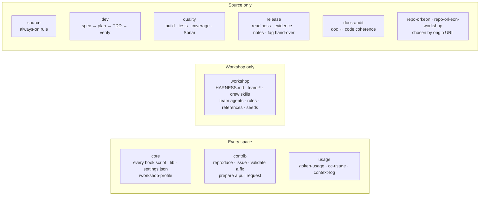
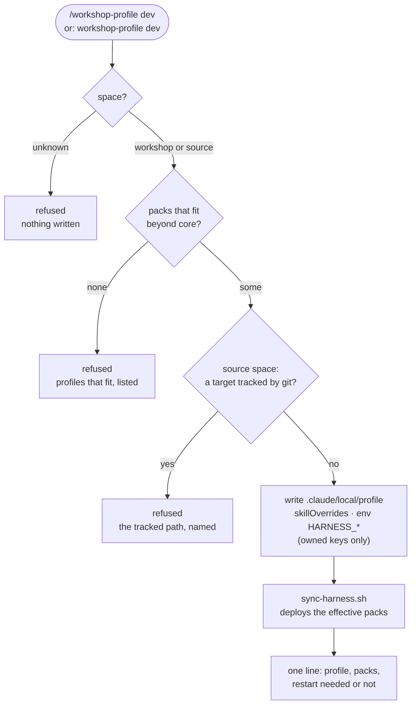
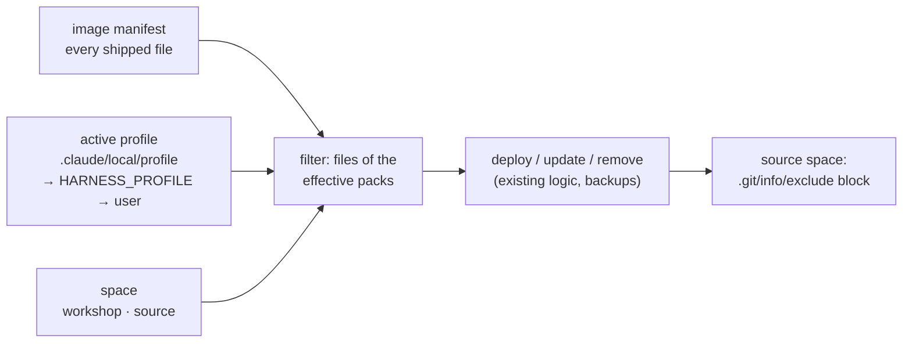
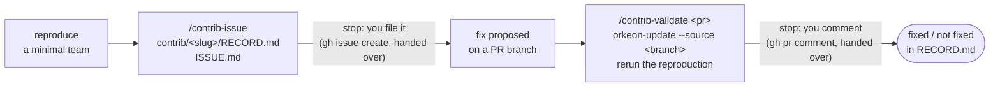
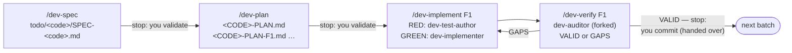
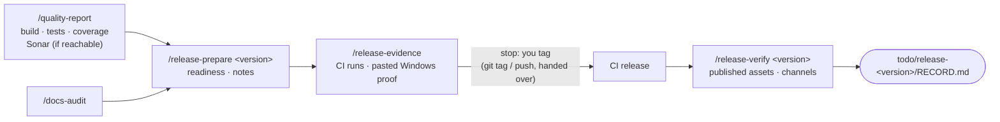

# Profiles and contributor packs — design

**Version 0.3** · 2026-10-10 · status: implemented in phase 3, measured in phase 5 · lot 11 of the
[plan](orkeon-workshop-plan.md) · decisions D48 onwards once accepted

This document designs how the harness stops being one fixed set of files and becomes a set of **packs**
composed into **profiles**, so that the same image serves the Orkeon user who builds teams in a workshop,
the outside contributor who reports and validates a fix, the core developer of Orkeon, the person who
releases it and the person who keeps its documentation true. It is written before any code; phase 3
implements it, phase 5 measures it.

Two constraints rule every choice below:

- **The `user` profile does not change.** A workshop that never asks for a profile loads exactly what it
  loads today, byte for byte; an existing workshop's `.claude/settings.local.json` is touched only when its
  owner runs `/workshop-profile`.
- **Frugality.** What a profile adds to every session is counted in bytes here and measured in tokens in
  phase 5. Switching is deterministic (a script, not the model); noisy work runs in subagents.

## 1. Starting point

Measured on the harness of commit `5a08b09` (phase 1 inventory).

| Loaded at every workshop session | Bytes | ≈ tokens (bytes / 4) |
|---|---:|---:|
| `CLAUDE.md` seed (690) and the `HARNESS.md` it imports (21 983) | 22 673 | 5 670 |
| Descriptions of the 5 model-invocable skills | 2 834 | 710 |
| Descriptions of the 6 subagents | 1 831 | 460 |
| 10 skills with `disable-model-invocation: true`, 7 rules (all `paths:`-scoped), 14 hooks | 0 | 0 |
| **Total the harness adds** | **27 338** | **≈ 6 840** |

- The brief's target of **8 kB per profile** is already exceeded by `HARNESS.md` alone. This design does not
  cut the existing harness: `user` keeps its 27.3 kB (§ 10 reports it; reducing it is a follow-up).
  The target applies in full to what the **new** packs add, and to the source-side profiles, whose
  harness starts from zero.
- On the Orkeon sources, the repository's own `CLAUDE.md` (54.7 kB, 691 lines) loads at every session. It
  is not the harness's to change; § 10 counts it apart.
- 14 hooks, 9 with a `HARNESS_*` switch read from the environment (`${HARNESS_X:-default}`), defaults in
  the `env` of the managed `.claude/settings.json`, overrides in the seeded `.claude/settings.local.json`.
- Precedent for per-workshop state: `.claude/local/language` (D41) — a one-line file, never touched by the
  synchronisation, parsed by `harness_workshop_language`, announced by a SessionStart hook that is silent
  when the file is absent, set by a thin skill over a script.

## 2. Vocabulary

| Term | Meaning |
|---|---|
| **Space** | The folder Claude Code works in: a **workshop** (an Orkeon workshop, as today) or a **source** space (the git checkout of a repository: `Orkeon/orkeon` first, any repository by design). Anything else is **unknown** and gets nothing. |
| **Pack** | A named set of harness files (skills, subagents, rules, hook scripts, references) plus the `HARNESS_*` switches it turns on, and the spaces it fits. Defined in `profiles/packs/<pack>.yaml`. |
| **Profile** | A named list of packs: `user`, `contrib`, `dev`, `release`, `docs`, `all`, or `custom` (packs chosen by hand). Defined in `profiles/<profile>.yaml`. |
| **Active profile** | The profile of a space: `.claude/local/profile`, else the container variable `HARNESS_PROFILE`, else `user`. |
| **Effective packs** | The active profile's packs that fit the space. |

## 3. Packs



| Pack | Spaces | Brings (paths under `.devcontainer/harness/`; a new pack's files under `packs/<pack>/`) | Switches it turns on | Adds per session |
|---|---|---|---:|---:|
| `core` | both | `claude/hooks/**` (every hook script, the new ones included), `claude/lib/**`, `claude/settings.json`, `claude/skills/workshop-profile/`, `evals/**`, `profiles/**` | — | profile hook line ≤ 120 B, only when profile ≠ `user` |
| `workshop` | workshop | **every other file outside `packs/`**: `HARNESS.md`, the seeds, the 15 skills, the 6 subagents, the other rules, `references/`, `examples/`, `library/` | — | 27 338 B (today's harness) |
| `contrib` | both | skills `contrib-issue`, `contrib-validate` (workshop), `contrib-pr` (source) | — | ≈ 0 (skills user-invoked) |
| `source` | source | `claude/rules/source-space.md` (no `paths:`, always on, ≤ 3 kB): what the harness does in a source space, where artefacts go, the hand-over rule | — (the workshop-only hooks stay silent through `harness_space`, § 6) | ≤ 3 000 B |
| `dev` | source | skills `dev-spec`, `dev-plan`, `dev-implement`, `dev-verify`, `dev-unit-tests`, `dev-integration-tests`, `dev-learn`; subagents `dev-test-author`, `dev-implementer`, `dev-auditor`, `adversarial-reviewer`; hook `dev-batch-guard` (the layer rules come from the repository pack, § 3.1) | `HARNESS_DEV_BATCH_GUARD=1` | ≈ 1 100 B (4 agent descriptions) |
| `quality` | source | skill `quality-report` (+ `scripts/quality-report-check.py`), rtk filters for the .NET quality tools | — | ≈ 0 |
| `release` | source | skills `release-prepare`, `release-evidence`, `release-verify` | — | ≈ 0 |
| `docs-audit` | source | skill `docs-audit` (runs in a forked subagent) | — | ≈ 0 |
| `repo-orkeon` | source, origin `Orkeon/orkeon` | rules `orkeon-domain`, `orkeon-application`, `orkeon-tests` (`paths:`-scoped); `references/repo.yaml`: the repository's commands and checklists read by the generic skills | — | 0 |
| `repo-orkeon-workshop` | source, origin `Orkeon/orkeon-workshop` | skills `ws-check`, `ws-migrate`, `ws-image`, `ws-docs`; rules for the bench, the harness hooks and the bilingual docs (`paths:`-scoped); `references/repo.yaml` | — | 0 |
| `usage` | both | skill `token-usage`; hooks `context-log`, `clear-nudge`; the `cc-usage` command (installed in the image, not deployed) | `HARNESS_CONTEXT_LOG=1`, `HARNESS_CLEAR_NUDGE=1` | ≈ 240 B (one description) |

Rules for packs:

- **A file belongs to exactly one pack, by where it lives.** A new pack's files live under
  `packs/<pack>/`, laid out like the harness itself (`claude/skills/…`, `claude/agents/…`, `claude/rules/…`,
  deployed to `.claude/…`; anything else to `.claude/harness/packs/<pack>/`). `core` names its files by
  globs over the existing tree, and `workshop` is everything else outside `packs/` — today's files do not
  move. An eval checks the partition on every build.
- **Hook scripts are all in `core`**, the new ones included: the `hooks` section of `settings.json` is static
  and must never point at a missing script; a pack turns its hooks on by their switch.
- **Every new skill is user-invoked** (`disable-model-invocation: true`, a one-line description, body under
  about 60 lines, the rest in `references/` files of the skill read on demand), except `token-usage`, which
  stays model-invocable because "why did this session cost so much" is asked in plain words. A skill asks for
  a summary of actions and results, never for the model's reasoning.
- **Every new hook has one switch**, `HARNESS_<NAME>`, default `0` in the managed `env`, so an inert hook
  exits 0 with no output; its entry in the static `hooks` section of `settings.json` is the same in every
  profile. A pack turns its hooks on by writing the switch to `1` in `.claude/settings.local.json` `env`
  (which Claude Code re-reads while the session runs).
- **Splitting `workshop`** into `crew`, `method` and `bench` is left for later: it would mean splitting
  `HARNESS.md`, and no profile of this lot needs a workshop without one of them.

### 3.1 Repository packs

The generic packs (`contrib`, `dev`, `quality`, `release`, `docs-audit`) know a method, not a repository.
What is specific to one repository — its layout, its commands, its contribution checklist, its own
procedures — lives in a **repository pack** `repo-<name>`:

- it declares the repositories it fits by their `origin` URL (`repos: ["github.com[:/]Orkeon/orkeon(\\.git)?$"]`);
- it is **added automatically** to the effective packs when the space's `origin` matches and the profile
  holds one of the generic packs it completes (`with: [contrib, dev, quality, release, docs-audit]`);
- its `references/repo.yaml` gives the values the generic skills read instead of hard-coding them: `product`
  (named in the skills' output; the pack's rules are written for that repository, with its real paths),
  build and test commands, the issue template fields, the PR checklist, the release readiness and
  verification commands, the doc checks;
- a repository without its pack still gets the generic packs; their skills then ask for the command they
  need, once, and say which value of a repository pack would have given it.

Two repository packs ship with this lot:

| Pack | Rules (`paths:`-scoped) | Own skills (user-invoked) |
|---|---|---|
| `repo-orkeon` | layers `src/core/Orkeon.{Domain,Application}/**`, tests `tests/**/Orkeon.*.Tests/**` (xUnit v3, hand-written doubles in `Doubles/`, `[Trait("Category", …)]`), adapted from the toolkit's clean-architecture preset | — (the generic skills, fed by `repo.yaml`) |
| `repo-orkeon-workshop` | `.devcontainer/bench/**` (TypeScript Clean Architecture, vitest, dependency-cruiser), `.devcontainer/harness/claude/hooks/**` (switch, inert exit, eval case per hook), `docs/**` (French mirror, `toc.yml`, the plan as the record) | `ws-check` (bench lint and tests, harness evals, replay of `checks.yml` in `node:24-bookworm`), `ws-migrate` (latest Orkeon `main` against `ORKEON_COMMIT`, the checklist of files to bring in step), `ws-image` (local image build on the reference commit, then the three workflows after a push), `ws-docs` (French mirror parity, `toc.yml`, links and anchors, Mermaid, docfx build) |

The procedures of `repo-orkeon-workshop` are the ones `CLAUDE.md` of this repository describes; the skills
run them and report, they do not restate them.

## 4. Profiles

| Profile | Packs | Workshop | Source | For |
|---|---|:-:|:-:|---|
| `user` | core, workshop | ✓ | — | the Orkeon user building teams (today's harness) |
| `contrib` | core, workshop, source, contrib, usage | ✓ | ✓ | an outside contributor: reproduces in a workshop, files the issue, validates a fix; prepares a PR in a source space |
| `dev` | core, source, dev, quality, usage (+ the repository pack) | — | ✓ | a core developer of the repository (Orkeon, this repository, or any other) |
| `release` | core, source, quality, release, docs-audit | — | ✓ | the person who releases |
| `docs` | core, source, docs-audit | — | ✓ | the person who keeps the documentation true |
| `all` | every pack | ✓ | ✓ | the maintainer who does a bit of everything |
| `custom` | chosen by hand | ✓ | ✓ | anything else |

- **Effective packs** = the profile's packs that fit the space; a pack that does not fit is left out and
  named in one line by the switcher (`contrib` in a source space has no `workshop` pack, `all` in a workshop
  has no `dev`). A profile **fits** a space when one of its packs made for a single space fits it (a
  profile made only of packs that fit both spaces fits when one of them does): `dev` holds `usage`, which
  fits a workshop, and is still refused there. A profile that does not fit is **refused**, with the reason
  and the profiles that fit (`dev in a workshop: dev is for a source checkout — fits here: user, contrib, all,
  custom`).
- **`custom`** is written `custom:<pack>,<pack>,…` in `.claude/local/profile`; `core` is always added.
- **Conflicting switches in a union** (`all`, `custom`): a guard switch (`HARNESS_GUARD_*`, `HARNESS_SECRET_GUARD`)
  takes the more restrictive value (`1`), a bound (`*_LINES`, `*_BYTES`) the smaller; any other conflict is
  an error of the pack definitions, caught by an eval. No pack of this lot sets `HARNESS_GUARD_GIT`:
  `release` prepares the tag and hands its command to the user (D47).

### 4.1 Profile files

A profile is a small YAML file; the schema is documented once, in `profiles/README.md`.

```yaml
# .claude/local/profiles/dev-docs.yaml - an example of a hand-made profile; the shipped ones list packs only
name: dev-docs
description: Core development, with the documentation audit at hand.
packs: [core, source, dev, quality, usage]
skills:                       # optional: skills taken without their pack, and visibility
  docs-audit: on              # deployed although docs-audit is not one of the packs
  token-usage: user-invocable-only
```

- `packs` decides what is deployed, pack by pack.
- `skills` refines it skill by skill: a skill named here is **deployed even when its pack is not**
  (the skill folder alone, with what it reads), and its value is its visibility, written to
  `skillOverrides` (`on`, `name-only`, `user-invocable-only`, `off`). `off` on a skill of a listed pack
  keeps the file but hides it.
- `custom:<packs>` takes packs only; a hand-made profile with skills is a file the user adds under
  `.claude/local/profiles/<name>.yaml`, read like the shipped ones (never touched by the synchronisation).

## 5. Choosing and switching a profile



**The switcher** is `claude/skills/workshop-profile/scripts/workshop-profile.py` (python3 and PyYAML, both in the image), run by the
`/workshop-profile` skill and also on the PATH as `workshop-profile`, so a source space that has no harness
yet can choose its first profile from the terminal. It is deterministic and prints a short summary;
the model only relays it. Arguments: a profile name, `custom:<packs>`, `--list` (profiles and packs, what
fits here), `--show` (the active profile and its effective packs), `--dry-run`.

What it writes, and nothing else:

| File | What | Ownership |
|---|---|---|
| `.claude/local/profile` | one line: `<profile>` or `custom:<packs>` | its own file |
| `.claude/settings.local.json` `skillOverrides` | `off` for every harness skill deployed but outside the effective packs whose folder the synchronisation leaves on disk (an `off` for a folder it removes is dropped), and the per-pack visibility a pack asks for (§ 5.1) | only the keys naming a **harness** skill; a key for any other skill, or one that was there before and that the switcher did not write, is left as it is (said in one line) |
| `.claude/settings.local.json` `env` | the `HARNESS_*` switches of the effective packs | only the switches a pack declares; one the previous profile set and the new one does not is removed; one that was there before and that the switcher did not write is left as it is (said in one line) |
| `.claude/local/profile.owned.json` | the keys it wrote last time | its own file, so a switch can undo exactly its previous writes |

The JSON is read, changed and written back with its other keys untouched (order kept); an unreadable
`settings.local.json` is refused, never overwritten. The script then runs `sync-harness.sh`, which deploys
the effective packs (§ 6).

**What takes effect when.** Claude Code re-applies `env` and `hooks` while a session runs, so switches take
effect at once. Whether a change of `skillOverrides`, of the skills on disk and of the subagents on disk is
seen without a restart is not documented `[NOT FOUND]`, and was not measured (it needs a session that
switches while it runs): the switcher's last line says "restart Claude Code to load …" whenever files moved or
`skillOverrides` changed.

### 5.1 Why both deployment and `skillOverrides`

| Lever | Acts on | Why it is needed |
|---|---|---|
| **Deployment per profile** (`sync-harness.sh`) | which files exist: skills, subagents, rules | subagent descriptions load at every session and have no override; a `user` workshop must not receive the new packs' files at all (Δ = 0); a source space must not receive the workshop's |
| **`skillOverrides`** (`settings.local.json`) | how visible a deployed skill is: `on`, `name-only`, `user-invocable-only`, `off` | the listing budget of `all` and `custom` (a model-invocable skill can be kept in the `/` menu but out of the model's listing with `user-invocable-only`); `off` hides a skill at once even if a restart is needed for the files |

Alternative rejected: **`skillOverrides` alone** (every pack deployed everywhere, visibility by settings).
It would deploy the dev subagents into every user workshop (≈ 1.1 kB more per session, no override exists
for subagents), the workshop's files into a source checkout, and it would make `user` depend on a settings
key that existing workshops do not have. Alternative rejected: **deployment alone**: the brief asks the
switcher to own `skillOverrides`, and without it `all` cannot trim its listing.

## 6. Deployment: `sync-harness.sh`



The existing synchronisation keeps its logic; four changes:

1. **The manifest it compares is filtered.** `NEW` = the image manifest restricted to the effective packs
   (resolved by the switcher itself, `workshop-profile.py --resolve`, which prints the space, the profile
   and the packs).
   Files that leave the profile are then simply *removed* by the existing removal loop, with the existing
   backup when they were edited locally. The marker stamp becomes the hash of the image manifest **and**
   of the effective pack list, so a profile change is never "up to date".
2. **The space is detected** before anything is written:
   - `workshop` — `is_workshop()` as today (manifest, marker, `teams/`, or an empty folder), or `--adopt`;
   - `source` — the folder is the top of a git work tree (`git rev-parse --show-toplevel`), is not a
     workshop, and the active profile has a pack that fits a source space; recorded in
     `.claude/.harness-space` (`source`) so that the next start does not mistake it for a workshop once
     the manifest exists;
   - `unknown` — anything else: today's refusal message, plus one line naming `HARNESS_PROFILE` and
     `workshop-profile`.
   A workshop that is itself a git repository stays a workshop: the workshop test comes first.
3. **In a source space**, only managed files of the effective packs are deployed — no seed, no workshop
   skeleton (`teams/`, `workbooks/`…), no `CLAUDE.md`, no `.gitignore`:
   - **nothing tracked is ever written**: before deploying, every target — and every file of the
     previous deployment, which a switch may remove — is checked with `git ls-files`; one tracked
     target refuses the whole deployment and names it; so does a folder between the checkout and a
     target that is a symbolic link (git does not look through it, a write would follow it);
   - **git status stays clean**: the deployed paths, `.claude/local/`, `.claude/.harness-*`,
     `.claude/settings.local.json` and `todo/` are listed in a delimited block of `.git/info/exclude`
     (`# >>> orkeon-workshop harness <top level>` … `# <<< … <top level>`), one block per worktree —
     the linked worktrees of a repository share that file —, rewritten at each run; the repository's own
     `.gitignore` is never touched;
   - the files land in the project's `.claude/` (never `~/.claude/`, which would leak into every space).
4. **The initial profile** comes from `HARNESS_PROFILE` (container environment) when
   `.claude/local/profile` does not exist. The published image does not set it: an existing or new
   workshop gets `user`. A `HARNESS_PROFILE` that does not fit the space falls back to `user` with a
   note, and so does a hand-made profile that cannot be read; shipped definitions that cannot be read
   leave a workshop with every file outside `packs/` (and a warning) and a source space with nothing.

With `user`, the deployed files are today's plus `.claude/harness/profiles/` (definitions, read by no
session); an eval compares the deployment with that of the harness before lot 11.

**Hooks in a source space.** Several hooks today treat `ORKEON_WORKSHOP` (default `/workspace`) as a
workshop (`harness_is_workshop`), which a source checkout mounted there would satisfy. A helper
`harness_space` (in `lib/team-common.sh`, reading `.claude/.harness-space`) lets the workshop-only hooks
(`run-gate`, `guard-phase`, `team-approve`, `status-check`, `session-doctor`, `workshop-language`) exit 0 in a source space;
an eval per hook proves it with a source fixture.

## 7. The SessionStart hook

`claude/hooks/workshop-profile.sh`, switch `HARNESS_WORKSHOP_PROFILE` (default `1`, it is part of `core`),
modelled on `workshop-language.sh`:

- profile `user` (or no profile file and no `HARNESS_PROFILE`): **no output** — Δ = 0;
- another profile: one line of `additionalContext`, e.g.
  `workshop-profile: dev (core, source, dev, quality, usage) — /workshop-profile to change`;
- an unreadable or unknown profile: one line saying so and that `user` applies;
- `source` other than `startup` and `clear`: no output (the line is already in the context).

## 8. Workflows

Every workflow writes its artefacts to disk and stops where a person decides. Records are dated; nothing is
posted, committed, pushed or tagged by Claude Code: the command is handed over (D47).

### 8.1 `contrib` — reproduce, report, validate



- **Workshop space.** `contrib/<slug>/` holds `RECORD.md` (dated entries: version, install channel,
  environment, steps, expected, actual, evidence paths) and `ISSUE.md`, shaped on the repository's issue
  template (for Orkeon `bug_report.yml`: version, channel, environment, steps, expected, actual). The
  reproduction is a minimal team under `teams/`, built with the workshop's own skills.
- **Validating a fix.** `orkeon-update --source` takes a branch, tag or commit of `Orkeon/orkeon` only
  `[NOT FOUND: pull refs and forks]`: `/contrib-validate` reads the PR's head branch
  (`gh pr view --json headRefName,isCrossRepository`) and refuses a PR from a fork with that reason.
- **Source space.** `/contrib-pr` walks the repository's contribution checklist (for Orkeon: branch
  `feature|fix|chore/<slug>`, `-warnaserror` build, the non-integration test filter, `PublicAPI.Unshipped.txt`,
  `CHANGELOG.md` `[Unreleased]`, docs and their French mirror, executable bits) and writes the PR body; the
  commit, push and `gh pr create` commands are handed over.

### 8.2 `dev` — spec, plan, implement, verify



- Adapted from the toolkit's chain (`business-spec → plan-implementation → implement-tdd →
  verify-ddd-tdd`), artefacts under `todo/<code>/` in the checkout, excluded from git (§ 6).
- **Subagents.** The workshop's `team-test-author`, `team-implementer` and `team-reviewer` are charters for
  an Orkeon *team* (crew YAML, library tools, team README) and are not deployed in a source space. `dev`
  brings its own, adapted from the toolkit's `tdd-test-author`, `tdd-implementer` and `ddd-tdd-auditor`, plus
  `adversarial-reviewer` for the spec and the plan. This departs from the answer given at gate 1 (reuse the
  team agents), for that reason; confirmed at gate 2.
- **Tests and learning**, alongside the chain: `/dev-unit-tests` (a unit test in the repository's
  conventions, adapted from `tests-unit-tests`), `/dev-integration-tests` (an integration test in its
  category, for Orkeon Testcontainers and `[Trait("Category","Integration")]`, adapted from
  `tests-integration-tests`), `/dev-learn` (turns the gaps the auditor keeps finding into a rule proposal,
  adapted from `learn`; the rule is written only once the user accepts it).
- **Rules** come from the repository pack (§ 3.1). The toolkit preset's EF and Web API rules are left out
  until a repository needs them.
- **`dev-batch-guard`** (adapted from `implement-tdd-guard`, switch `HARNESS_DEV_BATCH_GUARD`): one batch
  per session, `/clear` between batches.
- Graphify, `kit.config.json` and the `cctoolkit` scripts are not brought: inventories go to subagents.

### 8.3 `release` — readiness, evidence, notes, tag, verification



- **`/quality-report`** runs the repository's own quality commands (for Orkeon: `-warnaserror` build, tests
  without the integration categories, `dotnet-coverage` + ReportGenerator, `scripts/sonar-analyze.sh` when a
  Sonar server is reachable through `SONAR_HOST_URL` / `SONAR_TOKEN` — environment only, never on disk)
  and checks the arithmetic of its report with `quality-report-check.py`. No Stryker: Orkeon has none.
- **`/release-prepare`** checks readiness (for Orkeon: `src/Directory.Build.props` version,
  `scripts/check-release-readiness.py`: empty `[Unreleased]`, header-only `PublicAPI.Unshipped.txt`) and
  drafts the notes from the version's `CHANGELOG.md` section.
- **`/release-evidence`** gathers the install evidence: the Windows jobs of `release.yml` (`smoke-windows`,
  `smoke-windows-service`, `msi`) read with `gh run view`, and evidence pasted by the user, both copied into
  the dated record.
- **Tag**: the user tags; the skill prints the command.
- **`/release-verify`** after the CI: the GitHub Release and its checksums, `release-verify.yml`'s jobs, the
  channels — apt (`rc` or `stable`), MSI, archives, NuGet.org packages, the GHCR image. Homebrew is not
  published (no tap) and is not checked.

### 8.4 `docs` — doc ↔ code coherence

`/docs-audit` runs in a forked subagent (`context: fork`): it runs the repository's own doc checks when they
exist (for Orkeon: `scripts/check-docs-parity.sh`, `scripts/check-doc-claims.py`, the docfx build with
warnings as errors), checks relative links and anchors, then has `adversarial-reviewer` confront each page
changed since a reference (tag or commit) with the code it describes. A subagent cannot start another
one, so the forked audit reads the `adversarial-reviewer` charter when the `dev` pack is deployed and
applies its stance itself. It returns a table — page, claim, code
location, verdict (holds / stale / unverifiable) — and writes `todo/docs-audit-<date>/REPORT.md`. It fixes
nothing.

### 8.5 `usage` — measuring

- **`cc-usage`** (from `claude-code-token-usage`, MIT) is installed in the image under
  `/usr/local/share/cc-usage` with a `cc-usage` command, like `claude-usage`. Two small changes, recorded in
  `THIRD-PARTY.md`: transcripts are looked up under `CLAUDE_CONFIG_DIR` when it is set (the image sets it),
  and `--session` honours `--json`. The dashboard, `--serve` and the Codex half are not installed:
  `claude-usage-dashboard` already serves the aggregated view; the two tools are complementary (aggregate per
  day, model and project versus the composition of one session's context).
- **`/token-usage`**: the toolkit's reading guide, with its paths changed to the command.
- **`context-log`** (InstructionsLoaded: which instruction files loaded, into `.claude/local/context.log`)
  and **`clear-nudge`** (one line when the replayed context crosses a step), both off unless `usage` is
  active.

## 9. The image

- **One image.** No separate developer image: the profile is chosen at first start by `HARNESS_PROFILE` or
  later with `/workshop-profile`. The published image does not set `HARNESS_PROFILE`, so its behaviour for
  every existing workshop is unchanged.
- **New in the image:** `cc-usage` (four Python files and the licence, nothing to install with pip), the
  `workshop-profile` command, the `profiles/` definitions inside the harness staging.
- **A source checkout** is used by mounting it where a workshop would be (`ORKEON_WORKSHOP`, default
  `/workspace`) and setting `HARNESS_PROFILE=dev` (or `release`, `docs`, `contrib`) on the first start, or
  running `workshop-profile dev` in the terminal.

## 10. Startup budget per profile

Bytes the **harness** adds to every session, estimated from the files planned; phase 5 measures the real
`(startup)` tokens with `cc-usage --session` on one identical minimal prompt per profile.

| Profile | Space | Harness bytes | ≈ tokens | Δ vs today | Not the harness's |
|---|---|---:|---:|---:|---|
| `user` | workshop | 27 338 | 6 840 | **0** | — |
| `contrib` | workshop | ≈ 27 700 | 6 930 | ≈ +360 (profile line, `token-usage`) | — |
| `contrib` | source | ≈ 3 400 | 850 | — | repository `CLAUDE.md` (Orkeon 54.7 kB) |
| `dev` | source | ≈ 4 500 | 1 130 | — | same |
| `release` | source | ≈ 3 200 | 800 | — | same |
| `docs` | source | ≈ 3 200 | 800 | — | same |
| `all` | workshop | ≈ 28 900 | 7 230 | ≈ +1 560 | — |

**Measured in phase 5** (`.devcontainer/harness/VERIFICATIONS.md` V-23, the `(startup)` row of `cc-usage`):
`user` in a workshop 30 468 tokens, the same as the image before lot 11 (Δ 0); `contrib` +120; in a checkout of Orkeon,
against the repository without the harness (40 370), `docs` +931, `release` +934, `contrib` +1 007, `dev` +1 427,
`all` +1 440. The always-on rule `source-space.md` is about 950 of them. The claude.ai account's own connector and
skills reach the first turn on some runs only, and are kept out of the comparison.

Every new pack stays within the 8 kB target; `user`, `contrib` and `all` in a workshop exceed it because of
`HARNESS.md`, which this lot reports and does not cut (§ 12).

## 11. Placement in the roadmap

- A new **lot 11 — Profiles and contributor packs** in the plan's § 11 and in the roadmap of
  `docs/README.md` / `docs/fr/README.md`; its progress in § 11.1.
- Decisions, numbered after D47 in § 13 (never renumbered), once this design is accepted:
  - **D48** — packs composed into profiles; a file belongs to one pack; `user` = today's harness (Δ = 0).
  - **D49** — the space (workshop, source, unknown) decides what fits; a profile with nothing to deploy is
    refused.
  - **D50** — switching is a script: `.claude/local/profile`, owned keys of `skillOverrides` and `env` in
    `settings.local.json`, then the synchronisation; deployment per profile and `skillOverrides` together.
  - **D51** — in a source space the harness never writes a tracked file and keeps git status clean through
    `.git/info/exclude`.
  - **D52** — new hooks are off by default behind one switch each; the `hooks` section stays static.
  - **D53** — `cc-usage` in the image as the measuring tool, alongside `claude-usage`.
  - **D54** — what is specific to a repository lives in a repository pack chosen by its `origin`;
    `repo-orkeon` and `repo-orkeon-workshop` ship first.
  - **D55** — a profile lists packs and, optionally, skills with their visibility; a listed skill is deployed
    without its pack.

## 12. Open points and follow-ups

Settled at gate 2 (2026-10-10):

- **The `dev` subagents** (§ 8.2): the dev pack brings its own, adapted from the toolkit, because the team
  charters do not fit a source checkout.
- **`HARNESS_GUARD_GIT` stays `0` in source spaces**, as in a workshop: the skills hand commit, push and tag
  commands over (D47) and nothing blocks them deterministically; whoever wants the block sets it to `1` in
  `settings.local.json`.
- **Sonar is optional**: `/quality-report` uses `SONAR_HOST_URL` / `SONAR_TOKEN` (environment only) when a
  server is reachable — for instance one started on the host — and says "Sonar not run" otherwise; the
  container does not start Orkeon's `docker-compose.sonarqube.yml` itself.

Not measured, not assumed:

- whether a change of `skillOverrides`, of skills on disk and of subagents on disk is seen without a restart;
  until it is, the switcher always asks for a restart when one of them changed.

Follow-ups found on the way, not fixed in this lot:

- In a source space the managed `settings.json` keeps the workshop's defaults: reads of `**/bin/**` denied,
  reads capped at 120 lines. A per-space `env` default may suit development better.
- A source space cannot remove the harness: `user` is refused there; a `none` profile, or a documented
  removal, is to decide.
- Whether `.claude/local/profile` belongs in the workshop's git like `.claude/local/language`: it is kept
  (only `profile.owned.json` is ignored), but the `settings.local.json` keys it implies are not — a clone
  gets the profile's files at the next start and its overrides only once `/workshop-profile` runs.
- `subagent-report-shape.sh` reserves `## Verdict` for `team-reviewer`, so `dev-auditor` reports
  `## Audit — VALID|GAPS`; and `delegation-guard.sh` gives `dev-auditor` and `adversarial-reviewer` the
  default cap of 20 lines (8 gaps at most). Teaching the two hooks the dev agents is left for later.
- `write_manifest` in `sync-harness.sh` does not skip `evals/.fixtures/`.
- The `workshop-language` row of `FROZEN-LITERALS.md` has an unescaped `|` in a table cell.

- `HARNESS.md` is 22 kB against the 8 kB target; splitting it per pack would also allow splitting `workshop`.
- `THIRD-PARTY-NOTICES.md` and `harness/THIRD-PARTY.md` attribute `devcontainer.workshop.json` differently,
  and the latter counts 4 `bash-dispatch` modules where there are 5.
- `HARNESS_MAKE_EXECUTABLE` is missing from the switch table of `docs/reference/harness.md`.
- A stray `evals/.fixtures/` is left on disk by an earlier run (ignored by git).

## Changes

| Version | Date | Change |
|---|---|---|
| 0.3 | 2026-10-10 | Aligned with phase 3: the fit rule (§ 4), the fallbacks of § 6, the `user` deployment, `/docs-audit` applying the reviewer's stance itself (§ 8.4); follow-ups of § 12 completed. |
| 0.2 | 2026-10-10 | `dev` brings more skills (unit and integration tests, learn); repository packs `repo-orkeon` and `repo-orkeon-workshop` (§ 3.1); profiles may list skills (§ 4.1); D54, D55. |
| 0.1 | 2026-10-10 | First draft, from the phase 1 inventory and the gate 1 answers; gate 2 answers folded in (dev subagents, `HARNESS_GUARD_GIT` left at `0`, Sonar optional). |
